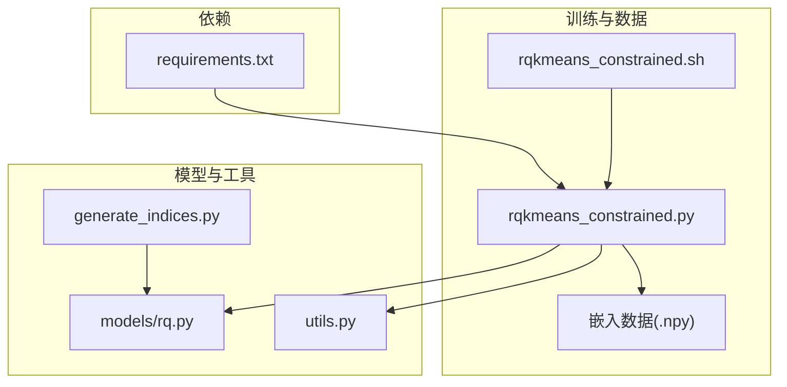
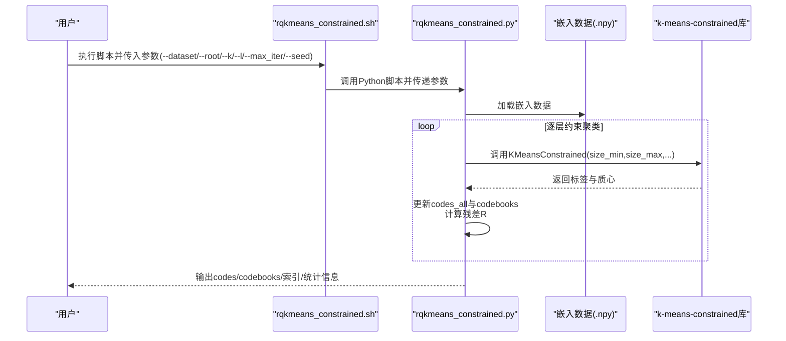
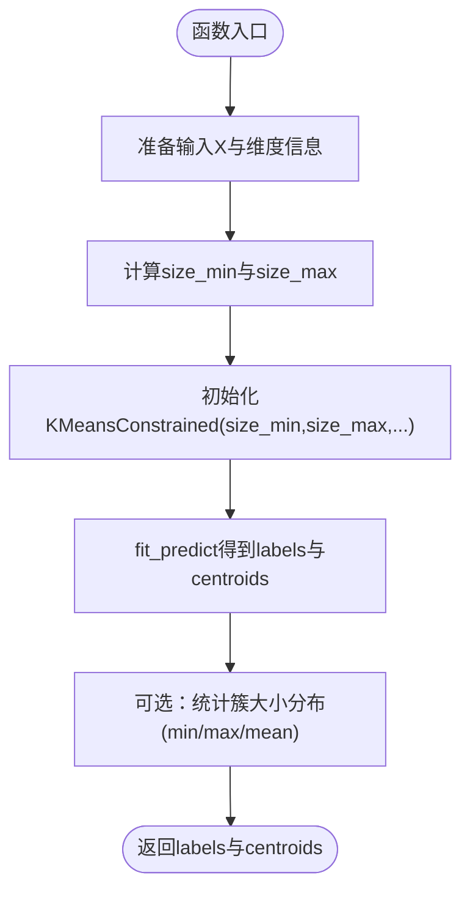
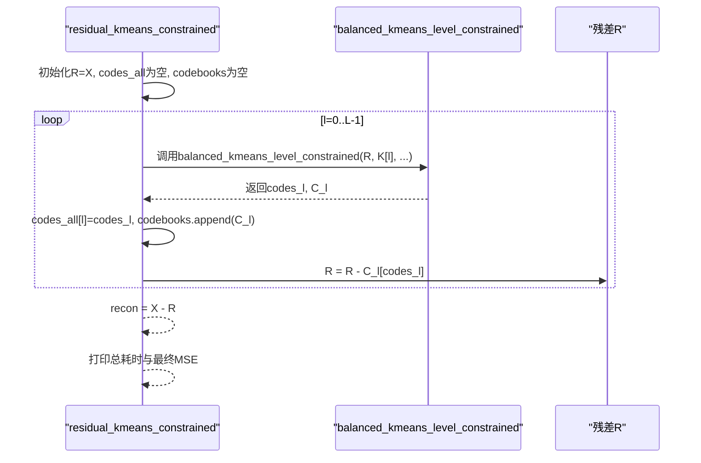
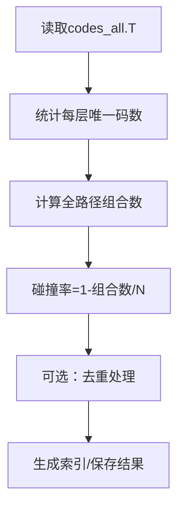
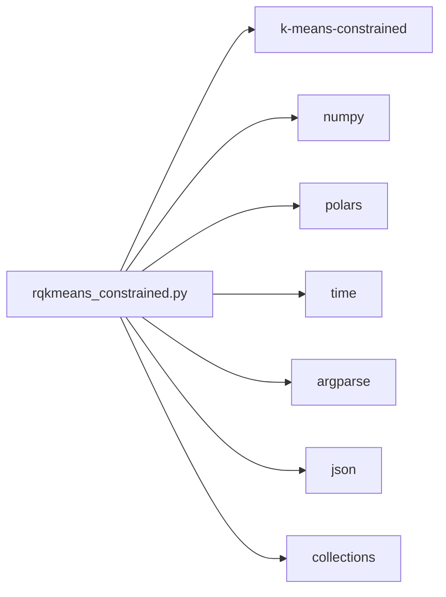

# 约束RQ-Kmeans

<cite>
**本文引用的文件**
- [rq/rqkmeans_constrained.py](file://rq/rqkmeans_constrained.py)
- [rq/rqkmeans_constrained.sh](file://rq/rqkmeans_constrained.sh)
- [rq/models/rq.py](file://rq/models/rq.py)
- [rq/utils.py](file://rq/utils.py)
- [rq/generate_indices.py](file://rq/generate_indices.py)
- [requirements.txt](file://requirements.txt)
</cite>

## 目录
1. [简介](#简介)
2. [项目结构](#项目结构)
3. [核心组件](#核心组件)
4. [架构总览](#架构总览)
5. [详细组件分析](#详细组件分析)
6. [依赖分析](#依赖分析)
7. [性能考量](#性能考量)
8. [故障排查指南](#故障排查指南)
9. [结论](#结论)
10. [附录](#附录)

## 简介
本文件深入解析基于k-means-constrained库实现的“约束平衡聚类”在RQ-KMeans中的应用，重点覆盖：
- balanced_kmeans_level_constrained如何通过size_min与size_max参数确保各簇大小均衡，从而有效降低碰撞率；
- residual_kmeans_constrained的逐层残差约束聚类流程，生成codes_all与codebooks，并解释其在构建紧凑且语义丰富的SID中的优势；
- 结合rqkmeans_constrained.sh脚本，说明命令行参数（如--k、--l、--max_iter）的使用方法及其对模型性能的影响；
- 提供实际运行示例与输出日志解读，帮助理解训练过程中的关键指标（如碰撞率、重构误差）。

## 项目结构
围绕RQ-KMeans约束聚类的核心文件与脚本如下：
- Python模块：rq/rqkmeans_constrained.py（主流程与约束聚类实现）
- Shell脚本：rq/rqkmeans_constrained.sh（训练入口脚本）
- 模型定义：rq/models/rq.py（ResidualVectorQuantizer，与RQ-VQ相关）
- 工具函数：rq/utils.py（通用工具）
- 索引生成与碰撞分析：rq/generate_indices.py（碰撞检测与索引生成）
- 依赖声明：requirements.txt（第三方库）

图表来源
- [rq/rqkmeans_constrained.py](file://rq/rqkmeans_constrained.py#L1-L292)
- [rq/rqkmeans_constrained.sh](file://rq/rqkmeans_constrained.sh#L1-L38)
- [rq/models/rq.py](file://rq/models/rq.py#L1-L56)
- [rq/utils.py](file://rq/utils.py#L1-L38)
- [rq/generate_indices.py](file://rq/generate_indices.py#L1-L151)
- [requirements.txt](file://requirements.txt#L1-L139)

章节来源
- [rq/rqkmeans_constrained.py](file://rq/rqkmeans_constrained.py#L1-L292)
- [rq/rqkmeans_constrained.sh](file://rq/rqkmeans_constrained.sh#L1-L38)
- [rq/models/rq.py](file://rq/models/rq.py#L1-L56)
- [rq/utils.py](file://rq/utils.py#L1-L38)
- [rq/generate_indices.py](file://rq/generate_indices.py#L1-L151)
- [requirements.txt](file://requirements.txt#L1-L139)

## 核心组件
- balanced_kmeans_level_constrained：使用k-means-constrained在单层上执行“平衡聚类”，通过size_min与size_max限制每簇大小，避免极端不均衡导致的碰撞。
- residual_kmeans_constrained：逐层对残差向量进行约束聚类，生成codes_all与codebooks，并计算最终重构误差。
- 命令行与脚本：rqkmeans_constrained.sh提供便捷参数传递；rq/rqkmeans_constrained.py解析参数并驱动训练流程。
- 碰撞分析与索引生成：generate_indices.py用于检测与处理碰撞，rq/rqkmeans_constrained.py内置碰撞率统计与去重逻辑。

章节来源
- [rq/rqkmeans_constrained.py](file://rq/rqkmeans_constrained.py#L26-L128)
- [rq/rqkmeans_constrained.py](file://rq/rqkmeans_constrained.py#L168-L292)
- [rq/rqkmeans_constrained.sh](file://rq/rqkmeans_constrained.sh#L1-L38)
- [rq/generate_indices.py](file://rq/generate_indices.py#L1-L151)

## 架构总览
下图展示从脚本到Python模块再到数据与外部库的整体调用关系。

图表来源
- [rq/rqkmeans_constrained.sh](file://rq/rqkmeans_constrained.sh#L1-L38)
- [rq/rqkmeans_constrained.py](file://rq/rqkmeans_constrained.py#L168-L292)

## 详细组件分析

### balanced_kmeans_level_constrained：约束平衡聚类
该函数在单层上使用k-means-constrained实现“平衡聚类”，核心要点：
- 计算每簇大小边界：size_min与size_max分别基于样本数N与簇数K推导，允许轻微不平衡，避免极端情况。
- 设置KMeansConstrained的关键参数：
  - size_min/size_max：强制约束每簇包含的样本数量范围；
  - max_iter/tol：控制迭代次数与收敛容忍度；
  - random_state/n_init/n_jobs：控制随机性与并行度。
- 返回值：labels（每样本所属簇）、centroids（簇质心），并打印该层耗时与簇大小分布（最小/最大/均值）。

图表来源
- [rq/rqkmeans_constrained.py](file://rq/rqkmeans_constrained.py#L26-L64)

章节来源
- [rq/rqkmeans_constrained.py](file://rq/rqkmeans_constrained.py#L26-L64)

### residual_kmeans_constrained：逐层残差约束聚类
该函数实现多层RQ式约束聚类，流程如下：
- 输入：X为(N,d)，K为每层簇数（整数或列表），L为层数；
- 初始化：复制X为R作为当前残差，创建空的codes_all与codebooks；
- 循环L次：
  - 对当前残差R在第l层执行balanced_kmeans_level_constrained，得到codes_l与C_l；
  - 将codes_l写入codes_all第l行，C_l加入codebooks；
  - 使用C_l[codes_l]重建当前层贡献并从R中减去，得到新的残差；
  - 可选：打印该层前后的残差MSE；
- 结束：recon = X - R，返回codes_all、codebooks与recon，并打印总耗时与最终MSE。

图表来源
- [rq/rqkmeans_constrained.py](file://rq/rqkmeans_constrained.py#L67-L128)

章节来源
- [rq/rqkmeans_constrained.py](file://rq/rqkmeans_constrained.py#L67-L128)

### 命令行参数与脚本使用
- 脚本参数（rqkmeans_constrained.sh）：
  - --dataset：数据集名称（默认工业科学数据集）；
  - --root：数据根目录；
  - --k：每层簇数（默认256）；
  - --l：层数（默认3）；
  - --max_iter：最大迭代次数（默认100）；
  - --seed：随机种子（默认42）。
- Python脚本参数（rq/rqkmeans_constrained.py）：
  - --root/--dataset/--k/--l/--max_iter/--seed/--verbose等，与脚本一一对应。

参数对性能的影响：
- --k：越大，每层编码更精细，重构误差越低，但碰撞率可能下降（更细粒度）；同时训练时间与存储开销增加。
- --l：层数越多，逐层残差越小，整体重构误差更低；但训练与推理复杂度上升。
- --max_iter：越大，收敛更稳定，但训练时间增长；tol过小可能导致收敛困难。
- --seed：影响随机初始化与聚类结果稳定性。

章节来源
- [rq/rqkmeans_constrained.sh](file://rq/rqkmeans_constrained.sh#L1-L38)
- [rq/rqkmeans_constrained.py](file://rq/rqkmeans_constrained.py#L168-L177)

### 碰撞率与代码分析
- analyze_codes：统计每层唯一码数、全路径组合数与碰撞率（1 - 唯一全路径/N）。
- deal_with_deduplicate：对重复路径进行去重处理（通过附加行号等策略），减少索引冲突。
- generate_indices.py：提供碰撞检测与索引生成流程，可用于验证与优化。

图表来源
- [rq/rqkmeans_constrained.py](file://rq/rqkmeans_constrained.py#L131-L166)
- [rq/rqkmeans_constrained.py](file://rq/rqkmeans_constrained.py#L232-L245)
- [rq/generate_indices.py](file://rq/generate_indices.py#L1-L151)

章节来源
- [rq/rqkmeans_constrained.py](file://rq/rqkmeans_constrained.py#L131-L166)
- [rq/rqkmeans_constrained.py](file://rq/rqkmeans_constrained.py#L232-L245)
- [rq/generate_indices.py](file://rq/generate_indices.py#L1-L151)

### 与RQ模型的关系
- models/rq.py中的ResidualVectorQuantizer展示了RQ-VQ的典型结构：多层VQ叠加，逐层残差，与residual_kmeans_constrained的思路一致。
- 两者共同目标是通过分层量化获得更紧凑且语义丰富的表示，从而降低碰撞率并提升检索质量。

章节来源
- [rq/models/rq.py](file://rq/models/rq.py#L1-L56)

## 依赖分析
- 外部库依赖：
  - k-means-constrained：用于实现size_min/size_max约束的KMeans；
  - numpy/polars/time/argparse/json/collections：标准库与常用工具；
  - torch/torchaudio/torchvision等：项目其他模块使用，此处未直接导入。
- requirements.txt：列出项目所需依赖版本，需确保k-means-constrained可用。

图表来源
- [rq/rqkmeans_constrained.py](file://rq/rqkmeans_constrained.py#L1-L24)
- [requirements.txt](file://requirements.txt#L1-L139)

章节来源
- [rq/rqkmeans_constrained.py](file://rq/rqkmeans_constrained.py#L1-L24)
- [requirements.txt](file://requirements.txt#L1-L139)

## 性能考量
- 平衡性与碰撞率：通过size_min/size_max限制簇大小，避免某些簇过大导致的碰撞；balanced_kmeans_level_constrained会打印最小/最大/平均簇大小，便于评估平衡性。
- 迭代与收敛：max_iter与tol影响收敛速度与稳定性；增大max_iter可提高精度但增加训练时间。
- 并行度：n_jobs参数控制并行度，有助于加速训练；合理设置可缩短总耗时。
- 层级与簇数：K与L共同决定编码精细度与存储成本；建议先固定K观察效果再调整L。
- 数据类型：输入X转换为float32，有助于内存与计算效率。

章节来源
- [rq/rqkmeans_constrained.py](file://rq/rqkmeans_constrained.py#L26-L64)
- [rq/rqkmeans_constrained.py](file://rq/rqkmeans_constrained.py#L67-L128)

## 故障排查指南
- 缺少k-means-constrained库：
  - 现象：启动时报错提示未安装；
  - 处理：根据提示安装相应包后重试。
- 数据文件不存在：
  - 现象：找不到嵌入数据文件；
  - 处理：确认--root与--dataset参数正确，检查数据文件路径。
- 碰撞率偏高：
  - 建议：适当增大K或L，或调整max_iter；检查去重逻辑是否生效。
- 训练耗时过长：
  - 建议：降低max_iter、减少L或K、合理设置n_jobs；确认数据dtype为float32。

章节来源
- [rq/rqkmeans_constrained.py](file://rq/rqkmeans_constrained.py#L168-L188)
- [rq/rqkmeans_constrained.py](file://rq/rqkmeans_constrained.py#L194-L206)

## 结论
- balanced_kmeans_level_constrained通过size_min/size_max实现“约束平衡聚类”，有效降低极端不均衡带来的碰撞风险；
- residual_kmeans_constrained逐层对残差进行约束聚类，生成紧凑且语义丰富的SID，有利于检索与压缩；
- 命令行参数（--k、--l、--max_iter）直接影响模型的编码精细度、训练耗时与最终性能；
- 结合去重与碰撞分析工具，可进一步优化索引质量与查询稳定性。

## 附录

### 实际运行示例与输出解读
- 运行脚本示例（以工业科学数据集为例）：
  - bash rqkmeans_constrained.sh --dataset Industrial_and_Scientific --root ../data/Amazon18/Industrial_and_Scientific --k 256 --l 3 --max_iter 100 --seed 42 --verbose
- 关键输出解读：
  - 各层开始与结束信息、每层残差MSE变化、总耗时；
  - 最终重构MSE（越低越好）；
  - 碰撞率（越低越好）与去重统计（重复组数量、重复总数、最大重复组规模）；
  - 保存的文件：.codebooks_constrained.npz（每层质心）、.codes_constrained.npy（原始codes）、.index.json（去重后的索引）。

章节来源
- [rq/rqkmeans_constrained.sh](file://rq/rqkmeans_constrained.sh#L1-L38)
- [rq/rqkmeans_constrained.py](file://rq/rqkmeans_constrained.py#L208-L292)