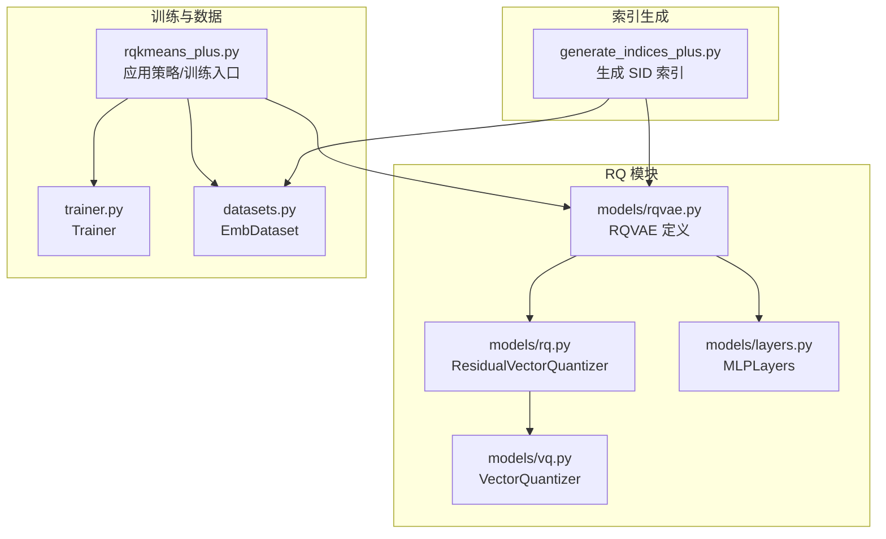
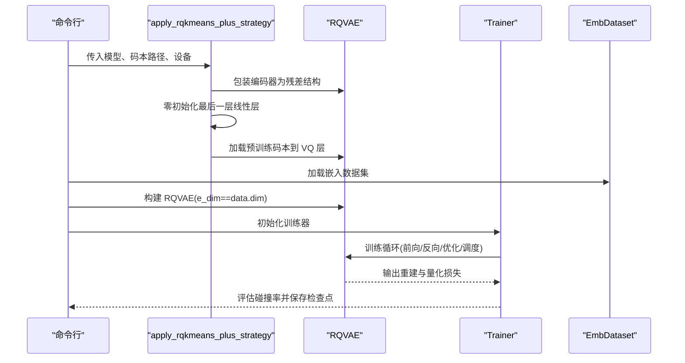
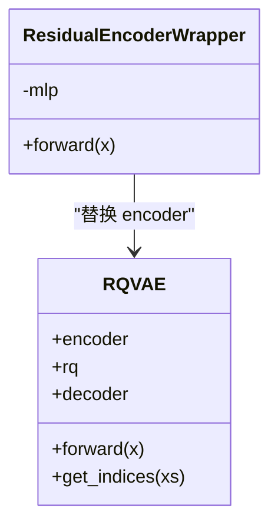
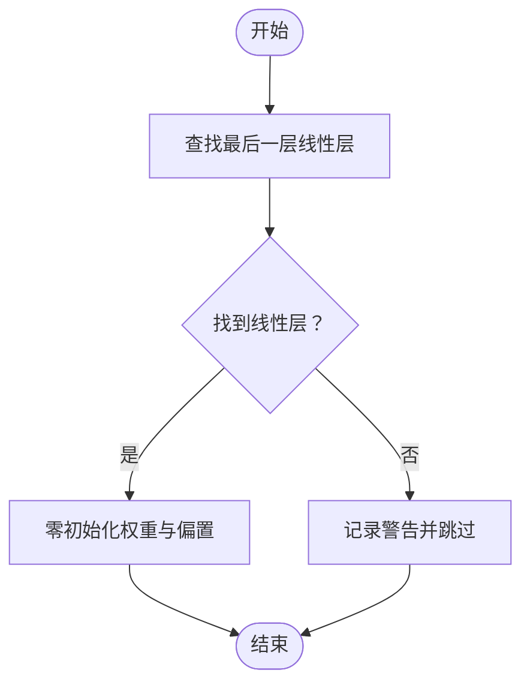
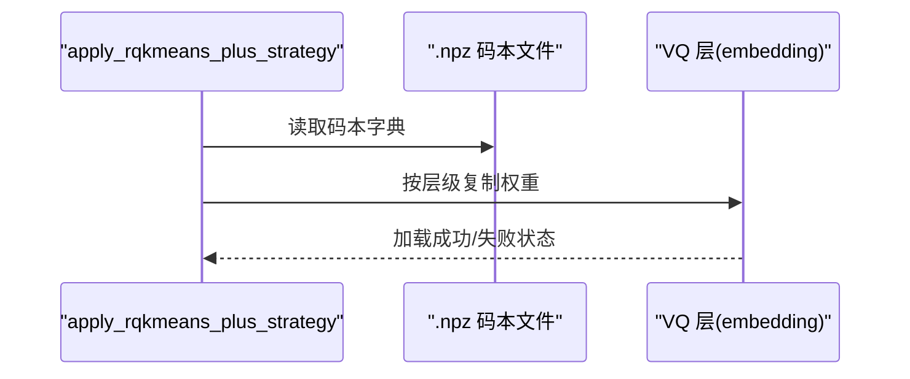
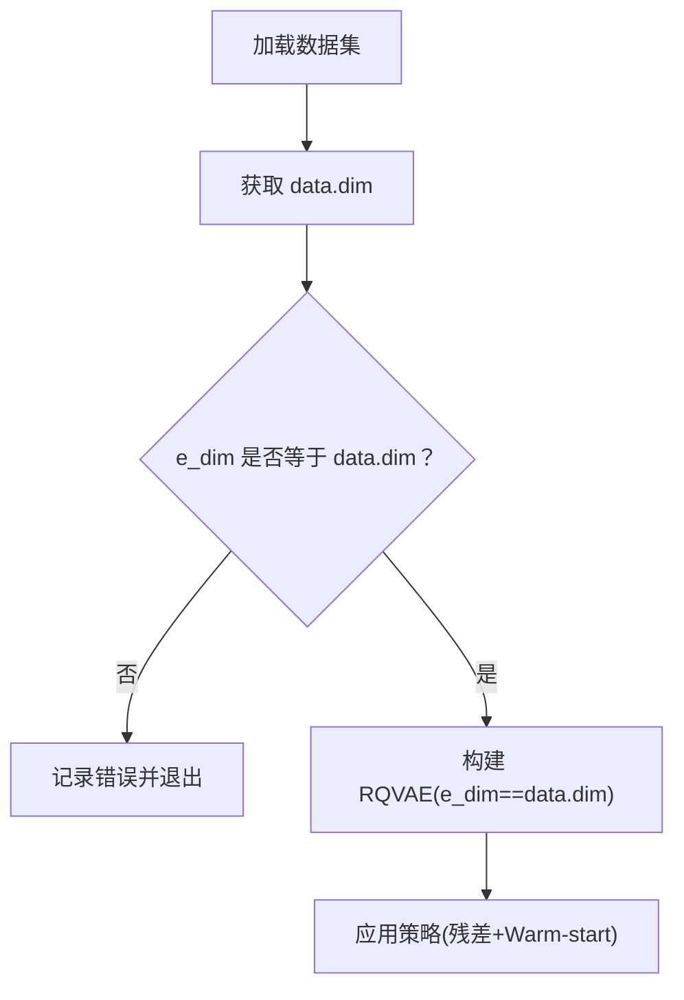
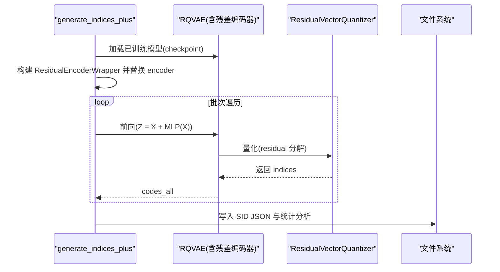
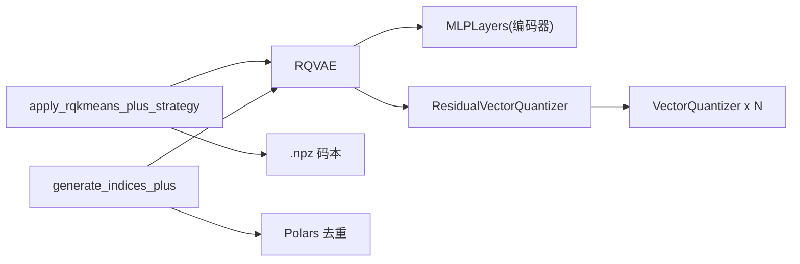

# RQ-Kmeans+

<cite>
**本文引用的文件列表**
- [rq/rqkmeans_plus.py](file://rq/rqkmeans_plus.py)
- [rq/generate_indices_plus.py](file://rq/generate_indices_plus.py)
- [rq/models/rqvae.py](file://rq/models/rqvae.py)
- [rq/models/rq.py](file://rq/models/rq.py)
- [rq/models/vq.py](file://rq/models/vq.py)
- [rq/models/layers.py](file://rq/models/layers.py)
- [rq/datasets.py](file://rq/datasets.py)
- [rq/trainer.py](file://rq/trainer.py)
</cite>

## 目录
1. [引言](#引言)
2. [项目结构](#项目结构)
3. [核心组件](#核心组件)
4. [架构总览](#架构总览)
5. [详细组件分析](#详细组件分析)
6. [依赖关系分析](#依赖关系分析)
7. [性能考量](#性能考量)
8. [故障排查指南](#故障排查指南)
9. [结论](#结论)
10. [附录](#附录)

## 引言
本文件围绕 RQ-Kmeans+ 的实现机制展开，重点解析以下内容：
- apply_rqkmeans_plus_strategy 函数如何通过 ResidualEncoderWrapper 为编码器添加残差连接 Z = X + MLP(X)，并采用零初始化策略对 MLP 最后一层线性层进行初始化；
- 如何利用预训练码本（pretrained_codebook_path）进行权重初始化，实现 Warm-start 训练；
- RQ-Kmeans+ 要求 e_dim 必须等于输入维度（data.dim）的根本原因：保证残差结构中 X 与 MLP(X) 维度一致；
- 结合 generate_indices_plus.py，说明生成的 codes_all 和 codebooks 数据结构如何被后续的 SFT 和 RL 流程使用，并展示其在提升模型收敛速度和表示能力方面的优势。

## 项目结构
RQ-Kmeans+ 相关代码主要分布在 rq 目录下，包含模型定义、量化模块、数据加载、训练器以及指标生成脚本等。关键文件如下：
- 模型与量化：models/rqvae.py、models/rq.py、models/vq.py、models/layers.py
- 训练与推理：rqkmeans_plus.py、trainer.py、datasets.py
- 索引生成：generate_indices_plus.py

图表来源
- [rq/models/rqvae.py](file://rq/models/rqvae.py#L1-L85)
- [rq/models/rq.py](file://rq/models/rq.py#L1-L56)
- [rq/models/vq.py](file://rq/models/vq.py#L1-L102)
- [rq/models/layers.py](file://rq/models/layers.py#L1-L108)
- [rq/rqkmeans_plus.py](file://rq/rqkmeans_plus.py#L1-L179)
- [rq/trainer.py](file://rq/trainer.py#L1-L256)
- [rq/datasets.py](file://rq/datasets.py#L1-L40)
- [rq/generate_indices_plus.py](file://rq/generate_indices_plus.py#L1-L188)

章节来源
- [rq/rqkmeans_plus.py](file://rq/rqkmeans_plus.py#L1-L179)
- [rq/models/rqvae.py](file://rq/models/rqvae.py#L1-L85)
- [rq/models/rq.py](file://rq/models/rq.py#L1-L56)
- [rq/models/vq.py](file://rq/models/vq.py#L1-L102)
- [rq/models/layers.py](file://rq/models/layers.py#L1-L108)
- [rq/datasets.py](file://rq/datasets.py#L1-L40)
- [rq/trainer.py](file://rq/trainer.py#L1-L256)
- [rq/generate_indices_plus.py](file://rq/generate_indices_plus.py#L1-L188)

## 核心组件
- ResidualEncoderWrapper：为原始编码器包装残差结构，实现 Z = X + MLP(X)。
- apply_rqkmeans_plus_strategy：应用残差连接与 Warm-start 初始化策略，包括零初始化最后一层线性层、加载预训练码本到 VQ 层。
- RQVAE：端到端模型，包含编码器（MLPLayers）、残差量化器（ResidualVectorQuantizer）与解码器（MLPLayers）。
- ResidualVectorQuantizer：多级向量量化器，逐层残差分解并输出各级 indices。
- VectorQuantizer：单级向量量化器，支持 KMeans 初始化与 Sinkhorn 约束。
- MLPLayers：通用多层感知机，负责初始化与前向传播。
- EmbDataset：嵌入数据集，提供维度信息 data.dim。
- Trainer：训练器，负责优化、调度、评估与保存检查点。
- generate_indices_plus：基于已训练模型生成 SID 索引，用于下游 SFT/RL。

章节来源
- [rq/rqkmeans_plus.py](file://rq/rqkmeans_plus.py#L1-L88)
- [rq/models/rqvae.py](file://rq/models/rqvae.py#L1-L85)
- [rq/models/rq.py](file://rq/models/rq.py#L1-L56)
- [rq/models/vq.py](file://rq/models/vq.py#L1-L102)
- [rq/models/layers.py](file://rq/models/layers.py#L1-L108)
- [rq/datasets.py](file://rq/datasets.py#L1-L40)
- [rq/trainer.py](file://rq/trainer.py#L1-L256)
- [rq/generate_indices_plus.py](file://rq/generate_indices_plus.py#L1-L188)

## 架构总览
RQ-Kmeans+ 的整体流程由“应用策略”和“训练/推理”两条主线构成：
- 应用策略阶段：对模型编码器进行残差包装，零初始化最后一层线性层，并加载预训练码本到 VQ 层，实现 Warm-start。
- 训练阶段：使用 Trainer 对 RQVAE 进行端到端训练，计算重建损失与量化损失，评估碰撞率。
- 推理阶段：generate_indices_plus 基于已训练模型对输入嵌入执行 Z = X + MLP(X) 后进行量化，得到 codes_all；同时可导出 codebooks 供下游使用。

图表来源
- [rq/rqkmeans_plus.py](file://rq/rqkmeans_plus.py#L24-L88)
- [rq/models/rqvae.py](file://rq/models/rqvae.py#L46-L66)
- [rq/trainer.py](file://rq/trainer.py#L98-L125)
- [rq/datasets.py](file://rq/datasets.py#L1-L40)

## 详细组件分析

### ResidualEncoderWrapper 与残差连接机制
- ResidualEncoderWrapper 将原始编码器作为内部 MLP，前向时返回 Z = X + MLP(X)。
- 在 apply_rqkmeans_plus_strategy 中，若模型存在 encoder 字段，则将其替换为 ResidualEncoderWrapper，并将包装后的模块移动到目标设备。
- 该设计确保残差分支与主干分支维度一致，从而实现稳定的梯度流动与更好的表征学习。

图表来源
- [rq/rqkmeans_plus.py](file://rq/rqkmeans_plus.py#L15-L23)
- [rq/models/rqvae.py](file://rq/models/rqvae.py#L46-L66)

章节来源
- [rq/rqkmeans_plus.py](file://rq/rqkmeans_plus.py#L15-L33)
- [rq/models/rqvae.py](file://rq/models/rqvae.py#L46-L66)

### 零初始化策略与最后一层线性层
- apply_rqkmeans_plus_strategy 会遍历编码器（MLPLayers）的模块，定位最后一个线性层，并将其权重与偏置置零。
- 零初始化的作用是使残差分支在训练初期对主干信号贡献较小，避免破坏输入特征，从而稳定训练初期的收敛过程。

图表来源
- [rq/rqkmeans_plus.py](file://rq/rqkmeans_plus.py#L35-L58)

章节来源
- [rq/rqkmeans_plus.py](file://rq/rqkmeans_plus.py#L35-L58)

### 预训练码本加载与 Warm-start 训练
- apply_rqkmeans_plus_strategy 从 .npz 文件中按层级加载码本，并复制到对应 VQ 层的 embedding 权重中。
- 若未找到目标 VQ 层或 .npz 中不存在对应键值，会记录警告或错误日志。
- 通过将预训练码本注入到 VQ 层，模型在训练初期即可获得更合理的离散表示，显著提升收敛速度与最终性能。

图表来源
- [rq/rqkmeans_plus.py](file://rq/rqkmeans_plus.py#L59-L87)
- [rq/models/vq.py](file://rq/models/vq.py#L21-L31)

章节来源
- [rq/rqkmeans_plus.py](file://rq/rqkmeans_plus.py#L59-L87)
- [rq/models/vq.py](file://rq/models/vq.py#L21-L31)

### e_dim 必须等于输入维度的根本原因
- RQ-Kmeans+ 的残差结构要求 X 与 MLP(X) 维度一致，才能进行逐元素相加。
- RQVAE 的编码器输出维度由 e_dim 决定，因此 e_dim 必须等于输入嵌入维度 data.dim。
- 在 rqkmeans_plus.py 的入口处，若 e_dim 不等于 data.dim，会直接报错并退出，提示用户设置正确的 e_dim。

图表来源
- [rq/rqkmeans_plus.py](file://rq/rqkmeans_plus.py#L141-L148)
- [rq/datasets.py](file://rq/datasets.py#L31-L31)
- [rq/models/rqvae.py](file://rq/models/rqvae.py#L46-L46)

章节来源
- [rq/rqkmeans_plus.py](file://rq/rqkmeans_plus.py#L141-L148)
- [rq/datasets.py](file://rq/datasets.py#L31-L31)
- [rq/models/rqvae.py](file://rq/models/rqvae.py#L46-L46)

### 生成 SID 索引与下游使用
- generate_indices_plus 基于已训练模型对输入嵌入执行 Z = X + MLP(X) 后进行量化，得到 codes_all（形状为 [N, Levels]）。
- 通过 Polars 对重复序列进行去重处理，生成最终的 SID 文本序列，写入 JSON 文件。
- 可导出 codebooks（每层的嵌入权重），用于下游 SFT/RL 等任务的初始化或检索增强。

图表来源
- [rq/generate_indices_plus.py](file://rq/generate_indices_plus.py#L40-L116)
- [rq/models/rq.py](file://rq/models/rq.py#L39-L56)
- [rq/models/rqvae.py](file://rq/models/rqvae.py#L61-L66)

章节来源
- [rq/generate_indices_plus.py](file://rq/generate_indices_plus.py#L40-L116)
- [rq/models/rq.py](file://rq/models/rq.py#L39-L56)
- [rq/models/rqvae.py](file://rq/models/rqvae.py#L61-L66)

## 依赖关系分析
- RQVAE 依赖 MLPLayers 作为编码器与解码器，依赖 ResidualVectorQuantizer 作为量化模块。
- ResidualVectorQuantizer 由多个 VectorQuantizer 组成，逐层进行残差分解。
- VectorQuantizer 使用 Embedding 作为码本，并支持 KMeans 初始化与 Sinkhorn 约束。
- apply_rqkmeans_plus_strategy 依赖 RQVAE 的结构（encoder、rq.vq_layers），并依赖 .npz 码本文件。
- generate_indices_plus 依赖 RQVAE 的结构与 checkpoint 文件，以及 Polars 进行去重处理。

图表来源
- [rq/models/rqvae.py](file://rq/models/rqvae.py#L46-L66)
- [rq/models/rq.py](file://rq/models/rq.py#L24-L38)
- [rq/models/vq.py](file://rq/models/vq.py#L21-L31)
- [rq/rqkmeans_plus.py](file://rq/rqkmeans_plus.py#L24-L87)
- [rq/generate_indices_plus.py](file://rq/generate_indices_plus.py#L40-L116)

章节来源
- [rq/models/rqvae.py](file://rq/models/rqvae.py#L46-L66)
- [rq/models/rq.py](file://rq/models/rq.py#L24-L38)
- [rq/models/vq.py](file://rq/models/vq.py#L21-L31)
- [rq/rqkmeans_plus.py](file://rq/rqkmeans_plus.py#L24-L87)
- [rq/generate_indices_plus.py](file://rq/generate_indices_plus.py#L40-L116)

## 性能考量
- 残差连接与零初始化有助于稳定训练初期的梯度，减少发散风险，提升收敛速度。
- 预训练码本 Warm-start 能够显著降低初始量化误差，提高重建质量与表示能力。
- 多级量化（Levels）在保持高保真度的同时，通过残差分解逐步逼近输入，有利于下游任务的语义表达。
- 训练器中对梯度进行裁剪与学习率调度，有助于在大规模数据上稳定收敛。

[本节为一般性讨论，不直接分析具体文件]

## 故障排查指南
- e_dim 与 data.dim 不一致：入口处会直接报错并退出，需确保 e_dim 设置为输入嵌入维度。
- 未找到 encoder 或 VQ 层：apply_rqkmeans_plus_strategy 会在日志中记录错误或警告，需确认模型结构与属性名。
- 未找到 .npz 码本文件：会抛出文件未找到异常，需检查路径与键名是否正确。
- 训练过程中出现 NaN：训练器包含 NaN 检查逻辑，建议检查学习率、梯度裁剪与数据预处理。

章节来源
- [rq/rqkmeans_plus.py](file://rq/rqkmeans_plus.py#L141-L148)
- [rq/rqkmeans_plus.py](file://rq/rqkmeans_plus.py#L59-L87)
- [rq/trainer.py](file://rq/trainer.py#L93-L96)

## 结论
RQ-Kmeans+ 通过残差连接与零初始化策略稳定了训练初期的收敛，再结合预训练码本的 Warm-start 初始化，有效提升了模型的收敛速度与表示能力。严格的维度约束（e_dim = data.dim）确保了残差结构的可行性。generate_indices_plus 生成的 codes_all 与 codebooks 为下游 SFT/RL 提供了高质量的离散语义路径与初始化资源，进一步增强了系统的实用性与扩展性。

[本节为总结性内容，不直接分析具体文件]

## 附录
- 关键参数与用途
  - pretrained_codebook_path：预训练码本文件路径，用于 Warm-start。
  - e_dim：编码器输出维度，必须等于输入嵌入维度。
  - num_emb_list：各级量化码本大小列表。
  - layers：编码器隐藏层维度列表。
  - loss_type：重建损失类型（如 mse/l1）。
  - beta：量化损失权重系数。
  - sk_epsilons/sk_iters：Sinkhorn 约束相关参数。
  - dropout_prob/bn：正则化与批归一化开关。
  - kmeans_init/kmeans_iters：KMeans 初始化与迭代次数。

[本节为概览性内容，不直接分析具体文件]