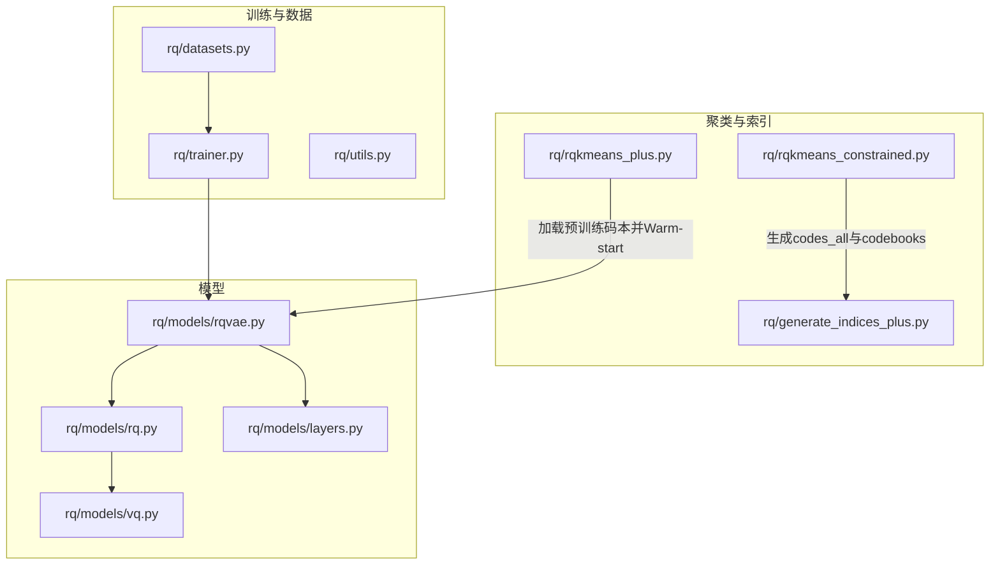
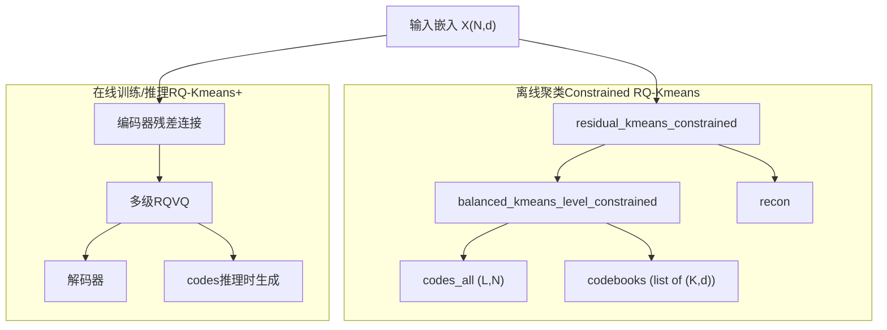
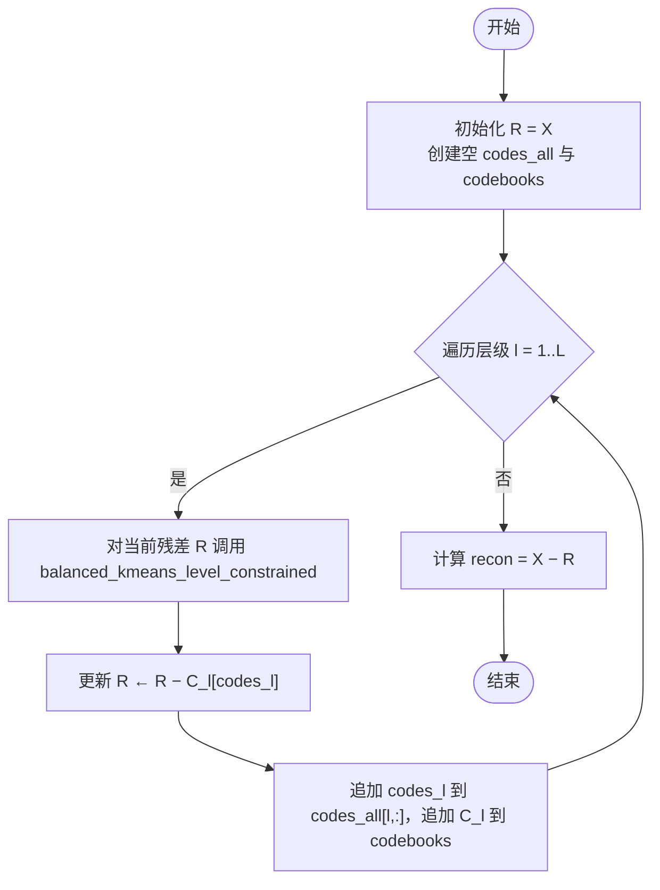
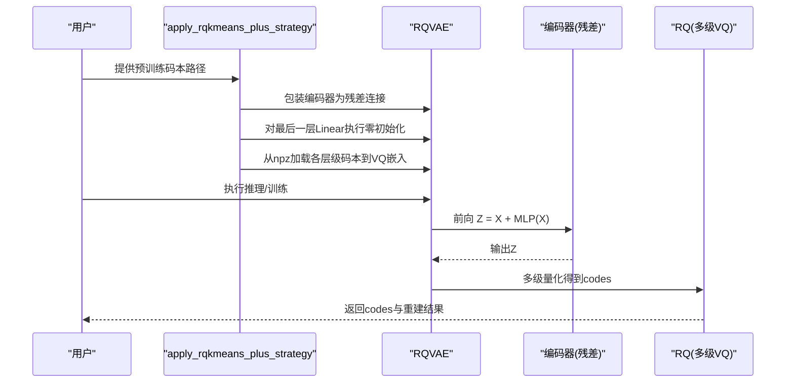
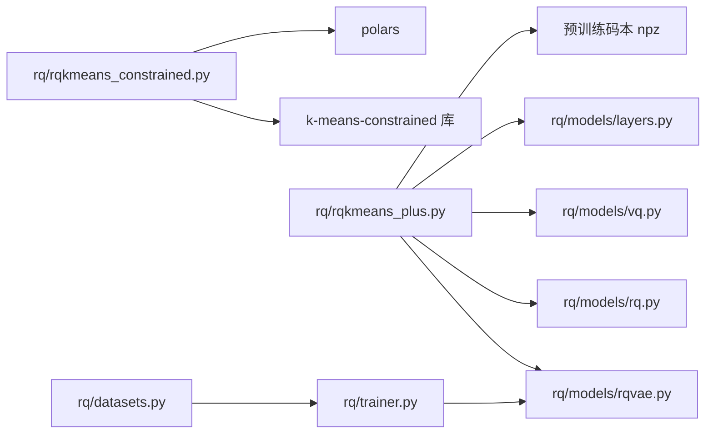

# RQ-Kmeans系列

<cite>
**本文引用的文件**
- [rq/rqkmeans_constrained.py](file://rq/rqkmeans_constrained.py)
- [rq/rqkmeans_plus.py](file://rq/rqkmeans_plus.py)
- [rq/models/rq.py](file://rq/models/rq.py)
- [rq/models/vq.py](file://rq/models/vq.py)
- [rq/models/layers.py](file://rq/models/layers.py)
- [rq/models/rqvae.py](file://rq/models/rqvae.py)
- [rq/generate_indices_plus.py](file://rq/generate_indices_plus.py)
- [rq/datasets.py](file://rq/datasets.py)
- [rq/trainer.py](file://rq/trainer.py)
- [rq/utils.py](file://rq/utils.py)
</cite>

## 目录
1. [引言](#引言)
2. [项目结构](#项目结构)
3. [核心组件](#核心组件)
4. [架构总览](#架构总览)
5. [详细组件分析](#详细组件分析)
6. [依赖关系分析](#依赖关系分析)
7. [性能考量](#性能考量)
8. [故障排查指南](#故障排查指南)
9. [结论](#结论)
10. [附录](#附录)

## 引言
本文件系统化梳理RQ-Kmeans系列算法，聚焦两类变体：
- Constrained RQ-Kmeans：基于k-means-constrained实现“平衡簇大小”的残差量化聚类，通过每层约束簇大小范围，降低碰撞率。
- RQ-Kmeans+：在RQVAE框架上引入残差连接与预训练码本初始化，采用零初始化策略稳定Warm-start训练，要求编码器输出维度e_dim与输入维度一致以保持残差结构正确。

文档将对比两者的实现差异，解析关键函数、数据结构（codes_all、codebooks）及后续应用，并给出可视化图示与排障建议。

## 项目结构
RQ-Kmeans系列位于rq目录下，围绕嵌入向量的分层量化与索引生成展开，包含：
- 聚类与索引生成脚本：rq/rqkmeans_constrained.py、rq/rqkmeans_plus.py、rq/generate_indices_plus.py
- 模型定义：rq/models/rqvae.py、rq/models/rq.py、rq/models/vq.py、rq/models/layers.py
- 训练与评估：rq/trainer.py、rq/datasets.py
- 工具与辅助：rq/utils.py

图表来源
- [rq/rqkmeans_constrained.py](file://rq/rqkmeans_constrained.py#L1-L120)
- [rq/rqkmeans_plus.py](file://rq/rqkmeans_plus.py#L1-L120)
- [rq/generate_indices_plus.py](file://rq/generate_indices_plus.py#L1-L120)
- [rq/models/rqvae.py](file://rq/models/rqvae.py#L1-L85)
- [rq/models/rq.py](file://rq/models/rq.py#L1-L56)
- [rq/models/vq.py](file://rq/models/vq.py#L1-L102)
- [rq/models/layers.py](file://rq/models/layers.py#L1-L108)
- [rq/datasets.py](file://rq/datasets.py#L1-L40)
- [rq/trainer.py](file://rq/trainer.py#L1-L120)
- [rq/utils.py](file://rq/utils.py#L1-L38)

章节来源
- [rq/rqkmeans_constrained.py](file://rq/rqkmeans_constrained.py#L1-L120)
- [rq/rqkmeans_plus.py](file://rq/rqkmeans_plus.py#L1-L120)
- [rq/models/rqvae.py](file://rq/models/rqvae.py#L1-L85)
- [rq/models/rq.py](file://rq/models/rq.py#L1-L56)
- [rq/models/vq.py](file://rq/models/vq.py#L1-L102)
- [rq/models/layers.py](file://rq/models/layers.py#L1-L108)
- [rq/datasets.py](file://rq/datasets.py#L1-L40)
- [rq/trainer.py](file://rq/trainer.py#L1-L120)
- [rq/utils.py](file://rq/utils.py#L1-L38)

## 核心组件
- Constrained RQ-Kmeans
  - balanced_kmeans_level_constrained：使用k-means-constrained对当前残差进行平衡簇大小的K-means聚类，返回标签与质心。
  - residual_kmeans_constrained：按层级对残差逐层聚类，生成codes_all与codebooks，并计算重建误差。
  - 数据结构：codes_all为(L, N)整数序列；codebooks为长度L的列表，每个元素为(K, d)的质心矩阵；recon为重建向量。
- RQ-Kmeans+
  - apply_rqkmeans_plus_strategy：对编码器添加残差连接（Z = X + MLP(X)），零初始化最后一层线性层，并从预训练npz加载各层码本到VQ嵌入权重。
  - RQVAE：编码器MLP + 多级ResidualVectorQuantizer + 解码器MLP。
  - generate_indices_plus：推理阶段对数据进行编码，生成codes并去重，输出JSON索引。
  - 关键约束：e_dim必须等于输入维度，以保证残差结构Z = X + MLP(X)的维度一致性。

章节来源
- [rq/rqkmeans_constrained.py](file://rq/rqkmeans_constrained.py#L26-L128)
- [rq/rqkmeans_plus.py](file://rq/rqkmeans_plus.py#L15-L120)
- [rq/models/rqvae.py](file://rq/models/rqvae.py#L1-L85)
- [rq/models/rq.py](file://rq/models/rq.py#L1-L56)
- [rq/models/vq.py](file://rq/models/vq.py#L1-L102)
- [rq/generate_indices_plus.py](file://rq/generate_indices_plus.py#L1-L120)

## 架构总览
RQ-Kmeans系列由“离线聚类”和“在线训练/推理”两条路径构成：
- 离线路径（Constrained RQ-Kmeans）
  - 输入：嵌入向量X ∈ (N, d)
  - 过程：逐层对残差R进行K-means聚类，得到codes_all与codebooks
  - 输出：codes_all、codebooks、recon
- 在线路径（RQ-Kmeans+）
  - 输入：嵌入向量X ∈ (N, d)，预训练码本（来自离线聚类）
  - 过程：编码器添加残差连接，零初始化最后一层，加载码本权重，训练或推理生成codes

图表来源
- [rq/rqkmeans_constrained.py](file://rq/rqkmeans_constrained.py#L26-L128)
- [rq/rqkmeans_plus.py](file://rq/rqkmeans_plus.py#L15-L120)
- [rq/models/rqvae.py](file://rq/models/rqvae.py#L1-L85)
- [rq/models/rq.py](file://rq/models/rq.py#L1-L56)

## 详细组件分析

### Constrained RQ-Kmeans：平衡簇大小与残差聚类
- 平衡簇大小约束
  - 通过k-means-constrained设置size_min与size_max，使每簇样本数在[n/K-1, n/K+1]范围内，缓解极端不平衡导致的碰撞。
  - 返回labels与cluster_centers_，用于后续codes_all与codebooks构建。
- 残差聚类流程
  - 初始化R = X，逐层对R进行聚类，得到codes_l与C_l，并更新R ← R − C_l[codes_l]，最终recon = X − R。
  - 每层记录时间与残差MSE，便于评估收敛与重建质量。
- 数据结构与后续应用
  - codes_all：(L, N)整数序列，每行对应样本在各层的码值；可用于生成紧凑SID。
  - codebooks：长度为L的列表，第l个元素为(K, d)的质心矩阵；可直接保存为npz供后续加载。
  - 该流程还提供去重逻辑与JSON索引生成，便于下游检索。

图表来源
- [rq/rqkmeans_constrained.py](file://rq/rqkmeans_constrained.py#L67-L128)

章节来源
- [rq/rqkmeans_constrained.py](file://rq/rqkmeans_constrained.py#L26-L128)

### RQ-Kmeans+：残差连接与预训练码本Warm-start
- 残差连接策略
  - 将原始编码器替换为ResidualEncoderWrapper，使得前向输出为Z = X + MLP(X)，保证残差结构维度一致。
  - 该设计要求e_dim必须等于输入维度，否则Z与X无法相加。
- 零初始化策略
  - 定位编码器最后一层Linear，将其权重与偏置置零，避免初始梯度过大，提升训练稳定性。
- 预训练码本加载
  - 从预训练npz中读取各层级码本，复制到模型的VQ嵌入权重，作为Warm-start初始化。
- 推理阶段生成codes
  - 前向：Z = model.encoder(X)，再经RQ多级量化得到codes；随后进行去重与JSON格式化输出。

图表来源
- [rq/rqkmeans_plus.py](file://rq/rqkmeans_plus.py#L15-L120)
- [rq/models/rqvae.py](file://rq/models/rqvae.py#L1-L85)
- [rq/models/rq.py](file://rq/models/rq.py#L1-L56)
- [rq/models/vq.py](file://rq/models/vq.py#L1-L102)

章节来源
- [rq/rqkmeans_plus.py](file://rq/rqkmeans_plus.py#L15-L120)
- [rq/models/rqvae.py](file://rq/models/rqvae.py#L1-L85)
- [rq/models/rq.py](file://rq/models/rq.py#L1-L56)
- [rq/models/vq.py](file://rq/models/vq.py#L1-L102)

### 数据结构：codes_all与codebooks
- Constrained RQ-Kmeans
  - codes_all：(L, N)整数数组，第l行表示样本在第l层的码值；用于生成紧凑SID。
  - codebooks：长度为L的列表，第l个元素为(K, d)的质心矩阵；可保存为npz供加载。
- RQ-Kmeans+
  - 推理时生成codes（与Constrained相同的数据结构），随后进行去重与JSON索引生成，便于检索。

章节来源
- [rq/rqkmeans_constrained.py](file://rq/rqkmeans_constrained.py#L83-L128)
- [rq/generate_indices_plus.py](file://rq/generate_indices_plus.py#L90-L150)

## 依赖关系分析
- Constrained RQ-Kmeans
  - 依赖k-means-constrained库实现平衡簇大小；内部调用KMeansConstrained并返回labels与cluster_centers_。
  - 通过polars进行codes去重与JSON索引生成。
- RQ-Kmeans+
  - 依赖RQVAE、ResidualVectorQuantizer、VectorQuantizer与MLPLayers构建残差量化网络。
  - 依赖NumPy加载预训练码本npz，并将权重复制到VQ嵌入层。
  - 依赖Trainer进行训练循环与碰撞率评估。

图表来源
- [rq/rqkmeans_constrained.py](file://rq/rqkmeans_constrained.py#L1-L47)
- [rq/rqkmeans_plus.py](file://rq/rqkmeans_plus.py#L1-L120)
- [rq/models/rqvae.py](file://rq/models/rqvae.py#L1-L85)
- [rq/models/rq.py](file://rq/models/rq.py#L1-L56)
- [rq/models/vq.py](file://rq/models/vq.py#L1-L102)
- [rq/models/layers.py](file://rq/models/layers.py#L1-L108)
- [rq/trainer.py](file://rq/trainer.py#L1-L120)
- [rq/datasets.py](file://rq/datasets.py#L1-L40)

章节来源
- [rq/rqkmeans_constrained.py](file://rq/rqkmeans_constrained.py#L1-L47)
- [rq/rqkmeans_plus.py](file://rq/rqkmeans_plus.py#L1-L120)
- [rq/models/rqvae.py](file://rq/models/rqvae.py#L1-L85)
- [rq/models/rq.py](file://rq/models/rq.py#L1-L56)
- [rq/models/vq.py](file://rq/models/vq.py#L1-L102)
- [rq/models/layers.py](file://rq/models/layers.py#L1-L108)
- [rq/trainer.py](file://rq/trainer.py#L1-L120)
- [rq/datasets.py](file://rq/datasets.py#L1-L40)

## 性能考量
- Constrained RQ-Kmeans
  - 平衡簇大小可显著降低碰撞率，提高SID紧凑性；但k-means-constrained的训练开销较大，需合理设置max_iter与n_jobs。
  - 残差逐层聚类会逐步降低重建误差，层数越多，重建质量越高但计算成本增加。
- RQ-Kmeans+
  - 残差连接与零初始化有助于稳定Warm-start训练，减少初期震荡；预训练码本可显著缩短收敛时间。
  - e_dim必须等于输入维度，否则维度不匹配会导致残差结构失效，影响训练与推理。

[本节为通用性能讨论，无需列出具体文件来源]

## 故障排查指南
- 缺少k-means-constrained库
  - 现象：导入失败并提示安装命令。
  - 处理：安装k-means-constrained后重试。
- 预训练码本路径错误
  - 现象：加载码本时报错或未加载成功。
  - 处理：确认npz文件存在且包含正确的键名（如codebook_0、codebook_1等）。
- e_dim与输入维度不一致
  - 现象：RQ-Kmeans+训练启动时报错，提示e_dim必须等于输入维度。
  - 处理：在调用时将--e_dim设置为数据维度。
- 碰撞率异常
  - 现象：训练过程中碰撞率居高不下。
  - 处理：检查K值是否过小、层数是否过多、是否启用sinkhorn以及是否进行了去重。

章节来源
- [rq/rqkmeans_constrained.py](file://rq/rqkmeans_constrained.py#L1-L47)
- [rq/rqkmeans_plus.py](file://rq/rqkmeans_plus.py#L120-L179)
- [rq/trainer.py](file://rq/trainer.py#L120-L200)

## 结论
- Constrained RQ-Kmeans通过k-means-constrained实现平衡簇大小，结合残差逐层聚类有效降低碰撞率，适合离线构建高质量码本与索引。
- RQ-Kmeans+通过残差连接与预训练码本Warm-start，结合零初始化策略，显著提升训练稳定性与收敛速度，适用于在线训练与推理场景。
- 两者共享统一的数据结构（codes_all、codebooks），并在后续流程中生成紧凑SID与JSON索引，便于检索与应用。

[本节为总结性内容，无需列出具体文件来源]

## 附录
- 关键函数与文件映射
  - balanced_kmeans_level_constrained：[rq/rqkmeans_constrained.py](file://rq/rqkmeans_constrained.py#L26-L86)
  - residual_kmeans_constrained：[rq/rqkmeans_constrained.py](file://rq/rqkmeans_constrained.py#L67-L128)
  - apply_rqkmeans_plus_strategy：[rq/rqkmeans_plus.py](file://rq/rqkmeans_plus.py#L24-L88)
  - ResidualEncoderWrapper：[rq/rqkmeans_plus.py](file://rq/rqkmeans_plus.py#L15-L23)
  - RQVAE：[rq/models/rqvae.py](file://rq/models/rqvae.py#L1-L85)
  - ResidualVectorQuantizer：[rq/models/rq.py](file://rq/models/rq.py#L1-L56)
  - VectorQuantizer：[rq/models/vq.py](file://rq/models/vq.py#L1-L102)
  - MLPLayers：[rq/models/layers.py](file://rq/models/layers.py#L1-L108)
  - generate_indices_plus：[rq/generate_indices_plus.py](file://rq/generate_indices_plus.py#L1-L188)
  - Trainer：[rq/trainer.py](file://rq/trainer.py#L1-L256)
  - EmbDataset：[rq/datasets.py](file://rq/datasets.py#L1-L40)
  - 工具函数：[rq/utils.py](file://rq/utils.py#L1-L38)