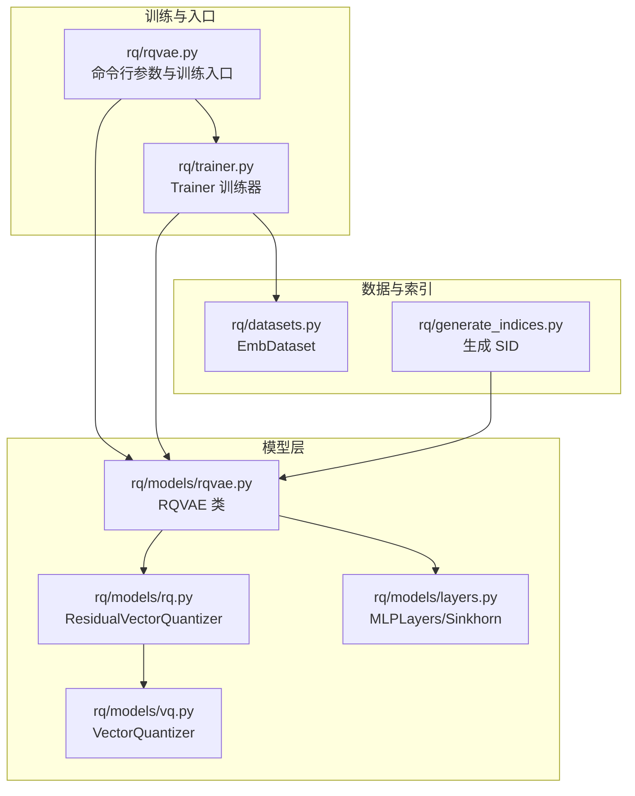
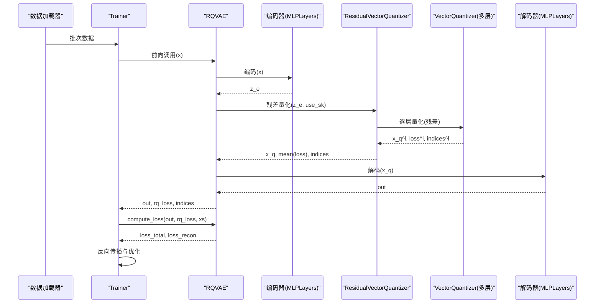
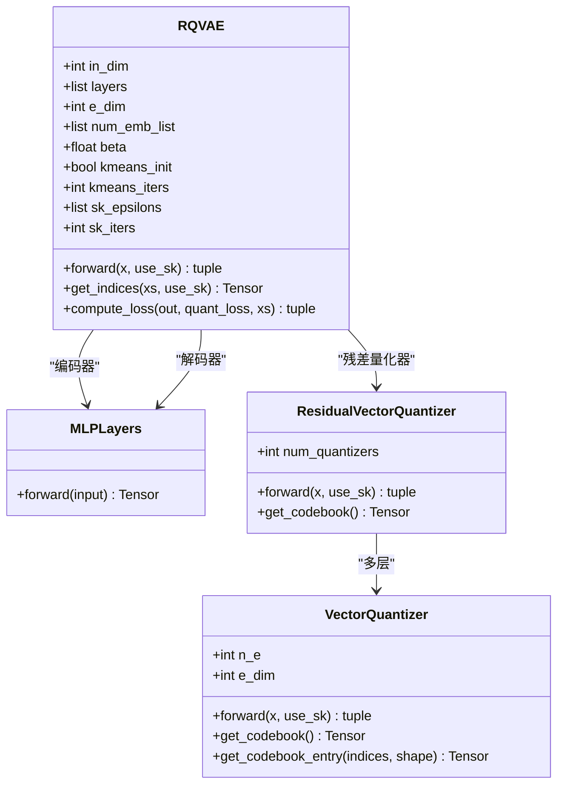
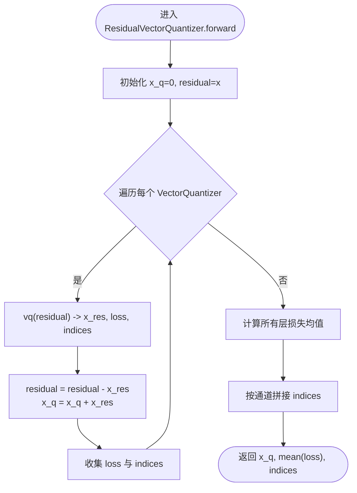
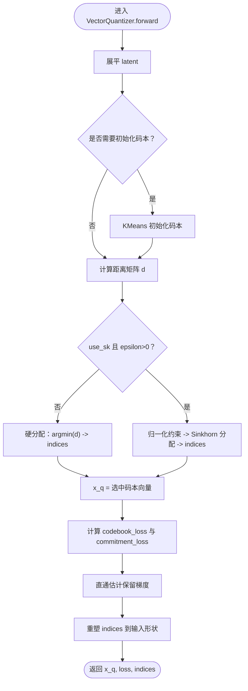
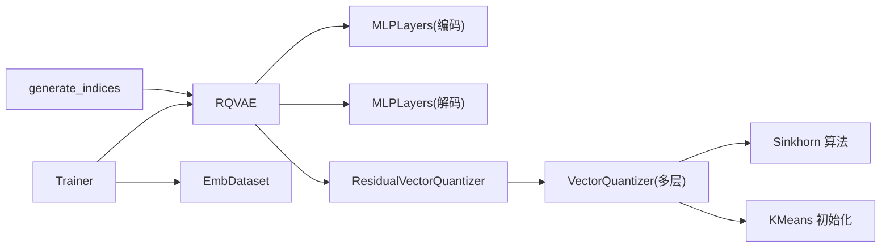

# RQ-VAE

<cite>
**本文引用的文件列表**
- [rq/models/rqvae.py](file://rq/models/rqvae.py)
- [rq/models/rq.py](file://rq/models/rq.py)
- [rq/models/vq.py](file://rq/models/vq.py)
- [rq/models/layers.py](file://rq/models/layers.py)
- [rq/rqvae.py](file://rq/rqvae.py)
- [rq/trainer.py](file://rq/trainer.py)
- [rq/datasets.py](file://rq/datasets.py)
- [rq/generate_indices.py](file://rq/generate_indices.py)
- [README.md](file://README.md)
</cite>

## 目录
1. [简介](#简介)
2. [项目结构](#项目结构)
3. [核心组件](#核心组件)
4. [架构总览](#架构总览)
5. [详细组件分析](#详细组件分析)
6. [依赖关系分析](#依赖关系分析)
7. [性能考量](#性能考量)
8. [故障排查指南](#故障排查指南)
9. [结论](#结论)
10. [附录](#附录)

## 简介
本文件围绕 RQ-VAE（残差量化变分自编码器）展开，聚焦于编码器-残差向量量化器-解码器三段式结构，系统解析 ResidualVectorQuantizer 如何通过多层级码本实现高保真向量压缩；详解 RQVAE 的 forward 方法中残差量化过程、量化损失（rq_loss）计算机制，以及 get_indices 方法如何生成离散的 Semantic ID 序列。同时结合命令行参数，说明学习率、批大小、num_emb_list、e_dim、sk_epsilons 等关键配置对模型性能的影响，并给出实际训练流程示例，阐明其在商品嵌入空间压缩与 SID 生成中的核心作用。

## 项目结构
本仓库与 RQ-VAE 相关的关键目录与文件如下：
- 模型定义：rq/models/rqvae.py（RQVAE 类）、rq/models/rq.py（ResidualVectorQuantizer）、rq/models/vq.py（VectorQuantizer）、rq/models/layers.py（MLPLayers、Sinkhorn 算法）
- 训练入口与脚本：rq/rqvae.py（命令行参数解析与训练主流程）、rq/trainer.py（Trainer 训练器）
- 数据加载：rq/datasets.py（EmbDataset）
- 索引生成：rq/generate_indices.py（将训练好的模型用于生成 SID）
- 项目背景：README.md（框架定位与 SID 构建流程）

图表来源
- [rq/models/rqvae.py](file://rq/models/rqvae.py#L1-L85)
- [rq/models/rq.py](file://rq/models/rq.py#L1-L56)
- [rq/models/vq.py](file://rq/models/vq.py#L1-L102)
- [rq/models/layers.py](file://rq/models/layers.py#L1-L108)
- [rq/rqvae.py](file://rq/rqvae.py#L1-L95)
- [rq/trainer.py](file://rq/trainer.py#L1-L256)
- [rq/datasets.py](file://rq/datasets.py#L1-L40)
- [rq/generate_indices.py](file://rq/generate_indices.py#L1-L151)

章节来源
- [rq/models/rqvae.py](file://rq/models/rqvae.py#L1-L85)
- [rq/models/rq.py](file://rq/models/rq.py#L1-L56)
- [rq/models/vq.py](file://rq/models/vq.py#L1-L102)
- [rq/models/layers.py](file://rq/models/layers.py#L1-L108)
- [rq/rqvae.py](file://rq/rqvae.py#L1-L95)
- [rq/trainer.py](file://rq/trainer.py#L1-L256)
- [rq/datasets.py](file://rq/datasets.py#L1-L40)
- [rq/generate_indices.py](file://rq/generate_indices.py#L1-L151)
- [README.md](file://README.md#L38-L48)

## 核心组件
- RQVAE：三段式结构（编码器-残差向量量化器-解码器），负责重建输入并输出量化损失与离散索引。
- ResidualVectorQuantizer：多级向量量化器，逐层分解残差，得到多维离散索引序列。
- VectorQuantizer：单级码本量化器，支持 KMeans 初始化与 Sinkhorn 归一化分配。
- MLPLayers：通用 MLP 层堆叠，支持 Dropout、BatchNorm 与激活函数。
- Trainer：训练循环、优化器、调度器、评估（碰撞率）与检查点保存。
- EmbDataset：从预存嵌入数组加载数据，自动处理 NaN/Inf。
- generate_indices：基于已训练模型生成商品的 Semantic ID（SID）序列。

章节来源
- [rq/models/rqvae.py](file://rq/models/rqvae.py#L1-L85)
- [rq/models/rq.py](file://rq/models/rq.py#L1-L56)
- [rq/models/vq.py](file://rq/models/vq.py#L1-L102)
- [rq/models/layers.py](file://rq/models/layers.py#L1-L108)
- [rq/trainer.py](file://rq/trainer.py#L1-L256)
- [rq/datasets.py](file://rq/datasets.py#L1-L40)
- [rq/generate_indices.py](file://rq/generate_indices.py#L1-L151)

## 架构总览
RQ-VAE 的整体流程为：输入嵌入经编码器映射到潜在空间，随后由 ResidualVectorQuantizer 逐层进行残差量化，得到量化后的表示与每层的离散索引；解码器将量化表示还原回原始嵌入空间；训练时最小化重构损失与量化损失的加权和。

图表来源
- [rq/trainer.py](file://rq/trainer.py#L98-L125)
- [rq/models/rqvae.py](file://rq/models/rqvae.py#L61-L85)
- [rq/models/rq.py](file://rq/models/rq.py#L39-L56)
- [rq/models/vq.py](file://rq/models/vq.py#L63-L99)
- [rq/models/layers.py](file://rq/models/layers.py#L1-L44)

## 详细组件分析

### RQVAE 类
- 结构要点
  - 编码器：MLPLayers，维度链为 [in_dim] -> layers -> [e_dim]。
  - 残差向量量化器：ResidualVectorQuantizer，层数等于 num_emb_list 长度。
  - 解码器：MLPLayers，维度链为 encode_layer_dims[::-1]。
  - 损失类型：mse 或 l1 重构损失；总损失为 loss_recon + quant_loss_weight * rq_loss。
- 前向流程
  - 编码 -> 残差量化 -> 解码 -> 返回 out、rq_loss、indices。
- get_indices 流程
  - 仅执行编码与残差量化，返回 indices（不反向传播）。

图表来源
- [rq/models/rqvae.py](file://rq/models/rqvae.py#L10-L85)
- [rq/models/rq.py](file://rq/models/rq.py#L1-L56)
- [rq/models/vq.py](file://rq/models/vq.py#L1-L102)
- [rq/models/layers.py](file://rq/models/layers.py#L1-L44)

章节来源
- [rq/models/rqvae.py](file://rq/models/rqvae.py#L10-L85)

### ResidualVectorQuantizer（多层级码本）
- 多级结构
  - 由多个 VectorQuantizer 组成，层数与 num_emb_list 长度一致。
  - 每一层对当前残差进行量化，逐步逼近原向量。
- 前向流程
  - 初始化 x_q=0，residual=x。
  - 逐层：x_res, loss, indices = vq(residual)，更新 residual = residual - x_res，累积 x_q += x_res。
  - 返回 x_q、所有层损失均值、按通道拼接的 indices。
- 代码片段路径
  - [前向实现](file://rq/models/rq.py#L39-L56)
  - [码本聚合](file://rq/models/rq.py#L32-L37)

图表来源
- [rq/models/rq.py](file://rq/models/rq.py#L39-L56)

章节来源
- [rq/models/rq.py](file://rq/models/rq.py#L1-L56)

### VectorQuantizer（单级码本）
- 功能
  - 支持 KMeans 初始化码本（可选）。
  - 使用 L2 距离查找最近码本向量，或使用 Sinkhorn 算法进行软分配。
  - 计算两种损失：codebook_loss 与 commitment_loss，二者加权得到最终 loss。
- 前向流程
  - 展平输入 latent。
  - 若未初始化且训练中，使用 KMeans 初始化码本。
  - 计算距离矩阵 d。
  - 若 use_sk 为 False 或 sk_epsilon<=0，则硬分配（argmin）；否则使用 Sinkhorn 算法得到概率分配 Q，再取 argmax 得到 indices。
  - 重构 x_q，保留梯度的“直通”估计，返回 x_q、loss、indices。
- 代码片段路径
  - [初始化与 KMeans](file://rq/models/vq.py#L40-L49)
  - [硬/软分配与损失](file://rq/models/vq.py#L63-L99)
  - [Sinkhorn 算法](file://rq/models/layers.py#L86-L108)

图表来源
- [rq/models/vq.py](file://rq/models/vq.py#L63-L99)
- [rq/models/layers.py](file://rq/models/layers.py#L86-L108)

章节来源
- [rq/models/vq.py](file://rq/models/vq.py#L1-L102)
- [rq/models/layers.py](file://rq/models/layers.py#L86-L108)

### MLPLayers（编码/解码网络）
- 功能
  - 通用 MLP 层堆叠，支持 Dropout、BatchNorm 与多种激活函数。
  - 权重初始化采用正态分布。
- 代码片段路径
  - [构造与前向](file://rq/models/layers.py#L1-L44)
  - [激活函数选择](file://rq/models/layers.py#L45-L67)
  - [KMeans 辅助](file://rq/models/layers.py#L69-L83)

章节来源
- [rq/models/layers.py](file://rq/models/layers.py#L1-L108)

### 训练器 Trainer
- 关键职责
  - 构建优化器与学习率调度器（支持 AdamW、SGD、Adagrad、RMSprop 等）。
  - 训练循环：前向 -> compute_loss -> 反向 -> 梯度裁剪 -> 优化 -> 调度。
  - 评估：计算碰撞率（collision_rate），记录最佳模型。
  - 检查点管理：限制保存数量，删除较差模型。
- 代码片段路径
  - [优化器与调度器](file://rq/trainer.py#L49-L92)
  - [训练一步](file://rq/trainer.py#L98-L125)
  - [验证与碰撞率](file://rq/trainer.py#L127-L153)

章节来源
- [rq/trainer.py](file://rq/trainer.py#L1-L256)

### 数据集 EmbDataset
- 功能
  - 从 .npy 文件加载嵌入，自动替换 NaN/Inf。
  - 提供 dim 作为输入维度。
- 代码片段路径
  - [数据加载与统计](file://rq/datasets.py#L1-L32)
  - [getitem/len](file://rq/datasets.py#L33-L40)

章节来源
- [rq/datasets.py](file://rq/datasets.py#L1-L40)

### 索引生成 generate_indices
- 功能
  - 加载训练好的 RQ-VAE 模型，对全量数据推理，得到 indices。
  - 将 indices 转换为带前缀的字符串形式，统计碰撞率并可迭代修正冲突样本。
  - 输出 .index.json，供后续 SFT/RL 使用。
- 代码片段路径
  - [加载权重与构建模型](file://rq/generate_indices.py#L51-L78)
  - [推理与写入](file://rq/generate_indices.py#L82-L102)
  - [碰撞检测与修正](file://rq/generate_indices.py#L114-L134)
  - [输出 JSON](file://rq/generate_indices.py#L136-L151)

章节来源
- [rq/generate_indices.py](file://rq/generate_indices.py#L1-L151)

## 依赖关系分析
- RQVAE 依赖
  - 编码器/解码器：MLPLayers
  - 残差量化器：ResidualVectorQuantizer
  - ResidualVectorQuantizer 依赖：VectorQuantizer
  - VectorQuantizer 依赖：KMeans 初始化、Sinkhorn 算法
- 训练依赖
  - EmbDataset 提供数据
  - Trainer 负责训练循环与评估
  - generate_indices 依赖训练好的模型权重

图表来源
- [rq/models/rqvae.py](file://rq/models/rqvae.py#L10-L85)
- [rq/models/rq.py](file://rq/models/rq.py#L1-L56)
- [rq/models/vq.py](file://rq/models/vq.py#L1-L102)
- [rq/models/layers.py](file://rq/models/layers.py#L1-L108)
- [rq/trainer.py](file://rq/trainer.py#L1-L256)
- [rq/datasets.py](file://rq/datasets.py#L1-L40)
- [rq/generate_indices.py](file://rq/generate_indices.py#L1-L151)

章节来源
- [rq/models/rqvae.py](file://rq/models/rqvae.py#L10-L85)
- [rq/models/rq.py](file://rq/models/rq.py#L1-L56)
- [rq/models/vq.py](file://rq/models/vq.py#L1-L102)
- [rq/models/layers.py](file://rq/models/layers.py#L1-L108)
- [rq/trainer.py](file://rq/trainer.py#L1-L256)
- [rq/datasets.py](file://rq/datasets.py#L1-L40)
- [rq/generate_indices.py](file://rq/generate_indices.py#L1-L151)

## 性能考量
- 学习率（--lr）
  - 控制优化器步长，影响收敛速度与稳定性。过小导致收敛慢，过大可能导致震荡。
  - 代码片段路径：[命令行参数](file://rq/rqvae.py#L17-L20)、[Trainer 构造](file://rq/trainer.py#L21-L28)
- 批大小（--batch_size）
  - 决定 GPU 显存占用与梯度估计方差。较大批次通常更稳定但显存更高。
  - 代码片段路径：[DataLoader 构造](file://rq/rqvae.py#L86-L89)
- num_emb_list（各层级码本大小）
  - 影响压缩比与表达能力。层级越多、每层码本越大，越接近原向量，但 SID 更长。
  - 代码片段路径：[RQVAE 初始化](file://rq/models/rqvae.py#L10-L60)、[ResidualVectorQuantizer 初始化](file://rq/models/rq.py#L13-L31)
- e_dim（嵌入维度）
  - 编码器输出维度，决定潜在空间大小。e_dim 越大，可表达性更强但压缩比下降。
  - 代码片段路径：[RQVAE 初始化](file://rq/models/rqvae.py#L10-L60)
- sk_epsilons（Sinkhorn 归一化系数）
  - 控制软分配强度。sk_epsilon 越大，分配越平滑；sk_epsilon=0 退化为硬分配。
  - 代码片段路径：[VectorQuantizer 前向](file://rq/models/vq.py#L63-L99)、[Sinkhorn 算法](file://rq/models/layers.py#L86-L108)
- 其他超参
  - beta（承诺损失权重）、quant_loss_weight（量化损失权重）、kmeans_init/kmeans_iters、sk_iters 等，共同影响训练稳定性与量化质量。
  - 代码片段路径：[RQVAE 初始化](file://rq/models/rqvae.py#L10-L60)、[VectorQuantizer 初始化](file://rq/models/vq.py#L1-L20)

章节来源
- [rq/rqvae.py](file://rq/rqvae.py#L17-L45)
- [rq/trainer.py](file://rq/trainer.py#L21-L92)
- [rq/models/rqvae.py](file://rq/models/rqvae.py#L10-L60)
- [rq/models/rq.py](file://rq/models/rq.py#L13-L31)
- [rq/models/vq.py](file://rq/models/vq.py#L1-L20)
- [rq/models/layers.py](file://rq/models/layers.py#L86-L108)

## 故障排查指南
- NaN 损失
  - Trainer 在每步训练后检查 loss 是否为 NaN 并抛出异常，便于快速定位问题。
  - 代码片段路径：[NaN 检查](file://rq/trainer.py#L93-L96)
- Sinkhorn 返回 NaN/Inf
  - VectorQuantizer 在使用 Sinkhorn 时会打印警告，建议检查 sk_epsilon 与数据分布。
  - 代码片段路径：[Sinkhorn 分配与警告](file://rq/models/vq.py#L77-L84)
- 数据异常（NaN/Inf）
  - EmbDataset 在加载时会替换 NaN/Inf 为 0，并打印统计信息，有助于发现数据质量问题。
  - 代码片段路径：[数据清洗与统计](file://rq/datasets.py#L12-L30)
- 碰撞率过高
  - Trainer 的评估阶段会计算碰撞率；generate_indices 也可迭代修正冲突样本。
  - 代码片段路径：[评估与碰撞率计算](file://rq/trainer.py#L127-L153)、[碰撞检测与修正](file://rq/generate_indices.py#L114-L134)

章节来源
- [rq/trainer.py](file://rq/trainer.py#L93-L96)
- [rq/models/vq.py](file://rq/models/vq.py#L77-L84)
- [rq/datasets.py](file://rq/datasets.py#L12-L30)
- [rq/generate_indices.py](file://rq/generate_indices.py#L114-L134)

## 结论
RQ-VAE 通过“编码器-残差向量量化器-解码器”的三段式结构，在保持高保真重建的同时实现了嵌入空间的高效压缩。ResidualVectorQuantizer 以多层级码本逐层分解残差，既能提升表达能力，又能生成稳定的离散索引序列。配合 Trainer 的训练循环与 generate_indices 的索引生成流程，RQ-VAE 在商品嵌入空间压缩与 SID 生成中发挥关键作用，为后续 SFT/RL 阶段提供高质量离散语义令牌。

## 附录

### 实际训练流程示例
- 步骤
  - 准备数据：加载 .npy 嵌入，构建 EmbDataset。
  - 构建模型：RQVAE，指定 in_dim（来自数据）、num_emb_list、e_dim、layers 等。
  - 构建训练器：Trainer，设置优化器、调度器、评估间隔等。
  - 训练：循环迭代，每步计算 total loss 与 recon loss，反向传播并更新参数。
  - 评估：周期性计算碰撞率，保存最佳模型。
  - 生成 SID：加载最佳权重，对全量数据推理，生成 .index.json。
- 代码片段路径
  - [命令行参数与入口](file://rq/rqvae.py#L14-L95)
  - [训练循环](file://rq/trainer.py#L98-L125)
  - [评估与保存](file://rq/trainer.py#L127-L153)
  - [索引生成](file://rq/generate_indices.py#L51-L102)

章节来源
- [rq/rqvae.py](file://rq/rqvae.py#L14-L95)
- [rq/trainer.py](file://rq/trainer.py#L98-L153)
- [rq/generate_indices.py](file://rq/generate_indices.py#L51-L102)

### RQ-VAE 在商品嵌入与 SID 生成中的角色
- 框架定位
  - README 中明确指出：从文本到嵌入，再到三层次 RQ-VAE 量化，形成紧凑且语义有意义的 SID。
- 代码片段路径
  - [框架说明](file://README.md#L38-L48)

章节来源
- [README.md](file://README.md#L38-L48)