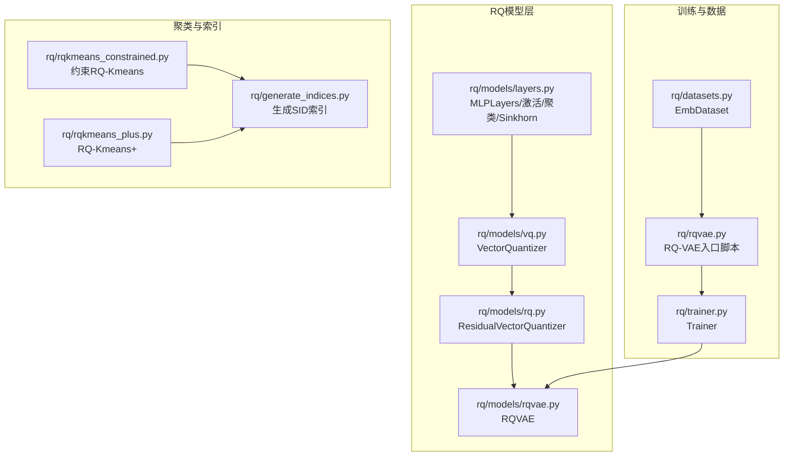
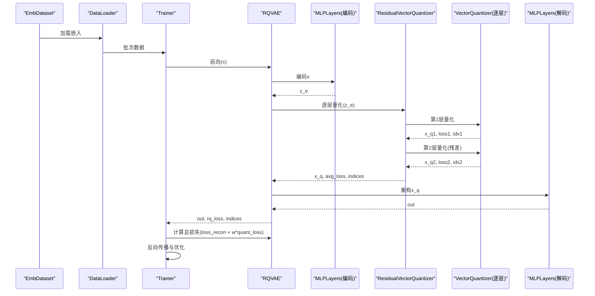
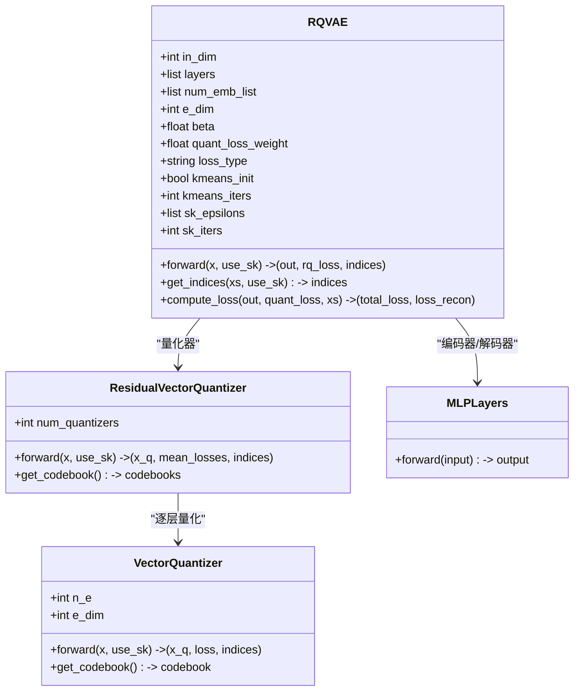
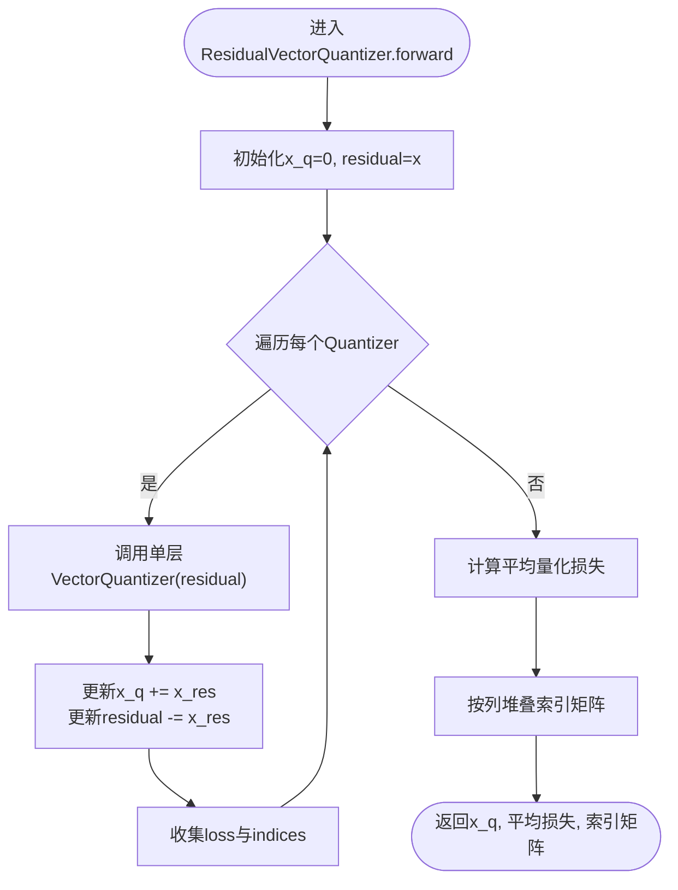
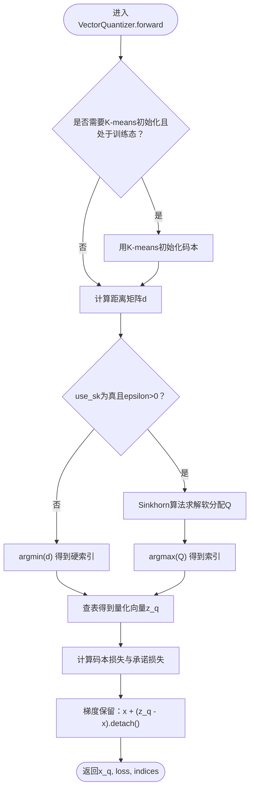
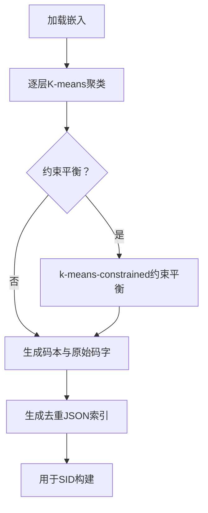
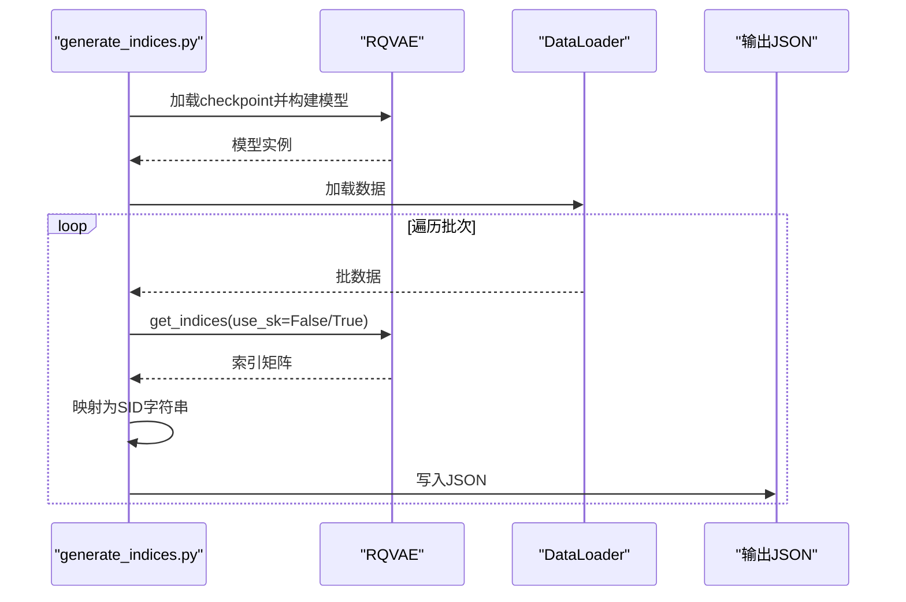
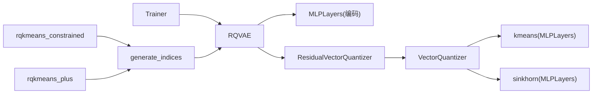

# SID构建

<cite>
**本文引用的文件**
- [README.md](file://README.md)
- [rq/models/rqvae.py](file://rq/models/rqvae.py)
- [rq/models/rq.py](file://rq/models/rq.py)
- [rq/models/vq.py](file://rq/models/vq.py)
- [rq/models/layers.py](file://rq/models/layers.py)
- [rq/rqvae.py](file://rq/rqvae.py)
- [rq/trainer.py](file://rq/trainer.py)
- [rq/datasets.py](file://rq/datasets.py)
- [rq/generate_indices.py](file://rq/generate_indices.py)
- [rq/rqkmeans_constrained.py](file://rq/rqkmeans_constrained.py)
- [rq/rqkmeans_plus.py](file://rq/rqkmeans_plus.py)
</cite>

## 目录
1. [简介](#简介)
2. [项目结构](#项目结构)
3. [核心组件](#核心组件)
4. [架构总览](#架构总览)
5. [详细组件分析](#详细组件分析)
6. [依赖关系分析](#依赖关系分析)
7. [性能与优化建议](#性能与优化建议)
8. [故障排查指南](#故障排查指南)
9. [结论](#结论)
10. [附录](#附录)

## 简介
本文件围绕Semantic ID（SID）构建展开，系统性解析RQ-VAE与RQ-Kmeans系列算法在MiniOneRec框架中的实现与应用。重点包括：
- RQ-VAE的编码器-量化器-解码器结构、残差向量量化（ResidualVectorQuantizer）机制及训练损失计算；
- 命令行参数对学习率、批大小、码本大小（num_emb_list）、嵌入维度（e_dim）、损失类型、K-means初始化、Sinkhorn迭代等关键配置的影响；
- 对比RQ-Kmeans、Constrained RQ-Kmeans与RQ-Kmeans+的实现差异及其在商品嵌入空间聚类中的应用；
- 通过RQVAE的get_indices方法将高维嵌入转换为离散的SID序列，并说明输出索引文件在后续SFT训练中的作用。

## 项目结构
本仓库以“rq”子模块为核心，提供SID构建的多种方案：RQ-VAE端到端训练、RQ-Kmeans聚类、约束平衡聚类与RQ-Kmeans+热启动策略。数据集加载、训练循环、指标评估与索引生成均在rq目录下完成。



图表来源
- [rq/models/layers.py](file://rq/models/layers.py#L1-L108)
- [rq/models/vq.py](file://rq/models/vq.py#L1-L102)
- [rq/models/rq.py](file://rq/models/rq.py#L1-L56)
- [rq/models/rqvae.py](file://rq/models/rqvae.py#L1-L85)
- [rq/datasets.py](file://rq/datasets.py#L1-L40)
- [rq/trainer.py](file://rq/trainer.py#L1-L256)
- [rq/rqvae.py](file://rq/rqvae.py#L1-L95)
- [rq/rqkmeans_constrained.py](file://rq/rqkmeans_constrained.py#L1-L292)
- [rq/rqkmeans_plus.py](file://rq/rqkmeans_plus.py#L1-L179)
- [rq/generate_indices.py](file://rq/generate_indices.py#L1-L151)

章节来源
- [README.md](file://README.md#L180-L222)

## 核心组件
- RQVAE：编码器（MLPLayers）→ 残差向量量化（ResidualVectorQuantizer）→ 解码器（MLPLayers），支持MSE/L1重建损失与量化损失加权。
- ResidualVectorQuantizer：按层级顺序对残差进行逐层向量量化，输出聚合后的量化表示、平均量化损失与每层索引矩阵。
- VectorQuantizer：单层向量量化，支持K-means初始化与Sinkhorn近似分配；计算码本损失与承诺损失。
- MLPLayers：通用多层感知机，支持Dropout、BatchNorm与可选激活函数。
- Trainer：训练循环、学习率调度、碰撞率评估与检查点保存。
- EmbDataset：从npy文件加载嵌入，自动处理NaN/Inf并统计基本统计信息。
- 聚类与索引：RQ-Kmeans系列提供基于K-means的残差分层聚类与约束平衡聚类，以及RQ-Kmeans+的残差连接与码本热启动策略；generate_indices负责将模型推理结果转为SID索引文件。

章节来源
- [rq/models/rqvae.py](file://rq/models/rqvae.py#L10-L85)
- [rq/models/rq.py](file://rq/models/rq.py#L1-L56)
- [rq/models/vq.py](file://rq/models/vq.py#L1-L102)
- [rq/models/layers.py](file://rq/models/layers.py#L1-L108)
- [rq/trainer.py](file://rq/trainer.py#L1-L256)
- [rq/datasets.py](file://rq/datasets.py#L1-L40)
- [rq/rqkmeans_constrained.py](file://rq/rqkmeans_constrained.py#L1-L292)
- [rq/rqkmeans_plus.py](file://rq/rqkmeans_plus.py#L1-L179)
- [rq/generate_indices.py](file://rq/generate_indices.py#L1-L151)

## 架构总览
RQ-VAE采用自编码器范式，编码器将高维嵌入压缩到潜空间，残差向量量化器逐层对残差进行离散化，解码器重构输入。训练时最小化重建损失与量化损失，同时可启用K-means初始化与Sinkhorn近似分配提升稳定性与收敛质量。



图表来源
- [rq/models/rqvae.py](file://rq/models/rqvae.py#L61-L85)
- [rq/models/rq.py](file://rq/models/rq.py#L39-L56)
- [rq/models/vq.py](file://rq/models/vq.py#L63-L99)
- [rq/models/layers.py](file://rq/models/layers.py#L1-L44)
- [rq/trainer.py](file://rq/trainer.py#L98-L125)

## 详细组件分析

### RQVAE类与训练损失
- 结构组成
  - 编码器：MLPLayers，层数由layers决定，支持dropout与bn。
  - 残差向量量化器：ResidualVectorQuantizer，按num_emb_list逐层量化，输出聚合量化表示与索引矩阵。
  - 解码器：MLPLayers，镜像编码器结构。
- 前向流程
  - forward返回重构值、量化损失与索引矩阵；get_indices仅返回索引矩阵，便于SID生成。
- 损失函数
  - 支持MSE与L1两种重建损失，总损失为重建损失与量化损失加权求和。



图表来源
- [rq/models/rqvae.py](file://rq/models/rqvae.py#L10-L85)
- [rq/models/rq.py](file://rq/models/rq.py#L1-L56)
- [rq/models/vq.py](file://rq/models/vq.py#L1-L102)
- [rq/models/layers.py](file://rq/models/layers.py#L1-L44)

章节来源
- [rq/models/rqvae.py](file://rq/models/rqvae.py#L10-L85)

### 残差向量量化（ResidualVectorQuantizer）
- 逐层量化策略：对输入x进行残差分解，每层使用独立的VectorQuantizer，最终将各层量化表示相加得到x_q，索引矩阵按列拼接。
- 码本管理：提供get_codebook接口聚合所有层级码本。
- Sinkhorn开关：可通过use_sk控制是否启用Sinkhorn近似分配，配合sk_epsilons与sk_iters。



图表来源
- [rq/models/rq.py](file://rq/models/rq.py#L39-L56)
- [rq/models/vq.py](file://rq/models/vq.py#L63-L99)

章节来源
- [rq/models/rq.py](file://rq/models/rq.py#L1-L56)

### 单层向量量化（VectorQuantizer）
- 初始化策略：若未启用K-means初始化，则随机初始化码本；否则等待训练阶段首次前向时用K-means中心填充。
- 分配策略：默认最近邻分配；当use_sk为真且epsilon>0时，使用Sinkhorn算法进行软分配，提高梯度稳定性。
- 损失构成：码本损失（重建方向）与承诺损失（量化方向），二者线性组合并受beta权重控制。



图表来源
- [rq/models/vq.py](file://rq/models/vq.py#L40-L99)
- [rq/models/layers.py](file://rq/models/layers.py#L85-L108)

章节来源
- [rq/models/vq.py](file://rq/models/vq.py#L1-L102)
- [rq/models/layers.py](file://rq/models/layers.py#L69-L108)

### 训练循环与评估（Trainer）
- 优化器与调度：支持Adam/SGD/Adagrad/RMSprop/AdamW，线性或常数warmup调度。
- 训练步骤：前向→计算总损失→反向→裁剪梯度→步进→调度器step。
- 评估指标：周期性评估碰撞率（唯一SID路径占比），并保存最佳检查点。

```mermaid
sequenceDiagram
participant T as "Trainer"
participant O as "优化器"
participant S as "调度器"
participant M as "RQVAE"
participant D as "DataLoader"
loop 每个epoch
T->>D : 迭代批次
D-->>T : 批数据
T->>M : 前向(out, rq_loss, indices)
M-->>T : out, rq_loss, indices
T->>M : compute_loss(loss_recon)
T->>O : 反向与参数更新
T->>S : step()
opt T->>T : 评估碰撞率
alt 更优碰撞率
T->>T : 保存检查点
end
end
```

图表来源
- [rq/trainer.py](file://rq/trainer.py#L98-L251)

章节来源
- [rq/trainer.py](file://rq/trainer.py#L1-L256)

### 数据集与命令行参数
- EmbDataset：从npy加载嵌入，自动处理NaN/Inf，输出张量。
- RQ-VAE训练脚本命令行参数要点：
  - 学习率、批次大小、工作进程数、优化器类型、学习率调度类型、warmup轮数、权重衰减、设备。
  - 损失类型、K-means初始化开关、K-means迭代次数、Sinkhorn epsilon列表与迭代次数。
  - 输入数据路径、码本大小列表（num_emb_list）、潜空间维度（e_dim）、量化损失权重、beta、隐藏层尺寸列表（layers）、输出目录与保存限制。

章节来源
- [rq/datasets.py](file://rq/datasets.py#L1-L40)
- [rq/rqvae.py](file://rq/rqvae.py#L14-L49)

### RQ-Kmeans系列对比与应用
- RQ-Kmeans：对嵌入逐层做K-means聚类，生成层级码本与整树码字序列，适合快速构建SID。
- Constrained RQ-Kmeans：引入k-means-constrained确保每层簇大小平衡，减少碰撞；训练后生成码本、原始码字与去重后的JSON索引。
- RQ-Kmeans+：在RQ-VAE基础上，对编码器增加残差连接，并用预训练码本热启动量化层，提升收敛速度与稳定性；要求e_dim等于输入维度。



图表来源
- [rq/rqkmeans_constrained.py](file://rq/rqkmeans_constrained.py#L67-L128)
- [rq/rqkmeans_plus.py](file://rq/rqkmeans_plus.py#L1-L179)

章节来源
- [rq/rqkmeans_constrained.py](file://rq/rqkmeans_constrained.py#L1-L292)
- [rq/rqkmeans_plus.py](file://rq/rqkmeans_plus.py#L1-L179)

### 通过get_indices生成SID序列
- RQ-VAE：在推理模式下调用get_indices，返回每条样本的层级索引矩阵；随后将索引映射为SID字符串并写入JSON文件。
- RQ-Kmeans+：同样可生成索引文件，但通常直接使用聚类生成的码本与索引，无需模型推理。



图表来源
- [rq/generate_indices.py](file://rq/generate_indices.py#L1-L151)
- [rq/models/rqvae.py](file://rq/models/rqvae.py#L68-L73)

章节来源
- [rq/generate_indices.py](file://rq/generate_indices.py#L1-L151)

## 依赖关系分析
- 组件耦合
  - RQVAE依赖MLPLayers作为编码器/解码器，依赖ResidualVectorQuantizer作为量化器。
  - ResidualVectorQuantizer内部包含多个VectorQuantizer，逐层串联。
  - VectorQuantizer依赖layers模块的kmeans与sinkhorn算法。
  - Trainer依赖Trainer类自身实现优化、调度与评估。
- 外部依赖
  - k-means-constrained（约束平衡聚类）、polars（数据处理）、transformers（学习率调度）。
- 潜在环依赖
  - 代码结构清晰，无明显循环导入。



图表来源
- [rq/models/rqvae.py](file://rq/models/rqvae.py#L10-L85)
- [rq/models/rq.py](file://rq/models/rq.py#L1-L56)
- [rq/models/vq.py](file://rq/models/vq.py#L1-L102)
- [rq/models/layers.py](file://rq/models/layers.py#L69-L108)
- [rq/trainer.py](file://rq/trainer.py#L1-L256)
- [rq/generate_indices.py](file://rq/generate_indices.py#L1-L151)
- [rq/rqkmeans_constrained.py](file://rq/rqkmeans_constrained.py#L1-L292)
- [rq/rqkmeans_plus.py](file://rq/rqkmeans_plus.py#L1-L179)

章节来源
- [rq/models/rqvae.py](file://rq/models/rqvae.py#L10-L85)
- [rq/models/rq.py](file://rq/models/rq.py#L1-L56)
- [rq/models/vq.py](file://rq/models/vq.py#L1-L102)
- [rq/models/layers.py](file://rq/models/layers.py#L1-L108)
- [rq/trainer.py](file://rq/trainer.py#L1-L256)
- [rq/generate_indices.py](file://rq/generate_indices.py#L1-L151)
- [rq/rqkmeans_constrained.py](file://rq/rqkmeans_constrained.py#L1-L292)
- [rq/rqkmeans_plus.py](file://rq/rqkmeans_plus.py#L1-L179)

## 性能与优化建议
- 批大小与设备：合理设置batch_size与pin_memory，充分利用GPU内存；必要时增大num_workers加速数据加载。
- Sinkhorn稳定：在高维嵌入场景下，适当调整sk_epsilons与sk_iters，避免数值不稳定；训练初期可关闭use_sk，稳定初始化后再开启。
- K-means初始化：启用kmeans_init可在训练早期提供更合理的码本起点，降低训练震荡。
- 残差量化深度：num_emb_list长度越长，SID表达能力越强，但需平衡碰撞率与存储开销。
- 评估与早停：定期评估碰撞率，结合最佳检查点保存策略，避免过拟合并节省存储。

## 故障排查指南
- NaN损失：Trainer在每次迭代后检查loss是否为NaN，若出现需检查学习率、梯度裁剪阈值与数据预处理。
- 数据异常：EmbDataset会自动替换NaN/Inf为0并打印统计信息，若仍异常，检查数据源与预处理脚本。
- 码本初始化失败：VectorQuantizer在训练初期若未初始化码本，需确保K-means初始化成功；必要时手动检查npy文件形状与数值范围。
- 约束聚类缺失：Constrained RQ-Kmeans依赖k-means-constrained与polars，若未安装将报错并提示安装方式。

章节来源
- [rq/trainer.py](file://rq/trainer.py#L93-L125)
- [rq/datasets.py](file://rq/datasets.py#L1-L40)
- [rq/models/vq.py](file://rq/models/vq.py#L40-L69)
- [rq/rqkmeans_constrained.py](file://rq/rqkmeans_constrained.py#L1-L60)

## 结论
本文件系统梳理了MiniOneRec中SID构建的关键技术路径：RQ-VAE端到端训练提供可微的离散化能力，RQ-Kmeans系列提供高效、可扩展的非参数化方案，RQ-Kmeans+进一步融合残差连接与码本热启动，显著提升收敛效率与稳定性。通过get_indices与generate_indices工具链，可将高维嵌入映射为稳定的SID序列，并服务于后续SFT训练与推荐系统落地。

## 附录
- 命令行参数速查（节选）
  - RQ-VAE训练：学习率、批次大小、优化器、学习率调度、warmup轮数、权重衰减、设备、损失类型、K-means初始化、K-means迭代、Sinkhorn epsilon列表与迭代、输入数据路径、码本大小列表、潜空间维度、量化损失权重、beta、隐藏层尺寸列表、输出目录与保存限制。
  - Constrained RQ-Kmeans：根目录、数据集名、每层簇数K、层级数L、最大迭代、随机种子、详细输出。
  - RQ-Kmeans+：学习率、批次大小、数据路径、预训练码本路径、码本大小列表、潜空间维度、隐藏层尺寸列表、量化损失权重、beta、设备、评估步长、保存限制、优化器、权重衰减、学习率调度、warmup轮数、dropout概率、bn开关、损失类型、Sinkhorn epsilon列表与迭代、K-means初始化与迭代。

章节来源
- [rq/rqvae.py](file://rq/rqvae.py#L14-L49)
- [rq/rqkmeans_constrained.py](file://rq/rqkmeans_constrained.py#L168-L177)
- [rq/rqkmeans_plus.py](file://rq/rqkmeans_plus.py#L90-L123)