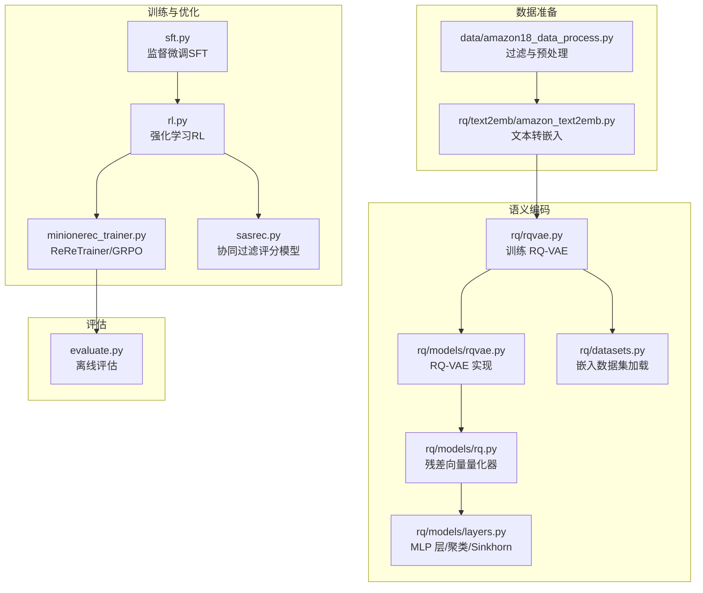
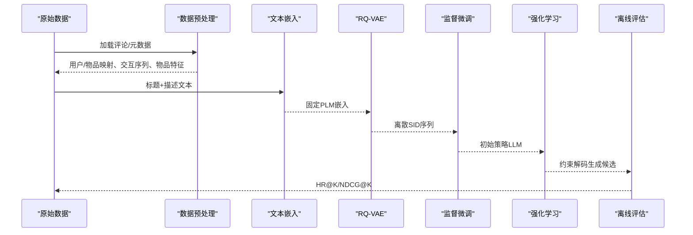
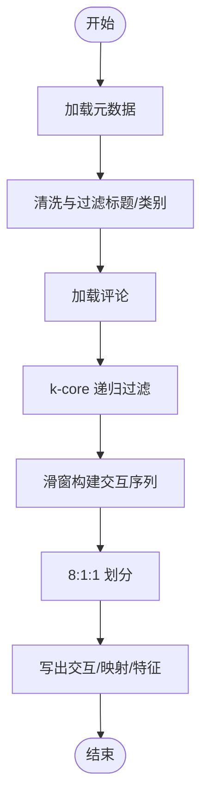
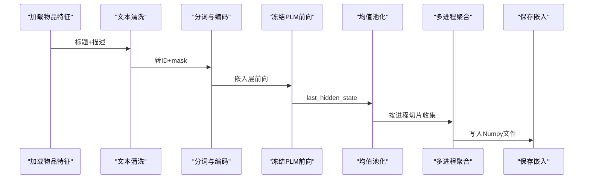
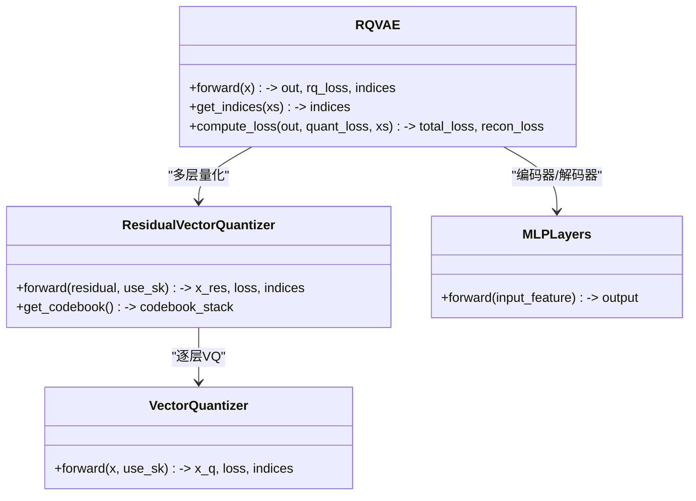
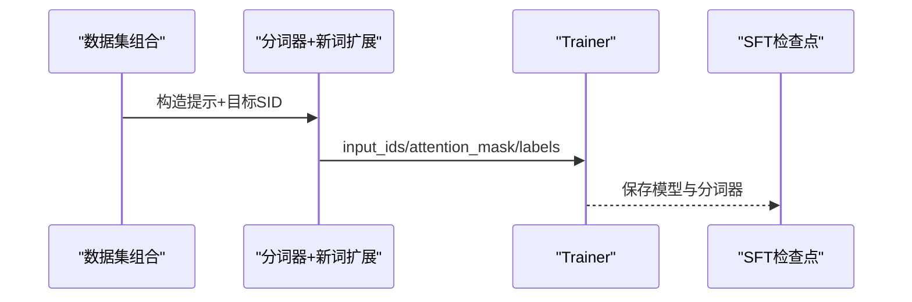
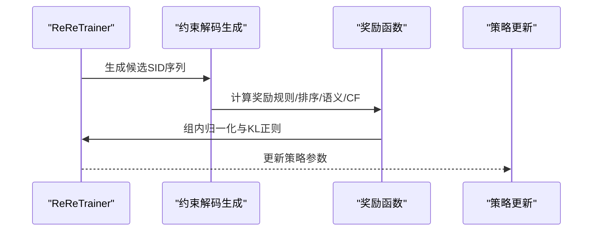
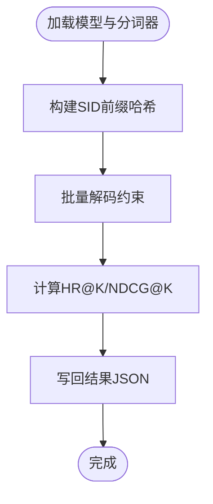

# 完整工作流

<cite>
**本文引用的文件**
- [data/amazon18_data_process.py](file://data/amazon18_data_process.py)
- [rq/text2emb/amazon_text2emb.py](file://rq/text2emb/amazon_text2emb.py)
- [rq/text2emb/utils.py](file://rq/text2emb/utils.py)
- [rq/datasets.py](file://rq/datasets.py)
- [rq/models/rqvae.py](file://rq/models/rqvae.py)
- [rq/models/layers.py](file://rq/models/layers.py)
- [rq/models/rq.py](file://rq/models/rq.py)
- [rq/rqvae.py](file://rq/rqvae.py)
- [data.py](file://data.py)
- [sft.py](file://sft.py)
- [rl.py](file://rl.py)
- [minionerec_trainer.py](file://minionerec_trainer.py)
- [sasrec.py](file://sasrec.py)
- [evaluate.py](file://evaluate.py)
- [README.md](file://README.md)
</cite>

## 目录
1. [简介](#简介)
2. [项目结构](#项目结构)
3. [核心组件](#核心组件)
4. [架构总览](#架构总览)
5. [详细组件分析](#详细组件分析)
6. [依赖关系分析](#依赖关系分析)
7. [性能与可扩展性](#性能与可扩展性)
8. [故障排查指南](#故障排查指南)
9. [结论](#结论)

## 简介
本文件系统化梳理 MiniOneRec 从原始数据到最终推荐模型的端到端工作流，覆盖六个阶段：
- 数据预处理（amazon18_data_process.py）
- 文本到嵌入转换（amazon_text2emb.py）
- Semantic ID 构建（rq/rqvae.py + 模型实现）
- 监督微调训练（sft.py）
- 强化学习优化（rl.py + ReReTrainer）
- 模型评估（evaluate.py）

文档重点说明每个阶段的输入输出、核心处理逻辑、关键参数配置，并以图示展示数据在模块间的流动路径，突出嵌入向量如何经 RQ-VAE 编码为离散 SID 序列，以及 SFT 模型如何作为 RL 阶段的初始策略。

## 项目结构
MiniOneRec 的工作流由“数据管线”“语义编码”“语言模型训练”“强化学习”“评估”五大部分组成，文件组织遵循功能域划分，便于分阶段执行与复用。

图表来源
- [data/amazon18_data_process.py](file://data/amazon18_data_process.py#L1-L574)
- [rq/text2emb/amazon_text2emb.py](file://rq/text2emb/amazon_text2emb.py#L1-L193)
- [rq/rqvae.py](file://rq/rqvae.py#L1-L95)
- [rq/models/rqvae.py](file://rq/models/rqvae.py#L1-L85)
- [rq/models/rq.py](file://rq/models/rq.py#L1-L56)
- [rq/models/layers.py](file://rq/models/layers.py#L1-L108)
- [rq/datasets.py](file://rq/datasets.py#L1-L40)
- [sft.py](file://sft.py#L1-L276)
- [rl.py](file://rl.py#L1-L317)
- [minionerec_trainer.py](file://minionerec_trainer.py#L1-L800)
- [sasrec.py](file://sasrec.py#L1-L656)
- [evaluate.py](file://evaluate.py#L1-L242)

章节来源
- [README.md](file://README.md#L130-L256)

## 核心组件
- 数据预处理：清洗文本、k-core 过滤、时间窗口筛选、交互序列构造与划分（训练/验证/测试），输出用户-物品映射、物品特征、评论数据与交互序列。
- 文本到嵌入：基于冻结的 PLM 将标题与描述拼接后进行均值池化，生成固定维度嵌入，支持多进程加速。
- RQ-VAE：将嵌入向量编码为离散语义索引（SID），三层残差向量量化，支持 Sinkhorn 迭代与 KMeans 初始化。
- SFT：以 SID 序列为输入，训练语言模型进行下一步 SID 预测；同时联合自然语言与 SID 的双向映射任务。
- RL：使用 GRPO 在约束解码下对策略进行奖励驱动优化，奖励可来自规则、排序指标或协同过滤打分。
- 评估：离线计算命中率与 NDCG，支持基于 SID 的约束解码。

章节来源
- [data/amazon18_data_process.py](file://data/amazon18_data_process.py#L1-L574)
- [rq/text2emb/amazon_text2emb.py](file://rq/text2emb/amazon_text2emb.py#L1-L193)
- [rq/models/rqvae.py](file://rq/models/rqvae.py#L1-L85)
- [rq/models/rq.py](file://rq/models/rq.py#L1-L56)
- [rq/models/layers.py](file://rq/models/layers.py#L1-L108)
- [rq/datasets.py](file://rq/datasets.py#L1-L40)
- [sft.py](file://sft.py#L1-L276)
- [rl.py](file://rl.py#L1-L317)
- [minionerec_trainer.py](file://minionerec_trainer.py#L1-L800)
- [sasrec.py](file://sasrec.py#L1-L656)
- [evaluate.py](file://evaluate.py#L1-L242)

## 架构总览
MiniOneRec 的端到端流水线如下：原始 Amazon 评论数据经预处理得到交互序列与物品特征；文本经 PLM 转换为嵌入；RQ-VAE 将嵌入量化为离散 SID；SFT 训练语言模型以 SID 为动作空间；RL 使用 GRPO 在约束解码下优化策略；最后以 evaluate 对策略进行离线评估。

图表来源
- [data/amazon18_data_process.py](file://data/amazon18_data_process.py#L1-L574)
- [rq/text2emb/amazon_text2emb.py](file://rq/text2emb/amazon_text2emb.py#L1-L193)
- [rq/rqvae.py](file://rq/rqvae.py#L1-L95)
- [sft.py](file://sft.py#L1-L276)
- [rl.py](file://rl.py#L1-L317)
- [minionerec_trainer.py](file://minionerec_trainer.py#L1-L800)
- [evaluate.py](file://evaluate.py#L1-L242)

## 详细组件分析

### 数据预处理（amazon18_data_process.py）
- 输入
  - 元数据文件（包含 ASIN、标题、描述、品牌、分类等）
  - 评论文件（包含用户ID、ASIN、评分、时间戳等）
  - 时间范围（起止年月）
  - K-core 过滤阈值（用户/物品）
- 核心流程
  - 清洗与去噪：HTML 标签、实体解码、多余空白、非法类别过滤
  - k-core 递归过滤：按阈值迭代移除低频用户/物品，直至稳定
  - 交互序列构建：按时间窗口滑动生成历史-目标对，限制历史长度
  - 划分与写出：8:1:1 划分训练/验证/测试，输出交互文件与映射表
- 输出
  - 交互序列（用户ID、历史SID列表、目标SID）
  - 物品特征（标题、描述、品牌、分类）
  - 用户/物品重映射索引
- 关键参数
  - user_k、item_k、st_year/st_month、ed_year/ed_month、输出目录

图表来源
- [data/amazon18_data_process.py](file://data/amazon18_data_process.py#L1-L574)

章节来源
- [data/amazon18_data_process.py](file://data/amazon18_data_process.py#L1-L574)

### 文本到嵌入转换（amazon_text2emb.py + utils.py）
- 输入
  - 物品特征（标题、描述）
  - 预训练语言模型（PLM）权重路径
- 核心流程
  - 文本拼接与清洗：标题+描述，去除空文本
  - 分词与编码：设置 padding 侧、填充至最大长度
  - 前向推理：冻结 PLM，Mean Pooling 得到句向量
  - 多进程聚合：按进程切片并汇总保存
- 输出
  - 物品嵌入矩阵（N×D）
- 关键参数
  - plm_name、plm_checkpoint、max_sent_len、word_drop_ratio、根目录、数据集名

图表来源
- [rq/text2emb/amazon_text2emb.py](file://rq/text2emb/amazon_text2emb.py#L1-L193)
- [rq/text2emb/utils.py](file://rq/text2emb/utils.py#L1-L347)

章节来源
- [rq/text2emb/amazon_text2emb.py](file://rq/text2emb/amazon_text2emb.py#L1-L193)
- [rq/text2emb/utils.py](file://rq/text2emb/utils.py#L1-L347)

### Semantic ID 构建（RQ-VAE）
- 输入
  - 物品嵌入矩阵（N×D）
- 核心流程
  - 编码器 MLP 将嵌入映射到潜空间
  - 残差向量量化（Residual Vector Quantizer）逐层量化，输出离散索引序列
  - 解码器 MLP 重构输入，总损失 = 重建误差 + 量化损失加权和
  - 支持 KMeans 初始化与 Sinkhorn 迭代
- 输出
  - 每个物品对应的离散 SID 序列
- 关键参数
  - num_emb_list（每层码本大小）、e_dim（码本向量维度）、layers（隐藏层维度）、beta（承诺损失系数）、quant_loss_weight、sk_epsilons/sk_iters、kmeans_init/kmeans_iters

图表来源
- [rq/models/rqvae.py](file://rq/models/rqvae.py#L1-L85)
- [rq/models/rq.py](file://rq/models/rq.py#L1-L56)
- [rq/models/layers.py](file://rq/models/layers.py#L1-L108)

章节来源
- [rq/rqvae.py](file://rq/rqvae.py#L1-L95)
- [rq/models/rqvae.py](file://rq/models/rqvae.py#L1-L85)
- [rq/models/rq.py](file://rq/models/rq.py#L1-L56)
- [rq/models/layers.py](file://rq/models/layers.py#L1-L108)
- [rq/datasets.py](file://rq/datasets.py#L1-L40)

### 监督微调训练（SFT）
- 输入
  - 交互序列（用户历史SID + 目标SID）
  - 物品特征（用于 SID↔标题 双向映射）
  - SID 索引文件（新增词汇表）
- 核心流程
  - 数据集组合：多种 SFT 任务（纯SID、SID+物品特征、融合序列、标题历史→SID 等）
  - 令牌扩展：根据 SID 索引为分词器添加新词，仅开放对应嵌入梯度
  - 训练：使用 Transformers Trainer，支持早停、bf16、梯度累积
- 输出
  - SFT 模型检查点（含分词器）
- 关键参数
  - base_model、output_dir、sid_index_path、item_meta_path、batch_size/micro_batch_size、learning_rate、cutoff_len、freeze_LLM、train_from_scratch

图表来源
- [sft.py](file://sft.py#L1-L276)
- [data.py](file://data.py#L1-L800)

章节来源
- [sft.py](file://sft.py#L1-L276)
- [data.py](file://data.py#L1-L800)

### 强化学习优化（RL）
- 输入
  - SFT 模型（作为参考策略）
  - RL 训练数据（提示+历史SID+目标SID）
  - 奖励函数（规则、排序、语义相似度、协同过滤）
- 核心流程
  - ReReTrainer（基于 GRPO）：每提示生成多个候选，组内归一化奖励，KL 正则保持与参考策略接近
  - 约束解码：基于 SID 信息构建前缀哈希，保证生成唯一有效 SID
  - 奖励函数：二值正确性 + 排序惩罚（NDCG 归一化），可叠加 CF 打分
- 输出
  - RL 模型检查点（含分词器）
- 关键参数
  - model_path、output_dir、num_generations、temperature、beta、reward_type、cf_path、sid_index_path、item_meta_path

图表来源
- [rl.py](file://rl.py#L1-L317)
- [minionerec_trainer.py](file://minionerec_trainer.py#L1-L800)
- [sasrec.py](file://sasrec.py#L1-L656)

章节来源
- [rl.py](file://rl.py#L1-L317)
- [minionerec_trainer.py](file://minionerec_trainer.py#L1-L800)
- [sasrec.py](file://sasrec.py#L1-L656)

### 模型评估（evaluate）
- 输入
  - 已训练模型（SFT 或 RL）
  - 测试数据（提示+历史SID）
  - 信息文件（SID↔标题 映射）
- 核心流程
  - 构建前缀哈希字典，限定生成 token
  - 批量解码（beam 或贪心），提取响应部分
  - 计算 HR@K、NDCG@K 并写回结果
- 输出
  - 结果 JSON（包含预测结果与指标）

图表来源
- [evaluate.py](file://evaluate.py#L1-L242)

章节来源
- [evaluate.py](file://evaluate.py#L1-L242)

## 依赖关系分析
- 数据预处理依赖 pandas、json、collections、datetime、numpy、tqdm 等库，输出交互文件与映射。
- 文本嵌入依赖 transformers、accelerate，支持多进程与分布式。
- RQ-VAE 依赖 torch、sklearn KMeans、faiss（可选）与自定义 Sinkhorn 算法。
- SFT 依赖 datasets、transformers、fire，支持早停与混合精度。
- RL 依赖 trl（GRPO）、transformers、sklearn（NDCG）、pickle（CF嵌入）。
- 评估依赖 transformers、accelerate、LogitsProcessor（约束解码）。

图表来源
- [data/amazon18_data_process.py](file://data/amazon18_data_process.py#L1-L574)
- [rq/text2emb/amazon_text2emb.py](file://rq/text2emb/amazon_text2emb.py#L1-L193)
- [rq/rqvae.py](file://rq/rqvae.py#L1-L95)
- [sft.py](file://sft.py#L1-L276)
- [rl.py](file://rl.py#L1-L317)
- [evaluate.py](file://evaluate.py#L1-L242)

章节来源
- [README.md](file://README.md#L130-L256)

## 性能与可扩展性
- 多进程嵌入：利用 Accelerate 与 gather_object，显著提升大规模文本嵌入效率。
- RQ-VAE 训练：大批次（如 2048）与 bf16 可降低显存占用；Sinkhorn 与 KMeans 初始化有助于收敛。
- SFT：支持梯度累积与早停，减少过拟合风险；冻结 LLM 参数仅训练新增嵌入，节省资源。
- RL：GRPO 组内归一化奖励与 KL 正则稳定训练；约束解码确保候选有效性与多样性。
- 评估：批式解码与前缀哈希减少无效 token，提高评估吞吐。

[本节提供通用建议，不直接分析具体文件]

## 故障排查指南
- 数据预处理
  - 若无元数据/评论文件，会报错退出；请确认路径与文件名。
  - k-core 过滤后物品数过少会自动扩大时间窗口重试。
- 文本嵌入
  - 分词器 padding 与设备需匹配；若 OOM，降低 max_sent_len 或 batch_size。
  - 多进程聚合失败时检查进程数量与磁盘权限。
- RQ-VAE
  - 嵌入中存在 NaN/Inf 会被替换为 0；建议先检查数据质量。
  - Sinkhorn 迭代与 KMeans 初始化失败时，调整 sk_epsilons/sk_iters 或关闭。
- SFT
  - 新增 SID 未生效时，确认 sid_index_path 存在且索引文件格式正确。
  - freeze_LLM=True 时仅训练新增嵌入，注意梯度掩码逻辑。
- RL
  - num_generations 必须能被全局 batch_size 整除；否则抛出异常。
  - 奖励函数选择错误（如 sasrec 但未提供 cf_path）会导致加载失败。
- 评估
  - 前缀哈希为空导致无法生成；确认 info_file 与分词器版本一致。

章节来源
- [data/amazon18_data_process.py](file://data/amazon18_data_process.py#L1-L574)
- [rq/text2emb/amazon_text2emb.py](file://rq/text2emb/amazon_text2emb.py#L1-L193)
- [rq/rqvae.py](file://rq/rqvae.py#L1-L95)
- [sft.py](file://sft.py#L1-L276)
- [rl.py](file://rl.py#L1-L317)
- [evaluate.py](file://evaluate.py#L1-L242)

## 结论
MiniOneRec 提供了从原始数据到生成式推荐模型的完整闭环工作流。通过“文本嵌入→RQ-VAE 离散化→SID 序列”的语义通道，结合 SFT 的语言对齐与 RL 的奖励优化，最终在离线评估中取得良好效果。该流水线具备良好的模块化与可扩展性，适合在不同数据集上快速落地与迭代。