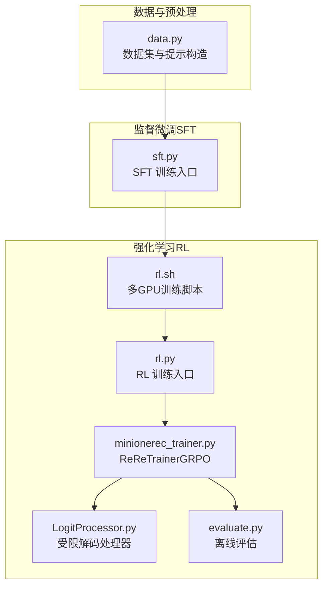
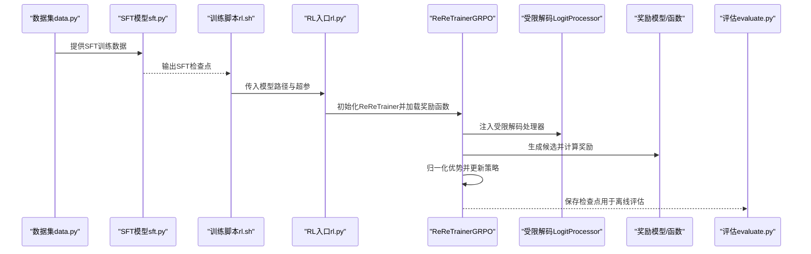
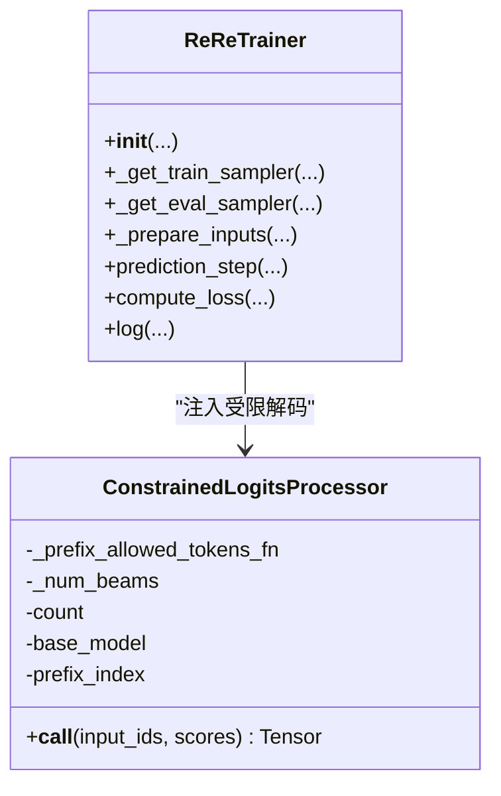
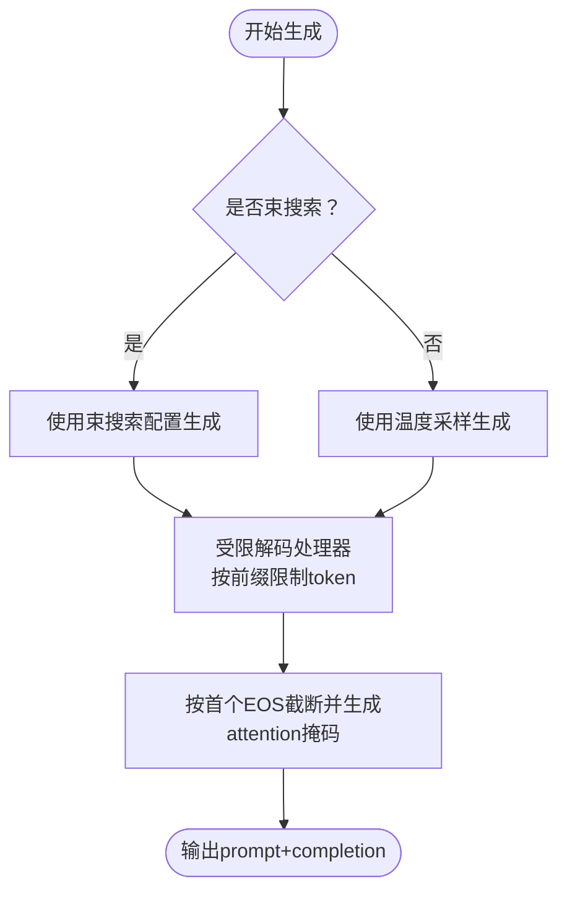
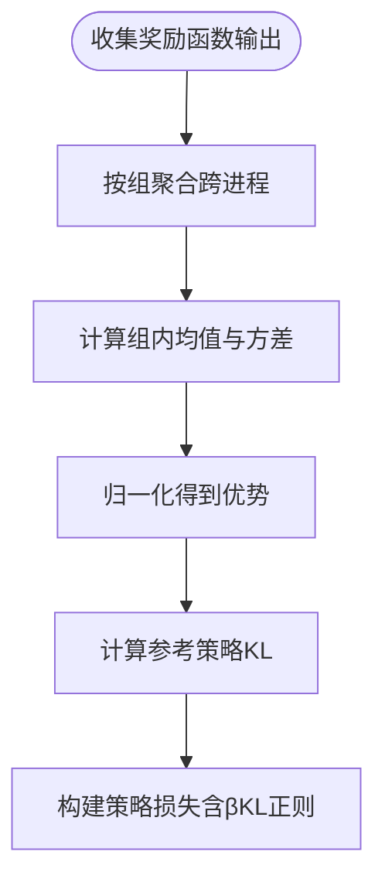
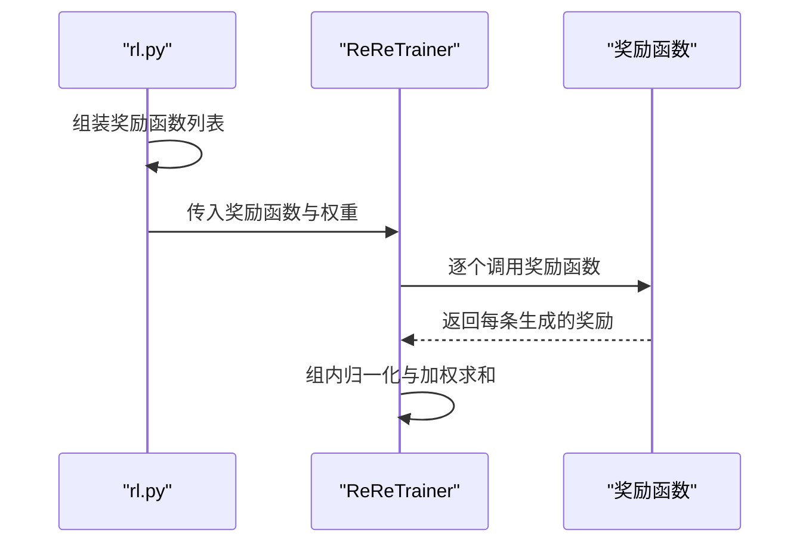
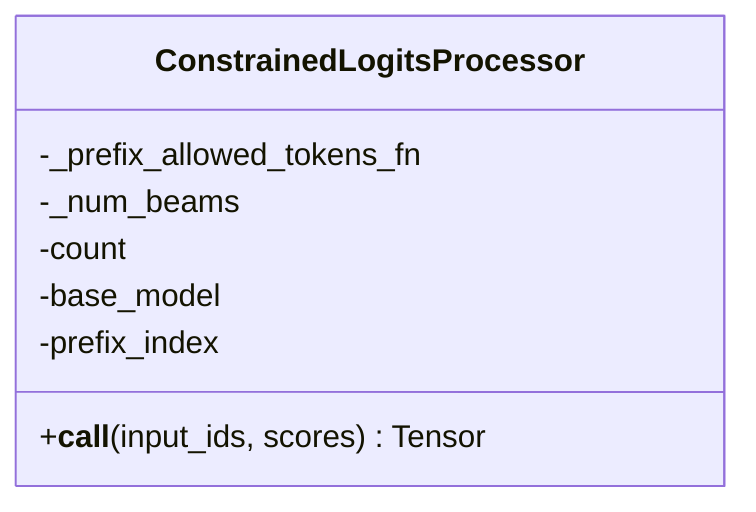
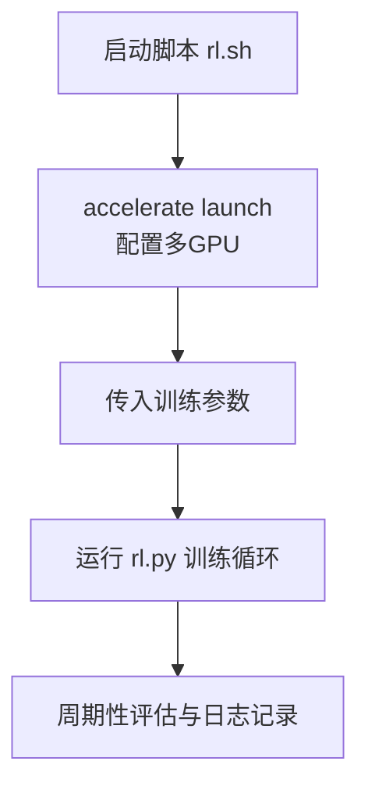
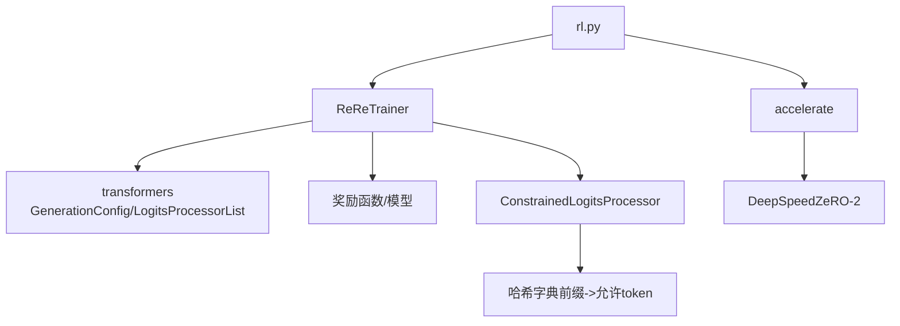

# 强化学习优化

<cite>
**本文引用的文件**
- [minionerec_trainer.py](file://minionerec_trainer.py)
- [rl.py](file://rl.py)
- [LogitProcessor.py](file://LogitProcessor.py)
- [rl.sh](file://rl.sh)
- [README.md](file://README.md)
- [data.py](file://data.py)
- [sft.py](file://sft.py)
- [evaluate.py](file://evaluate.py)
</cite>

## 目录
1. [简介](#简介)
2. [项目结构](#项目结构)
3. [核心组件](#核心组件)
4. [架构总览](#架构总览)
5. [详细组件分析](#详细组件分析)
6. [依赖关系分析](#依赖关系分析)
7. [性能考量](#性能考量)
8. [故障排查指南](#故障排查指南)
9. [结论](#结论)
10. [附录](#附录)

## 简介
本文件围绕基于强化学习（RL）的推荐优化，聚焦于 GRPO（Generalized Reward Policy Optimization）算法在 MiniOneRec 框架中的实现与应用。文档重点解析以下方面：
- 训练器 ReReTrainer 的定制化设计：奖励信号计算（点击率、多样性、排序相关性等）、策略梯度更新与价值函数估计（KL正则）。
- rl.py 中如何集成 SFT 模型作为初始策略，并通过多轮交互进行策略优化。
- LogitProcessor.py 在束搜索（beam search）过程中实施受限解码，确保生成序列的合法性与多样性。
- rl.sh 脚本展示多 GPU 训练配置与超参数设置，讨论探索-利用权衡对推荐性能的影响。

## 项目结构
该仓库采用“阶段化流水线”组织方式：先 SFT，再 RL；RL 阶段以 GRPO 为核心训练器，结合奖励函数与受限解码策略，完成推荐优化。

图表来源
- [README.md](file://README.md#L1-L120)
- [rl.sh](file://rl.sh#L1-L42)
- [rl.py](file://rl.py#L1-L120)
- [minionerec_trainer.py](file://minionerec_trainer.py#L120-L220)
- [LogitProcessor.py](file://LogitProcessor.py#L1-L63)
- [evaluate.py](file://evaluate.py#L1-L120)

章节来源
- [README.md](file://README.md#L1-L120)
- [rl.sh](file://rl.sh#L1-L42)

## 核心组件
- ReReTrainer（GRPO 训练器）：负责生成候选推荐、计算奖励、归一化优势、执行策略梯度更新与 KL 正则约束。
- ReReTrainer 中的受限解码：通过 ConstrainedLogitsProcessor 实施前缀合法性约束，保证生成序列有效且多样化。
- 奖励函数体系：规则奖励（命中目标）、排序奖励（NDCG 权重）、语义相似度奖励、协同过滤评分奖励等。
- 多 GPU 训练脚本：rl.sh 使用 accelerate 启动分布式训练，配置 DeepSpeed ZeRO-2、进程数与端口等。

章节来源
- [minionerec_trainer.py](file://minionerec_trainer.py#L120-L220)
- [LogitProcessor.py](file://LogitProcessor.py#L1-L63)
- [rl.py](file://rl.py#L120-L220)
- [rl.sh](file://rl.sh#L1-L42)

## 架构总览
下图展示了从数据到 RL 训练再到评估的整体流程，以及关键模块之间的交互关系。

图表来源
- [rl.sh](file://rl.sh#L1-L42)
- [rl.py](file://rl.py#L120-L220)
- [minionerec_trainer.py](file://minionerec_trainer.py#L600-L1026)
- [LogitProcessor.py](file://LogitProcessor.py#L1-L63)
- [evaluate.py](file://evaluate.py#L120-L200)

## 详细组件分析

### ReReTrainer（GRPO 训练器）
ReReTrainer 是针对推荐场景定制的 GRPO 训练器，其关键职责包括：
- 数据准备与采样：重复随机采样确保每条 prompt 在多 GPU 上均匀分布，便于组内奖励归一化。
- 生成候选：支持常规采样与束搜索；在束搜索模式下使用受限解码处理器。
- 奖励计算：支持多种奖励函数（规则、排序、语义、协同过滤），并可加权融合。
- 组内归一化：按 prompt 分组计算均值与标准差，归一化优势，稳定梯度。
- 策略更新：基于 per-token log probability 与优势，加入 KL 正则（参考策略）保持策略稳定。

图表来源
- [minionerec_trainer.py](file://minionerec_trainer.py#L120-L220)
- [LogitProcessor.py](file://LogitProcessor.py#L1-L63)

章节来源
- [minionerec_trainer.py](file://minionerec_trainer.py#L600-L1026)

#### 生成与受限解码流程
- 在生成阶段，根据是否启用束搜索选择不同的 GenerationConfig。
- 若启用受限解码，将 ConstrainedLogitsProcessor 与温度采样处理器组合，按输入前缀动态允许后续 token。
- 对生成结果进行 EOS 截断与掩码拼接，以便计算 per-token log probability 与 KL。

图表来源
- [minionerec_trainer.py](file://minionerec_trainer.py#L695-L850)
- [LogitProcessor.py](file://LogitProcessor.py#L1-L63)

章节来源
- [minionerec_trainer.py](file://minionerec_trainer.py#L695-L850)

#### 奖励与优势计算
- 将每条 prompt 的多个生成序列视为一组，分别计算各奖励函数得分。
- 使用 gather 聚合跨进程的奖励，按组内均值与方差归一化得到优势。
- 计算 per-token log probability 与参考策略的 KL，构建最终损失。

图表来源
- [minionerec_trainer.py](file://minionerec_trainer.py#L928-L1026)

章节来源
- [minionerec_trainer.py](file://minionerec_trainer.py#L928-L1026)

### 奖励函数体系（rl.py）
- 规则奖励：命中目标物品得高分，否则为零。
- 排序奖励：基于 NDCG 的权重分配，惩罚高概率但错误的候选。
- 语义奖励：基于物品嵌入余弦相似度。
- 协同过滤奖励：基于序列模型预测的打分。

图表来源
- [rl.py](file://rl.py#L140-L220)
- [minionerec_trainer.py](file://minionerec_trainer.py#L928-L1026)

章节来源
- [rl.py](file://rl.py#L140-L220)

### 受限解码（LogitProcessor.py）
- 通过 prefix_allowed_tokens_fn 动态限制每个位置的 token 选择。
- 以输入前缀的哈希为键，查表返回允许的 token 列表，避免非法或重复生成。
- 支持不同基础模型的前缀索引差异（如 GPT-2 与 LLaMA）。

图表来源
- [LogitProcessor.py](file://LogitProcessor.py#L1-L63)

章节来源
- [LogitProcessor.py](file://LogitProcessor.py#L1-L63)

### 多 GPU 训练与超参数（rl.sh）
- 使用 accelerate 启动，配置 num_processes、main_process_port、DeepSpeed 配置文件。
- 关键超参：batch size、gradient_accumulation_steps、num_generations、beam_search、temperature、beta、sync_ref_model 等。
- 通过 eval_step 控制评估频率，report_to wandb 记录指标。

图表来源
- [rl.sh](file://rl.sh#L1-L42)
- [rl.py](file://rl.py#L220-L317)

章节来源
- [rl.sh](file://rl.sh#L1-L42)
- [rl.py](file://rl.py#L220-L317)

## 依赖关系分析
- ReReTrainer 依赖 transformers 的 GenerationConfig、LogitsProcessorList、AutoModelForCausalLM 等组件。
- 受限解码依赖 ConstrainedLogitsProcessor，后者依赖哈希字典与前缀索引。
- 奖励函数可为外部模型或自定义函数，支持多路奖励融合。
- 多 GPU 训练依赖 accelerate 与 DeepSpeed（ZeRO-2）配置。

图表来源
- [minionerec_trainer.py](file://minionerec_trainer.py#L600-L1026)
- [LogitProcessor.py](file://LogitProcessor.py#L1-L63)
- [rl.py](file://rl.py#L220-L317)
- [rl.sh](file://rl.sh#L1-L42)

章节来源
- [minionerec_trainer.py](file://minionerec_trainer.py#L600-L1026)
- [LogitProcessor.py](file://LogitProcessor.py#L1-L63)
- [rl.py](file://rl.py#L220-L317)
- [rl.sh](file://rl.sh#L1-L42)

## 性能考量
- 生成效率：束搜索显著提升多样性与稳定性，但需注意内存与吞吐；温度采样适合探索。
- 组内归一化：降低奖励方差，提高策略更新稳定性。
- KL 正则：控制策略漂移，避免过拟合到奖励陷阱。
- 多 GPU：合理设置 num_processes 与 gradient_accumulation_steps，避免显存不足。
- vLLM 集成：在主进程加载权重后广播到其他进程，减少同步开销。

章节来源
- [minionerec_trainer.py](file://minionerec_trainer.py#L418-L510)
- [minionerec_trainer.py](file://minionerec_trainer.py#L928-L1026)
- [rl.sh](file://rl.sh#L1-L42)

## 故障排查指南
- 生成重复或不合法：检查受限解码哈希字典构建逻辑与前缀索引；确认 prefix_allowed_tokens_fn 返回非空集合。
- 评估指标异常：核对奖励函数权重与归一化过程；检查组内均值/方差计算与广播。
- 多 GPU 冲突：确认 num_processes 与 GPU 数量匹配；若使用 vLLM，确保设备分配不冲突。
- 显存不足：减小 per_device_train_batch_size 或 num_generations；增大 gradient_accumulation_steps。

章节来源
- [minionerec_trainer.py](file://minionerec_trainer.py#L510-L620)
- [minionerec_trainer.py](file://minionerec_trainer.py#L928-L1026)
- [rl.sh](file://rl.sh#L1-L42)

## 结论
本框架以 GRPO 为核心，结合多路奖励函数与受限解码策略，在推荐场景实现了稳定的策略优化。ReReTrainer 通过组内归一化与 KL 正则，平衡了探索与利用；受限解码保障生成序列的合法性与多样性；多 GPU 训练脚本提供了可扩展的分布式训练方案。建议在实际部署中根据数据规模与硬件条件调整 num_generations、temperature、beta 等超参，以获得更优的推荐性能。

## 附录
- 数据准备与 SFT 流程：见 [sft.py](file://sft.py#L120-L200) 与 [data.py](file://data.py#L1-L120)。
- 离线评估：见 [evaluate.py](file://evaluate.py#L120-L200)。