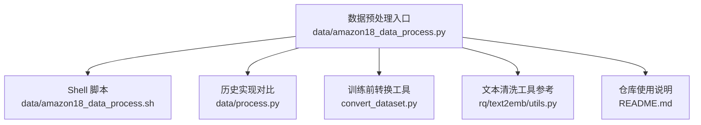
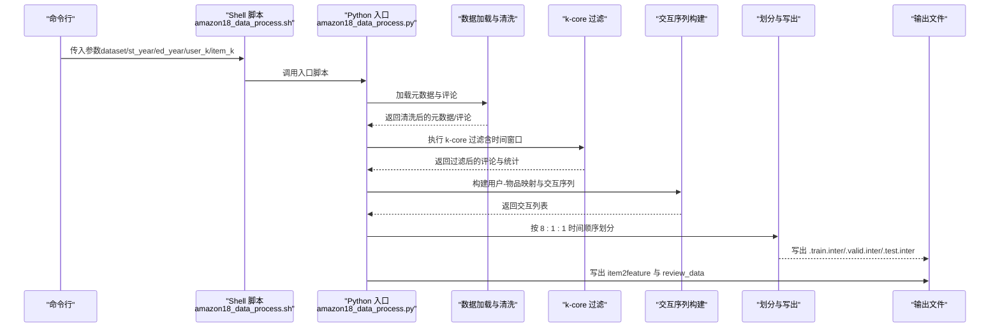
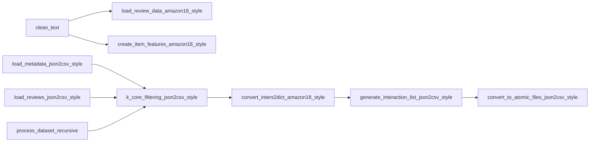

# 数据准备

<cite>
**本文引用的文件**
- [amazon18_data_process.py](file://data/amazon18_data_process.py)
- [amazon18_data_process.sh](file://data/amazon18_data_process.sh)
- [process.py](file://data/process.py)
- [README.md](file://README.md)
- [convert_dataset.py](file://convert_dataset.py)
- [rq_text2emb_utils.py](file://rq/text2emb/utils.py)
</cite>

## 目录
1. [简介](#简介)
2. [项目结构](#项目结构)
3. [核心组件](#核心组件)
4. [架构总览](#架构总览)
5. [详细组件分析](#详细组件分析)
6. [依赖关系分析](#依赖关系分析)
7. [性能考量](#性能考量)
8. [故障排查指南](#故障排查指南)
9. [结论](#结论)
10. [附录](#附录)

## 简介
本文件围绕 MiniOneRec 仓库中的 Amazon 数据预处理流程展开，系统性梳理从原始 Amazon 评论与元数据加载、k-core 过滤、时间窗口筛选，到最终生成用户-物品交互序列的完整数据流水线。重点解析 clean_text、k_core_filtering_json2csv_style、generate_interaction_list_json2csv_style 等核心函数的实现逻辑与参数配置；并通过命令行参数说明如何控制数据集范围（st_year/ed_year）与过滤阈值（user_k/item_k），并解释输出文件（.train.inter/.valid.inter/.test.inter）的结构及在后续训练中的用途。同时补充 item2feature、review_data 等辅助数据的生成方式与用途。

## 项目结构
- 数据预处理入口：data/amazon18_data_process.py
- 预处理脚本：data/amazon18_data_process.sh
- 历史对比实现：data/process.py
- 训练前转换工具：convert_dataset.py
- 文本清洗工具（文本嵌入前预处理参考）：rq/text2emb/utils.py
- 仓库使用说明与数据准备步骤：README.md

图表来源
- [amazon18_data_process.py](file://data/amazon18_data_process.py#L467-L574)
- [amazon18_data_process.sh](file://data/amazon18_data_process.sh#L1-L10)
- [process.py](file://data/process.py#L1-L198)
- [convert_dataset.py](file://convert_dataset.py#L36-L60)
- [rq_text2emb_utils.py](file://rq/text2emb/utils.py#L206-L244)
- [README.md](file://README.md#L130-L171)

章节来源
- [amazon18_data_process.py](file://data/amazon18_data_process.py#L467-L574)
- [amazon18_data_process.sh](file://data/amazon18_data_process.sh#L1-L10)
- [README.md](file://README.md#L130-L171)

## 核心组件
- 数据加载与清洗
  - clean_text：清理 HTML 标签、转义字符、多余空白，统一引号与换行处理。
  - load_metadata_json2csv_style：读取元数据，过滤无标题或标题过长的条目，构建 ASIN 到标题的映射。
  - load_reviews_json2csv_style：读取评论数据，支持多种文件名模式，不在此阶段进行时间戳过滤。
- 过滤与迭代 k-core
  - k_core_filtering_json2csv_style：基于用户与物品计数的迭代 k-core 过滤，同时在循环内按时间窗口过滤，确保密度与阈值双约束。
- 交互序列生成
  - convert_inters2dict_amazon18_style：按用户分组并按时间排序，建立用户-物品映射与索引。
  - generate_interaction_list_json2csv_style：为每个用户生成滑动窗口的历史序列，保留最多 10 步历史，形成训练样本。
  - convert_to_atomic_files_json2csv_style：按 8:1:1 时间顺序划分训练/验证/测试集，写出 .train.inter/.valid.inter/.test.inter 文件。
- 辅助数据
  - create_item_features_amazon18_style：从元数据构建 item2feature 字典，包含 title、description、brand、categories 等字段。
  - load_review_data_amazon18_style：从评论中提取 review 与 summary 文本，键由 (uid, iid, timestamp) 组成，避免重复用户-物品对的时间戳冲突。
- 递归时间扩展
  - process_dataset_recursive：当物品数量不足阈值时，自动扩大时间范围（年份回退），直至满足最小物品数量要求。

章节来源
- [amazon18_data_process.py](file://data/amazon18_data_process.py#L15-L178)
- [amazon18_data_process.py](file://data/amazon18_data_process.py#L180-L279)
- [amazon18_data_process.py](file://data/amazon18_data_process.py#L281-L342)
- [amazon18_data_process.py](file://data/amazon18_data_process.py#L344-L432)
- [amazon18_data_process.py](file://data/amazon18_data_process.py#L434-L465)

## 架构总览
下图展示了从命令行参数到最终输出文件的端到端数据流。

图表来源
- [amazon18_data_process.sh](file://data/amazon18_data_process.sh#L1-L10)
- [amazon18_data_process.py](file://data/amazon18_data_process.py#L467-L574)

章节来源
- [amazon18_data_process.sh](file://data/amazon18_data_process.sh#L1-L10)
- [amazon18_data_process.py](file://data/amazon18_data_process.py#L467-L574)

## 详细组件分析

### 数据加载与清洗
- clean_text
  - 功能：去除 HTML 标签、解码 HTML 实体、规范化引号与换行、压缩多余空白。
  - 复杂度：O(n)，逐字符处理。
  - 注意事项：对空输入返回空字符串；对 HTML 实体与标签的处理顺序影响最终结果。
  - 参考路径：[clean_text](file://data/amazon18_data_process.py#L15-L27)

- load_metadata_json2csv_style
  - 功能：读取元数据文件，过滤无标题或标题异常的条目，构建 ASIN 到标题的映射；同时记录需要移除的物品集合。
  - 复杂度：O(N)，N 为元数据行数。
  - 关键点：标题长度限制与词数限制用于剔除噪声；与评论侧的标题缺失检查配合完成物品过滤。
  - 参考路径：[load_metadata_json2csv_style](file://data/amazon18_data_process.py#L63-L93)

- load_reviews_json2csv_style
  - 功能：尝试读取不同命名模式的评论文件，不进行时间戳过滤，留待后续 k-core 循环内统一处理。
  - 复杂度：O(M)，M 为评论行数。
  - 参考路径：[load_reviews_json2csv_style](file://data/amazon18_data_process.py#L96-L118)

章节来源
- [amazon18_data_process.py](file://data/amazon18_data_process.py#L15-L118)

### k-core 过滤与迭代策略
- k_core_filtering_json2csv_style
  - 功能：迭代式 k-core 过滤，先移除无标题物品，再按用户/物品计数阈值逐步剔除低频用户与物品；在每次循环内部按时间窗口过滤，保证密度与阈值双约束。
  - 复杂度：最坏情况下 O(R×T)，R 为评论总数，T 为迭代轮次；每轮遍历一次评论。
  - 关键点：flag 控制是否继续迭代；打印当前用户/物品/评论数量与密度，便于监控收敛。
  - 参考路径：[k_core_filtering_json2csv_style](file://data/amazon18_data_process.py#L121-L177)

- process_dataset_recursive
  - 功能：若物品数量低于阈值，自动将起始年份回退一年并扩大时间范围，再次执行过滤，直到满足最小物品数量或达到最早年份。
  - 复杂度：取决于迭代次数与过滤成本，通常不超过多次调用 k-core。
  - 参考路径：[process_dataset_recursive](file://data/amazon18_data_process.py#L434-L464)

章节来源
- [amazon18_data_process.py](file://data/amazon18_data_process.py#L121-L177)
- [amazon18_data_process.py](file://data/amazon18_data_process.py#L434-L464)

### 交互序列生成与划分
- convert_inters2dict_amazon18_style
  - 功能：按用户分组评论，按时间排序，建立用户与物品的索引映射，并生成交互列表（包含评分与时间戳）。
  - 复杂度：O(R log R)，主要由排序决定。
  - 参考路径：[convert_inters2dict_amazon18_style](file://data/amazon18_data_process.py#L180-L215)

- generate_interaction_list_json2csv_style
  - 功能：为每个用户生成滑动窗口的历史序列，窗口大小最大 10；保留历史物品 ID、标题、评分与时间戳，目标项为下一个物品。
  - 复杂度：O(S)，S 为有效交互数；排序按时间戳进行。
  - 参考路径：[generate_interaction_list_json2csv_style](file://data/amazon18_data_process.py#L218-L278)

- convert_to_atomic_files_json2csv_style
  - 功能：按 8:1:1 的比例划分训练/验证/测试集，写出 .train.inter/.valid.inter/.test.inter；历史序列截断至最后 50 个物品。
  - 输出格式：列头为 user_id:token、item_id_list:token_seq、item_id:token；每行以制表符分隔。
  - 参考路径：[convert_to_atomic_files_json2csv_style](file://data/amazon18_data_process.py#L281-L342)

章节来源
- [amazon18_data_process.py](file://data/amazon18_data_process.py#L180-L342)

### 辅助数据生成
- create_item_features_amazon18_style
  - 功能：从元数据构建 item2feature 字典，包含 title、description、brand、categories 等字段；对 categories 进行扁平化与清洗。
  - 复杂度：O(I)，I 为物品数量。
  - 参考路径：[create_item_features_amazon18_style](file://data/amazon18_data_process.py#L382-L431)

- load_review_data_amazon18_style
  - 功能：从评论中提取 review 与 summary 文本，键采用 (uid, iid, timestamp) 的唯一组合，避免同一用户-物品对在不同时间出现重复。
  - 复杂度：O(R)，R 为评论数量。
  - 参考路径：[load_review_data_amazon18_style](file://data/amazon18_data_process.py#L344-L379)

章节来源
- [amazon18_data_process.py](file://data/amazon18_data_process.py#L344-L431)

### 命令行参数与运行流程
- 命令行参数
  - --dataset：数据集名称（如 Industrial_and_Scientific）
  - --user_k / --item_k：用户与物品的 k-core 阈值
  - --st_year / --st_month / --ed_year / --ed_month：时间窗口起止年月
  - --metadata_file / --reviews_file：元数据与评论文件路径（可选）
  - --output_path：输出目录
- 运行流程
  - 解析参数后设置时间戳边界；
  - 加载评论（不进行时间过滤）；
  - 递归过滤（必要时扩大时间范围）；
  - 转换为用户-物品映射与交互序列；
  - 划分训练/验证/测试集并写出 .inter 文件；
  - 生成 item2feature 与 review_data；
  - 写出 remap 索引文件（user2id、item2id）。

章节来源
- [amazon18_data_process.py](file://data/amazon18_data_process.py#L467-L574)
- [amazon18_data_process.sh](file://data/amazon18_data_process.sh#L1-L10)
- [README.md](file://README.md#L130-L171)

## 依赖关系分析
- 模块内依赖
  - clean_text 被 load_review_data_amazon18_style 与 create_item_features_amazon18_style 调用，用于清洗文本字段。
  - k_core_filtering_json2csv_style 依赖 load_metadata_json2csv_style 的标题映射与物品移除集合。
  - generate_interaction_list_json2csv_style 依赖 convert_inters2dict_amazon18_style 的用户-物品映射与索引。
  - convert_to_atomic_files_json2csv_style 依赖 generate_interaction_list_json2csv_style 的交互列表。
  - process_dataset_recursive 依赖 k_core_filtering_json2csv_style 与 load_reviews_json2csv_style。
- 外部依赖
  - 文件系统：读取元数据与评论 JSON 文件，写入 .inter、.json、.user2id、.item2id。
  - 时间戳：get_timestamp_start 将年月转换为时间戳，用于过滤。

图表来源
- [amazon18_data_process.py](file://data/amazon18_data_process.py#L15-L178)
- [amazon18_data_process.py](file://data/amazon18_data_process.py#L180-L342)
- [amazon18_data_process.py](file://data/amazon18_data_process.py#L434-L464)

章节来源
- [amazon18_data_process.py](file://data/amazon18_data_process.py#L15-L178)
- [amazon18_data_process.py](file://data/amazon18_data_process.py#L180-L342)
- [amazon18_data_process.py](file://data/amazon18_data_process.py#L434-L464)

## 性能考量
- 时间复杂度
  - k-core 过滤：每轮 O(R)，迭代轮次受数据稀疏性影响；整体约 O(R×T)。
  - 排序：convert_inters2dict_amazon18_style 与 generate_interaction_list_json2csv_style 主要瓶颈在排序，约为 O(R log R)。
  - 写出文件：线性扫描交互列表，O(S)。
- I/O 优化
  - 使用 tqdm 进度条监控大文件读取与处理。
  - 输出文件采用分步写出，减少内存峰值。
- 参数调优
  - user_k/item_k 增大可提升数据质量但降低密度；st_year/ed_year 调整影响物品覆盖范围。
  - 历史长度截断（默认 50）与滑窗大小（默认 10）可在召回与效率间权衡。

[本节为通用指导，不直接分析具体文件]

## 故障排查指南
- 无元数据/评论文件
  - 现象：提示“未找到元数据/评论文件”并返回空集合。
  - 处理：确认 --metadata_file 与 --reviews_file 或默认文件名是否存在。
  - 参考路径：[load_metadata_json2csv_style](file://data/amazon18_data_process.py#L63-L93)、[load_reviews_json2csv_style](file://data/amazon18_data_process.py#L96-L118)
- k-core 后物品过少
  - 现象：物品数量低于阈值触发时间范围扩大。
  - 处理：检查 st_year 是否已回退到最早年份；适当降低 user_k/item_k 或放宽时间窗口。
  - 参考路径：[process_dataset_recursive](file://data/amazon18_data_process.py#L434-L464)
- 输出为空或样本极少
  - 现象：训练/验证/测试样本数为 0。
  - 处理：检查时间窗口与 k-core 阈值；确认评论与元数据匹配（标题缺失会移除物品）。
  - 参考路径：[k_core_filtering_json2csv_style](file://data/amazon18_data_process.py#L121-L177)
- 文本清洗异常
  - 现象：标题或描述为空或过长。
  - 处理：确认元数据字段完整性；clean_text 已做基础清洗。
  - 参考路径：[clean_text](file://data/amazon18_data_process.py#L15-L27)、[create_item_features_amazon18_style](file://data/amazon18_data_process.py#L382-L431)

章节来源
- [amazon18_data_process.py](file://data/amazon18_data_process.py#L63-L118)
- [amazon18_data_process.py](file://data/amazon18_data_process.py#L121-L177)
- [amazon18_data_process.py](file://data/amazon18_data_process.py#L382-L431)
- [amazon18_data_process.py](file://data/amazon18_data_process.py#L434-L464)

## 结论
本数据预处理流水线以 k-core 为核心过滤手段，结合时间窗口与标题有效性检查，确保数据质量与稳定性；通过滑动窗口与时间顺序划分，生成符合下游训练需求的交互序列文件。clean_text、k_core_filtering_json2csv_style、generate_interaction_list_json2csv_style 等关键函数共同构成高质量数据准备的基础。配合 item2feature 与 review_data 的生成，为后续文本嵌入与模型训练提供完备的辅助数据。

[本节为总结性内容，不直接分析具体文件]

## 附录

### 输出文件格式说明
- .train.inter/.valid.inter/.test.inter
  - 列定义：user_id:token、item_id_list:token_seq、item_id:token
  - 行结构：每行以制表符分隔，历史序列最多 50 个物品 ID。
  - 用途：供后续 SFT/RL 训练使用，作为用户历史与目标物品的输入。
  - 参考路径：[convert_to_atomic_files_json2csv_style](file://data/amazon18_data_process.py#L281-L342)

- .item.json
  - 内容：item2feature，包含 title、description、brand、categories 等字段。
  - 用途：文本嵌入前的特征来源。
  - 参考路径：[create_item_features_amazon18_style](file://data/amazon18_data_process.py#L382-L431)

- .review.json
  - 内容：review_data，键为 (uid, iid, timestamp)，值为 review 与 summary 文本。
  - 用途：文本嵌入与语言对齐任务的数据源。
  - 参考路径：[load_review_data_amazon18_style](file://data/amazon18_data_process.py#L344-L379)

- .user2id、.item2id
  - 内容：用户与物品的重映射索引文件。
  - 用途：将原始 ID 映射为连续整数 ID，便于模型处理。
  - 参考路径：[write_remap_index](file://data/amazon18_data_process.py#L41-L46)

### 与历史实现的对比
- data/process.py 展示了早期实现的思路与输出格式，可作为对照参考。
- convert_dataset.py 提供了将交互数据转换为 MiniOneRec CSV 格式的工具方法，可用于后续格式迁移。
- 参考路径：
  - [process.py](file://data/process.py#L1-L198)
  - [convert_dataset.py](file://convert_dataset.py#L36-L60)

章节来源
- [amazon18_data_process.py](file://data/amazon18_data_process.py#L281-L431)
- [process.py](file://data/process.py#L1-L198)
- [convert_dataset.py](file://convert_dataset.py#L36-L60)