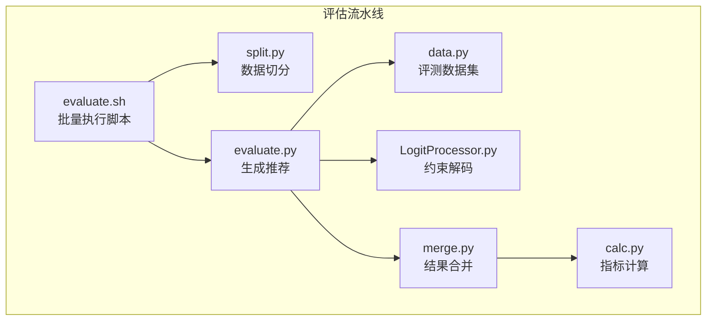
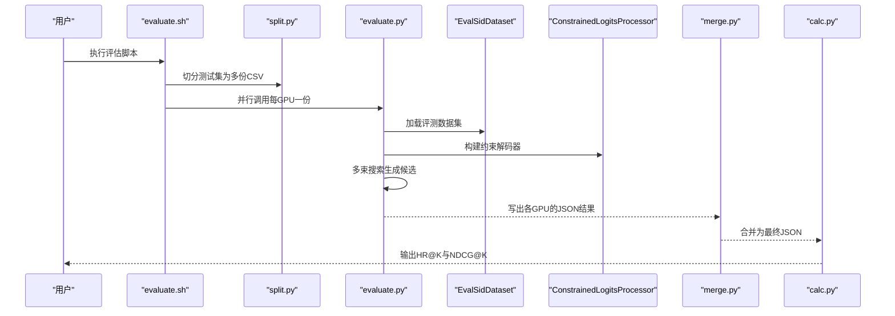
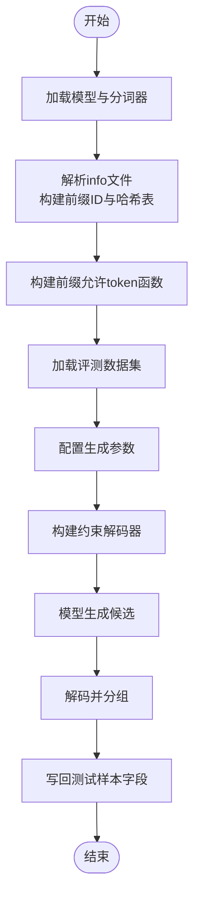
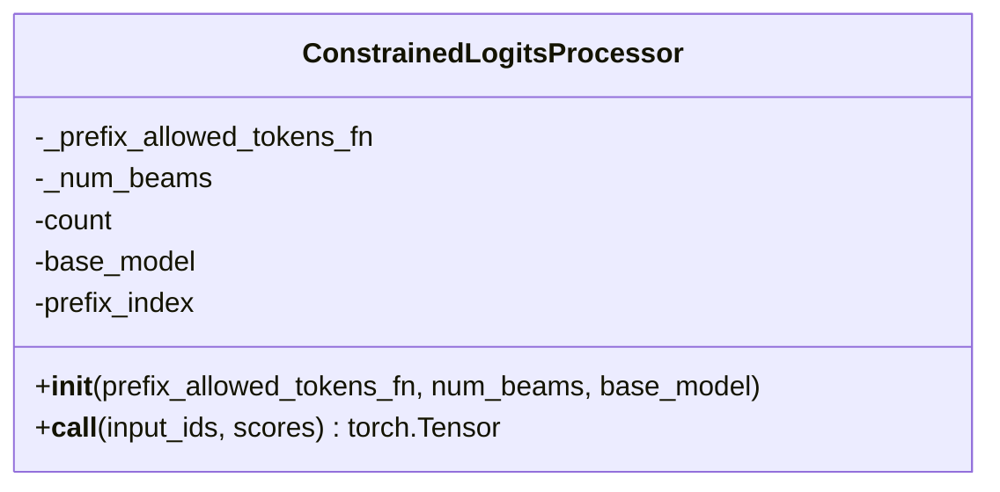
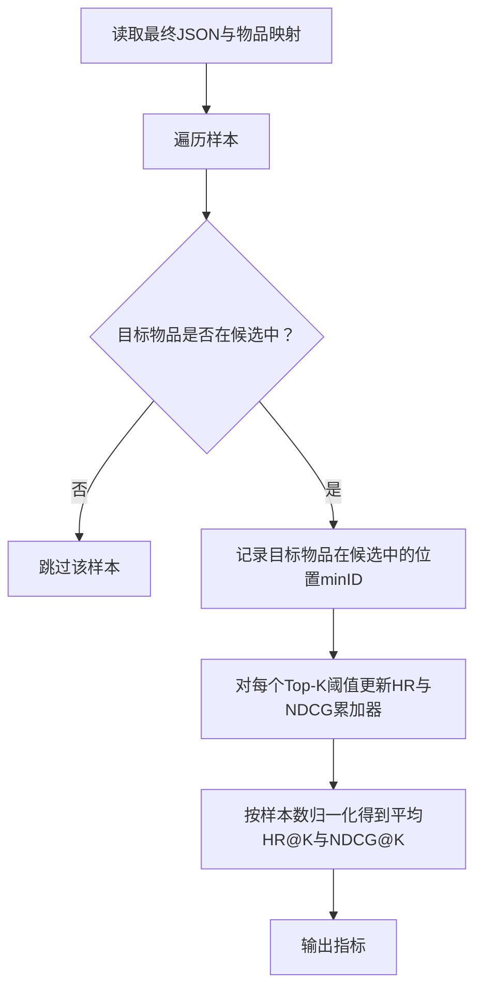
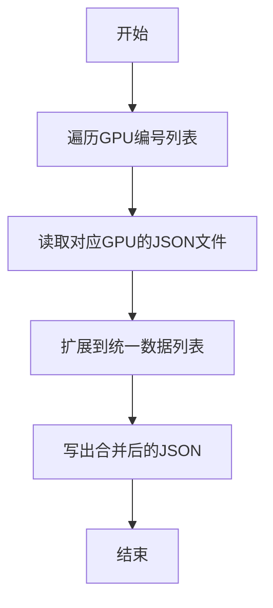
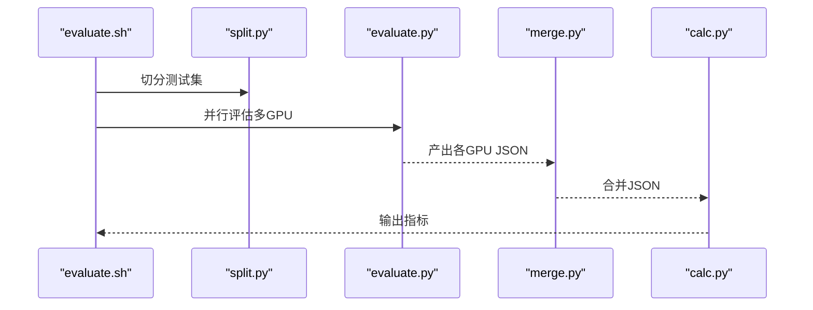
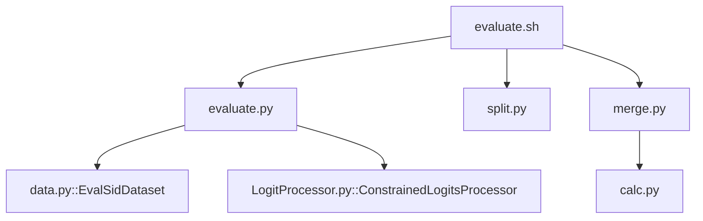

# 模型评估

<cite>
**本文引用的文件**
- [evaluate.py](file://evaluate.py)
- [calc.py](file://calc.py)
- [merge.py](file://merge.py)
- [evaluate.sh](file://evaluate.sh)
- [data.py](file://data.py)
- [LogitProcessor.py](file://LogitProcessor.py)
- [split.py](file://split.py)
- [README.md](file://README.md)
- [requirements.txt](file://requirements.txt)
</cite>

## 目录
1. [简介](#简介)
2. [项目结构](#项目结构)
3. [核心组件](#核心组件)
4. [架构总览](#架构总览)
5. [详细组件分析](#详细组件分析)
6. [依赖关系分析](#依赖关系分析)
7. [性能考量](#性能考量)
8. [故障排查指南](#故障排查指南)
9. [结论](#结论)
10. [附录](#附录)

## 简介
本文件系统性阐述MiniOneRec的离线Top-K推荐评估流程，覆盖从模型加载、验证/测试集生成推荐列表，到Recall@K与NDCG@K等核心指标的计算，以及批量评估脚本与多GPU并行合并策略。目标是帮助读者快速理解评估管道的输入输出、关键实现细节与常见问题定位方法。

## 项目结构
评估相关的关键文件与职责如下：
- evaluate.py：加载训练好的模型，构建约束解码器，对测试样本进行生成式Top-K推荐，并将预测结果写入JSON。
- data.py：提供EvalSidDataset等评测数据集类，负责构造输入提示与标签（仅评测时返回输入）。
- LogitProcessor.py：实现ConstrainedLogitsProcessor，基于前缀哈希表限制下一步token，确保生成序列合法性。
- split.py：将测试集按GPU编号切分为多个子文件，便于多进程/多GPU并行评估。
- merge.py：将各GPU生成的独立结果合并为统一的最终结果文件。
- calc.py：读取最终结果与物品映射，计算HR@K与NDCG@K等指标。
- evaluate.sh：一键批量评估脚本，串联数据切分、并行评估、结果合并与指标计算。

图表来源
- [evaluate.sh](file://evaluate.sh#L1-L95)
- [split.py](file://split.py#L1-L22)
- [evaluate.py](file://evaluate.py#L1-L242)
- [LogitProcessor.py](file://LogitProcessor.py#L1-L63)
- [data.py](file://data.py#L592-L711)
- [merge.py](file://merge.py#L1-L19)
- [calc.py](file://calc.py#L1-L85)

章节来源
- [evaluate.sh](file://evaluate.sh#L1-L95)
- [README.md](file://README.md#L51-L90)

## 核心组件
- 评测数据集：EvalSidDataset负责将历史交互序列转换为模型输入，仅在评测模式返回input_ids与attention_mask，不包含标签。
- 约束解码：ConstrainedLogitsProcessor通过前缀哈希表限制候选token，结合多束搜索生成合法且多样化的Top-K候选。
- 推荐生成：evaluate.py对每个样本生成num_beams条候选，截取新增部分作为预测项，按原始顺序写回测试样本。
- 结果合并：merge.py将各GPU生成的独立JSON合并为一个统一文件，供指标计算使用。
- 指标计算：calc.py读取最终结果与物品映射，计算HR@K与NDCG@K，支持多种Top-K阈值。

章节来源
- [data.py](file://data.py#L592-L711)
- [LogitProcessor.py](file://LogitProcessor.py#L1-L63)
- [evaluate.py](file://evaluate.py#L142-L234)
- [merge.py](file://merge.py#L1-L19)
- [calc.py](file://calc.py#L1-L85)

## 架构总览
下图展示了从命令行到最终指标的端到端流程，包括数据准备、模型生成、结果合并与指标计算四个阶段。

图表来源
- [evaluate.sh](file://evaluate.sh#L1-L95)
- [split.py](file://split.py#L1-L22)
- [evaluate.py](file://evaluate.py#L142-L234)
- [LogitProcessor.py](file://LogitProcessor.py#L1-L63)
- [merge.py](file://merge.py#L1-L19)
- [calc.py](file://calc.py#L1-L85)

## 详细组件分析

### 组件A：evaluate.py（模型加载与生成）
- 模型加载与设备选择：从预训练路径加载模型，自动选择GPU或CPU；设置bf16精度以节省显存。
- 信息文件解析：读取物品语义ID与标题，构造分词后的前缀ID集合，建立前缀哈希表，用于后续约束解码。
- 约束解码器：根据模型类型（如LLaMA/GPT2）选择不同的前缀索引，构建前缀允许token函数。
- 数据集加载：使用EvalSidDataset构造评测样本，仅返回input_ids与attention_mask。
- 生成配置：设置num_beams、长度惩罚、最大新token数等参数；使用GenerationConfig与LogitsProcessorList。
- 解码流程：对批次进行padding，调用模型generate，截取新增部分作为预测序列，解码为字符串，按束数分组后写回测试样本。
- 结果落盘：将包含预测结果的测试样本写入JSON文件。

图表来源
- [evaluate.py](file://evaluate.py#L1-L242)
- [data.py](file://data.py#L592-L711)
- [LogitProcessor.py](file://LogitProcessor.py#L1-L63)

章节来源
- [evaluate.py](file://evaluate.py#L1-L242)
- [data.py](file://data.py#L592-L711)
- [LogitProcessor.py](file://LogitProcessor.py#L1-L63)

### 组件B：LogitProcessor.py（约束解码）
- 前缀哈希匹配：根据当前上下文的固定长度后缀生成哈希键，在哈希表中查找允许的下一个token集合。
- 分束处理：对每个batch与beam分别应用mask，避免非法token进入下一时刻。
- 归一化与掩码：先对logits做log_softmax，再叠加mask，使不允许的token得分极低，从而在采样/搜索中被抑制。

图表来源
- [LogitProcessor.py](file://LogitProcessor.py#L1-L63)

章节来源
- [LogitProcessor.py](file://LogitProcessor.py#L1-L63)

### 组件C：calc.py（指标计算）
- 输入：最终JSON结果与物品映射文件（含物品名到ID的映射）。
- 计算流程：遍历每个样本，定位目标物品在候选列表中的最小位置；对不同Top-K阈值统计命中与排序归一化增益。
- 指标定义：
  - HR@K：若目标物品在Top-K内则计为1，否则为0。
  - NDCG@K：若目标物品在Top-K内，则增益为1/log(minID+2)，否则为0；最后按样本数归一化。
- 支持阈值：默认Top-K集合包含1、3、5、10、20、50。

图表来源
- [calc.py](file://calc.py#L1-L85)

章节来源
- [calc.py](file://calc.py#L1-L85)

### 组件D：merge.py（多GPU结果合并）
- 输入：包含多个GPU输出文件的目录与对应GPU编号列表。
- 合并逻辑：逐个读取各GPU的JSON文件，将样本列表扩展到统一列表，最终写出一个合并后的JSON文件。

图表来源
- [merge.py](file://merge.py#L1-L19)

章节来源
- [merge.py](file://merge.py#L1-L19)

### 组件E：evaluate.sh（批量执行）
- 自动化流程：对指定类别与模型路径，完成数据切分、并行评估、结果合并与指标计算。
- 关键步骤：
  - 查找训练/测试/信息文件，创建临时目录。
  - 使用split.py将测试集按GPU编号切分。
  - 并行启动多个evaluate.py实例，每个占用一个GPU。
  - 等待所有进程完成后，合并JSON文件。
  - 调用calc.py计算指标并输出。

图表来源
- [evaluate.sh](file://evaluate.sh#L1-L95)
- [split.py](file://split.py#L1-L22)
- [merge.py](file://merge.py#L1-L19)
- [calc.py](file://calc.py#L1-L85)

章节来源
- [evaluate.sh](file://evaluate.sh#L1-L95)

## 依赖关系分析
- 外部依赖：evaluate.py依赖transformers、accelerate、bitsandbytes等库；calc.py依赖pandas、numpy等；脚本依赖fire与tqdm。
- 内部模块耦合：
  - evaluate.py依赖data.py中的EvalSidDataset与LogitProcessor.py中的ConstrainedLogitsProcessor。
  - evaluate.sh协调split.py、evaluate.py、merge.py与calc.py。
  - merge.py与calc.py之间通过JSON文件进行弱耦合。

图表来源
- [evaluate.py](file://evaluate.py#L1-L242)
- [data.py](file://data.py#L592-L711)
- [LogitProcessor.py](file://LogitProcessor.py#L1-L63)
- [evaluate.sh](file://evaluate.sh#L1-L95)
- [split.py](file://split.py#L1-L22)
- [merge.py](file://merge.py#L1-L19)
- [calc.py](file://calc.py#L1-L85)

章节来源
- [requirements.txt](file://requirements.txt#L1-L139)

## 性能考量
- 多GPU并行：evaluate.sh通过CUDA_VISIBLE_DEVICES将任务分配至多GPU，显著缩短评估时间。
- 批次大小与束宽：evaluate.py支持调整batch_size与num_beams，建议在显存允许范围内增大束宽以提升多样性与质量。
- 生成长度与惩罚：max_new_tokens与length_penalty影响生成稳定性与多样性，需结合业务需求调优。
- 约束解码效率：前缀哈希表查询为O(1)平均复杂度，但构建过程需要遍历所有语义ID与标题，建议在info文件较小或缓存哈希表时复用。

[本节为通用指导，无需特定文件来源]

## 故障排查指南
- 模型加载失败
  - 确认base_model路径正确且权重可访问。
  - 检查CUDA可用性与显存是否充足。
- 评测数据缺失
  - 确认train_file/test_file/info_file存在且命名符合预期。
  - evaluate.sh会自动查找匹配文件，若找不到会打印错误并跳过该类别。
- 结果合并失败
  - 检查temp目录下是否存在各GPU的.json文件。
  - 确认merge.py的cuda_list与实际生成文件一致。
- 指标异常
  - 检查info文件中的物品名称是否与候选一致，calc.py会统计未匹配项数量。
  - 确认Top-K阈值不超过生成候选数。

章节来源
- [evaluate.sh](file://evaluate.sh#L1-L95)
- [merge.py](file://merge.py#L1-L19)
- [calc.py](file://calc.py#L1-L85)

## 结论
本评估体系以evaluate.sh为核心入口，结合split.py、evaluate.py、merge.py与calc.py形成完整的离线Top-K评估闭环。通过约束解码与多GPU并行，既能保证生成质量，又能高效完成大规模评测；calc.py提供的HR@K与NDCG@K指标直观反映模型在不同Top-K阈值下的表现，便于横向对比与持续优化。

[本节为总结，无需特定文件来源]

## 附录

### 典型评估输出解读示例
- 输出文件：final_result_{category}.json
  - 包含每条样本的原始字段与新增的predict字段（包含num_beams条候选），以及去重标记等。
- 指标输出：
  - HR@K：在不同Top-K阈值下的命中率，数值越高表示模型越能在Top-K内召回目标物品。
  - NDCG@K：考虑目标物品排名的归一化增益，排名越靠前增益越大，综合反映排序质量。
- 参考解读：
  - 若HR@K随K增大而上升，且NDCG@K保持较高水平，说明模型具有良好的排序能力。
  - 若HR@K在小K时较高但在大K时迅速下降，可能需要调整生成策略或引入重排序模块。

章节来源
- [calc.py](file://calc.py#L1-L85)
- [evaluate.py](file://evaluate.py#L219-L234)