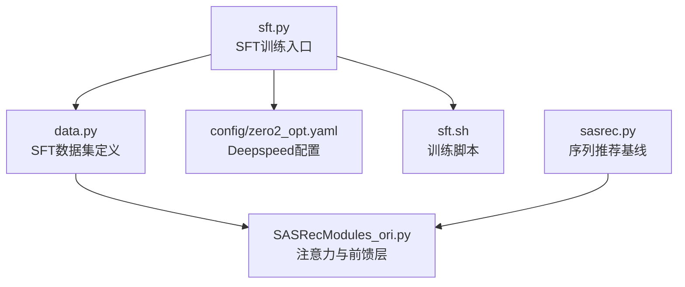
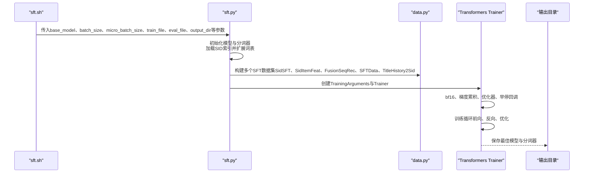
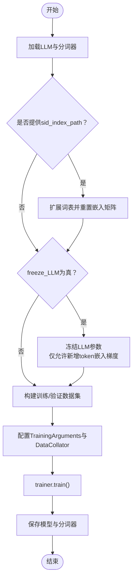
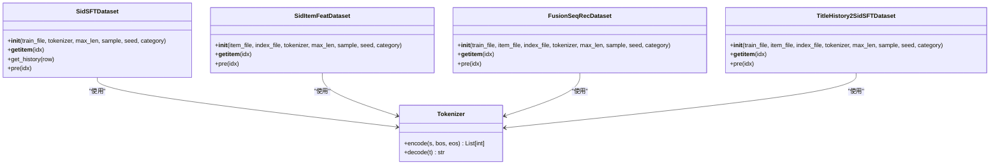
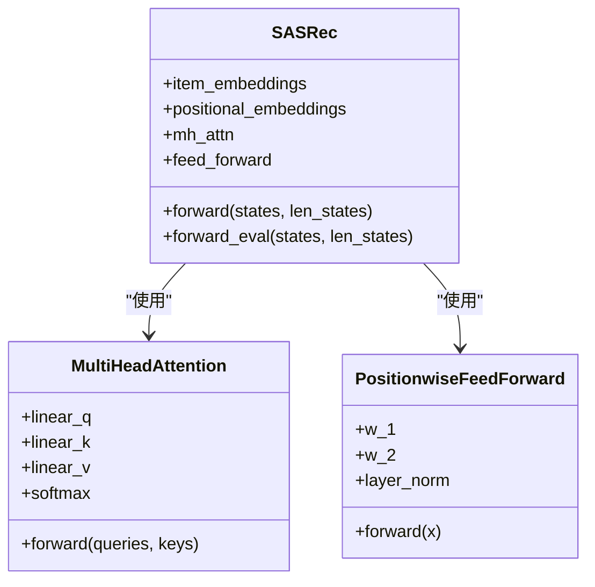
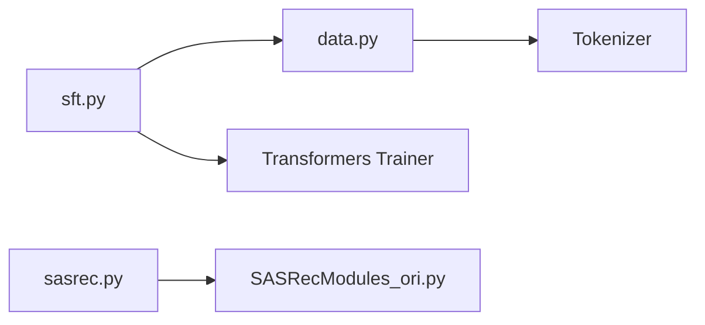

# 监督微调

<cite>
**本文引用的文件**
- [sft.py](file://sft.py)
- [data.py](file://data.py)
- [sft.sh](file://sft.sh)
- [config/zero2_opt.yaml](file://config/zero2_opt.yaml)
- [sasrec.py](file://sasrec.py)
- [SASRecModules_ori.py](file://SASRecModules_ori.py)
- [README.md](file://README.md)
</cite>

## 目录
1. [简介](#简介)
2. [项目结构](#项目结构)
3. [核心组件](#核心组件)
4. [架构总览](#架构总览)
5. [详细组件分析](#详细组件分析)
6. [依赖关系分析](#依赖关系分析)
7. [性能考量](#性能考量)
8. [故障排查指南](#故障排查指南)
9. [结论](#结论)
10. [附录](#附录)

## 简介
本文件围绕监督微调（SFT）阶段展开，聚焦于基于SASRec架构的序列推荐模型在MiniOneRec框架中的训练流程与实现细节。文档重点说明：
- 如何以SID序列作为输入，通过语言模型（LLM）的解码能力进行“下一步”预测（next-token prediction），从而完成序列推荐任务；
- 数据加载器对SFT训练样本的处理方式，包括用户历史行为序列的构建、目标项的对齐与标签构造；
- sft.sh脚本中Deepspeed与Accelerate的配置要点，以及zero2_opt.yaml中的优化器设置；
- 参数冻结（frozen_lm）选项对训练效率与模型性能的影响；
- SFT模型作为强化学习阶段初始策略的关键作用。

## 项目结构
- SFT入口与训练逻辑：sft.py
- 数据管道与多类SFT数据集：data.py
- 训练启动脚本与分布式配置：sft.sh、config/zero2_opt.yaml
- 序列推荐基线（SASRec）实现：sasrec.py、SASRecModules_ori.py
- 项目说明与流程概览：README.md

图表来源
- [sft.py](file://sft.py#L93-L276)
- [data.py](file://data.py#L484-L590)
- [config/zero2_opt.yaml](file://config/zero2_opt.yaml#L1-L20)
- [sft.sh](file://sft.sh#L1-L27)
- [sasrec.py](file://sasrec.py#L214-L276)
- [SASRecModules_ori.py](file://SASRecModules_ori.py#L1-L95)

章节来源
- [sft.py](file://sft.py#L93-L276)
- [data.py](file://data.py#L484-L590)
- [sft.sh](file://sft.sh#L1-L27)
- [config/zero2_opt.yaml](file://config/zero2_opt.yaml#L1-L20)
- [sasrec.py](file://sasrec.py#L214-L276)
- [SASRecModules_ori.py](file://SASRecModules_ori.py#L1-L95)
- [README.md](file://README.md#L38-L48)

## 核心组件
- 训练入口与参数管理：sft.py中的train函数负责模型初始化、分词器配置、数据集拼接、Trainer构建与训练执行。
- 数据集族：data.py提供多种SFT数据集，如SidSFTDataset、SidItemFeatDataset、FusionSeqRecDataset、TitleHistory2SidSFTDataset等，统一输出input_ids、attention_mask、labels等张量字段。
- 分布式与优化配置：sft.sh使用torchrun多卡启动；config/zero2_opt.yaml定义Deepspeed零冗余优化配置；sft.py中通过Transformers Trainer的TrainingArguments控制优化器、bf16混合精度、梯度累积等。
- 基线序列模型：sasrec.py中的SASRec模块包含多头注意力与前馈网络，用于离线序列推荐评估；其底层模块由SASRecModules_ori.py提供。

章节来源
- [sft.py](file://sft.py#L93-L276)
- [data.py](file://data.py#L484-L590)
- [sft.sh](file://sft.sh#L1-L27)
- [config/zero2_opt.yaml](file://config/zero2_opt.yaml#L1-L20)
- [sasrec.py](file://sasrec.py#L214-L276)
- [SASRecModules_ori.py](file://SASRecModules_ori.py#L1-L95)

## 架构总览
SFT阶段的核心流程如下：
- 从预训练语言模型加载模型与分词器；
- 加载SID索引与物品元信息，动态扩展词表并可选择冻结LLM参数；
- 组装多个SFT数据集（历史SID序列、标题到SID映射、融合序列推荐、偏好引导等），形成联合训练集；
- 使用Transformers Trainer进行训练，支持bf16、梯度累积、早停回调；
- 训练完成后保存最终检查点与分词器。

图表来源
- [sft.sh](file://sft.sh#L1-L27)
- [sft.py](file://sft.py#L93-L276)
- [data.py](file://data.py#L484-L590)

章节来源
- [sft.sh](file://sft.sh#L1-L27)
- [sft.py](file://sft.py#L93-L276)
- [data.py](file://data.py#L484-L590)

## 详细组件分析

### 组件A：SFT训练入口（sft.py）
- 模型与分词器：从预训练路径加载AutoModelForCausalLM与AutoTokenizer，设置pad_token、padding_side为左填充；若提供sid_index_path，则动态添加新token并调整嵌入矩阵大小。
- 参数冻结（frozen_lm）：当freeze_LLM为真时，冻结所有LLM参数，仅保留新增token嵌入层的梯度通道（通过自定义hook实现掩蔽）。
- 数据集组装：创建多个SFT数据集实例并合并为ConcatDataset，同时准备验证集；使用HuggingFace Dataset将列表转为HF格式并采样/打乱。
- 训练器配置：使用TrainingArguments设置bf16、warmup_steps、optim、eval_strategy、save_strategy、group_by_length等；使用DataCollatorForSeq2Seq进行批内对齐；加入EarlyStoppingCallback。
- 训练与保存：trainer.train执行训练，结束后保存模型与分词器至指定输出目录。

图表来源
- [sft.py](file://sft.py#L93-L276)

章节来源
- [sft.py](file://sft.py#L93-L276)

### 组件B：数据加载器（data.py）
- SidSFTDataset：以用户交互的历史SID序列为输入，构造“预测下一个SID”的指令式提示，编码后拼接目标SID，生成input_ids、attention_mask与labels（对输入部分设为-100，仅对目标位置计算损失）。
- SidItemFeatDataset：将SID映射到标题或描述，构造双向映射任务（sid2title/title2sid），用于语言-语义空间对齐。
- FusionSeqRecDataset：结合历史SID序列与物品特征（标题/描述），输出标题或描述作为目标，帮助模型在序列预测中融入语义信息。
- TitleHistory2SidSFTDataset：以历史标题序列为输入，预测下一个项目的SID，实现“标题→SID”的跨模态对齐。
- 其他数据集：还包括RL相关的TitleHistory2Sid、RLTitle2Sid、RLSeqTitle2Sid等，服务于后续强化学习阶段。

图表来源
- [data.py](file://data.py#L484-L590)
- [data.py](file://data.py#L712-L800)
- [data.py](file://data.py#L1311-L1540)
- [data.py](file://data.py#L1543-L1695)

章节来源
- [data.py](file://data.py#L484-L590)
- [data.py](file://data.py#L712-L800)
- [data.py](file://data.py#L1311-L1540)
- [data.py](file://data.py#L1543-L1695)

### 组件C：SASRec序列推荐基线（sasrec.py + SASRecModules_ori.py）
- 模块组成：SASRec包含位置嵌入、多头注意力、前馈网络与层归一化；SASRecModules_ori提供MultiHeadAttention与PositionwiseFeedForward的具体实现。
- 前向传播：对输入序列进行嵌入与位置编码，经注意力与前馈堆叠，使用mask屏蔽填充位置，最后通过线性层输出下一时刻的打分向量。
- 评估流程：sasrec.py提供RecDataset与evaluate_games等工具，用于离线Top-K评估（HR@K/NDCG@K）。

图表来源
- [sasrec.py](file://sasrec.py#L214-L276)
- [SASRecModules_ori.py](file://SASRecModules_ori.py#L1-L95)

章节来源
- [sasrec.py](file://sasrec.py#L214-L276)
- [SASRecModules_ori.py](file://SASRecModules_ori.py#L1-L95)

### 组件D：训练脚本与分布式配置（sft.sh、zero2_opt.yaml）
- sft.sh：使用torchrun以多进程方式启动训练，传入base_model、batch_size、micro_batch_size、train_file、eval_file、output_dir、wandb配置、类别、SID索引与物品元信息路径、freeze_LLM开关等。
- zero2_opt.yaml：Deepspeed配置采用zero_stage=2，开启contiguous_gradients、overlap_comm、reduce_scatter、bucket_size等，混合精度bf16，便于大模型高效训练。

章节来源
- [sft.sh](file://sft.sh#L1-L27)
- [config/zero2_opt.yaml](file://config/zero2_opt.yaml#L1-L20)

## 依赖关系分析
- sft.py依赖data.py中的各类SFT数据集，用于构造训练/验证样本；同时依赖Transformers Trainer进行训练。
- data.py内部各数据集共享Tokenizer封装，确保不同任务的一致编码策略。
- sasrec.py与SASRecModules_ori.py构成序列推荐基线，用于离线评估与对比，不直接参与SFT训练。

图表来源
- [sft.py](file://sft.py#L93-L276)
- [data.py](file://data.py#L484-L590)
- [sasrec.py](file://sasrec.py#L214-L276)
- [SASRecModules_ori.py](file://SASRecModules_ori.py#L1-L95)

章节来源
- [sft.py](file://sft.py#L93-L276)
- [data.py](file://data.py#L484-L590)
- [sasrec.py](file://sasrec.py#L214-L276)
- [SASRecModules_ori.py](file://SASRecModules_ori.py#L1-L95)

## 性能考量
- 内存与显存：Deepspeed zero2优化显著降低每卡显存占用；bf16混合精度减少内存压力；梯度累积与合理的batch/micro_batch比例平衡吞吐与显存。
- 训练效率：冻结LLM参数（frozen_lm）可大幅减少可训练参数规模，缩短收敛时间并降低显存峰值；仅对新增token嵌入层开放梯度。
- 数据处理：使用DataCollatorForSeq2Seq自动对齐序列，避免padding浪费；group_by_length可提升训练稳定性与速度。
- 早停与评估：EarlyStoppingCallback与定期评估有助于防止过拟合并稳定收敛。

章节来源
- [sft.py](file://sft.py#L229-L266)
- [config/zero2_opt.yaml](file://config/zero2_opt.yaml#L1-L20)

## 故障排查指南
- 训练崩溃或显存溢出
  - 检查batch_size与micro_batch_size的比例，适当增大梯度累积步数；
  - 启用bf16并确认硬件支持；
  - 减小max_len或sample数量以降低序列长度与样本规模。
- 冻结参数无效
  - 确认freeze_LLM为True且已成功扩展词表；
  - 检查自定义hook是否正确应用到新增token嵌入层。
- 数据对齐异常
  - 确认DataCollatorForSeq2Seq启用并pad_to_multiple_of为8；
  - 检查tokenizer.pad_token与padding_side配置。
- Deepspeed配置问题
  - 确认zero_stage=2与bf16设置一致；
  - 若使用多机多卡，核对num_machines与进程数匹配。

章节来源
- [sft.py](file://sft.py#L229-L266)
- [config/zero2_opt.yaml](file://config/zero2_opt.yaml#L1-L20)

## 结论
SFT阶段通过将用户交互历史（SID序列）转化为语言模型的“下一步预测”任务，实现了序列推荐与语言对齐的联合训练。data.py提供了多样化的SFT数据集，覆盖SID→标题/描述、标题→SID、融合序列推荐与偏好引导等任务；sft.py整合这些数据集并通过Transformers Trainer高效训练，支持Deepspeed与bf16加速。参数冻结（frozen_lm）在保证性能的同时显著提升训练效率。SFT得到的策略模型随后作为强化学习阶段的初始策略，为后续RL优化奠定基础。

## 附录
- 项目整体流程说明可参考README中的“SFT”与“RL”阶段描述，明确SFT在端到端工作流中的定位与价值。

章节来源
- [README.md](file://README.md#L38-L48)