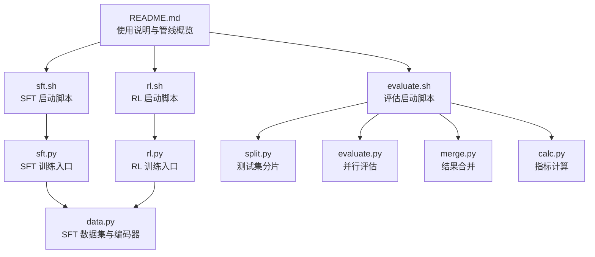
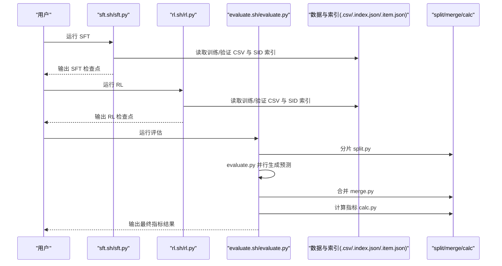
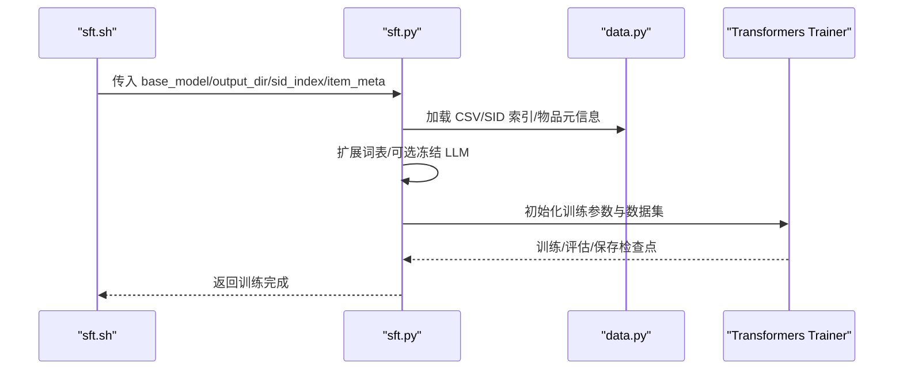
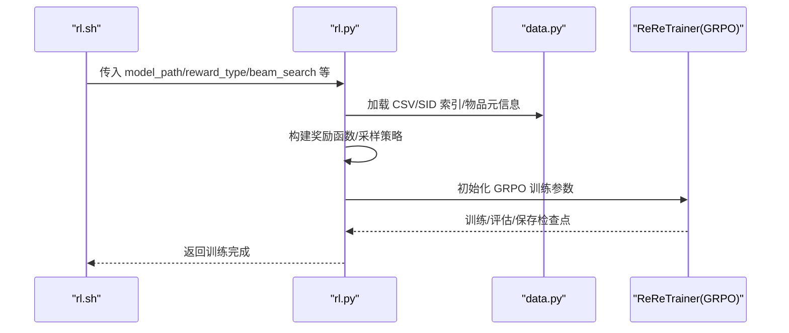
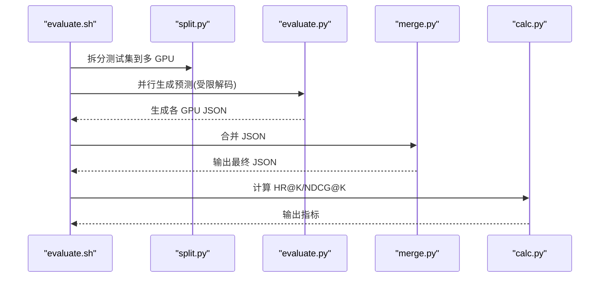
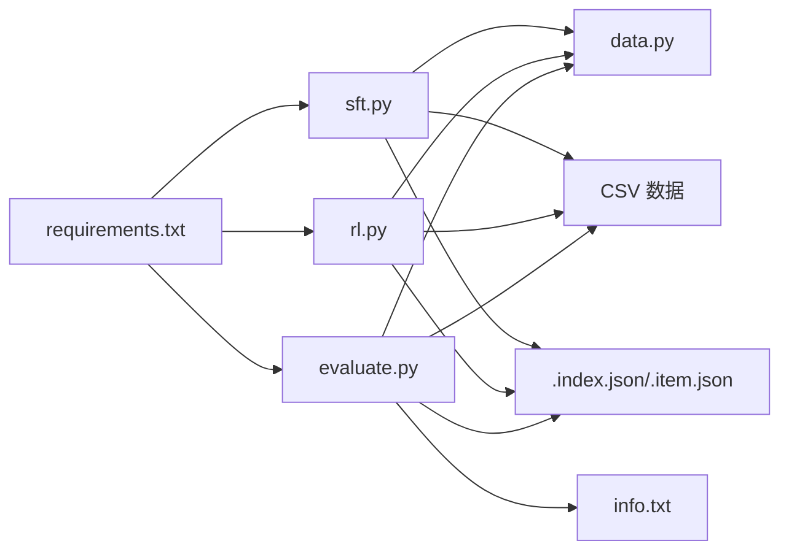

# 快速入门

<cite>
**本文引用的文件**
- [README.md](file://README.md)
- [requirements.txt](file://requirements.txt)
- [sft.sh](file://sft.sh)
- [sft.py](file://sft.py)
- [rl.sh](file://rl.sh)
- [rl.py](file://rl.py)
- [evaluate.sh](file://evaluate.sh)
- [evaluate.py](file://evaluate.py)
- [split.py](file://split.py)
- [merge.py](file://merge.py)
- [calc.py](file://calc.py)
- [convert_dataset.py](file://convert_dataset.py)
- [data.py](file://data.py)
- [rq/rqvae.sh](file://rq/rqvae.sh)
- [rq/rqvae.py](file://rq/rqvae.py)
- [data/amazon18_data_process.sh](file://data/amazon18_data_process.sh)
- [data/amazon18_data_process.py](file://data/amazon18_data_process.py)
</cite>

## 目录
1. [简介](#简介)
2. [项目结构](#项目结构)
3. [核心组件](#核心组件)
4. [架构总览](#架构总览)
5. [详细组件分析](#详细组件分析)
6. [依赖关系分析](#依赖关系分析)
7. [性能与资源建议](#性能与资源建议)
8. [故障排查指南](#故障排查指南)
9. [结论](#结论)
10. [附录](#附录)

## 简介
本指南面向首次运行 MiniOneRec 的用户，目标是在最短时间内完成从环境准备到完整训练流程（SFT 微调 → RL 优化 → 模型评估）的端到端体验。文档提供清晰的步骤说明、命令示例与预期输出提示，强调脚本之间的调用顺序与数据传递关系，并给出常见错误来源与快速排查方法。

## 项目结构
MiniOneRec 提供了从数据预处理、SID 构建、SFT 训练、RL 优化到离线评估的一体化脚本与工具模块。核心流程由三个 Bash 脚本串联：sft.sh、rl.sh、evaluate.sh；它们分别调用对应的 Python 训练/推理脚本，并通过共享的数据目录与索引文件实现数据传递。

图表来源
- [README.md](file://README.md#L92-L127)
- [sft.sh](file://sft.sh#L1-L27)
- [sft.py](file://sft.py#L274-L276)
- [rl.sh](file://rl.sh#L1-L42)
- [rl.py](file://rl.py#L315-L317)
- [evaluate.sh](file://evaluate.sh#L1-L95)
- [split.py](file://split.py#L1-L22)
- [evaluate.py](file://evaluate.py#L235-L237)
- [merge.py](file://merge.py#L1-L19)
- [calc.py](file://calc.py#L84-L85)

章节来源
- [README.md](file://README.md#L92-L127)

## 核心组件
- 环境与依赖
  - 使用独立 Python 环境安装依赖，确保版本兼容性。
  - 关键依赖包括 PyTorch、Transformers、Accelerate、DeepSpeed、TRL 等。
- 数据准备
  - 可直接使用仓库提供的示例数据（包含预构建的索引与 CSV 文件），也可按官方流程自行下载与预处理。
- SFT 阶段
  - 通过 sft.sh 启动多卡分布式训练，加载 CSV 训练/验证集与 SID 索引，支持冻结 LLM 参数仅训练新增词嵌入。
- RL 阶段
  - 通过 rl.sh 启动基于 GRPO 的推荐导向强化学习，支持多种奖励函数与约束采样策略。
- 评估阶段
  - 通过 evaluate.sh 自动拆分测试集、并行评估、合并结果并计算 HR@K/NDCG@K 指标。

章节来源
- [requirements.txt](file://requirements.txt#L1-L139)
- [README.md](file://README.md#L132-L170)
- [sft.sh](file://sft.sh#L1-L27)
- [rl.sh](file://rl.sh#L1-L42)
- [evaluate.sh](file://evaluate.sh#L1-L95)

## 架构总览
下图展示了 MiniOneRec 的端到端训练与评估流水线，突出脚本间的数据流与控制流。

图表来源
- [sft.sh](file://sft.sh#L1-L27)
- [sft.py](file://sft.py#L274-L276)
- [rl.sh](file://rl.sh#L1-L42)
- [rl.py](file://rl.py#L315-L317)
- [evaluate.sh](file://evaluate.sh#L1-L95)
- [split.py](file://split.py#L1-L22)
- [merge.py](file://merge.py#L1-L19)
- [calc.py](file://calc.py#L84-L85)

## 详细组件分析

### SFT 微调（sft.sh → sft.py）
- 入口与参数
  - sft.sh 使用 torchrun 多卡启动，传入 base_model、输出目录、SID 索引与物品元信息等关键参数。
  - sft.py 接收上述参数，构建模型与分词器，动态扩展词表以容纳新增 SID 令牌，并可选择冻结 LLM 参数。
- 数据加载
  - 通过 data.py 中的 SFT 数据集类加载 CSV，构造“指令 + 历史交互 + 目标 SID”的序列，用于自回归训练。
- 训练过程
  - 使用 Transformers Trainer 进行多卡分布式训练，支持早停回调与断点续训。
- 输出
  - 保存最佳检查点与最终检查点，包含模型权重与分词器。

图表来源
- [sft.sh](file://sft.sh#L1-L27)
- [sft.py](file://sft.py#L93-L271)
- [data.py](file://data.py#L484-L590)

章节来源
- [sft.sh](file://sft.sh#L1-L27)
- [sft.py](file://sft.py#L93-L271)
- [data.py](file://data.py#L484-L590)

### RL 优化（rl.sh → rl.py）
- 入口与参数
  - rl.sh 使用 Accelerate 启动多进程，传入模型路径、批次大小、奖励类型、采样数量等。
  - rl.py 接收参数，构建 ReReTrainer（基于 GRPO），定义多种奖励函数（规则、排序、语义、协同过滤）。
- 数据加载
  - 通过 data.py 中的 RL 数据集类加载 CSV，构造 prompt/completion 对与历史映射。
- 训练过程
  - 支持束搜索、动态采样、KL 正则、参考模型同步等策略，稳定推荐导向优化。
- 输出
  - 保存 RL 最终检查点与分词器。

图表来源
- [rl.sh](file://rl.sh#L1-L42)
- [rl.py](file://rl.py#L30-L314)
- [data.py](file://data.py#L407-L482)

章节来源
- [rl.sh](file://rl.sh#L1-L42)
- [rl.py](file://rl.py#L30-L314)
- [data.py](file://data.py#L407-L482)

### 模型评估（evaluate.sh → evaluate.py → split/merge/calc）
- 流程概述
  - evaluate.sh 自动定位测试集与信息文件，创建临时目录，调用 split.py 将测试集均匀分片到多 GPU。
  - evaluate.py 在各 GPU 上并行生成候选推荐，使用受限解码（Constrained Decoding）保证输出为合法 SID。
  - merge.py 合并各 GPU 的 JSON 结果，calc.py 计算 HR@K 与 NDCG@K 指标。
- 关键点
  - evaluate.py 内置前缀哈希约束，确保生成内容严格来自物品索引。
  - split/merge/calc 三者配合实现高吞吐离线评估。

图表来源
- [evaluate.sh](file://evaluate.sh#L1-L95)
- [split.py](file://split.py#L1-L22)
- [evaluate.py](file://evaluate.py#L1-L242)
- [merge.py](file://merge.py#L1-L19)
- [calc.py](file://calc.py#L1-L85)

章节来源
- [evaluate.sh](file://evaluate.sh#L1-L95)
- [split.py](file://split.py#L1-L22)
- [evaluate.py](file://evaluate.py#L1-L242)
- [merge.py](file://merge.py#L1-L19)
- [calc.py](file://calc.py#L1-L85)

### 数据准备与 SID 构建（可选）
- 示例数据
  - 若使用仓库自带示例数据，可直接跳过以下步骤；否则需要先完成数据过滤与预处理、文本向量化、RQ-VAE/RQ-Kmeans 训练与索引生成。
- 关键脚本
  - data/amazon18_data_process.sh：过滤与预处理 Amazon 数据。
  - rq/rqvae.sh：训练 RQ-VAE 生成 SID 索引。
  - convert_dataset.py：将交互数据转换为 MiniOneRec 训练格式（CSV + 索引 + 物品信息）。

章节来源
- [README.md](file://README.md#L152-L231)
- [data/amazon18_data_process.sh](file://data/amazon18_data_process.sh#L1-L10)
- [rq/rqvae.sh](file://rq/rqvae.sh#L1-L7)
- [convert_dataset.py](file://convert_dataset.py#L1-L234)

## 依赖关系分析
- Python 依赖
  - requirements.txt 列出训练/评估所需包，包括 PyTorch、Transformers、Accelerate、DeepSpeed、TRL、W&B 等。
- 脚本耦合
  - sft.sh 与 rl.sh 分别强依赖对应 Python 脚本；evaluate.sh 依赖 split/merge/calc 与 evaluate.py。
  - 三者均依赖 data.py 中的数据集类与分词器。
- 外部输入
  - CSV 训练/验证/测试文件、SID 索引文件（.index.json）、物品元信息（.item.json）、物品信息（.txt）。

图表来源
- [requirements.txt](file://requirements.txt#L1-L139)
- [sft.py](file://sft.py#L274-L276)
- [rl.py](file://rl.py#L315-L317)
- [evaluate.py](file://evaluate.py#L235-L237)
- [data.py](file://data.py#L1-L200)

章节来源
- [requirements.txt](file://requirements.txt#L1-L139)
- [sft.py](file://sft.py#L274-L276)
- [rl.py](file://rl.py#L315-L317)
- [evaluate.py](file://evaluate.py#L235-L237)
- [data.py](file://data.py#L1-L200)

## 性能与资源建议
- GPU 资源
  - SFT/RL 阶段建议使用 8× A100/H100 80 GB 或等效显存设备，以充分利用多卡分布式训练。
- 内存与磁盘
  - 确保训练数据与索引文件位于高速存储上，避免 I/O 成为瓶颈。
- 训练参数
  - 合理设置 batch_size/micro_batch_size 与梯度累积步数，平衡显存占用与收敛速度。
- 评估并行
  - evaluate.sh 默认对 8 张 GPU 并行评估，可根据实际设备调整 CUDA_VISIBLE_DEVICES 与分片数量。

[本节为通用建议，不直接分析具体文件]

## 故障排查指南
- 环境问题
  - 依赖缺失：确认已按 requirements.txt 安装所有依赖，特别是 PyTorch、Transformers、Accelerate、DeepSpeed、TRL。
  - Python 版本不符：README 指定 Python 3.11，请使用 conda 创建并激活环境后再安装依赖。
- 路径错误
  - SFT/RL/评估脚本中的路径（如 base_model、output_dir、sid_index_path、item_meta_path、info_file）必须指向真实存在的文件。
  - evaluate.sh 会自动查找 CSV 与 info 文件，若找不到会打印错误并跳过该类别。
- 数据格式不匹配
  - 确保 CSV 字段包含 user_id、history_item_sid、item_sid 等字段，且 SID 已正确映射至 .index.json。
  - evaluate.py 依赖 info.txt 的格式为“semantic_id \t item_title \t item_id”，请保持一致。
- 多卡通信
  - sft.sh/rl.sh 中设置了 NCCL_IB_DISABLE=1，若网络环境特殊可按需调整。
- 权重与索引
  - 若 freeze_LLM=True，仅训练新增词嵌入，需确保 .index.json 中存在新增 SID 令牌。
- 评估失败
  - split.py/merge.py/calc.py 任一环节失败都会导致最终指标缺失，检查临时目录与 JSON 文件是否存在。

章节来源
- [README.md](file://README.md#L132-L170)
- [requirements.txt](file://requirements.txt#L1-L139)
- [sft.sh](file://sft.sh#L1-L27)
- [rl.sh](file://rl.sh#L1-L42)
- [evaluate.sh](file://evaluate.sh#L1-L95)
- [evaluate.py](file://evaluate.py#L1-L242)
- [split.py](file://split.py#L1-L22)
- [merge.py](file://merge.py#L1-L19)
- [calc.py](file://calc.py#L1-L85)

## 结论
通过本指南，您可以在最短时间内完成 MiniOneRec 的完整流程：环境准备 → 数据准备（或直接使用示例数据）→ SFT 微调 → RL 优化 → 模型评估。建议先以示例数据验证流程，再逐步替换为自有数据与模型。遇到问题时，优先检查路径、依赖与数据格式，结合日志与错误提示快速定位。

[本节为总结，不直接分析具体文件]

## 附录

### 快速开始步骤清单
- 环境准备
  - 创建并激活 Python 环境，安装依赖。
- 数据准备（可选）
  - 下载原始数据后，按 README 的 2.2/2.3 步骤过滤与预处理，训练 RQ-VAE/RQ-Kmeans 并生成索引，最后转换为 MiniOneRec 训练格式。
- SFT 微调
  - 运行 sft.sh，等待训练完成并生成检查点。
- RL 优化
  - 运行 rl.sh，等待 RL 训练完成并生成检查点。
- 模型评估
  - 运行 evaluate.sh，等待评估完成并查看 HR@K/NDCG@K 指标。

章节来源
- [README.md](file://README.md#L92-L170)
- [sft.sh](file://sft.sh#L1-L27)
- [rl.sh](file://rl.sh#L1-L42)
- [evaluate.sh](file://evaluate.sh#L1-L95)