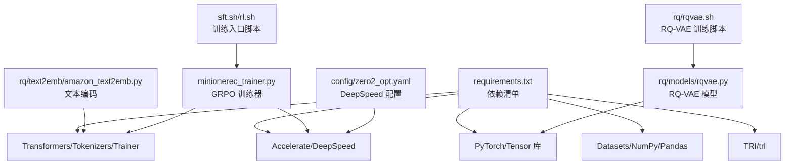
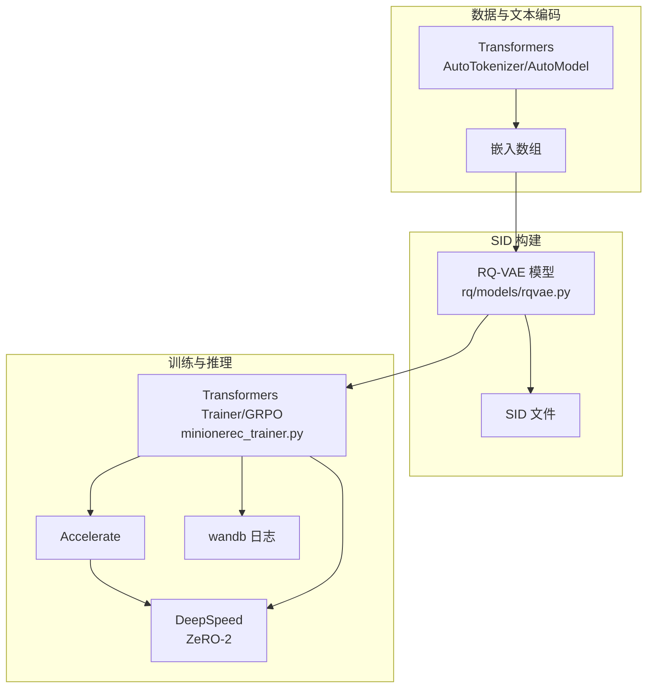
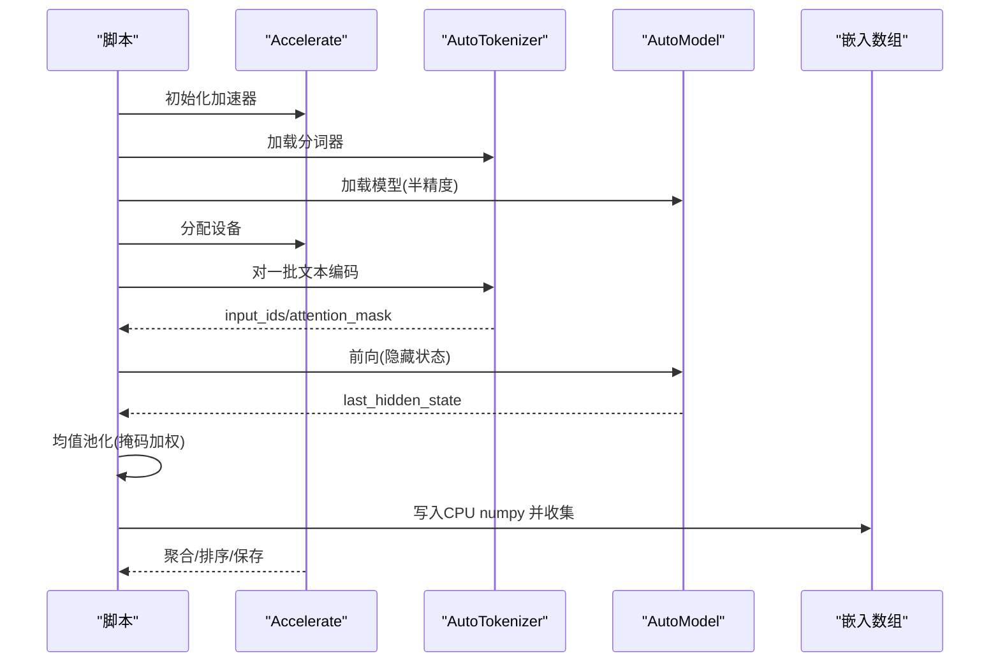
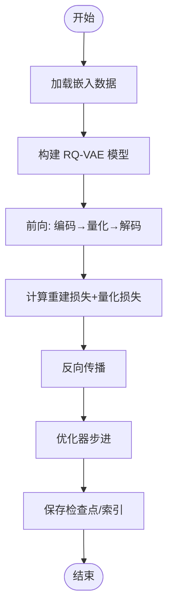
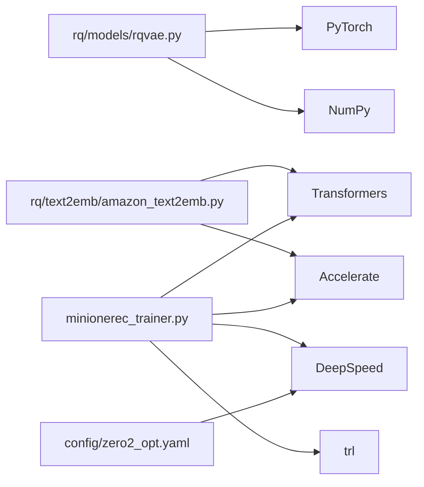

# 技术栈与依赖

<cite>
**本文引用的文件**
- [requirements.txt](file://requirements.txt)
- [README.md](file://README.md)
- [config/zero2_opt.yaml](file://config/zero2_opt.yaml)
- [rq/text2emb/amazon_text2emb.py](file://rq/text2emb/amazon_text2emb.py)
- [rq/models/rqvae.py](file://rq/models/rqvae.py)
- [minionerec_trainer.py](file://minionerec_trainer.py)
- [sft.sh](file://sft.sh)
- [rl.sh](file://rl.sh)
- [rq/rqvae.sh](file://rq/rqvae.sh)
</cite>

## 目录
1. [简介](#简介)
2. [项目结构](#项目结构)
3. [核心组件](#核心组件)
4. [架构总览](#架构总览)
5. [详细组件分析](#详细组件分析)
6. [依赖关系分析](#依赖关系分析)
7. [性能与硬件要求](#性能与硬件要求)
8. [故障排查指南](#故障排查指南)
9. [结论](#结论)

## 简介
本文件系统梳理 MiniOneRec 所依赖的核心 Python 技术栈，明确各库的版本要求与在项目中的职责，并提供安装与运行指南、常见兼容性问题处理方法以及针对 RQ-VAE 训练与大规模嵌入生成等计算密集型任务的硬件建议。内容基于仓库中的依赖清单、脚本与源码实现进行归纳总结。

## 项目结构
围绕技术栈与依赖，项目主要由以下部分构成：
- 核心依赖声明：集中于依赖清单文件，定义了 PyTorch 生态、Transformers 生态、Accelerate、Deepspeed、TRI、数据集与工具库等。
- 训练与推理脚本：通过 shell 脚本启动 SFT 与 RL 阶段，使用 Accelerate/DeepSpeed 进行分布式训练。
- 文本到嵌入生成：利用 Transformers 的预训练模型对商品标题与描述进行编码，得到向量表示。
- SID 构建：基于嵌入训练 RQ-VAE 或 RQ-KMeans 等量化模型，生成离散语义索引（SID）。
- 推荐训练器：基于 Transformers/TRL 的 GRPO 训练器，集成 Accelerate/DeepSpeed。

图表来源
- [requirements.txt](file://requirements.txt#L1-L139)
- [rq/text2emb/amazon_text2emb.py](file://rq/text2emb/amazon_text2emb.py#L1-L193)
- [rq/models/rqvae.py](file://rq/models/rqvae.py#L1-L85)
- [minionerec_trainer.py](file://minionerec_trainer.py#L1-L76)
- [config/zero2_opt.yaml](file://config/zero2_opt.yaml#L1-L20)
- [sft.sh](file://sft.sh#L1-L26)
- [rl.sh](file://rl.sh#L1-L30)
- [rq/rqvae.sh](file://rq/rqvae.sh#L1-L6)

章节来源
- [requirements.txt](file://requirements.txt#L1-L139)
- [README.md](file://README.md#L92-L127)

## 核心组件
- PyTorch 与 Torch* 生态：提供张量运算、自动微分、分布式训练与混合精度支持；项目中大量使用 torch、torchaudio、torchvision、torchmetrics、torchrec、torchsnapshot 等。
- Transformers 生态：提供预训练模型加载、分词器、Trainer/TrainingArguments、GenerationConfig、PEFT、TRL（GRPO）等；项目中用于 SFT/RL 训练与生成。
- Accelerate：统一多设备训练抽象，简化分布式训练与设备管理；项目中用于文本嵌入生成与 RL 训练。
- DeepSpeed：ZeRO 优化、梯度累积、参数/优化器卸载等；项目中通过配置文件启用 ZeRO Stage 2。
- HuggingFace 生态：datasets、tokenizers、huggingface-hub、safetensors、wandb 等；项目中用于数据处理、模型下载与日志记录。
- TRIL/trl：提供 GRPO 训练框架与参考模型构建；项目中作为推荐强化学习训练器的基础。
- 其他：numpy、pandas、scipy、einops、faiss、bitsandbytes、k_means_constrained、polars 等，分别用于数据处理、量化与聚类、LoRA/QLoRA、向量检索等。

章节来源
- [requirements.txt](file://requirements.txt#L1-L139)
- [minionerec_trainer.py](file://minionerec_trainer.py#L1-L76)
- [rq/text2emb/amazon_text2emb.py](file://rq/text2emb/amazon_text2emb.py#L1-L193)

## 架构总览
下图展示 MiniOneRec 在“文本编码→嵌入生成→SID 构建→SFT/RL 训练”全流程中，各技术栈组件的交互关系与职责分工。

图表来源
- [rq/text2emb/amazon_text2emb.py](file://rq/text2emb/amazon_text2emb.py#L1-L193)
- [rq/models/rqvae.py](file://rq/models/rqvae.py#L1-L85)
- [minionerec_trainer.py](file://minionerec_trainer.py#L1-L76)
- [config/zero2_opt.yaml](file://config/zero2_opt.yaml#L1-L20)

## 详细组件分析

### PyTorch 与 Torch* 生态
- 版本与用途
  - torch、torchaudio、torchvision：张量运算、音频/视觉处理、训练与推理。
  - torchmetrics、torcheval：指标计算与评估辅助。
  - torchrec：推荐场景下的高效嵌入与召回。
  - torchsnapshot：模型快照与恢复。
- 复杂度与性能
  - RQ-VAE 前向/反向涉及多层 MLP 与残差向量量化，时间复杂度与层数、嵌入维度、批次大小相关；混合精度可显著降低显存占用。
- 错误处理与兼容性
  - 使用 torch.cuda.is_available()/device_count() 判断 GPU 可用性；注意不同 CUDA/cuDNN 版本组合可能导致编译/运行时冲突。
- 性能要点
  - bf16/mixed precision 与梯度累积结合可提升吞吐；pin_memory、prefetch 等可优化数据加载。

章节来源
- [requirements.txt](file://requirements.txt#L1-L139)
- [rq/models/rqvae.py](file://rq/models/rqvae.py#L1-L85)

### Transformers 与 TRL（GRPO）
- 版本与用途
  - transformers：AutoModelForCausalLM/AutoTokenizer/Trainer/TrainingArguments/GenerationConfig 等。
  - trl：GRPOConfig、参考模型创建、logits 处理器等。
- 复杂度与性能
  - 训练阶段使用 Trainer/TrainingArguments 控制微调超参；bf16、梯度累积、warmup、logging 步骤等影响收敛速度与稳定性。
- 错误处理与兼容性
  - 当启用 PEFT/LoRA 时，参考模型构建策略不同；DeepSpeed ZeRO-3 下需特殊处理 ref_model 初始化。
- 性能要点
  - bf16 与梯度累积配合可提升大模型训练效率；日志与评估频率需平衡性能与可观测性。

章节来源
- [requirements.txt](file://requirements.txt#L1-L139)
- [minionerec_trainer.py](file://minionerec_trainer.py#L1-L76)
- [minionerec_trainer.py](file://minionerec_trainer.py#L272-L302)
- [minionerec_trainer.py](file://minionerec_trainer.py#L633-L657)

### Accelerate（分布式与多进程）
- 版本与用途
  - accelerate：统一多设备训练抽象，提供 gather_object、broadcast_object_list、is_peft_model 等工具。
- 复杂度与性能
  - 多进程切分数据块、均值池化嵌入、结果聚合，整体复杂度与数据规模线性相关。
- 错误处理与兼容性
  - 注意主进程与非主进程的条件打印与保存；num_processes 与 GPU 数量匹配，避免设备冲突。
- 性能要点
  - 合理设置 batch_size 与 num_processes；加速器设备选择与显存分配需与训练器/推理引擎协调。

章节来源
- [rq/text2emb/amazon_text2emb.py](file://rq/text2emb/amazon_text2emb.py#L1-L193)
- [minionerec_trainer.py](file://minionerec_trainer.py#L1-L41)

### DeepSpeed（ZeRO 优化）
- 版本与用途
  - deepspeed：ZeRO Stage 2 优化，包含梯度/参数/优化器卸载、通信重叠等。
- 配置要点
  - 配置文件启用 mixed_precision、reduce_scatter、overlap_comm、bucket_size 等；与 Accelerate/Trainer 协同工作。
- 错误处理与兼容性
  - ZeRO-3 下参考模型初始化方式不同；num_processes 与 GPU 数量需一致或合理错开。
- 性能要点
  - 通过梯度累积与 bf16 提升吞吐；注意 offload 设备与内存上限。

章节来源
- [requirements.txt](file://requirements.txt#L1-L139)
- [config/zero2_opt.yaml](file://config/zero2_opt.yaml#L1-L20)
- [minionerec_trainer.py](file://minionerec_trainer.py#L272-L302)

### 文本到嵌入生成（Transformers + Accelerate）
- 流程概览
  - 读取商品元数据，拼接标题与描述，使用 AutoTokenizer 编码，AutoModel 前向得到隐藏状态，按注意力掩码做均值池化，最终保存为嵌入数组。
  - 多进程切分数据，主进程汇总并排序后写盘。
- 关键点
  - torch.float16 与 low_cpu_mem_usage 减少显存与 CPU 内存压力。
  - pad_token 设置与 padding_side 调整保证对齐。
- 性能要点
  - 批大小与进度条控制；多进程聚合需等待所有进程完成。

图表来源
- [rq/text2emb/amazon_text2emb.py](file://rq/text2emb/amazon_text2emb.py#L1-L193)

章节来源
- [rq/text2emb/amazon_text2emb.py](file://rq/text2emb/amazon_text2emb.py#L1-L193)

### RQ-VAE 模型与 SID 生成
- 模型结构
  - 编码器/解码器 MLP 层 + 残差向量量化（ResidualVectorQuantizer），前向返回重建损失与量化损失，提供 get_indices 获取离散索引。
- 复杂度与性能
  - 前向/反向与层数、嵌入维度、批次大小成正比；bf16/mixed precision 可显著节省显存。
- 错误处理与兼容性
  - e_dim 必须与输入维度一致；训练脚本中设置 batch_size 与 epochs，注意 GPU 显存上限。
- 性能要点
  - 梯度累积与 bf16；kmeans_init/kmeans_iters/sk_epsilons/sk_iters 影响收敛质量与速度。

图表来源
- [rq/models/rqvae.py](file://rq/models/rqvae.py#L1-L85)
- [rq/rqvae.sh](file://rq/rqvae.sh#L1-L6)

章节来源
- [rq/models/rqvae.py](file://rq/models/rqvae.py#L1-L85)
- [rq/rqvae.sh](file://rq/rqvae.sh#L1-L6)

### 训练入口与分布式配置
- SFT/RL 脚本
  - sft.sh 使用 torchrun 启动单机多卡训练；rl.sh 使用 accelerate launch 搭配 DeepSpeed 配置文件进行分布式训练。
- 分布式配置
  - zero2_opt.yaml 启用 bf16、ZeRO-2、通信重叠与桶大小优化；num_processes 与 GPU 数量匹配。
- 性能要点
  - 严格控制 batch size 与梯度累积步数；NCCL 参数可根据网络环境调整。

章节来源
- [sft.sh](file://sft.sh#L1-L26)
- [rl.sh](file://rl.sh#L1-L30)
- [config/zero2_opt.yaml](file://config/zero2_opt.yaml#L1-L20)

## 依赖关系分析
- 组件耦合
  - 文本编码依赖 Transformers/Accelerate；SID 构建依赖 PyTorch 与 RQ 模块；训练器依赖 Transformers/TRL/DeepSpeed/Accelerate。
- 外部依赖
  - 数据与工具：datasets、tokenizers、huggingface-hub、safetensors、wandb、numpy、pandas、scipy、einops、faiss、bitsandbytes、k_means_constrained、polars。
- 潜在循环依赖
  - 未发现直接循环导入；训练器与加速器/深度学习框架通过接口解耦。

图表来源
- [rq/models/rqvae.py](file://rq/models/rqvae.py#L1-L85)
- [rq/text2emb/amazon_text2emb.py](file://rq/text2emb/amazon_text2emb.py#L1-L193)
- [minionerec_trainer.py](file://minionerec_trainer.py#L1-L76)
- [config/zero2_opt.yaml](file://config/zero2_opt.yaml#L1-L20)

章节来源
- [requirements.txt](file://requirements.txt#L1-L139)
- [minionerec_trainer.py](file://minionerec_trainer.py#L1-L76)

## 性能与硬件要求
- 环境与版本
  - Python 3.11（快速开始与完整流程均指定）。
  - CUDA/cuDNN 版本需与 PyTorch 匹配；项目中出现 cu118/cu12 对应不同 CUDA 主版本。
- GPU 配置建议
  - 训练与评估：至少 4–8× A100/H100 80GB（官方建议）。
  - 多卡训练：确保 num_processes 与可用 GPU 数一致；ZeRO-3 下需特别处理参考模型初始化。
- 显存与吞吐
  - bf16/mixed precision 与梯度累积可显著提升吞吐；批大小与序列长度需根据显存动态调整。
- 网络与通信
  - NCCL 参数可按需禁用/启用特定通道；分布式训练需稳定网络与端口占用。

章节来源
- [README.md](file://README.md#L130-L151)
- [README.md](file://README.md#L92-L127)
- [config/zero2_opt.yaml](file://config/zero2_opt.yaml#L1-L20)
- [sft.sh](file://sft.sh#L1-L26)
- [rl.sh](file://rl.sh#L1-L30)

## 故障排查指南
- 依赖安装问题
  - CUDA/cuDNN 版本不匹配：核对 requirements 中对应版本；若报错，优先更换与 PyTorch 匹配的 CUDA/cuDNN。
  - bitsandbytes/flash-attn/flash-attention：若安装失败，尝试使用官方 wheel 或降级 Python 版本。
- 分布式与设备问题
  - num_processes 与 GPU 数不一致：根据实际 GPU 数调整脚本参数；ZeRO-3 下参考模型初始化逻辑不同。
  - vLLM 兼容性：当 use_vllm=True 时，需单独设备且避免与训练共享 GPU；必要时降低显存利用率。
- 文本嵌入生成问题
  - pad_token 与 padding_side：确保分词器设置正确；批量编码时注意最大长度与截断策略。
  - 多进程聚合：确认所有进程完成后再进行排序与保存，避免空文件或重复写入。
- 训练稳定性
  - bf16 与梯度累积：逐步增加累积步数，观察损失曲线；warmup 与学习率需与数据规模匹配。
  - 日志与评估：适当降低 logging 步长与评估频率，避免 I/O 成为瓶颈。

章节来源
- [minionerec_trainer.py](file://minionerec_trainer.py#L415-L474)
- [rq/text2emb/amazon_text2emb.py](file://rq/text2emb/amazon_text2emb.py#L1-L193)
- [config/zero2_opt.yaml](file://config/zero2_opt.yaml#L1-L20)

## 结论
MiniOneRec 的技术栈围绕 PyTorch/Transformers/DeepSpeed/Accelerate/TRL 构建，覆盖从文本编码、嵌入生成、SID 构建到 SFT/RL 的完整流程。通过 bf16、ZeRO-2、梯度累积与多进程并行，项目能够在大规模数据与模型上保持高效训练。建议在安装与部署时严格遵循依赖版本与 CUDA/cuDNN 匹配关系，并根据硬件资源合理配置分布式参数与批大小，以获得最佳性能与稳定性。