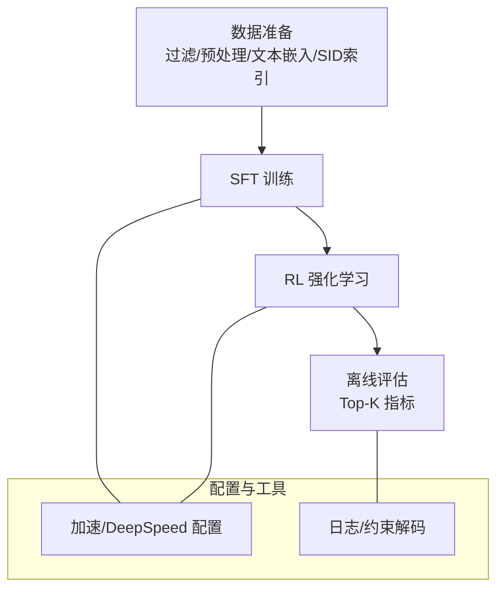
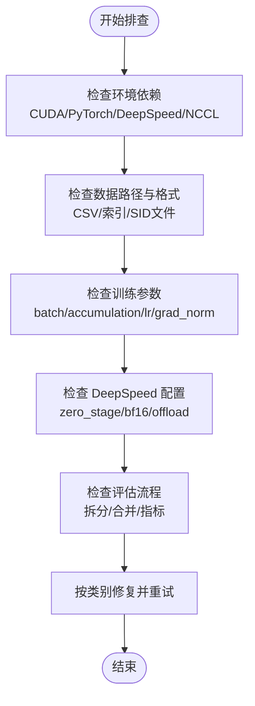

# 故障排除

<cite>
**本文引用的文件**
- [README.md](file://README.md)
- [requirements.txt](file://requirements.txt)
- [sft.sh](file://sft.sh)
- [rl.sh](file://rl.sh)
- [evaluate.sh](file://evaluate.sh)
- [sft.py](file://sft.py)
- [rl.py](file://rl.py)
- [minionerec_trainer.py](file://minionerec_trainer.py)
- [evaluate.py](file://evaluate.py)
- [LogitProcessor.py](file://LogitProcessor.py)
- [config/zero2_opt.yaml](file://config/zero2_opt.yaml)
- [rq/rqkmeans_plus.sh](file://rq/rqkmeans_plus.sh)
- [rq/rqkmeans_plus.py](file://rq/rqkmeans_plus.py)
- [rq/rqvae.py](file://rq/rqvae.py)
</cite>

## 目录
1. [简介](#简介)
2. [项目结构与运行流程概览](#项目结构与运行流程概览)
3. [常见问题分类与排查清单](#常见问题分类与排查清单)
4. [逐类问题详解与修复建议](#逐类问题详解与修复建议)
5. [依赖与环境问题](#依赖与环境问题)
6. [数据处理与输入问题](#数据处理与输入问题)
7. [训练异常与数值问题](#训练异常与数值问题)
8. [评估与指标异常](#评估与指标异常)
9. [性能优化与资源管理](#性能优化与资源管理)
10. [故障排除流程图](#故障排除流程图)
11. [结论](#结论)

## 简介
本指南面向使用 MiniOneRec 的研究者与工程师，聚焦于在实际运行中可能遇到的典型问题：环境依赖不匹配、数据准备失败、训练异常（显存溢出、NaN损失、梯度异常）、评估结果异常等。文档基于仓库中的脚本、训练器与配置文件，提供可操作的诊断步骤、根因分析与修复建议，并附带具体参数与路径修改指引，帮助用户快速定位并解决问题。

## 项目结构与运行流程概览
MiniOneRec 的端到端流程包含以下阶段：
- 数据准备：过滤与预处理原始数据，生成文本嵌入，构建 SID（语义 ID）索引。
- SID 构建：可选 RQ-VAE 或 RQ-Kmeans+ 训练与索引生成。
- SFT（监督微调）：以 SID 为词表扩展，进行序列到序列训练。
- RL（推荐导向强化学习）：基于 GRPO 的策略优化，使用奖励函数（规则、排序、语义、协同过滤）。
- 评估：离线 Top-K 评测，计算 HR@K/NDCG@K 并合并多 GPU 结果。

图表来源
- [README.md](file://README.md#L120-L210)
- [sft.sh](file://sft.sh#L1-L27)
- [rl.sh](file://rl.sh#L1-L42)
- [evaluate.sh](file://evaluate.sh#L1-L95)
- [config/zero2_opt.yaml](file://config/zero2_opt.yaml#L1-L20)

章节来源
- [README.md](file://README.md#L120-L210)
- [sft.sh](file://sft.sh#L1-L27)
- [rl.sh](file://rl.sh#L1-L42)
- [evaluate.sh](file://evaluate.sh#L1-L95)

## 常见问题分类与排查清单
- 环境依赖错误
  - CUDA/cuDNN/驱动版本不匹配
  - PyTorch/Transformers/DeepSpeed 版本不兼容
  - 多卡通信（NCCL）报错或网络禁用导致进程同步失败
- 数据处理失败
  - 文件路径不存在或权限不足
  - 数据集格式不正确（列名、分隔符）
  - SID 索引缺失或损坏
- 训练异常
  - 显存不足（OOM）
  - NaN/Inf 损失
  - 梯度爆炸/梯度消失
  - DeepSpeed 零冗余优化配置不当
- 评估异常
  - 评测数据拆分/合并失败
  - 指标计算缺失或为空
  - 解码约束未生效导致输出无效
- 其他
  - 权重冻结与新增词表扩展冲突
  - vLLM 设备占用与训练设备冲突

章节来源
- [requirements.txt](file://requirements.txt#L1-L139)
- [config/zero2_opt.yaml](file://config/zero2_opt.yaml#L1-L20)
- [sft.py](file://sft.py#L120-L270)
- [rl.py](file://rl.py#L1-L120)
- [evaluate.py](file://evaluate.py#L1-L120)

## 逐类问题详解与修复建议

### 环境依赖错误
- 症状
  - 启动时报 CUDA/cuDNN/驱动不匹配
  - 安装依赖时报版本冲突
  - DeepSpeed 初始化失败或零冗余优化报错
  - 多卡训练时 NCCL 报错或进程卡住
- 根因
  - 依赖版本与 CUDA 工具链不一致（如 cu118 对应的包）
  - NCCL 网络被禁用导致进程间通信失败
  - DeepSpeed 零冗余优化配置与硬件不匹配
- 诊断步骤
  - 检查 CUDA 驱动与 PyTorch 编译版本是否匹配
  - 查看 requirements 中的版本号与当前环境是否一致
  - 在训练脚本中确认 NCCL 设置是否合理
  - 检查 DeepSpeed 配置文件中的 zero_stage、bf16、offload_* 是否与硬件匹配
- 修复建议
  - 使用官方推荐的 Python 3.11 与 PyTorch 2.6.0（cu118/cu12）组合
  - 若使用 DeepSpeed，确保 bf16 与硬件支持一致；必要时关闭 offload 或改为 CPU offload
  - 如遇 NCCL 报错，临时开启网络或减少 GPU 数量；确认端口未被占用
  - 参考以下路径进行参数核对与修改：
    - [requirements.txt](file://requirements.txt#L1-L139)
    - [config/zero2_opt.yaml](file://config/zero2_opt.yaml#L1-L20)
    - [sft.sh](file://sft.sh#L1-L27)
    - [rl.sh](file://rl.sh#L1-L42)

章节来源
- [requirements.txt](file://requirements.txt#L1-L139)
- [config/zero2_opt.yaml](file://config/zero2_opt.yaml#L1-L20)
- [sft.sh](file://sft.sh#L1-L27)
- [rl.sh](file://rl.sh#L1-L42)

### 数据处理失败
- 症状
  - 数据文件找不到或路径拼接错误
  - CSV 列名不匹配或字段缺失
  - SID 索引文件不存在或格式不符
  - 文本嵌入生成失败（FAISS/Constrained KMeans 依赖未安装）
- 根因
  - 脚本中硬编码路径与实际目录不一致
  - 数据预处理阶段缺少必要的依赖包
  - SID 构建阶段未完成或产物未生成
- 诊断步骤
  - 检查数据准备脚本中的路径参数是否正确
  - 确认 CSV 列名与数据加载逻辑一致
  - 运行 SID 构建脚本并验证 .index.json 与 .item.json 是否生成
  - 若使用 RQ-Kmeans+，确认预训练 codebook 路径存在且键名匹配
- 修复建议
  - 修改脚本中的路径参数，确保与实际数据目录一致
  - 安装缺失依赖（如 FAISS、k_means_constrained、polars）
  - 重新执行 SID 构建流程，确保中间产物完整
  - 参考以下路径进行核对：
    - [README.md](file://README.md#L150-L210)
    - [rq/rqkmeans_plus.sh](file://rq/rqkmeans_plus.sh#L1-L9)
    - [rq/rqkmeans_plus.py](file://rq/rqkmeans_plus.py#L1-L179)
    - [rq/rqvae.py](file://rq/rqvae.py#L1-L95)

章节来源
- [README.md](file://README.md#L150-L210)
- [rq/rqkmeans_plus.sh](file://rq/rqkmeans_plus.sh#L1-L9)
- [rq/rqkmeans_plus.py](file://rq/rqkmeans_plus.py#L1-L179)
- [rq/rqvae.py](file://rq/rqvae.py#L1-L95)

### 训练异常（显存不足、NaN、梯度异常）
- 症状
  - OOM：显存不足导致训练中断
  - NaN/Inf：损失变为 NaN 或 Inf
  - 梯度异常：梯度爆炸或梯度消失
  - DeepSpeed 零冗余优化初始化失败
- 根因
  - batch size/micro_batch_size 组合过大
  - bf16 与硬件不兼容或精度不足
  - 学习率过高或奖励函数不稳定
  - DeepSpeed 零冗余优化配置不当
- 诊断步骤
  - 降低 per_device_train_batch_size 与 gradient_accumulation_steps
  - 检查 bf16 与硬件兼容性，必要时切换 fp16 或关闭 bf16
  - 观察梯度范数与学习率，适当降低学习率
  - 核对 DeepSpeed 零冗余优化配置与硬件资源
- 修复建议
  - 减小 micro_batch_size，增大 gradient_accumulation_steps 以维持全局 batch
  - 关闭 bf16 或启用 CPU offload（谨慎使用）
  - 降低学习率，设置 max_grad_norm 控制梯度爆炸
  - 参考以下路径进行参数核对与修改：
    - [sft.py](file://sft.py#L220-L270)
    - [rl.py](file://rl.py#L260-L310)
    - [config/zero2_opt.yaml](file://config/zero2_opt.yaml#L1-L20)

章节来源
- [sft.py](file://sft.py#L220-L270)
- [rl.py](file://rl.py#L260-L310)
- [config/zero2_opt.yaml](file://config/zero2_opt.yaml#L1-L20)

### 评估与指标异常
- 症状
  - 评测数据拆分失败或部分 GPU 无输出
  - 合并结果失败或最终 JSON 为空
  - 指标计算报错或返回空值
  - 解码约束未生效，输出无效
- 根因
  - 测试数据路径不存在或权限不足
  - 多 GPU 并行评估未等待完成即合并
  - 评测脚本未正确设置 pad_token/eos_token 导致解码异常
  - 约束解码哈希字典构建失败或模型名称分支不匹配
- 诊断步骤
  - 检查 evaluate.sh 中的路径与文件是否存在
  - 确认 split.py 成功生成各 GPU 的子文件
  - 确保 evaluate.py 正确设置 tokenizer.pad_token 与 generation_config
  - 核对 ConstrainedLogitsProcessor 的前缀索引与模型类型匹配
- 修复建议
  - 补充缺失的测试数据文件或修正路径
  - 确保 evaluate.sh 中 wait 完成后再执行合并
  - 在 evaluate.py 中统一 pad_token/eos_token 设置
  - 根据模型类型修正 prefix_index 分支，避免哈希键不匹配
  - 参考以下路径进行核对与修改：
    - [evaluate.sh](file://evaluate.sh#L1-L95)
    - [evaluate.py](file://evaluate.py#L1-L120)
    - [LogitProcessor.py](file://LogitProcessor.py#L1-L63)

章节来源
- [evaluate.sh](file://evaluate.sh#L1-L95)
- [evaluate.py](file://evaluate.py#L1-L120)
- [LogitProcessor.py](file://LogitProcessor.py#L1-L63)

### 其他问题（权重冻结与新增词表扩展）
- 症状
  - freeze_LLM=True 但未添加新 token，导致全部参数被冻结
  - 新增词表后嵌入层梯度掩蔽不生效
- 根因
  - 未检测到新增 token 或索引文件路径错误
  - 冻结逻辑仅对新增嵌入行开放，其余参数仍被冻结
- 诊断步骤
  - 检查 sid_index_path 与 item_meta_path 是否存在
  - 确认 TokenExtender 能成功解析 .index.json
  - 观察训练日志中可训练参数数量
- 修复建议
  - 确保索引文件存在且格式正确
  - 在 freeze_LLM=True 时，仅对新增 token 的嵌入行启用梯度
  - 参考以下路径进行核对与修改：
    - [sft.py](file://sft.py#L140-L210)

章节来源
- [sft.py](file://sft.py#L140-L210)

## 依赖与环境问题
- CUDA/cuDNN/驱动不匹配
  - 症状：导入 PyTorch/Transformers/DeepSpeed 失败或运行时报错
  - 修复：使用与 requirements 一致的 CUDA 工具链版本
  - 参考：[requirements.txt](file://requirements.txt#L1-L139)
- NCCL 网络禁用
  - 症状：多卡训练卡住或进程间通信失败
  - 修复：在脚本中取消禁用或调整 GPU 数量与端口
  - 参考：[sft.sh](file://sft.sh#L1-L27)、[rl.sh](file://rl.sh#L1-L42)
- DeepSpeed 零冗余优化
  - 症状：初始化失败或内存 offload 不生效
  - 修复：根据硬件选择合适的 zero_stage、bf16、offload_* 参数
  - 参考：[config/zero2_opt.yaml](file://config/zero2_opt.yaml#L1-L20)

章节来源
- [requirements.txt](file://requirements.txt#L1-L139)
- [sft.sh](file://sft.sh#L1-L27)
- [rl.sh](file://rl.sh#L1-L42)
- [config/zero2_opt.yaml](file://config/zero2_opt.yaml#L1-L20)

## 数据处理与输入问题
- 文件路径错误
  - 症状：脚本无法找到训练/验证/测试文件或 info 文件
  - 修复：检查 evaluate.sh 中的 ls 与路径拼接，确保文件存在
  - 参考：[evaluate.sh](file://evaluate.sh#L1-L95)
- 数据格式不匹配
  - 症状：CSV 列名不一致导致解析失败
  - 修复：对照数据加载逻辑，确保列名与数据一致
  - 参考：[data.py](file://data.py#L1-L200)
- SID 索引缺失
  - 症状：SFT/RL 训练时无法扩展词表或生成提示
  - 修复：重新执行 SID 构建与索引生成
  - 参考：[README.md](file://README.md#L180-L210)、[rq/rqkmeans_plus.sh](file://rq/rqkmeans_plus.sh#L1-L9)

章节来源
- [evaluate.sh](file://evaluate.sh#L1-L95)
- [data.py](file://data.py#L1-L200)
- [README.md](file://README.md#L180-L210)
- [rq/rqkmeans_plus.sh](file://rq/rqkmeans_plus.sh#L1-L9)

## 训练异常与数值问题
- 显存不足（OOM）
  - 症状：训练启动即 OOM
  - 修复：减小 micro_batch_size，增大 gradient_accumulation_steps；必要时降低 bf16
  - 参考：[sft.py](file://sft.py#L220-L270)、[rl.py](file://rl.py#L260-L310)
- NaN/Inf 损失
  - 症状：损失变为 NaN/Inf
  - 修复：降低学习率、设置 max_grad_norm、检查奖励函数稳定性
  - 参考：[rl.py](file://rl.py#L260-L310)
- 梯度异常
  - 症状：梯度爆炸或消失
  - 修复：设置 max_grad_norm、降低学习率、检查数据分布
  - 参考：[rl.py](file://rl.py#L260-L310)
- DeepSpeed 零冗余优化
  - 症状：初始化失败或 offload 不生效
  - 修复：调整 zero_stage、bf16、offload_* 参数
  - 参考：[config/zero2_opt.yaml](file://config/zero2_opt.yaml#L1-L20)

章节来源
- [sft.py](file://sft.py#L220-L270)
- [rl.py](file://rl.py#L260-L310)
- [config/zero2_opt.yaml](file://config/zero2_opt.yaml#L1-L20)

## 评估与指标异常
- 评测数据拆分/合并失败
  - 症状：split.py 未生成子文件或 merge.py 无输出
  - 修复：检查 evaluate.sh 中的路径与 CUDA_VISIBLE_DEVICES 列表
  - 参考：[evaluate.sh](file://evaluate.sh#L1-L95)
- 指标计算缺失
  - 症状：最终 JSON 为空或指标计算报错
  - 修复：确认 merge.py 输出文件存在，再执行 calc.py
  - 参考：[evaluate.sh](file://evaluate.sh#L60-L95)
- 解码约束未生效
  - 症状：输出无效或越界
  - 修复：检查 evaluate.py 中 pad_token/eos_token 设置与 ConstrainedLogitsProcessor 的 prefix_index
  - 参考：[evaluate.py](file://evaluate.py#L1-L120)、[LogitProcessor.py](file://LogitProcessor.py#L1-L63)

章节来源
- [evaluate.sh](file://evaluate.sh#L1-L95)
- [evaluate.py](file://evaluate.py#L1-L120)
- [LogitProcessor.py](file://LogitProcessor.py#L1-L63)

## 性能优化与资源管理
- 批大小与梯度累积
  - 建议：在显存允许前提下尽量增大全局 batch，保持稳定的吞吐
  - 参考：[sft.py](file://sft.py#L220-L270)、[rl.py](file://rl.py#L260-L310)
- DeepSpeed 零冗余优化
  - 建议：根据 GPU 数量与显存选择合适的 zero_stage，合理使用 offload
  - 参考：[config/zero2_opt.yaml](file://config/zero2_opt.yaml#L1-L20)
- vLLM 与生成
  - 建议：若使用 vLLM，确保设备分配不与训练 GPU 冲突，并设置合理的 gpu_memory_utilization
  - 参考：[minionerec_trainer.py](file://minionerec_trainer.py#L420-L478)

章节来源
- [sft.py](file://sft.py#L220-L270)
- [rl.py](file://rl.py#L260-L310)
- [config/zero2_opt.yaml](file://config/zero2_opt.yaml#L1-L20)
- [minionerec_trainer.py](file://minionerec_trainer.py#L420-L478)

## 故障排除流程图
以下流程图总结了从“启动失败”到“定位根因”的通用排查路径，便于快速定位问题。

图表来源
- [requirements.txt](file://requirements.txt#L1-L139)
- [evaluate.sh](file://evaluate.sh#L1-L95)
- [config/zero2_opt.yaml](file://config/zero2_opt.yaml#L1-L20)
- [sft.py](file://sft.py#L220-L270)
- [rl.py](file://rl.py#L260-L310)

## 结论
通过系统化的环境校验、数据路径核对、训练参数与 DeepSpeed 配置审查以及评估流程的逐项检查，大多数 MiniOneRec 运行问题均可快速定位并修复。建议在首次运行前先对照本指南逐项自查，遇到复杂问题时优先缩小范围至“环境—数据—训练—评估”四个维度，结合仓库提供的脚本与配置文件进行针对性修改，以获得稳定高效的训练与评测体验。