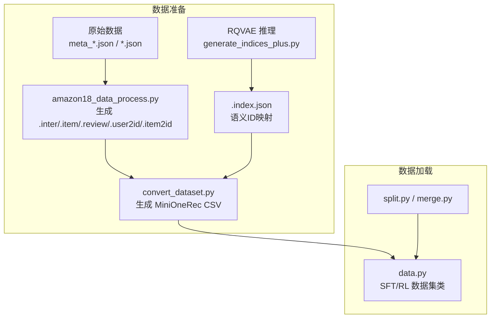
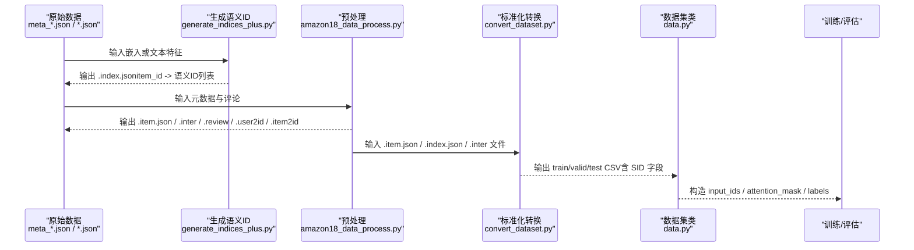
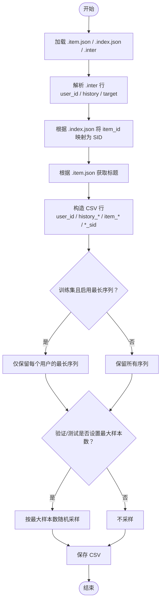
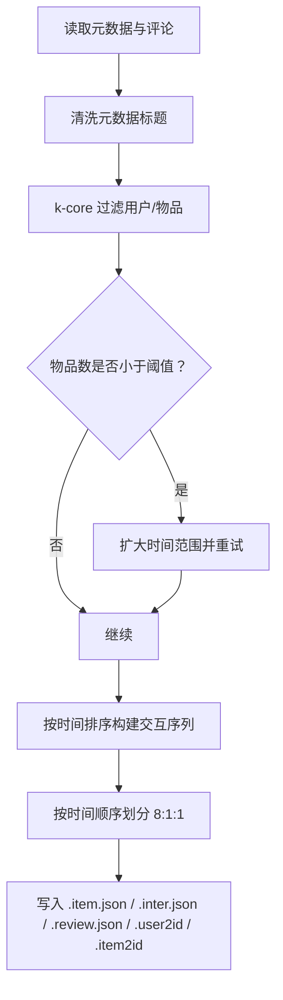
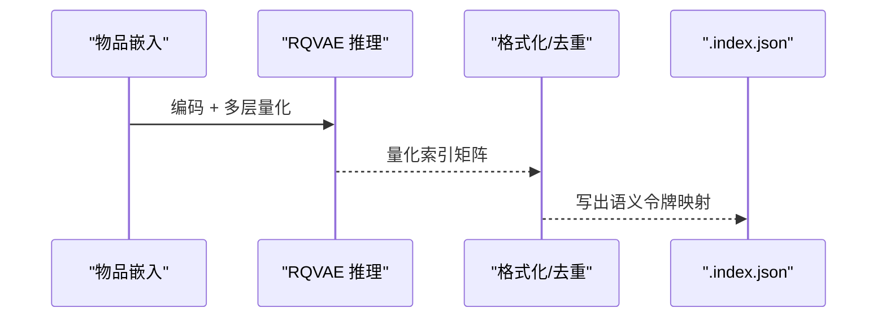
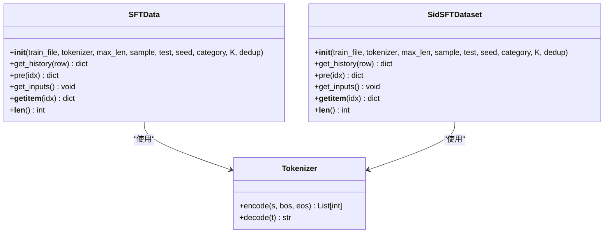
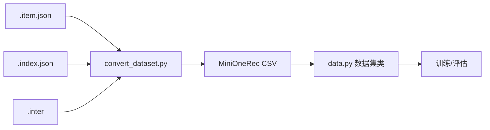

# 数据处理

<cite>
**本文引用的文件**
- [convert_dataset.py](file://convert_dataset.py)
- [convert_dataset.sh](file://convert_dataset.sh)
- [data.py](file://data.py)
- [data/process.py](file://data/process.py)
- [data/amazon18_data_process.py](file://data/amazon18_data_process.py)
- [data/amazon18_data_process.sh](file://data/amazon18_data_process.sh)
- [split.py](file://split.py)
- [merge.py](file://merge.py)
- [rq/generate_indices.py](file://rq/generate_indices.py)
- [rq/generate_indices_plus.py](file://rq/generate_indices_plus.py)
</cite>

## 目录
1. [简介](#简介)
2. [项目结构](#项目结构)
3. [核心组件](#核心组件)
4. [架构总览](#架构总览)
5. [详细组件分析](#详细组件分析)
6. [依赖关系分析](#依赖关系分析)
7. [性能考量](#性能考量)
8. [故障排查指南](#故障排查指南)
9. [结论](#结论)
10. [附录](#附录)

## 简介
本文件系统性阐述本仓库的数据处理机制，覆盖以下方面：
- 数据格式定义：从 Amazon 原始交互数据到模型可用的标准化 CSV 格式，以及语义 ID（SID）映射与序列化方式。
- 预处理流程与转换逻辑：如何将交互序列、标题、评分等字段清洗、映射并序列化为训练样本。
- 数据管道：在 SFT 和 RL 训练中如何通过数据集类构造批处理样本，特别是序列化用户行为数据的构造方式。
- 数据增强与采样：当前实现中的采样与去重策略。
- 训练/验证集划分：基于时间顺序的划分方法与采样限制。
- 示例与调试建议：如何快速验证数据格式与适配自定义数据集。

## 项目结构
围绕数据处理的关键目录与文件如下：
- 数据准备与转换
  - 原始 Amazon 数据预处理：data/amazon18_data_process.py 及其脚本 data/amazon18_data_process.sh
  - 语义 ID 生成：rq/generate_indices.py、rq/generate_indices_plus.py
  - 标准化转换：convert_dataset.py 及其脚本 convert_dataset.sh
- 数据加载与序列化
  - 数据集类与序列化：data.py
  - 分割与合并工具：split.py、merge.py
- 辅助脚本
  - data/process.py 提供另一种预处理流程（与 amazon18_data_process.py 类似但略有差异）

图表来源
- [data/amazon18_data_process.py](file://data/amazon18_data_process.py#L1-L574)
- [rq/generate_indices_plus.py](file://rq/generate_indices_plus.py#L1-L188)
- [convert_dataset.py](file://convert_dataset.py#L1-L234)
- [data.py](file://data.py#L1-L800)
- [split.py](file://split.py#L1-L22)
- [merge.py](file://merge.py#L1-L19)

章节来源
- [data/amazon18_data_process.py](file://data/amazon18_data_process.py#L1-L574)
- [rq/generate_indices_plus.py](file://rq/generate_indices_plus.py#L1-L188)
- [convert_dataset.py](file://convert_dataset.py#L1-L234)
- [data.py](file://data.py#L1-L800)
- [split.py](file://split.py#L1-L22)
- [merge.py](file://merge.py#L1-L19)

## 核心组件
- 语义 ID 生成器：使用 RQVAE 将嵌入编码为多层语义令牌，并输出 .index.json 映射文件。
- 原始数据预处理：按时间窗口与 k-core 过滤，生成交互序列（滑动窗口），并输出 .inter/.item/.review 等文件。
- 标准化转换：将上述文件转换为 MiniOneRec 的 CSV 格式，包含用户 ID、历史标题/ID、目标标题/ID、历史 SID、目标 SID 等字段。
- 数据集类：SFT/RL 数据集类负责将 CSV 行解析为模型输入张量（input_ids、attention_mask、labels），支持标题与 SID 两种序列化路径。
- 分割与合并：split.py 按 GPU 列表切分 CSV，merge.py 合并 JSON 结果。

章节来源
- [rq/generate_indices_plus.py](file://rq/generate_indices_plus.py#L1-L188)
- [data/amazon18_data_process.py](file://data/amazon18_data_process.py#L1-L574)
- [convert_dataset.py](file://convert_dataset.py#L1-L234)
- [data.py](file://data.py#L1-L800)
- [split.py](file://split.py#L1-L22)
- [merge.py](file://merge.py#L1-L19)

## 架构总览
下图展示从原始数据到模型输入的整体流程。

图表来源
- [rq/generate_indices_plus.py](file://rq/generate_indices_plus.py#L1-L188)
- [data/amazon18_data_process.py](file://data/amazon18_data_process.py#L1-L574)
- [convert_dataset.py](file://convert_dataset.py#L1-L234)
- [data.py](file://data.py#L1-L800)

## 详细组件分析

### 组件A：convert_dataset.py（标准化转换）
- 功能概述
  - 加载 .item.json（物品元数据）、.index.json（item_id -> 语义ID列表）、.inter（交互序列）。
  - 将交互序列转换为 MiniOneRec CSV，包含 user_id、history_item_title、item_title、history_item_id、item_id、history_item_sid、item_sid 等字段。
  - 支持仅保留每个用户最长序列（训练集）与对验证/测试集进行最大样本数采样。
- 关键步骤
  - 读取并解析 .inter 文件（跳过表头），按行拆分为 user_id、history_item_ids、target_item_id。
  - 使用 .index.json 将 item_id 转换为语义 ID（保留括号），并用 .item.json 获取标题。
  - 构造 CSV 行并保存到对应 split 目录。
  - 训练集可选择仅保留最长序列以减少冗余。
- 序列化与字段
  - 用户 ID：前缀 A 并转为字符串。
  - 历史与目标：同时提供原始 item_id 与语义 ID（SID），便于标题与 SID 两条路径训练。
  - 标题：历史与目标均保留原始标题，用于标题路径训练。
- 参数与控制
  - --keep_longest_only：训练集仅保留最长序列。
  - --max_valid_samples / --max_test_samples：限制验证/测试样本数量。
  - --seed：随机采样种子。
- 调试建议
  - 检查 .index.json 是否存在目标 item_id 的映射；若缺失则该样本会被跳过。
  - 若训练集仅保留最长序列，确认 user_to_longest 的字典大小与唯一用户数一致。

图表来源
- [convert_dataset.py](file://convert_dataset.py#L1-L234)

章节来源
- [convert_dataset.py](file://convert_dataset.py#L1-L234)
- [convert_dataset.sh](file://convert_dataset.sh#L1-L24)

### 组件B：data/amazon18_data_process.py（原始数据预处理）
- 功能概述
  - 读取元数据与评论，执行 k-core 过滤（用户/物品最小交互数），按时间窗口过滤。
  - 将评论转换为交互序列（滑动窗口，最大历史长度 10），并按时间顺序划分训练/验证/测试（8:1:1）。
  - 生成 .item.json（标题、描述、品牌、分类等）、.inter.json、.review.json、.user2id、.item2id 等文件。
- 关键步骤
  - 元数据清洗：去除无效标题、HTML 标签、实体解码、多余空白。
  - k-core 递归过滤：迭代移除低频用户/物品，必要时扩大时间范围。
  - 生成交互序列：按时间排序，滑窗构造历史与目标项。
  - 时间划分：按时间戳排序后按比例切分。
- 数据格式要点
  - .inter 文件字段：user_id、item_id_list（history）、item_id（target）。
  - .item.json 字段：title、description、brand、categories。
  - .review.json 字段：review、summary。
- 参数与控制
  - --user_k / --item_k：k-core 阈值。
  - --st_year / --st_month / --ed_year / --ed_month：时间窗口。
  - 输出目录：--output_path。

图表来源
- [data/amazon18_data_process.py](file://data/amazon18_data_process.py#L1-L574)

章节来源
- [data/amazon18_data_process.py](file://data/amazon18_data_process.py#L1-L574)
- [data/amazon18_data_process.sh](file://data/amazon18_data_process.sh#L1-L10)

### 组件C：rq/generate_indices.py / generate_indices_plus.py（语义 ID 生成）
- 功能概述
  - 使用训练好的 RQVAE 模型对物品嵌入进行推理，得到多层级量化索引，再格式化为语义令牌（如 <a_1>, <b_2>, <c_3>）。
  - generate_indices_plus.py 在此基础上增加去重与碰撞处理，确保 SID 唯一性。
- 输出
  - .index.json：item_id -> 语义令牌列表（多层）。
- 使用建议
  - 确保 e_dim 与输入维度匹配，num_emb_list 与模型配置一致。
  - 若出现碰撞，使用 generate_indices_plus.py 的去重逻辑重新生成。

图表来源
- [rq/generate_indices_plus.py](file://rq/generate_indices_plus.py#L1-L188)
- [rq/generate_indices.py](file://rq/generate_indices.py#L1-L151)

章节来源
- [rq/generate_indices_plus.py](file://rq/generate_indices_plus.py#L1-L188)
- [rq/generate_indices.py](file://rq/generate_indices.py#L1-L151)

### 组件D：data.py（数据管道与序列化）
- 功能概述
  - 定义多种数据集类：SFT/RL/评估等，统一将 CSV 行解析为模型输入张量。
  - 支持标题与 SID 两条序列化路径：历史标题/目标标题 或 历史 SID/目标 SID。
  - 构造 prompt + history + completion 的格式，生成 input_ids、attention_mask、labels。
- 关键逻辑
  - 解析 CSV：eval 读取字符串化的列表字段（history_item_title、history_item_sid 等）。
  - 标题路径：将历史标题拼接为自然语言提示，目标标题作为 completion。
  - SID 路径：将历史 SID 拼接为逗号分隔字符串，目标 SID 作为 completion。
  - 截断与填充：按 max_len 截断右侧，保持张量长度一致。
  - 标签构造：golden_tokens 前面的 -100 表示忽略，仅对目标部分计算损失。
- 训练/评估差异
  - 测试模式仅返回 input_ids 与 attention_mask。
  - 训练模式返回 input_ids、attention_mask、labels。

图表来源
- [data.py](file://data.py#L1-L800)

章节来源
- [data.py](file://data.py#L1-L800)

### 组件E：split.py / merge.py（分割与合并）
- 功能概述
  - split.py：将 CSV 按 GPU 列表切分为多个子文件，便于分布式训练。
  - merge.py：将多个 JSON 结果合并为单个 JSON 文件。
- 使用场景
  - 训练前将大文件切分，训练后将结果合并回单文件。

章节来源
- [split.py](file://split.py#L1-L22)
- [merge.py](file://merge.py#L1-L19)

## 依赖关系分析
- convert_dataset.py 依赖：
  - .item.json：物品标题等元数据。
  - .index.json：item_id -> 语义令牌列表。
  - .inter：交互序列（user_id、history、target）。
- data.py 依赖：
  - CSV 文件：包含 history_item_title、item_title、history_item_id、item_id、history_item_sid、item_sid 等字段。
  - 分词器：Tokenizer 对文本进行编码与解码。
- 预处理与 SID 生成：
  - amazon18_data_process.py 产出 .item.json、.inter.json、.review.json、.user2id、.item2id。
  - generate_indices_plus.py 产出 .index.json。

图表来源
- [convert_dataset.py](file://convert_dataset.py#L1-L234)
- [data.py](file://data.py#L1-L800)

章节来源
- [convert_dataset.py](file://convert_dataset.py#L1-L234)
- [data.py](file://data.py#L1-L800)

## 性能考量
- 数据规模与内存
  - 预处理阶段需加载元数据与评论，建议在磁盘空间充足的情况下运行，避免频繁 IO。
  - k-core 过滤可能需要多次迭代，注意日志密度与时间开销。
- 序列长度与截断
  - data.py 中对 input_ids/attention_mask/labels 均按 max_len 截断右侧，确保批内张量尺寸一致。
- 采样与去重
  - convert_dataset.py 支持对验证/测试集进行最大样本数采样，降低评估成本。
  - 训练集可仅保留最长序列，减少冗余样本。
- 分布式训练
  - split.py 将 CSV 切分为多份，merge.py 合并结果，适合多 GPU/节点并行。

[本节为通用指导，无需特定文件来源]

## 故障排查指南
- 问题：convert_dataset.py 报告“未找到目标 item_id 的语义 ID”
  - 检查 .index.json 是否包含目标 item_id；若缺失，该样本会被跳过。
  - 确认 .inter 中的 item_id 与 .index.json 的键一致（类型与数值）。
- 问题：训练集样本数异常
  - 若启用“仅保留最长序列”，确认 user_to_longest 的字典大小与唯一用户数一致。
  - 若设置了 max_valid_samples/max_test_samples，请检查采样后的样本数。
- 问题：data.py 解析历史字段报错
  - 确认 CSV 中 history_item_title/history_item_sid 等字段为字符串化的列表形式，data.py 使用 eval 进行解析。
- 问题：SID 路径训练失败
  - 确认 .index.json 已正确生成，且 item_id 与 .item.json 的键一致。
  - 若出现碰撞，使用 generate_indices_plus.py 的去重逻辑重新生成 .index.json。
- 问题：GPU 切分/合并失败
  - 确认 split.py 的 cuda_list 与实际 GPU 数一致。
  - 合并时检查输入路径与文件名格式。

章节来源
- [convert_dataset.py](file://convert_dataset.py#L1-L234)
- [rq/generate_indices_plus.py](file://rq/generate_indices_plus.py#L1-L188)
- [data.py](file://data.py#L1-L800)
- [split.py](file://split.py#L1-L22)
- [merge.py](file://merge.py#L1-L19)

## 结论
本仓库提供了从原始 Amazon 数据到模型输入的完整数据管线：先通过 k-core 与时间窗口过滤生成高质量交互序列，再利用 RQVAE 生成语义 ID，最终将数据转换为 MiniOneRec 标准格式。数据集类统一了标题与 SID 两条序列化路径，并在 SFT/RL 训练中高效构造批处理样本。通过采样、去重与切分/合并工具，可灵活适配不同规模与硬件条件下的训练需求。

[本节为总结，无需特定文件来源]

## 附录

### 数据格式定义与示例
- CSV 字段（MiniOneRec 标准）
  - user_id：用户标识（字符串，前缀 A）。
  - history_item_title：历史物品标题列表（字符串化列表）。
  - item_title：目标物品标题（字符串）。
  - history_item_id：历史物品原始 ID 列表（字符串化列表）。
  - item_id：目标物品原始 ID（字符串）。
  - history_item_sid：历史物品语义 ID 列表（字符串化列表）。
  - item_sid：目标物品语义 ID（字符串）。
- 示例（字段含义）
  - user_id：A1234567890
  - history_item_title：["Book A","Book B","Book C"]
  - item_title：Book D
  - history_item_id：["I001","I002","I003"]
  - item_id：I004
  - history_item_sid：["<a_1><b_2><c_3>","<a_2><b_3><c_4>","<a_3><b_4><c_5>"]
  - item_sid：<a_4><b_5><c_6>

章节来源
- [convert_dataset.py](file://convert_dataset.py#L1-L234)
- [data.py](file://data.py#L1-L800)

### 训练/验证集划分方法
- 时间顺序划分
  - 原始数据按时间戳排序后，按 8:1:1 划分为训练/验证/测试。
  - 该方法由 data/amazon18_data_process.py 实现。
- 采样限制
  - convert_dataset.py 支持对验证/测试集设置最大样本数并随机采样，降低评估成本。
- 切分与合并
  - split.py：将 CSV 按 GPU 列表切分为多个子文件。
  - merge.py：将多个 JSON 结果合并为单个 JSON 文件。

章节来源
- [data/amazon18_data_process.py](file://data/amazon18_data_process.py#L1-L574)
- [convert_dataset.py](file://convert_dataset.py#L1-L234)
- [split.py](file://split.py#L1-L22)
- [merge.py](file://merge.py#L1-L19)

### 数据增强策略
- 当前实现未显式引入数据增强（如随机替换、插入、删除等）。
- 可选策略（建议）
  - 文本侧：对历史标题进行随机扰动（如同义词替换、拼写错误模拟）。
  - 序列侧：对历史序列进行随机裁剪或打乱（需谨慎，避免破坏时间顺序）。
  - SID 侧：对语义令牌进行随机替换（需保证语义一致性）。
- 注意事项
  - 增强策略应与下游任务一致（标题预测 vs SID 预测）。
  - 增强后需保持 labels 与 input_ids 的对齐。

[本节为概念性建议，无需特定文件来源]

### 自定义数据集适配指南
- 准备文件
  - .item.json：包含 title、description、brand、categories 等字段。
  - .index.json：item_id -> 语义令牌列表。
  - .inter：表头 user_id:token\titem_id_list:token_seq\titem_id:token，后续每行三列。
- 转换步骤
  - 使用 convert_dataset.py 将上述文件转换为 MiniOneRec CSV。
  - 确保 .inter 中的 item_id 与 .index.json 的键一致。
- 训练参数
  - 在 data.py 中指定 max_len、category、seed 等参数。
  - 如需仅保留最长序列，启用 --keep_longest_only。
  - 如需限制验证/测试样本数，设置 --max_valid_samples/--max_test_samples。

章节来源
- [convert_dataset.py](file://convert_dataset.py#L1-L234)
- [data.py](file://data.py#L1-L800)