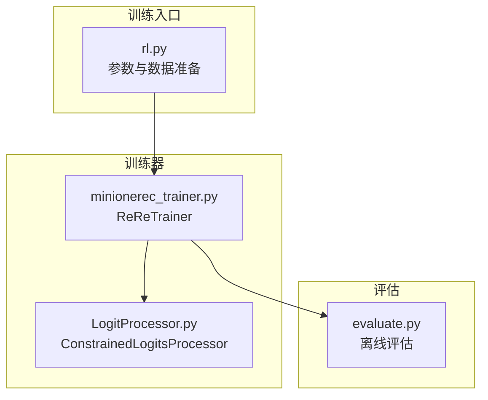
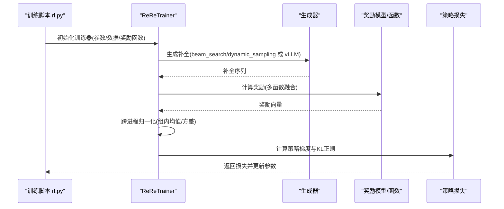
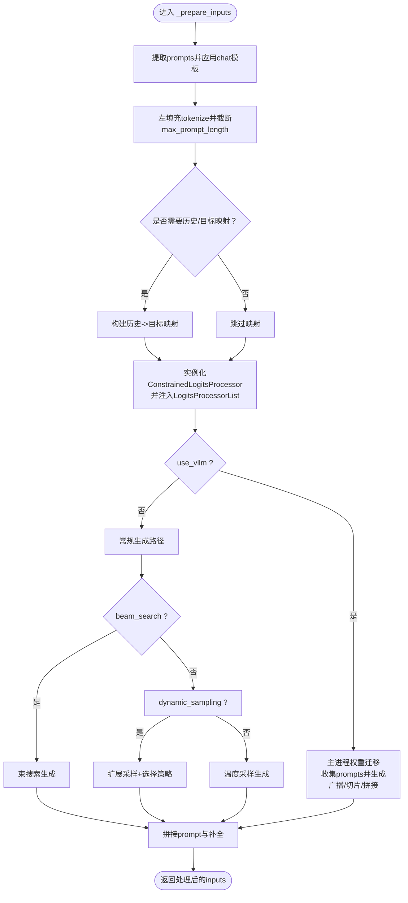
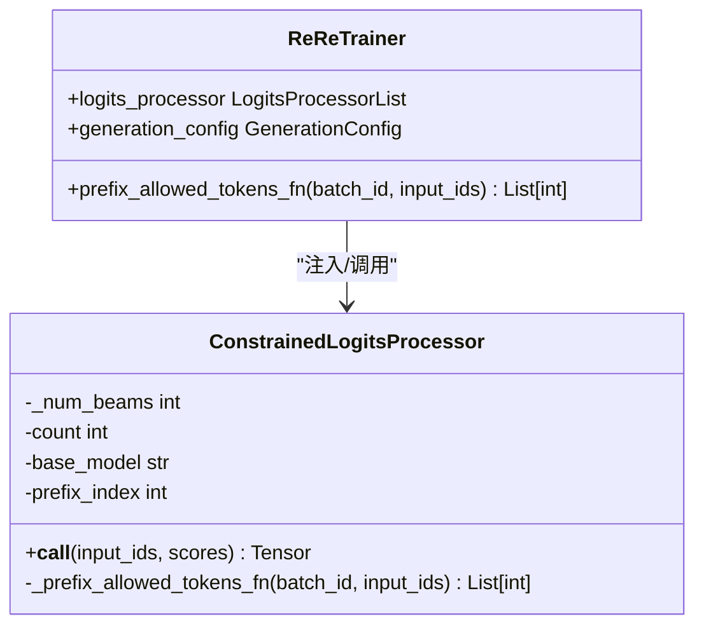
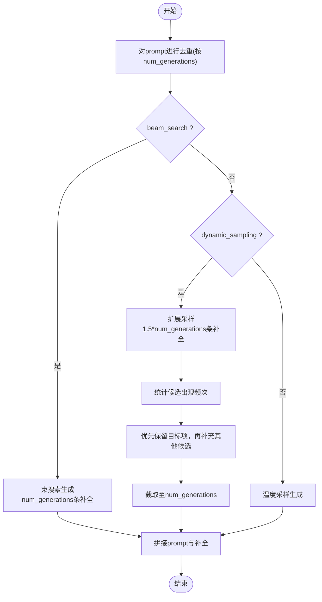
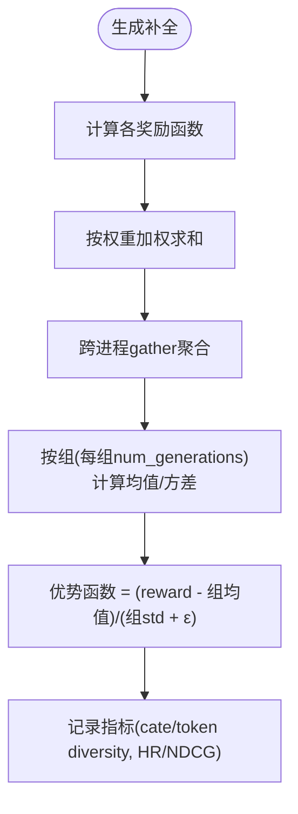
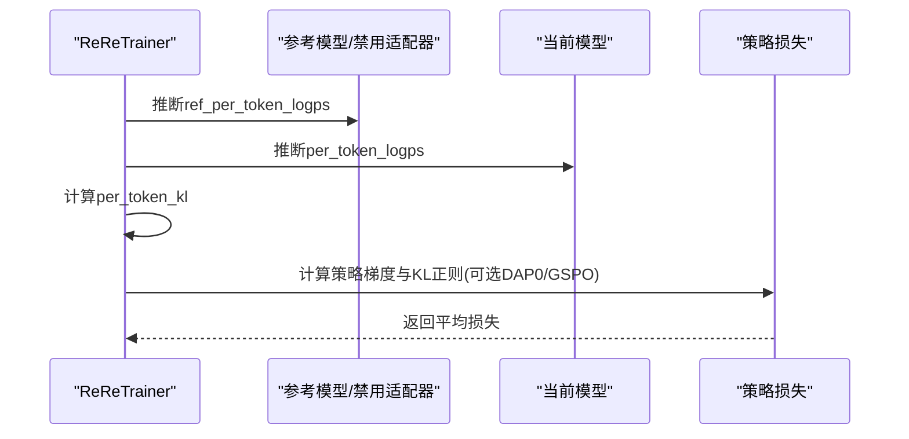
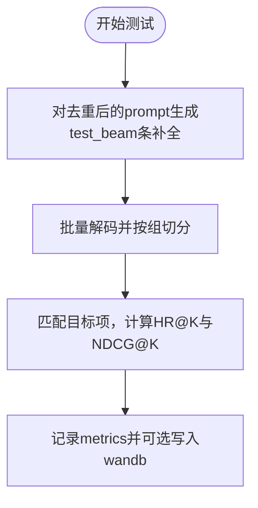
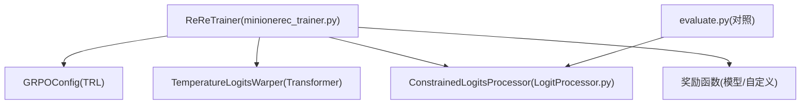

# GRPO-based训练器工作原理

<cite>
**本文引用的文件**
- [minionerec_trainer.py](file://minionerec_trainer.py)
- [LogitProcessor.py](file://LogitProcessor.py)
- [rl.py](file://rl.py)
- [evaluate.py](file://evaluate.py)
</cite>

## 目录
1. [简介](#简介)
2. [项目结构](#项目结构)
3. [核心组件](#核心组件)
4. [架构总览](#架构总览)
5. [详细组件分析](#详细组件分析)
6. [依赖关系分析](#依赖关系分析)
7. [性能考量](#性能考量)
8. [故障排查指南](#故障排查指南)
9. [结论](#结论)
10. [附录](#附录)

## 简介
本文件面向“生成式推荐专用”的GRPO（Generative Reward Policy Optimization）训练器，系统性解析minionerec_trainer.py中实现的训练机制。重点覆盖：
- 输入预处理与批处理：_prepare_inputs中提示词批处理、历史记录与目标项映射、ConstrainedLogitsProcessor动态注入。
- 生成阶段：TemperatureLogitsWarper与约束解码器协同实现可控文本生成；非vLLM模式下beam_search与dynamic_sampling两种策略差异及对多样性的潜在影响。
- 奖励计算：多reward_funcs（如NDCG、HR等）融合、跨进程归一化、优势函数计算。
- 策略梯度更新：ref_per_token_logps推断与KL正则化、DAP0/GSPO变体。
- 实时评估：test_during_training机制与多奖励信号融合、生成多样性控制的配置建议。

## 项目结构
该仓库围绕“生成式推荐”构建，训练入口由rl.py驱动，训练器ReReTrainer位于minionerec_trainer.py，核心约束解码逻辑由LogitProcessor.py提供，评估流程参考evaluate.py。

图表来源
- [rl.py](file://rl.py#L288-L308)
- [minionerec_trainer.py](file://minionerec_trainer.py#L121-L200)
- [LogitProcessor.py](file://LogitProcessor.py#L23-L63)
- [evaluate.py](file://evaluate.py#L168-L202)

章节来源
- [rl.py](file://rl.py#L288-L308)
- [minionerec_trainer.py](file://minionerec_trainer.py#L121-L200)

## 核心组件
- ReReTrainer：基于Transformers Trainer扩展的GRPO训练器，负责数据预处理、生成、奖励计算、优势函数归一化、策略梯度损失计算与日志记录。
- ConstrainedLogitsProcessor：自定义LogitsProcessor，按历史前缀动态限制候选token集合，实现推荐场景下的“可约束生成”。
- 采样与生成策略：beam_search与dynamic_sampling两种路径，分别对应确定性束搜索与“扩展采样+选择”的多样性增强策略。
- 奖励函数：支持模型型奖励（如序列分类器）与自定义函数（如规则、NDCG、语义相似度、协同过滤打分），并进行加权融合与跨进程归一化。

章节来源
- [minionerec_trainer.py](file://minionerec_trainer.py#L121-L200)
- [LogitProcessor.py](file://LogitProcessor.py#L23-L63)
- [rl.py](file://rl.py#L249-L287)

## 架构总览
GRPO在生成式推荐中的关键流程：
- 数据准备：从数据集读取prompt，必要时映射历史到目标项，构造chat模板。
- 生成：根据配置选择vLLM或常规生成；在常规生成路径中，注入TemperatureLogitsWarper与ConstrainedLogitsProcessor。
- 奖励：对每条生成补全计算多奖励信号，跨进程聚合后按组均值与方差归一化得到优势函数。
- 更新：基于策略梯度与KL正则（beta系数），可选DAP0或GSPO变体。

图表来源
- [rl.py](file://rl.py#L288-L308)
- [minionerec_trainer.py](file://minionerec_trainer.py#L472-L523)
- [minionerec_trainer.py](file://minionerec_trainer.py#L928-L975)
- [minionerec_trainer.py](file://minionerec_trainer.py#L1028-L1067)

## 详细组件分析

### 输入预处理与批处理：_prepare_inputs
- 提示词批处理与裁剪：从原始样本提取prompt，应用chat模板与左填充tokenization，按max_prompt_length截断。
- 历史与目标映射：当启用add_gt/test_during_training/dynamic_sampling时，从prompt2history/history2target字典映射历史与目标项，统计类别数用于后续指标计算。
- 约束解码器注入：实例化ConstrainedLogitsProcessor，绑定prefix_allowed_tokens_fn，设置num_beams；与TemperatureLogitsWarper组合形成LogitsProcessorList，用于生成阶段动态限制候选token集合。
- 生成路径选择：若use_vllm为真，则通过主进程权重迁移、全局prompt收集、广播回本地切片、pad拼接prompt与补全；否则在常规生成路径中按beam_search或dynamic_sampling分支执行。

图表来源
- [minionerec_trainer.py](file://minionerec_trainer.py#L659-L721)
- [minionerec_trainer.py](file://minionerec_trainer.py#L722-L850)
- [minionerec_trainer.py](file://minionerec_trainer.py#L851-L870)
- [minionerec_trainer.py](file://minionerec_trainer.py#L871-L890)

章节来源
- [minionerec_trainer.py](file://minionerec_trainer.py#L659-L890)

### 生成阶段：TemperatureLogitsWarper与约束解码器
- TemperatureLogitsWarper：通过温度参数调节softmax分布，提高或降低采样多样性。
- ConstrainedLogitsProcessor：基于prefix_allowed_tokens_fn，按当前历史前缀动态生成允许的token集合，避免非法或不相关补全，提升推荐质量与一致性。
- 组合策略：两者共同构成LogitsProcessorList，在生成阶段逐步施加温度扰动与前缀约束。

图表来源
- [LogitProcessor.py](file://LogitProcessor.py#L23-L63)
- [minionerec_trainer.py](file://minionerec_trainer.py#L683-L693)

章节来源
- [LogitProcessor.py](file://LogitProcessor.py#L23-L63)
- [minionerec_trainer.py](file://minionerec_trainer.py#L683-L693)

### 非vLLM模式下的两种生成策略
- 束搜索（beam_search）
  - 使用GenerationConfig(num_beams=num_generations, num_return_sequences=num_generations)，对每个去重后的prompt生成num_generations条补全。
  - 优点：确定性高、稳定性好；缺点：多样性较低。
- 动态采样（dynamic_sampling）
  - 先对每个prompt扩展生成1.5*num_generations条补全，统计各候选出现频次，优先保留目标项，再补充其他候选，最终截取至num_generations。
  - 优点：在保证目标命中率的同时提升多样性；缺点：额外的统计与筛选开销。

图表来源
- [minionerec_trainer.py](file://minionerec_trainer.py#L772-L804)
- [minionerec_trainer.py](file://minionerec_trainer.py#L800-L844)

章节来源
- [minionerec_trainer.py](file://minionerec_trainer.py#L772-L844)

### 奖励计算与优势函数
- 多奖励函数融合：支持模型型奖励（如序列分类器）与自定义函数（如规则、NDCG、语义相似度、协同过滤打分）。对每个补全计算各奖励函数输出，按reward_weights加权求和。
- 跨进程归一化：使用gather将所有进程的奖励向量聚合，按组（每组num_generations条补全）计算均值与标准差，优势函数为(reward - 组均值)/(组标准差 + ε)。
- 指标记录：记录categorical_diversity与token_diversity，以及test_during_training开启时的HR@K与NDCG@K。

图表来源
- [minionerec_trainer.py](file://minionerec_trainer.py#L928-L975)
- [minionerec_trainer.py](file://minionerec_trainer.py#L948-L972)
- [minionerec_trainer.py](file://minionerec_trainer.py#L978-L1001)

章节来源
- [minionerec_trainer.py](file://minionerec_trainer.py#L928-L1001)

### ref_per_token_logps推断与策略梯度更新
- ref_per_token_logps推断：在推理模式下，对拼接后的prompt_completion_ids计算每token对数概率，作为参考分布（reference）。
- 策略梯度损失：计算per_token_logps与ref_per_token_logps的KL，得到per_token_kl；优势函数advantages与KL共同决定每token损失；支持DAP0与GSPO两种变体，后者引入序列级重要性分数与序列KL。
- 日志与收敛：记录completion_length与KL，便于监控训练稳定性。

图表来源
- [minionerec_trainer.py](file://minionerec_trainer.py#L889-L900)
- [minionerec_trainer.py](file://minionerec_trainer.py#L1028-L1067)

章节来源
- [minionerec_trainer.py](file://minionerec_trainer.py#L889-L900)
- [minionerec_trainer.py](file://minionerec_trainer.py#L1028-L1067)

### test_during_training机制与实时性能监控
- dedup逻辑：对每个prompt仅保留一份用于测试，避免重复计算。
- 评测指标：对每组补全计算HR@K与NDCG@K，统计平均值并记录到metrics。
- 可视化：当log_completions开启且满足logging_steps时，将prompt、completion与reward写入wandb表格。

图表来源
- [minionerec_trainer.py](file://minionerec_trainer.py#L729-L770)
- [minionerec_trainer.py](file://minionerec_trainer.py#L993-L1001)

章节来源
- [minionerec_trainer.py](file://minionerec_trainer.py#L729-L770)
- [minionerec_trainer.py](file://minionerec_trainer.py#L993-L1001)

## 依赖关系分析
- ReReTrainer依赖：
  - Transformers: GenerationConfig、LogitsProcessorList、TemperatureLogitsWarper、AutoModelForCausalLM/AutoTokenizer。
  - TRL: GRPOConfig、SyncRefModelCallback、apply_chat_template、unwrap_model_for_generation。
  - 自定义模块：LogitProcessor.ConstrainedLogitsProcessor。
- 评估与对照：evaluate.py展示了独立的ConstrainedLogitsProcessor使用方式，便于离线验证生成质量。

图表来源
- [minionerec_trainer.py](file://minionerec_trainer.py#L1-L120)
- [LogitProcessor.py](file://LogitProcessor.py#L1-L30)
- [evaluate.py](file://evaluate.py#L168-L202)

章节来源
- [minionerec_trainer.py](file://minionerec_trainer.py#L1-L120)
- [LogitProcessor.py](file://LogitProcessor.py#L1-L30)
- [evaluate.py](file://evaluate.py#L168-L202)

## 性能考量
- vLLM路径：主进程加载权重、启用前缀缓存、单次批量生成，适合大规模并行生成；需注意设备分配与内存占用。
- 常规生成路径：beam_search确定性强但多样性低；dynamic_sampling在多样性与目标命中间折衷，但增加统计与筛选成本。
- 跨进程奖励聚合：使用gather确保奖励归一化正确性，但会带来通信开销；num_generations需与全局batch大小整除，避免数据错位。
- KL正则与beta：适当增大beta可抑制策略漂移，但可能降低探索；可通过DAP0/GSPO变体平衡稳定性与性能。

[本节为通用指导，无需列出具体文件来源]

## 故障排查指南
- num_generations与全局batch不整除：抛出异常，检查per_device_train/eval_batch_size与num_processes。
- vLLM设备冲突：若请求设备被训练占用或显存不足，需调整num_processes或vllm_device。
- 无PEFT时参考模型同步：若启用sync_ref_model，确保DeepSpeed或accelerate正确准备参考模型。
- 测试期间HR/NDCG异常：确认prompt2history/history2target映射完整，目标项清洗与strip一致。

章节来源
- [minionerec_trainer.py](file://minionerec_trainer.py#L393-L411)
- [minionerec_trainer.py](file://minionerec_trainer.py#L418-L478)
- [minionerec_trainer.py](file://minionerec_trainer.py#L516-L523)

## 结论
该训练器将GRPO推广到生成式推荐任务，通过：
- 在输入预处理阶段完成提示词批处理、历史-目标映射与约束解码器注入；
- 在生成阶段结合温度采样与前缀约束，支持beam_search与dynamic_sampling两种策略；
- 在奖励计算阶段融合多信号并通过跨进程归一化稳定优势估计；
- 在策略更新阶段利用ref_per_token_logps与KL正则，提供DAP0/GSPO变体；
- 在训练过程中通过test_during_training实现实时性能监控与可视化。

[本节为总结，无需列出具体文件来源]

## 附录

### 配置与参数建议（基于代码行为）
- 生成策略
  - beam_search：追求确定性与稳定性，适合对多样性要求不高的场景。
  - dynamic_sampling：在多样性与目标命中之间取得平衡，适合需要提升推荐多样性的场景。
- 温度与长度惩罚
  - temperature：控制采样多样性；过高导致分散，过低导致保守。
  - length_penalty：控制生成长度偏好，避免过短或过长。
- 奖励函数与权重
  - 支持多奖励函数融合，reward_weights可按需调整；建议先以单一奖励函数验证，再逐步引入多信号。
- 参考模型与同步
  - 若启用sync_ref_model，确保参考模型与主模型状态一致；在PEFT场景下可禁用参考模型。
- vLLM使用
  - 合理设置vllm_device与gpu_memory_utilization，避免与训练GPU冲突；启用前缀缓存提升吞吐。
- 实时监控
  - 开启test_during_training可记录HR@K与NDCG@K；开启log_completions可将补全与奖励写入wandb表格，便于复盘。

章节来源
- [minionerec_trainer.py](file://minionerec_trainer.py#L472-L523)
- [minionerec_trainer.py](file://minionerec_trainer.py#L524-L577)
- [minionerec_trainer.py](file://minionerec_trainer.py#L993-L1001)
- [rl.py](file://rl.py#L249-L287)