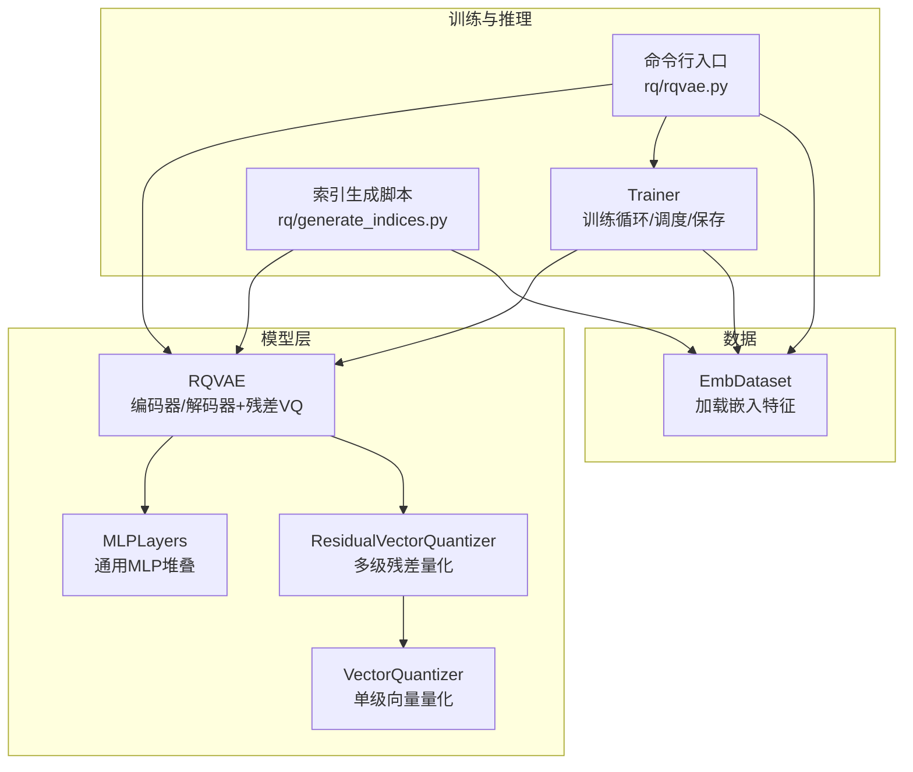
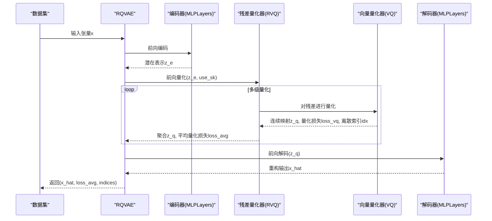
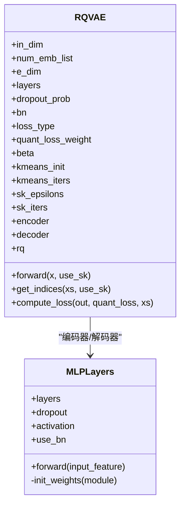
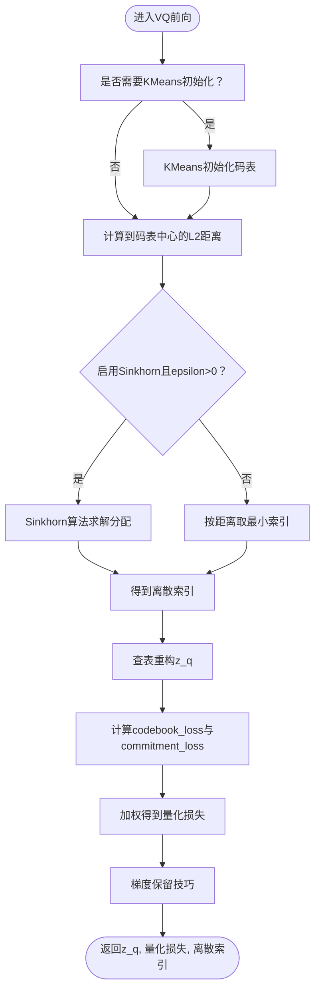
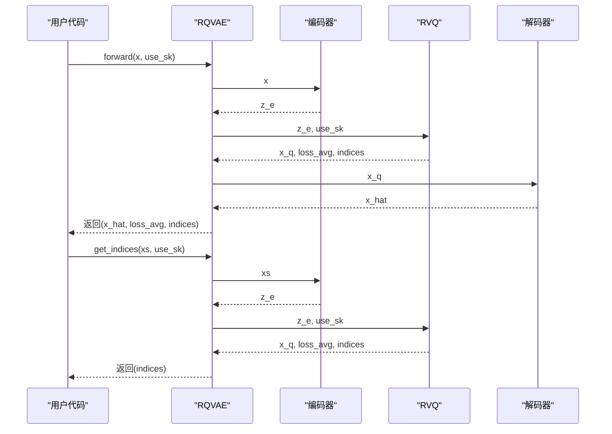
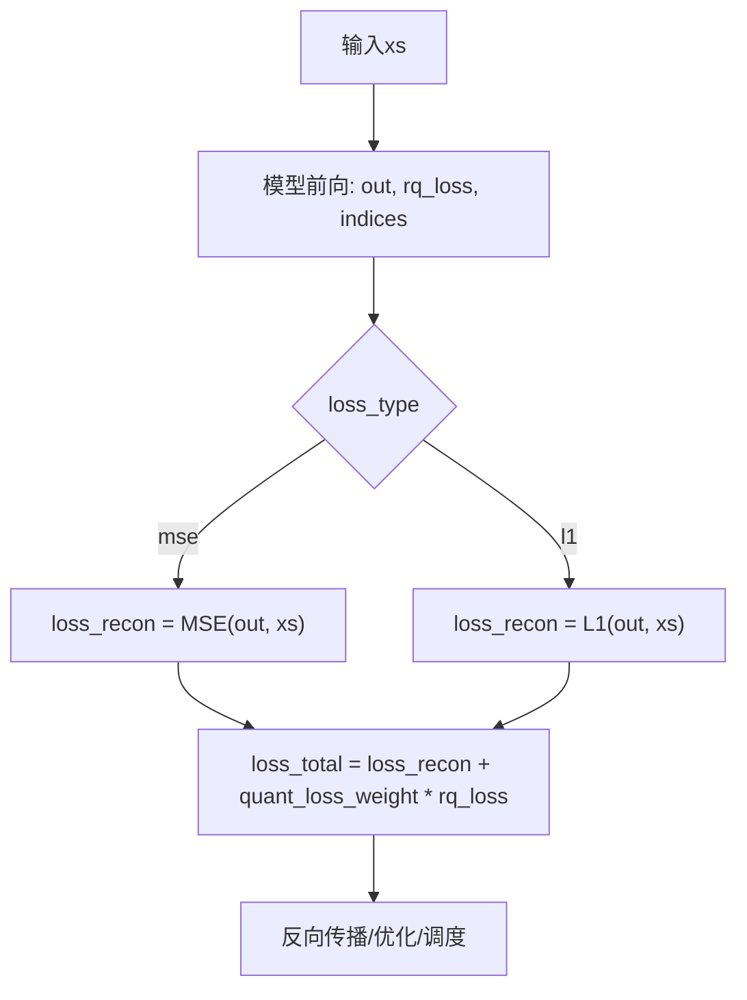
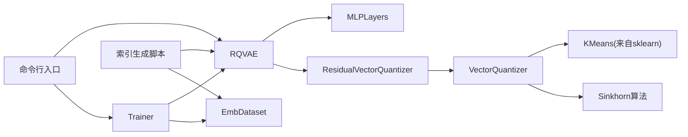

# RQ-VAE模型架构与实现

<cite>
**本文引用的文件**
- [rq/models/rqvae.py](file://rq/models/rqvae.py)
- [rq/models/layers.py](file://rq/models/layers.py)
- [rq/models/rq.py](file://rq/models/rq.py)
- [rq/models/vq.py](file://rq/models/vq.py)
- [rq/datasets.py](file://rq/datasets.py)
- [rq/trainer.py](file://rq/trainer.py)
- [rq/rqvae.py](file://rq/rqvae.py)
- [rq/generate_indices.py](file://rq/generate_indices.py)
</cite>

## 目录
1. [简介](#简介)
2. [项目结构](#项目结构)
3. [核心组件](#核心组件)
4. [架构总览](#架构总览)
5. [详细组件分析](#详细组件分析)
6. [依赖关系分析](#依赖关系分析)
7. [性能考量](#性能考量)
8. [故障排查指南](#故障排查指南)
9. [结论](#结论)
10. [附录](#附录)

## 简介
本文件深入解析MiniOneRec中RQ-VAE（残差量化变分自编码器）的实现机制，围绕其继承自nn.Module的类结构、关键参数配置、编码器与解码器的MLP堆叠结构、前向传播的数据流、离散化语义ID提取流程、重构与量化损失的加权计算，以及高级配置（如kmeans初始化、Sinkhorn算法超参）对训练稳定性与量化效果的影响展开。文档同时给出典型使用场景与性能调优建议，并通过图示帮助读者建立整体认知。

## 项目结构
RQ-VAE相关代码主要位于rq/models目录下，配合数据集加载、训练器与推理脚本共同构成完整的训练与索引生成流水线：
- 模型层：RQVAE、MLPLayers、ResidualVectorQuantizer、VectorQuantizer
- 训练与推理：Trainer、命令行入口、索引生成脚本
- 数据：EmbDataset

图表来源
- [rq/models/rqvae.py](file://rq/models/rqvae.py#L1-L85)
- [rq/models/layers.py](file://rq/models/layers.py#L1-L108)
- [rq/models/rq.py](file://rq/models/rq.py#L1-L56)
- [rq/models/vq.py](file://rq/models/vq.py#L1-L102)
- [rq/trainer.py](file://rq/trainer.py#L1-L256)
- [rq/rqvae.py](file://rq/rqvae.py#L1-L95)
- [rq/generate_indices.py](file://rq/generate_indices.py#L1-L151)
- [rq/datasets.py](file://rq/datasets.py#L1-L40)

章节来源
- [rq/models/rqvae.py](file://rq/models/rqvae.py#L1-L85)
- [rq/models/layers.py](file://rq/models/layers.py#L1-L108)
- [rq/models/rq.py](file://rq/models/rq.py#L1-L56)
- [rq/models/vq.py](file://rq/models/vq.py#L1-L102)
- [rq/trainer.py](file://rq/trainer.py#L1-L256)
- [rq/rqvae.py](file://rq/rqvae.py#L1-L95)
- [rq/generate_indices.py](file://rq/generate_indices.py#L1-L151)
- [rq/datasets.py](file://rq/datasets.py#L1-L40)

## 核心组件
- RQVAE：继承自nn.Module，封装编码器、残差量化器与解码器，提供前向传播、离散化索引提取与损失计算接口。
- MLPLayers：通用MLP堆叠模块，支持dropout、批归一化与激活函数选择。
- ResidualVectorQuantizer：多级残差向量量化器，按顺序对残差逐步量化，输出聚合后的连续表示、平均量化损失与每层离散索引。
- VectorQuantizer：单级向量量化器，支持KMeans初始化、MSE重构与承诺损失、可选Sinkhorn近似匹配。
- Trainer：训练器，负责优化器构建、学习率调度、梯度裁剪、日志与检查点管理。
- EmbDataset：加载预训练文本嵌入作为输入特征。
- 命令行入口与索引生成脚本：提供训练与离线索引生成的端到端流程。

章节来源
- [rq/models/rqvae.py](file://rq/models/rqvae.py#L1-L85)
- [rq/models/layers.py](file://rq/models/layers.py#L1-L108)
- [rq/models/rq.py](file://rq/models/rq.py#L1-L56)
- [rq/models/vq.py](file://rq/models/vq.py#L1-L102)
- [rq/trainer.py](file://rq/trainer.py#L1-L256)
- [rq/datasets.py](file://rq/datasets.py#L1-L40)
- [rq/rqvae.py](file://rq/rqvae.py#L1-L95)
- [rq/generate_indices.py](file://rq/generate_indices.py#L1-L151)

## 架构总览
RQ-VAE采用编码器-残差量化-解码器的端到端结构。编码器将高维特征压缩至潜在空间；残差量化器逐层对残差进行量化，得到离散索引序列；解码器将量化后的潜在表示重构回原空间。训练时通过重构损失与量化损失加权组合，推理时可通过get_indices提取离散语义ID序列。

图表来源
- [rq/models/rqvae.py](file://rq/models/rqvae.py#L61-L66)
- [rq/models/rq.py](file://rq/models/rq.py#L39-L56)
- [rq/models/vq.py](file://rq/models/vq.py#L63-L99)
- [rq/models/layers.py](file://rq/models/layers.py#L42-L43)

## 详细组件分析

### RQVAE类结构与参数配置
- 继承nn.Module：统一PyTorch模块生命周期与设备管理。
- 关键参数与作用
  - in_dim：输入特征维度（例如768维文本嵌入）
  - num_emb_list：每级VQ的码表大小列表，决定离散化层级数与离散符号数量
  - e_dim：每级VQ的嵌入维度，影响潜在空间表达能力
  - layers：编码器/解码器隐藏层维度列表，决定压缩比与容量
  - dropout_prob/bn：正则化与稳定化策略
  - loss_type：重构损失类型（mse/l1）
  - quant_loss_weight：量化损失权重，平衡重构与离散化
  - beta：承诺损失系数，控制量化器对连续输入的约束强度
  - kmeans_init/kmeans_iters：是否使用KMeans初始化码表及迭代次数
  - sk_epsilons/sk_iters：Sinkhorn算法的epsilon与迭代次数，用于近似最优传输分配
- 编码器与解码器
  - 编码器：MLPLayers，输入维度in_dim，逐层压缩到e_dim
  - 解码器：MLPLayers，输入维度e_dim，逐层还原到in_dim
  - 解码器维度与编码器对称（逆序），保证自编码一致性
- 前向传播
  - 先编码，再残差量化，最后解码
  - 返回重构输出、平均量化损失与离散索引矩阵
- 离散化索引提取
  - get_indices仅执行编码+量化，返回每样本每层级的离散索引
- 损失计算
  - compute_loss根据loss_type选择MSE或L1重构损失
  - 总损失=重构损失+quant_loss_weight*量化损失

章节来源
- [rq/models/rqvae.py](file://rq/models/rqvae.py#L10-L85)

### 编码器与解码器的MLPLayers堆叠结构
- 结构组成
  - Dropout -> Linear -> BatchNorm1d(除最后一层外) -> 激活函数(除最后一层外)
  - 权重初始化采用Xavier正态分布，偏置置零
- 维度变换逻辑
  - 编码器：[in_dim] -> [layers[0]] -> ... -> [e_dim]
  - 解码器：[e_dim] -> ... -> [layers[0]] -> [in_dim]
  - 通过encode_layer_dims与decode_layer_dims确保对称性

图表来源
- [rq/models/layers.py](file://rq/models/layers.py#L7-L44)
- [rq/models/rqvae.py](file://rq/models/rqvae.py#L46-L59)

章节来源
- [rq/models/layers.py](file://rq/models/layers.py#L1-L108)
- [rq/models/rqvae.py](file://rq/models/rqvae.py#L46-L59)

### 残差量化器（ResidualVectorQuantizer）与向量量化器（VectorQuantizer）
- ResidualVectorQuantizer
  - 多级串联：对输入x进行逐层残差量化，累计得到x_q，计算所有层的平均量化损失，拼接每层离散索引
  - 参数：n_e_list（每层码表大小）、e_dim、beta、kmeans_init、kmeans_iters、sk_epsilons、sk_iters
- VectorQuantizer
  - 初始化：若未启用KMeans初始化且处于训练阶段，则延迟用KMeans初始化码表
  - 前向：计算到码表中心的L2距离，选择最小距离索引；若启用Sinkhorn且epsilon>0，则用Sinkhorn算法求解最优分配；计算codebook_loss与commitment_loss，二者加权得到最终量化损失；通过梯度保留技巧使量化过程可微
  - get_codebook/get_codebook_entry：访问/构造码表条目

图表来源
- [rq/models/vq.py](file://rq/models/vq.py#L40-L99)
- [rq/models/layers.py](file://rq/models/layers.py#L86-L108)

章节来源
- [rq/models/rq.py](file://rq/models/rq.py#L1-L56)
- [rq/models/vq.py](file://rq/models/vq.py#L1-L102)

### 前向传播数据流与get_indices
- 前向传播
  - 编码器将输入x映射到潜在空间
  - 残差量化器对潜在表示进行多级量化，得到x_q、平均量化损失与离散索引矩阵
  - 解码器将x_q重构回原始空间
- get_indices
  - 仅执行编码+量化，不进行解码，直接返回离散索引矩阵，便于后续生成式任务使用

图表来源
- [rq/models/rqvae.py](file://rq/models/rqvae.py#L61-L72)

章节来源
- [rq/models/rqvae.py](file://rq/models/rqvae.py#L61-L72)

### 损失函数与训练流程
- 重构损失
  - 支持MSE与L1两种范数，由loss_type控制
- 量化损失
  - 由ResidualVectorQuantizer计算各层量化损失的平均值
- 总损失
  - 总损失=重构损失+quant_loss_weight*量化损失
- 训练器Trainer
  - 优化器与学习率调度可选Adam/SGD/Adagrad/RMSprop/AdamW
  - 梯度裁剪防止爆炸
  - 训练/验证循环中记录与保存最佳模型（按损失或碰撞率）

图表来源
- [rq/models/rqvae.py](file://rq/models/rqvae.py#L74-L85)
- [rq/trainer.py](file://rq/trainer.py#L98-L125)

章节来源
- [rq/models/rqvae.py](file://rq/models/rqvae.py#L74-L85)
- [rq/trainer.py](file://rq/trainer.py#L98-L125)

### 高级配置对训练稳定性与量化效果的影响
- kmeans_init与kmeans_iters
  - 在训练初期用KMeans初始化码表，有助于稳定收敛，避免随机初始化导致的发散
- sk_epsilons与sk_iters
  - Sinkhorn算法通过epsilon控制最优传输的“平滑”程度，epsilon过小可能不稳定，过大可能降低离散度；迭代次数影响分配精度
- beta
  - 控制承诺损失权重，增强对连续输入的约束，提升离散化质量但可能影响重构精度
- quant_loss_weight
  - 平衡重构与离散化，过大可能导致欠拟合，过小可能导致过度离散化

章节来源
- [rq/models/vq.py](file://rq/models/vq.py#L1-L102)
- [rq/models/rq.py](file://rq/models/rq.py#L1-L56)
- [rq/models/rqvae.py](file://rq/models/rqvae.py#L10-L45)

### 典型使用场景与性能调优建议
- 将高维商品特征（如768维文本嵌入）压缩为紧凑离散标记序列
  - 使用get_indices提取离散索引，结合prefix等规则生成可读标记，用于后续生成式推荐
- 训练阶段
  - 启用kmeans_init并设置合理kmeans_iters，有助于早期稳定
  - 逐步调整sk_epsilons与sk_iters，观察训练稳定性与碰撞率
  - 适当增大quant_loss_weight以强化离散化，但需监控重构误差
- 推理阶段
  - 可关闭use_sk或调整sk_epsilons以减少冲突，必要时在索引生成脚本中动态调整
  - 使用generate_indices.py批量导出索引，评估碰撞率并进行后处理

章节来源
- [rq/generate_indices.py](file://rq/generate_indices.py#L1-L151)
- [rq/rqvae.py](file://rq/rqvae.py#L1-L95)

## 依赖关系分析
- 模块耦合
  - RQVAE依赖MLPLayers、ResidualVectorQuantizer
  - ResidualVectorQuantizer依赖VectorQuantizer
  - VectorQuantizer依赖KMeans与Sinkhorn算法
  - 训练器Trainer依赖RQVAE与数据集
- 外部依赖
  - PyTorch、NumPy、Scikit-learn（KMeans）、Transformers（学习率调度）

图表来源
- [rq/models/rqvae.py](file://rq/models/rqvae.py#L1-L85)
- [rq/models/layers.py](file://rq/models/layers.py#L1-L108)
- [rq/models/rq.py](file://rq/models/rq.py#L1-L56)
- [rq/models/vq.py](file://rq/models/vq.py#L1-L102)
- [rq/trainer.py](file://rq/trainer.py#L1-L256)
- [rq/rqvae.py](file://rq/rqvae.py#L1-L95)
- [rq/generate_indices.py](file://rq/generate_indices.py#L1-L151)
- [rq/datasets.py](file://rq/datasets.py#L1-L40)

章节来源
- [rq/models/rqvae.py](file://rq/models/rqvae.py#L1-L85)
- [rq/models/layers.py](file://rq/models/layers.py#L1-L108)
- [rq/models/rq.py](file://rq/models/rq.py#L1-L56)
- [rq/models/vq.py](file://rq/models/vq.py#L1-L102)
- [rq/trainer.py](file://rq/trainer.py#L1-L256)
- [rq/rqvae.py](file://rq/rqvae.py#L1-L95)
- [rq/generate_indices.py](file://rq/generate_indices.py#L1-L151)
- [rq/datasets.py](file://rq/datasets.py#L1-L40)

## 性能考量
- 计算复杂度
  - 编码器/解码器MLP：O(B*D_in*D_out)，其中B为批次大小，D为维度
  - VQ：对每个样本计算到码表中心的距离，复杂度O(B*K*e_dim)，K为码表大小
  - Sinkhorn：O(B*K*sk_iters)，受epsilon与迭代次数影响
- 内存占用
  - 主要由码表存储与中间激活张量决定；e_dim与num_emb_list越大，内存越高
- 优化建议
  - 合理设置layers与e_dim，平衡压缩比与表达能力
  - 适度增大batch_size以提升Sinkhorn稳定性
  - 使用BN与dropout缓解过拟合
  - 在GPU上运行并启用pin_memory加速数据加载

## 故障排查指南
- 训练损失为NaN
  - 检查输入嵌入是否存在NaN/Inf，必要时在数据加载阶段清洗
  - 减小学习率或启用梯度裁剪
  - 检查sk_epsilons是否过大导致Sinkhorn数值不稳定
- 碰撞率过高
  - 增大每层码表大小num_emb_list或提高e_dim
  - 调整sk_epsilons使其更接近0（更确定性）或增大（更强随机性）
  - 在索引生成脚本中对冲突样本再次使用use_sk进行修正
- 重构误差过大
  - 降低quant_loss_weight，减少对离散化的约束
  - 提升layers容量或增加e_dim
  - 切换loss_type为MSE或L1并比较效果

章节来源
- [rq/trainer.py](file://rq/trainer.py#L93-L125)
- [rq/generate_indices.py](file://rq/generate_indices.py#L1-L151)
- [rq/datasets.py](file://rq/datasets.py#L1-L40)

## 结论
RQ-VAE通过编码器压缩、残差量化离散化与解码器重构的端到端设计，实现了将高维商品特征映射为紧凑离散标记序列的目标。其关键在于合理的MLP堆叠、多级残差量化策略、可选的Sinkhorn近似分配以及重构与量化损失的平衡。通过KMeans初始化与超参调优，可在训练稳定性与量化效果之间取得良好折中，为后续生成式推荐任务提供高质量离散表示。

## 附录
- 命令行入口与训练脚本
  - 提供学习率、优化器、学习率调度、数据路径、批次大小、Dropout、BN、损失类型、量化权重、Beta、KMeans初始化、Sinkhorn超参等参数
- 索引生成脚本
  - 加载已训练模型，批量提取离散索引，统计碰撞率并进行冲突修复

章节来源
- [rq/rqvae.py](file://rq/rqvae.py#L1-L95)
- [rq/generate_indices.py](file://rq/generate_indices.py#L1-L151)