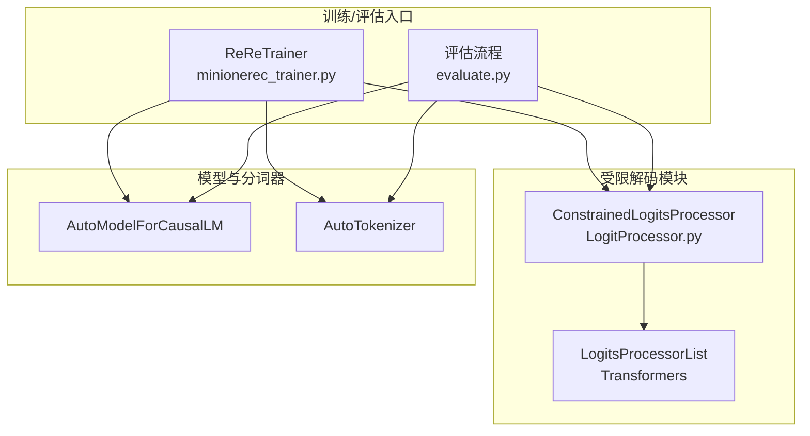
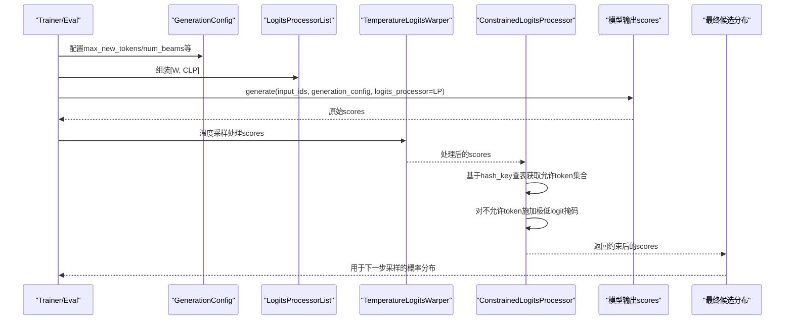
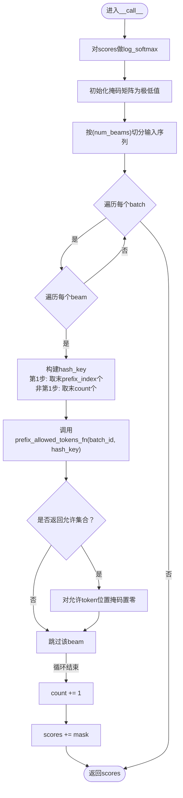
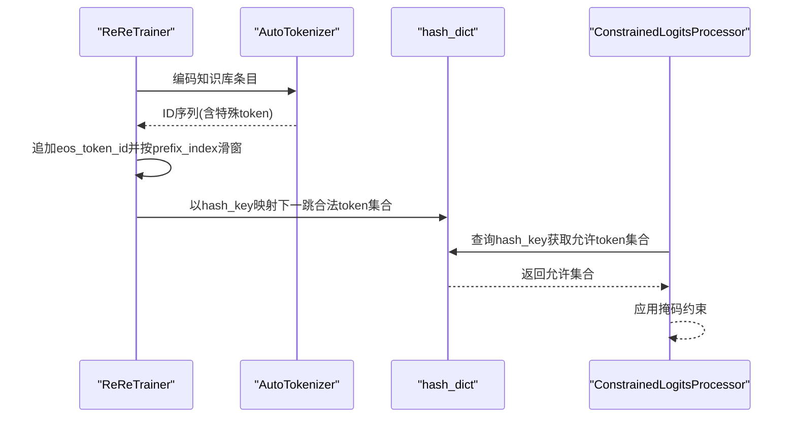
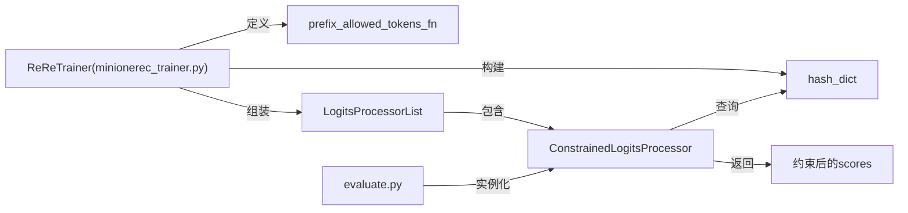

# 受限解码的Logit处理器

<cite>
**本文引用的文件**
- [LogitProcessor.py](file://LogitProcessor.py)
- [minionerec_trainer.py](file://minionerec_trainer.py)
- [evaluate.py](file://evaluate.py)
</cite>

## 目录
1. [引言](#引言)
2. [项目结构](#项目结构)
3. [核心组件](#核心组件)
4. [架构总览](#架构总览)
5. [详细组件分析](#详细组件分析)
6. [依赖关系分析](#依赖关系分析)
7. [性能考量](#性能考量)
8. [故障排查指南](#故障排查指南)
9. [结论](#结论)
10. [附录](#附录)

## 引言
本文件围绕受限解码中的Logit处理器展开，重点阐述ConstrainedLogitsProcessor在生成式推荐中的关键作用。该处理器通过在每一步生成时，基于当前已生成token序列的哈希键，动态查询允许的后续token集合，并以掩码矩阵将非法token的logits置为极低值，从而实现“硬约束”。本文将从接口规范、构造参数、执行流程、束搜索协同、模型差异适配、调用场景与状态管理等方面进行系统化解读，并给出自定义约束函数的开发指南与性能优化建议。

## 项目结构
本次分析聚焦于以下文件：
- LogitProcessor.py：定义受限Logit处理器ConstrainedLogitsProcessor
- minionerec_trainer.py：训练/推理入口，包含构建哈希表、构造约束函数、注入LogitsProcessorList等
- evaluate.py：评估脚本，演示如何在独立场景下使用ConstrainedLogitsProcessor

图表来源
- [LogitProcessor.py](file://LogitProcessor.py#L1-L63)
- [minionerec_trainer.py](file://minionerec_trainer.py#L677-L704)
- [evaluate.py](file://evaluate.py#L160-L208)

章节来源
- [LogitProcessor.py](file://LogitProcessor.py#L1-L63)
- [minionerec_trainer.py](file://minionerec_trainer.py#L525-L576)
- [evaluate.py](file://evaluate.py#L160-L208)

## 核心组件
- ConstrainedLogitsProcessor：继承自Transformers的LogitsProcessor，负责在每步生成时对候选token进行约束过滤。
- ReReTrainer：在训练/推理阶段构建商品ID空间的前缀哈希表，提供prefix_allowed_tokens_fn回调；并将温度采样与受限Logit处理器组合为LogitsProcessorList。
- 评估脚本evaluate.py：在离线评估场景中直接实例化ConstrainedLogitsProcessor并注入到GenerationConfig。

章节来源
- [LogitProcessor.py](file://LogitProcessor.py#L1-L63)
- [minionerec_trainer.py](file://minionerec_trainer.py#L677-L704)
- [evaluate.py](file://evaluate.py#L160-L208)

## 架构总览
受限解码的关键在于“知识库约束”与“生成过程”的无缝衔接。整体流程如下：
- 训练/准备阶段：根据知识库中的商品描述/语义，构建tokenizer后的ID序列，并按固定长度滑窗生成哈希键，映射到下一跳合法token集合，形成hash_dict。
- 推理阶段：每步生成时，ConstrainedLogitsProcessor根据当前输入序列的哈希键查表，得到允许的后续token集合，通过掩码将其他token的logits置为极低值，从而实现硬约束。
- 束搜索协同：num_beams参数控制批次内每个样本的分支数量，LogitsProcessorList按顺序应用温度采样与受限约束，保证多分支的一致性与合法性。

图表来源
- [minionerec_trainer.py](file://minionerec_trainer.py#L677-L704)
- [LogitProcessor.py](file://LogitProcessor.py#L41-L63)
- [evaluate.py](file://evaluate.py#L160-L208)

## 详细组件分析

### 组件一：ConstrainedLogitsProcessor（受限Logit处理器）
- 继承接口：遵循Transformers的LogitsProcessor规范，需实现__call__方法，接收input_ids与scores，返回处理后的scores。
- 关键字段与参数
  - prefix_allowed_tokens_fn：回调函数，输入(batch_id, hash_key)，返回允许的下一个token集合
  - num_beams：束搜索分支数，用于将batch视作(batch, beam, seq)的三维结构
  - base_model：模型标识，用于区分GPT2与LLaMA等模型的prefix_index差异
  - count：多步生成的状态计数器，控制每次取末尾多少个token作为hash_key
  - prefix_index：不同模型的前缀长度偏移，适配特殊token位置差异
- 执行流程（__call__）
  - 将scores归一化为log_softmax形式
  - 初始化掩码矩阵，将所有位置的logit设为极低值
  - 按(batch, beam)遍历当前输入序列
  - 第一步：取末尾prefix_index个token作为hash_key；后续步：取末count个token作为hash_key
  - 调用prefix_allowed_tokens_fn查询允许的token集合
  - 若存在允许集合，则将其对应位置的掩码置零（不改变概率），否则跳过
  - 累加掩码到scores，返回最终分布

图表来源
- [LogitProcessor.py](file://LogitProcessor.py#L41-L63)

章节来源
- [LogitProcessor.py](file://LogitProcessor.py#L22-L63)

### 组件二：prefix_allowed_tokens_fn与hash_dict（知识库集成）
- 构建阶段（ReReTrainer）
  - 读取知识库信息，构造“### Response:\n...”格式文本
  - 使用AutoTokenizer编码，针对LLaMA与GPT2分别处理特殊起始token
  - 为每个ID序列追加eos_token_id，并按prefix_index滑窗生成hash_key
  - 将hash_key映射到下一跳合法token集合，形成hash_dict
- 使用阶段（ConstrainedLogitsProcessor）
  - 在每步生成时，依据当前输入序列的hash_key查询hash_dict，得到允许的后续token集合
  - 通过掩码实现硬约束，确保生成结果严格落在预定义的商品ID空间内

图表来源
- [minionerec_trainer.py](file://minionerec_trainer.py#L525-L576)
- [minionerec_trainer.py](file://minionerec_trainer.py#L582-L587)

章节来源
- [minionerec_trainer.py](file://minionerec_trainer.py#L525-L576)
- [minionerec_trainer.py](file://minionerec_trainer.py#L582-L587)

### 组件三：束搜索与num_beams的协同机制
- num_beams参数决定每步生成的分支数量，ConstrainedLogitsProcessor内部通过view(-1, num_beams, ...)将输入序列按(batch, beam, seq)组织，确保对每个beam独立应用约束。
- 在ReReTrainer中，当beam_search为真时，generation_config的num_beams与num_return_sequences均设置为num_generations，保证每轮生成的候选数量与训练/评估策略一致。
- 温度采样与受限约束的组合：先进行温度采样，再应用受限约束，既保留多样性又保证合法性。

章节来源
- [minionerec_trainer.py](file://minionerec_trainer.py#L482-L500)
- [minionerec_trainer.py](file://minionerec_trainer.py#L677-L704)
- [LogitProcessor.py](file://LogitProcessor.py#L41-L63)

### 组件四：模型差异适配（GPT2与LLaMA的prefix_index）
- 不同模型的特殊token位置不同，导致prefix_index取值不同：
  - GPT2：prefix_index=4
  - LLaMA：prefix_index=3
- 该差异在构造函数中自动识别base_model字符串并设置prefix_index，从而保证hash_key提取的正确性。

章节来源
- [LogitProcessor.py](file://LogitProcessor.py#L34-L39)
- [minionerec_trainer.py](file://minionerec_trainer.py#L543-L551)

### 组件五：多步生成中的状态管理（self.count）
- count初始为0，表示第一轮生成时使用prefix_index长度的后缀作为hash_key
- 每次__call__结束后count自增1，后续轮次改为使用末count个token作为hash_key
- 这种设计使得随着生成步数增加，hash_key逐步扩展，提升查询精度与覆盖范围

章节来源
- [LogitProcessor.py](file://LogitProcessor.py#L32-L33)
- [LogitProcessor.py](file://LogitProcessor.py#L48-L60)

### 组件六：实际调用场景（minionerec_trainer.py）
- 训练/推理入口中，ReReTrainer在生成前构建hash_dict，并定义prefix_allowed_tokens_fn
- 将TemperatureLogitsWarper与ConstrainedLogitsProcessor组合为LogitsProcessorList
- 在generate调用时传入generation_config与logits_processor，确保生成结果严格符合商品ID空间

章节来源
- [minionerec_trainer.py](file://minionerec_trainer.py#L677-L704)
- [minionerec_trainer.py](file://minionerec_trainer.py#L744-L785)

### 组件七：评估脚本中的使用（evaluate.py）
- 评估流程中同样实例化ConstrainedLogitsProcessor，并将其加入LogitsProcessorList
- 通过generation_config配置num_beams等参数，确保评估一致性

章节来源
- [evaluate.py](file://evaluate.py#L160-L208)

## 依赖关系分析
- ConstrainedLogitsProcessor依赖Transformers的LogitsProcessor接口与LogitsProcessorList容器
- ReReTrainer负责构建知识库、生成hash_dict与prefix_allowed_tokens_fn，并将其注入到LogitsProcessorList
- evaluate.py提供独立的受限解码示例，便于验证与调试

图表来源
- [minionerec_trainer.py](file://minionerec_trainer.py#L525-L576)
- [minionerec_trainer.py](file://minionerec_trainer.py#L677-L704)
- [evaluate.py](file://evaluate.py#L160-L208)
- [LogitProcessor.py](file://LogitProcessor.py#L41-L63)

章节来源
- [minionerec_trainer.py](file://minionerec_trainer.py#L525-L576)
- [minionerec_trainer.py](file://minionerec_trainer.py#L677-L704)
- [evaluate.py](file://evaluate.py#L160-L208)
- [LogitProcessor.py](file://LogitProcessor.py#L41-L63)

## 性能考量
- 掩码策略：将非法token的logit置为极低值，避免显式删除或稀疏化操作，计算开销小且数值稳定
- 查表效率：hash_dict采用字典映射，查询复杂度近似O(1)，适合在线推理
- 批量处理：按(batch, beam)维度批量遍历，充分利用张量运算
- 代价权衡：随着count递增，hash_key长度增长，查询更精确但可能增加少量计算；可通过合理设置prefix_index与滑窗策略平衡
- 内存占用：掩码矩阵与hash_dict规模取决于词汇表大小与知识库规模，建议在构建阶段进行裁剪与去重

[本节为通用性能讨论，无需特定文件来源]

## 故障排查指南
- 生成结果包含非法token
  - 检查prefix_allowed_tokens_fn是否正确返回允许集合
  - 确认hash_dict构建时的prefix_index与目标模型一致
  - 核对count状态是否与期望一致
- 束搜索分支异常
  - 确认generation_config的num_beams与num_return_sequences设置一致
  - 检查LogitsProcessorList中TemperatureLogitsWarper与ConstrainedLogitsProcessor的顺序
- 特殊token处理错误
  - 针对GPT2与LLaMA分别设置不同的prefix_index
  - 确保tokenizer的pad_token/eos_token配置正确

章节来源
- [LogitProcessor.py](file://LogitProcessor.py#L34-L39)
- [LogitProcessor.py](file://LogitProcessor.py#L41-L63)
- [minionerec_trainer.py](file://minionerec_trainer.py#L482-L500)
- [minionerec_trainer.py](file://minionerec_trainer.py#L677-L704)

## 结论
ConstrainedLogitsProcessor通过“哈希键查表+掩码约束”的方式，在生成过程中实现了对商品ID空间的硬约束，有效防止模型生成虚构或无效的推荐项。其设计兼顾了可移植性（通过prefix_allowed_tokens_fn抽象）、可扩展性（通过hash_dict与滑窗策略）与高效性（通过批量化与极低logit掩码）。配合ReReTrainer与评估脚本，可在训练/推理/评估全流程中稳定地保障生成质量与合法性。

[本节为总结性内容，无需特定文件来源]

## 附录

### 自定义约束函数开发指南
- 回调签名
  - 输入：batch_id（批次索引）、hash_key（当前输入序列的末尾若干token组成的列表）
  - 输出：允许的下一个token集合（整数列表）
- 设计要点
  - hash_key长度应与构建阶段保持一致，确保查表一致性
  - 返回空列表时，表示无任何合法扩展，需由上层逻辑处理（如回退策略）
  - 可结合业务规则（如品类限制、热度阈值）对候选集进行二次筛选
- 示例路径参考
  - 训练阶段的prefix_allowed_tokens_fn定义与使用：[minionerec_trainer.py](file://minionerec_trainer.py#L582-L587)
  - 评估阶段的prefix_allowed_tokens_fn定义与使用：[evaluate.py](file://evaluate.py#L108-L141)

章节来源
- [minionerec_trainer.py](file://minionerec_trainer.py#L582-L587)
- [evaluate.py](file://evaluate.py#L108-L141)