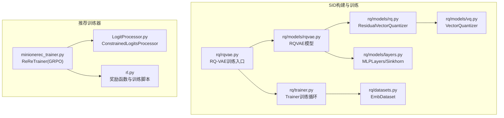
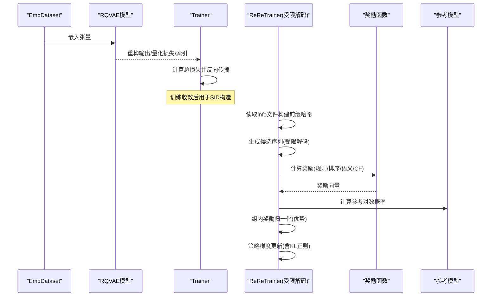
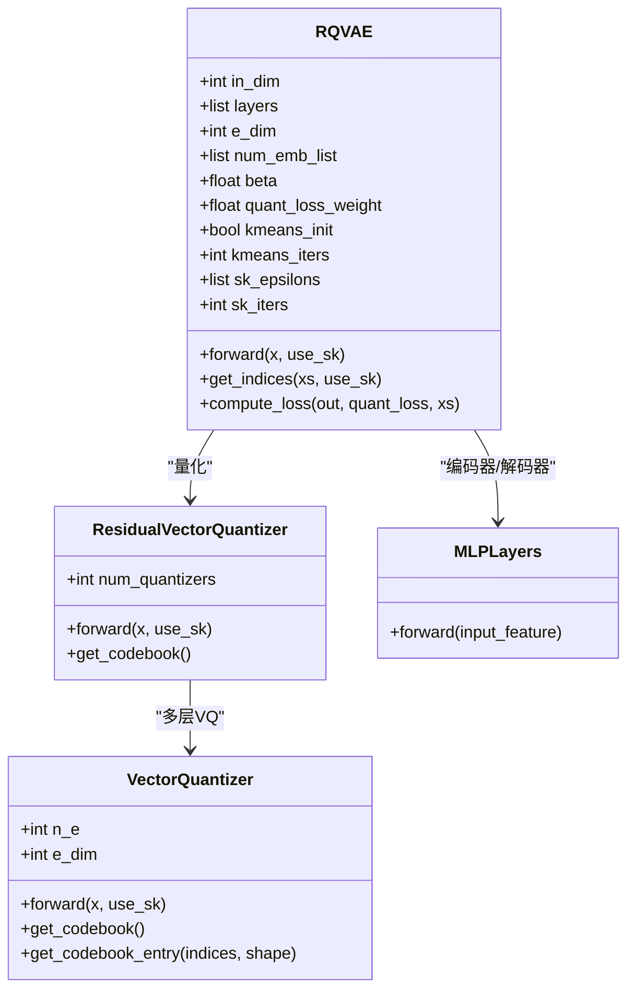
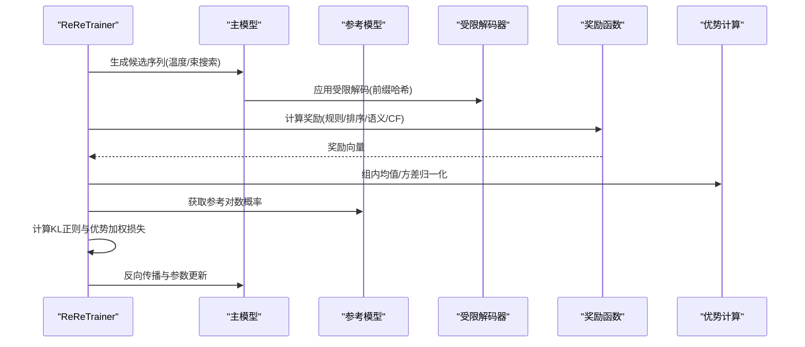
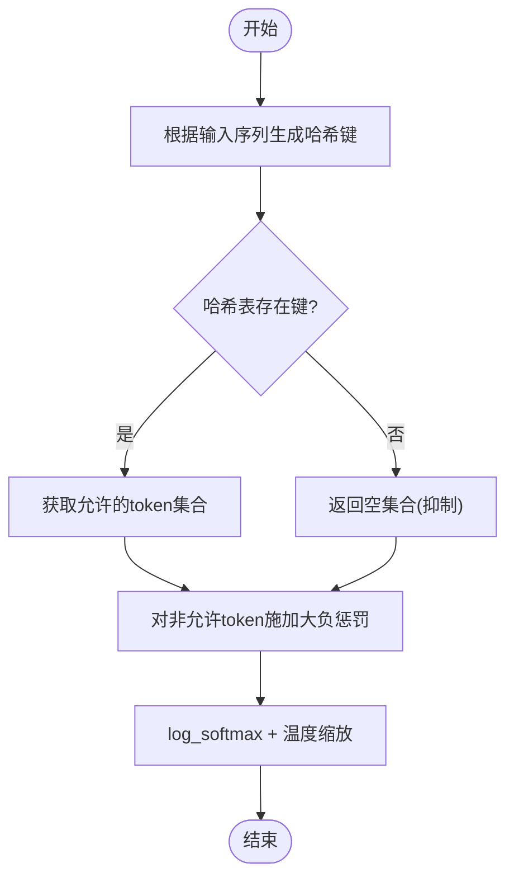
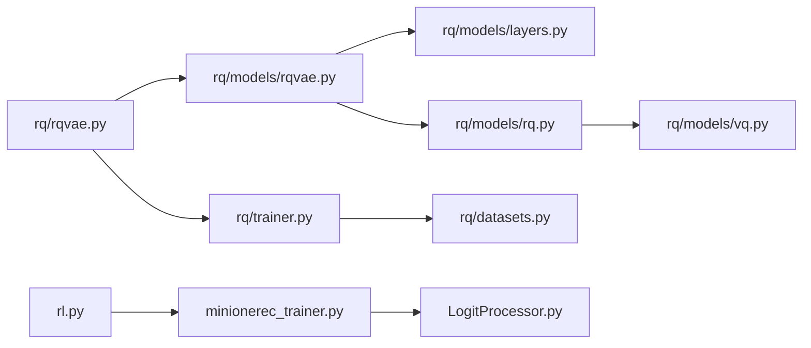

# 核心技术设计

<cite>
**本文引用的文件**
- [README.md](file://README.md)
- [rq/rqvae.py](file://rq/rqvae.py)
- [rq/models/rqvae.py](file://rq/models/rqvae.py)
- [rq/models/layers.py](file://rq/models/layers.py)
- [rq/models/rq.py](file://rq/models/rq.py)
- [rq/models/vq.py](file://rq/models/vq.py)
- [rq/trainer.py](file://rq/trainer.py)
- [rq/datasets.py](file://rq/datasets.py)
- [minionerec_trainer.py](file://minionerec_trainer.py)
- [LogitProcessor.py](file://LogitProcessor.py)
- [rl.py](file://rl.py)
</cite>

## 目录
1. [引言](#引言)
2. [项目结构](#项目结构)
3. [核心组件](#核心组件)
4. [架构总览](#架构总览)
5. [详细组件分析](#详细组件分析)
6. [依赖关系分析](#依赖关系分析)
7. [性能考量](#性能考量)
8. [故障排查指南](#故障排查指南)
9. [结论](#结论)

## 引言
本文件面向希望深入理解MiniOneRec生成式推荐框架核心技术的读者，聚焦以下三部分：
- RQ-VAE模型（rqvae.py）：如何将高维商品嵌入压缩为紧凑的语义ID序列，并在训练中平衡重建误差与向量量化损失。
- GRPO-based训练器（minionerec_trainer.py）：如何基于组相对策略优化进行策略梯度更新，整合奖励信号并在多步采样中稳定优化。
- 受限解码器（LogitProcessor.py）：如何通过前缀哈希映射限制候选生成，从而在离散SIDs空间内提升推荐质量与多样性。

文档将从系统架构、数据流、处理逻辑、错误处理与性能特性等维度展开，并提供可视化图示帮助理解。

## 项目结构
MiniOneRec采用模块化组织，围绕“SID构建（RQ-VAE/RQ-Kmeans等）→监督微调（SFT）→强化学习（RL）”的端到端流程组织代码。其中：
- SID构建与训练：rq/目录包含RQ-VAE训练入口、模型定义、量化层与训练器。
- 推荐训练器：minionerec_trainer.py实现GRPO训练器，负责多步采样、奖励归一化、优势计算与策略更新。
- 解码约束：LogitProcessor.py提供受控解码逻辑，将生成空间限制在合法SIDs集合。
- RL奖励与脚本：rl.py定义多种奖励函数（规则、排序、语义、协同过滤），并驱动GRPO训练流程。

图表来源
- [rq/rqvae.py](file://rq/rqvae.py#L1-L95)
- [rq/models/rqvae.py](file://rq/models/rqvae.py#L1-L85)
- [rq/models/rq.py](file://rq/models/rq.py#L1-L56)
- [rq/models/vq.py](file://rq/models/vq.py#L1-L102)
- [rq/models/layers.py](file://rq/models/layers.py#L1-L108)
- [rq/trainer.py](file://rq/trainer.py#L1-L256)
- [rq/datasets.py](file://rq/datasets.py#L1-L40)
- [minionerec_trainer.py](file://minionerec_trainer.py#L1-L200)
- [LogitProcessor.py](file://LogitProcessor.py#L1-L63)
- [rl.py](file://rl.py#L1-L120)

章节来源
- [README.md](file://README.md#L38-L70)

## 核心组件
- RQ-VAE模型：编码器将高维嵌入映射至低维潜变量，残差向量量化器逐层量化得到离散索引序列，解码器重构输入；训练目标由重建误差与量化损失加权组成。
- GRPO训练器：在每轮采样中生成多个候选，计算奖励并按提示分组归一化，利用优势估计与参考模型KL正则进行策略梯度更新。
- 受限解码器：基于前缀哈希表动态限制下一时刻可选token，确保生成始终落在合法SIDs集合内。

章节来源
- [rq/models/rqvae.py](file://rq/models/rqvae.py#L1-L85)
- [rq/trainer.py](file://rq/trainer.py#L98-L173)
- [minionerec_trainer.py](file://minionerec_trainer.py#L560-L620)
- [LogitProcessor.py](file://LogitProcessor.py#L23-L63)

## 架构总览
下图展示了从商品文本到SID序列，再到生成式推荐的端到端流程，以及GRPO训练器如何在受限解码下进行策略优化。

图表来源
- [rq/datasets.py](file://rq/datasets.py#L1-L40)
- [rq/models/rqvae.py](file://rq/models/rqvae.py#L61-L85)
- [rq/trainer.py](file://rq/trainer.py#L98-L173)
- [minionerec_trainer.py](file://minionerec_trainer.py#L560-L620)
- [rl.py](file://rl.py#L156-L246)

## 详细组件分析

### RQ-VAE模型（rq/models/rqvae.py）
- 结构要点
  - 编码器：MLPLayers堆叠，将输入维度映射到潜变量维度。
  - 残差向量量化器：多层VQ叠加，逐层产生残差并量化，最终输出紧致索引序列。
  - 解码器：镜像编码器结构，从量化潜变量重构输入。
  - 损失：重建误差（MSE/L1）与量化损失加权求和。
- 训练机制
  - 前向：编码→量化→解码，返回重构结果、量化损失与索引。
  - 计算损失：根据配置选择重建损失类型，总损失=重建误差+量化损失权重×量化损失。
  - 训练循环：Trainer按批次反传、梯度裁剪、学习率调度，周期性评估碰撞率以衡量离散化质量。

图表来源
- [rq/models/rqvae.py](file://rq/models/rqvae.py#L1-L85)
- [rq/models/rq.py](file://rq/models/rq.py#L1-L56)
- [rq/models/vq.py](file://rq/models/vq.py#L1-L102)
- [rq/models/layers.py](file://rq/models/layers.py#L1-L68)

章节来源
- [rq/models/rqvae.py](file://rq/models/rqvae.py#L10-L85)
- [rq/models/layers.py](file://rq/models/layers.py#L1-L68)
- [rq/models/rq.py](file://rq/models/rq.py#L1-L56)
- [rq/models/vq.py](file://rq/models/vq.py#L1-L102)
- [rq/trainer.py](file://rq/trainer.py#L98-L173)

### GRPO-based训练器（minionerec_trainer.py）
- 关键流程
  - 数据准备：重复随机采样器确保相同提示在多GPU上均匀分布，便于组内奖励归一化。
  - 生成阶段：支持常规采样或束搜索，结合温度与受限解码处理器。
  - 奖励计算：支持字符串模型奖励或自定义函数，多奖励加权求和并按提示分组归一化为优势。
  - 策略更新：使用参考模型对数概率与当前模型对数概率的KL项，结合优势计算每token损失，支持DAP0或GSPO变体。
- 设计权衡
  - 组内归一化降低方差，但要求全局批大小能被每提示生成数整除。
  - 参考模型同步与PEFT适配减少策略漂移，但增加显存与通信开销。
  - 束搜索保证唯一性与合法性，但可能牺牲探索多样性。

图表来源
- [minionerec_trainer.py](file://minionerec_trainer.py#L560-L620)
- [minionerec_trainer.py](file://minionerec_trainer.py#L929-L1001)
- [minionerec_trainer.py](file://minionerec_trainer.py#L1034-L1056)
- [LogitProcessor.py](file://LogitProcessor.py#L23-L63)
- [rl.py](file://rl.py#L156-L246)

章节来源
- [minionerec_trainer.py](file://minionerec_trainer.py#L121-L250)
- [minionerec_trainer.py](file://minionerec_trainer.py#L560-L620)
- [minionerec_trainer.py](file://minionerec_trainer.py#L929-L1001)
- [minionerec_trainer.py](file://minionerec_trainer.py#L1034-L1056)
- [rl.py](file://rl.py#L156-L246)

### 受限解码器（LogitProcessor.py）
- 实现逻辑
  - 基于前缀哈希表动态限制下一时刻token集合，避免非法SIDs进入生成序列。
  - 对每个beam单独应用掩码，结合温度warper与log_softmax实现稳定解码。
  - 针对不同基座模型（如GPT2/LLaMA）设置不同的前缀索引以适配特殊token。
- 性能与稳定性
  - 哈希键由历史前缀拼接生成，查询O(1)；当允许集合为空时，强制抑制该beam，防止无效扩展。
  - 与束搜索配合可显著提升生成效率与多样性，避免重复与非法路径。

图表来源
- [LogitProcessor.py](file://LogitProcessor.py#L23-L63)
- [minionerec_trainer.py](file://minionerec_trainer.py#L560-L620)

章节来源
- [LogitProcessor.py](file://LogitProcessor.py#L1-L63)
- [minionerec_trainer.py](file://minionerec_trainer.py#L560-L620)

## 依赖关系分析
- RQ-VAE训练链路
  - 入口脚本rq/rqvae.py加载数据集EmbDataset，实例化RQVAE与Trainer，启动训练循环。
  - RQVAE内部依赖MLPLayers、ResidualVectorQuantizer与VectorQuantizer，后者实现KMeans初始化与Sinkhorn算法。
- GRPO训练链路
  - 入口脚本rl.py构建数据集与奖励函数，实例化ReReTrainer，调用训练流程。
  - ReReTrainer依赖ConstrainedLogitsProcessor进行受限解码，奖励函数可为预训练分类模型或自定义函数。
- 耦合与内聚
  - RQ-VAE与训练器耦合度低，便于替换SID构建方法（如RQ-Kmeans+）。
  - GRPO训练器与受限解码器强耦合，确保动作空间为离散合法SIDs集合。

图表来源
- [rq/rqvae.py](file://rq/rqvae.py#L1-L95)
- [rq/models/rqvae.py](file://rq/models/rqvae.py#L1-L85)
- [rq/models/layers.py](file://rq/models/layers.py#L1-L108)
- [rq/models/rq.py](file://rq/models/rq.py#L1-L56)
- [rq/models/vq.py](file://rq/models/vq.py#L1-L102)
- [rq/trainer.py](file://rq/trainer.py#L1-L256)
- [rq/datasets.py](file://rq/datasets.py#L1-L40)
- [rl.py](file://rl.py#L1-L120)
- [minionerec_trainer.py](file://minionerec_trainer.py#L1-L200)
- [LogitProcessor.py](file://LogitProcessor.py#L1-L63)

章节来源
- [rq/rqvae.py](file://rq/rqvae.py#L1-L95)
- [rq/models/rqvae.py](file://rq/models/rqvae.py#L1-L85)
- [rq/models/layers.py](file://rq/models/layers.py#L1-L108)
- [rq/models/rq.py](file://rq/models/rq.py#L1-L56)
- [rq/models/vq.py](file://rq/models/vq.py#L1-L102)
- [rq/trainer.py](file://rq/trainer.py#L1-L256)
- [rq/datasets.py](file://rq/datasets.py#L1-L40)
- [rl.py](file://rl.py#L1-L120)
- [minionerec_trainer.py](file://minionerec_trainer.py#L1-L200)
- [LogitProcessor.py](file://LogitProcessor.py#L1-L63)

## 性能考量
- 向量量化与离散化
  - 优势：SIDs为离散符号，便于在受限空间内进行束搜索与奖励归一化，提高采样效率与多样性。
  - 风险：量化引入信息损失，需通过重建误差与量化损失平衡，训练中监控碰撞率以评估离散化质量。
- 训练稳定性
  - GRPO中组内奖励归一化有效降低方差，但需满足批大小与生成数的整除关系。
  - 参考模型同步与PEFT适配可减少策略漂移，但带来额外显存与通信成本。
- 解码效率
  - 前缀哈希表查询O(1)，在大规模SIDs空间中仍具高效性；空集合时抑制无效扩展，避免无效搜索。

[本节为通用指导，不直接分析具体文件]

## 故障排查指南
- RQ-VAE训练异常
  - 检查嵌入数据是否包含NaN/Inf，EmbDataset已内置替换逻辑；若仍报NaN，检查编码器/量化初始化与学习率。
  - 监控碰撞率，若持续偏高，考虑增大量化码本容量或调整beta/量化损失权重。
- GRPO训练异常
  - 若出现“全局批大小必须被每提示生成数整除”，请调整per_device_train/eval_batch_size或num_generations。
  - vLLM设备冲突：当use_vllm启用且与训练GPU重叠时，遵循提示调整进程数或显存利用率。
  - 奖励归一化异常：确认每组样本数量一致，避免奖励形状不匹配。
- 受限解码异常
  - 当允许集合为空时，生成会被抑制；检查info文件格式与前缀索引设置，确保哈希键正确生成。

章节来源
- [rq/datasets.py](file://rq/datasets.py#L1-L40)
- [rq/trainer.py](file://rq/trainer.py#L190-L251)
- [minionerec_trainer.py](file://minionerec_trainer.py#L393-L411)
- [minionerec_trainer.py](file://minionerec_trainer.py#L425-L478)
- [LogitProcessor.py](file://LogitProcessor.py#L23-L63)

## 结论
MiniOneRec通过RQ-VAE将高维商品嵌入压缩为紧凑SIDs，并在GRPO框架下结合受限解码实现高效、可控的生成式推荐。RQ-VAE在重建与量化之间取得平衡，GRPO在组内奖励归一化与KL正则下稳定更新策略，受限解码确保动作空间合法与多样。设计上的离散化优势与信息损失风险需要通过训练配置与评估指标共同权衡。