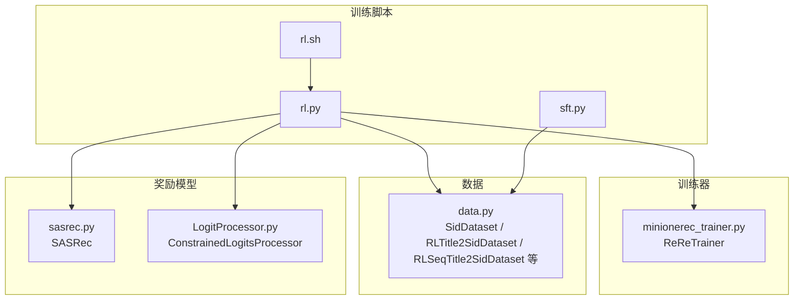
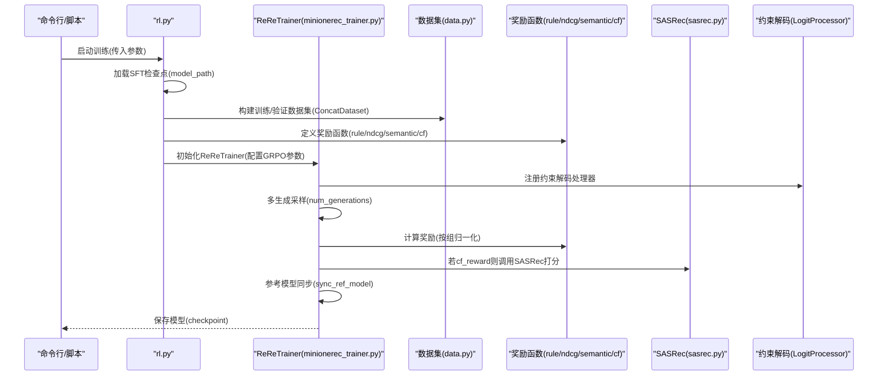
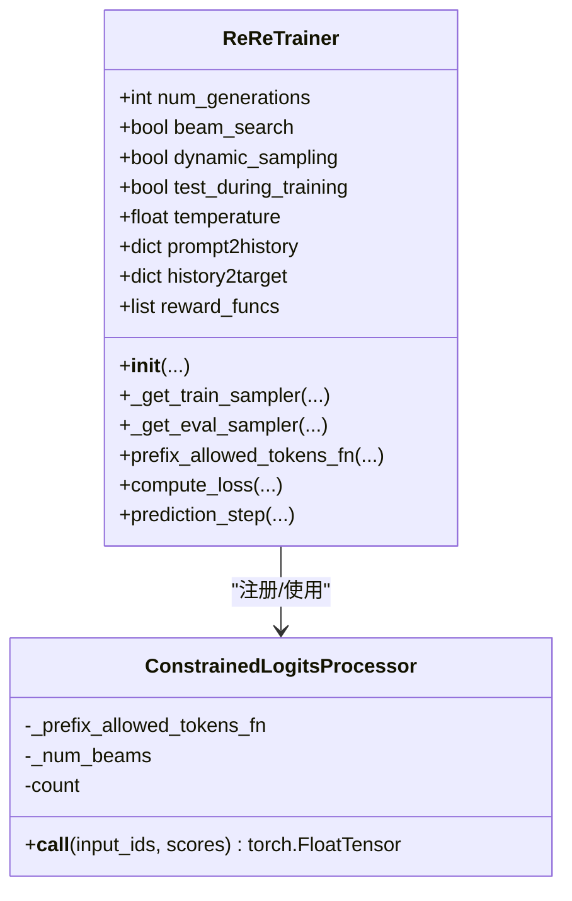
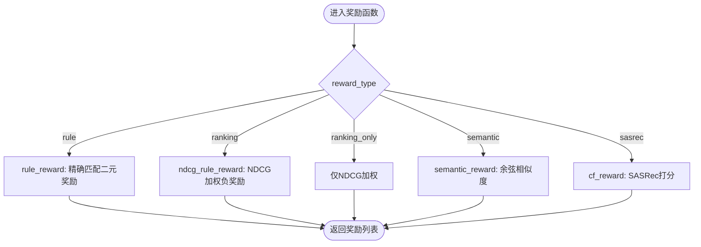
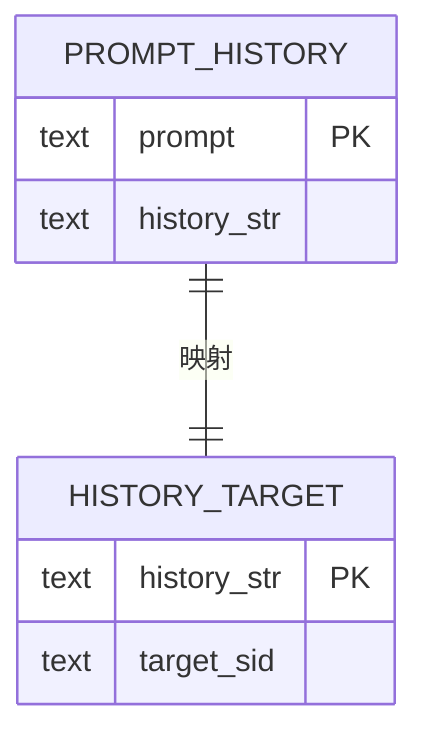
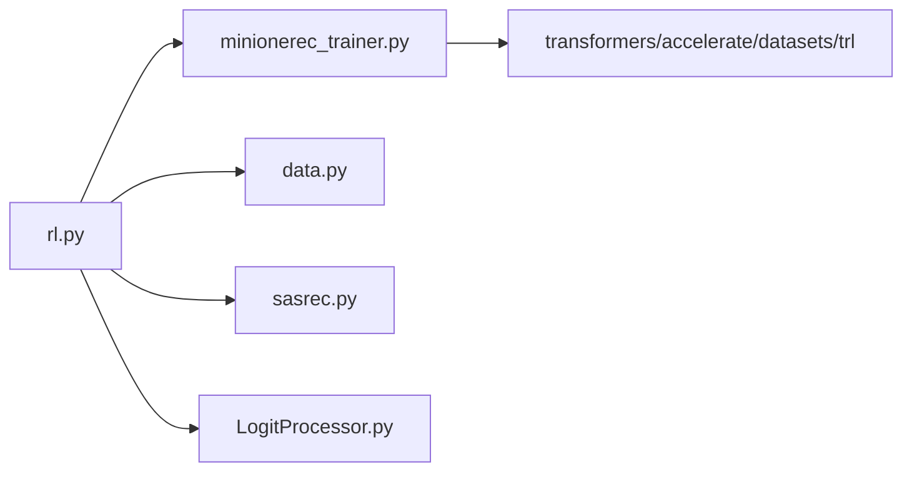

# 强化学习（RL）优化

<cite>
**本文引用的文件列表**
- [rl.py](file://rl.py)
- [minionerec_trainer.py](file://minionerec_trainer.py)
- [sft.py](file://sft.py)
- [sasrec.py](file://sasrec.py)
- [data.py](file://data.py)
- [LogitProcessor.py](file://LogitProcessor.py)
- [rl.sh](file://rl.sh)
- [README.md](file://README.md)
</cite>

## 目录
1. [引言](#引言)
2. [项目结构](#项目结构)
3. [核心组件](#核心组件)
4. [架构总览](#架构总览)
5. [详细组件分析](#详细组件分析)
6. [依赖关系分析](#依赖关系分析)
7. [性能考量](#性能考量)
8. [故障排查指南](#故障排查指南)
9. [结论](#结论)
10. [附录](#附录)

## 引言
本文件围绕强化学习（RL）优化阶段的技术文档，聚焦于 rl.py 的实现机制，系统阐述其基于 GRPO（Generative Reward Policy Optimization）的策略优化框架，使用 ReReTrainer（来自 minionerec_trainer.py）作为核心训练器。文档将解释如何加载 SFT 阶段训练好的模型作为初始策略，并通过多轮 rollout 生成推荐序列；深入剖析奖励函数（reward_fun）的多种实现模式：基于精确匹配的 rule_reward、基于 NDCG 加权的 ndcg_rule_reward、基于语义相似度的 semantic_reward（利用 item_ada_embd）以及基于协同过滤模型（SASRec）的 cf_reward；说明数据集构建逻辑，特别是 SidDataset 和 RLTitle2SidDataset 等如何将用户历史会话（prompt2history）与目标项目（history2target）关联；阐述训练配置，包括多生成（num_generations）、束搜索（beam_search）、动态采样（dynamic_sampling）等关键参数的作用；描述与 SFT 模型的衔接方式，如通过 model_path 加载检查点；提供代码示例路径，展示如何配置不同的 reward_type 来实现多样化的优化目标；最后讨论常见挑战，如奖励稀疏性、训练不稳定（梯度爆炸）以及通过 beta、learning_rate 等超参数进行调优，并解释 test_during_training 等评估集成机制。

## 项目结构
该仓库采用“功能分层 + 数据驱动”的组织方式：
- 训练脚本层：rl.py（RL 训练入口）、sft.py（SFT 训练入口）
- 训练器层：minionerec_trainer.py（ReReTrainer，封装 GRPO 训练流程）
- 数据层：data.py（SFT/RL 数据集构建，包含 SidDataset、RLTitle2SidDataset 等）
- 奖励模型层：sasrec.py（SASRec 协同过滤模型），LogitProcessor.py（约束解码处理器）
- 运行脚本：rl.sh（RL 训练一键脚本）
- 文档与说明：README.md（整体框架说明）

图表来源
- [rl.py](file://rl.py#L1-L317)
- [minionerec_trainer.py](file://minionerec_trainer.py#L1-L1149)
- [data.py](file://data.py#L1-L2134)
- [sasrec.py](file://sasrec.py#L1-L656)
- [LogitProcessor.py](file://LogitProcessor.py#L1-L63)
- [rl.sh](file://rl.sh#L1-L42)

章节来源
- [README.md](file://README.md#L38-L70)
- [rl.py](file://rl.py#L1-L120)
- [minionerec_trainer.py](file://minionerec_trainer.py#L1-L200)
- [data.py](file://data.py#L407-L520)

## 核心组件
- rl.py：RL 训练入口，负责加载 SFT 检查点、构建数据集、定义奖励函数、配置 GRPO 训练参数并启动 ReReTrainer。
- ReReTrainer（minionerec_trainer.py）：基于 GRPO 的推荐专用训练器，支持多生成、束搜索、动态采样、参考模型同步、约束解码等。
- 数据集模块（data.py）：提供 SidDataset、RLTitle2SidDataset、RLSeqTitle2SidDataset 等，负责构造 prompt-completion 对，并维护 prompt2history、history2target 映射。
- 奖励函数族：rule_reward、ndcg_rule_reward、semantic_reward、cf_reward。
- 协同过滤模型（sasrec.py）：SASRec，用于 cf_reward 的打分。
- 约束解码处理器（LogitProcessor.py）：ConstrainedLogitsProcessor，配合 ReReTrainer 实现受控的 beam 解码。

章节来源
- [rl.py](file://rl.py#L30-L120)
- [minionerec_trainer.py](file://minionerec_trainer.py#L120-L220)
- [data.py](file://data.py#L407-L520)
- [sasrec.py](file://sasrec.py#L214-L276)
- [LogitProcessor.py](file://LogitProcessor.py#L23-L63)

## 架构总览
下图展示了 RL 优化阶段的整体架构：从 SFT 模型加载开始，到数据集构建、奖励函数定义、GRPO 训练器运行、多生成采样与奖励归一化，再到参考模型同步与评估集成。

图表来源
- [rl.py](file://rl.py#L120-L317)
- [minionerec_trainer.py](file://minionerec_trainer.py#L340-L790)
- [data.py](file://data.py#L851-L1090)
- [sasrec.py](file://sasrec.py#L214-L276)
- [LogitProcessor.py](file://LogitProcessor.py#L23-L63)

## 详细组件分析

### 组件A：ReReTrainer（GRPO 推荐专用训练器）
- 职责：封装 GRPO 的推荐场景训练流程，支持多生成采样、束搜索、动态采样、参考模型同步、约束解码、评估指标记录等。
- 关键点：
  - 多生成与批大小一致性校验：num_generations 必须能整除全局批大小（训练/评估）。
  - 生成配置：根据 beam_search 或温度采样设置 GenerationConfig；支持 vLLM（可选）。
  - 约束解码：通过 ConstrainedLogitsProcessor 限制输出前缀，保证生成的 SID 在词表范围内且唯一。
  - 奖励函数：支持字符串模型 ID、预训练分类模型或自定义函数；可多奖励函数加权融合。
  - 参考模型：支持 DeepSpeed Zero3 或 PEFT 场景下的 ref_model 创建与同步。
  - 测试评估：在训练过程中可选择性地进行测试集生成并计算 HR/NDCG 指标。

图表来源
- [minionerec_trainer.py](file://minionerec_trainer.py#L120-L220)
- [minionerec_trainer.py](file://minionerec_trainer.py#L578-L790)
- [LogitProcessor.py](file://LogitProcessor.py#L23-L63)

章节来源
- [minionerec_trainer.py](file://minionerec_trainer.py#L340-L790)
- [LogitProcessor.py](file://LogitProcessor.py#L23-L63)

### 组件B：奖励函数体系（rule/ndcg/semantic/cf）
- rule_reward：基于精确匹配的目标项与生成项是否一致，返回二元奖励。
- ndcg_rule_reward：在每组 num_generations 中，若命中目标则组内奖励置零，否则按 NDCG 权重分配负奖励，缓解奖励稀疏性。
- semantic_reward：基于 item_ada_embd 的余弦相似度作为奖励，衡量生成项与目标项的语义接近程度。
- cf_reward：基于 SASRec 的打分作为奖励，对无效项进行随机兜底，确保数值稳定性。

图表来源
- [rl.py](file://rl.py#L160-L246)

章节来源
- [rl.py](file://rl.py#L160-L246)

### 组件C：数据集构建与映射（prompt2history/history2target）
- SidDataset：将用户历史交互（SID 序列）转换为 prompt-completion 对，并建立 prompt2history、history2target 映射。
- RLTitle2SidDataset：将标题/描述映射到 SID，构造 RL 任务的 prompt-completion 对。
- RLSeqTitle2SidDataset：基于标题序列的历史，预测下一个 SID。
- RLSid2TitleDataset、RLSidhis2TitleDataset：SID 到标题的双向映射，服务于 RL 训练。

图表来源
- [data.py](file://data.py#L407-L520)
- [data.py](file://data.py#L851-L1090)

章节来源
- [data.py](file://data.py#L407-L520)
- [data.py](file://data.py#L851-L1090)

### 组件D：SFT 模型衔接与检查点加载
- rl.py 通过 AutoModelForCausalLM.from_pretrained(model_path, ...) 加载 SFT 阶段的检查点，作为 RL 的初始策略。
- sft.py 展示了 SFT 阶段的完整流程，包括数据拼接、分词器配置、训练参数设置与保存最终检查点。

章节来源
- [rl.py](file://rl.py#L136-L143)
- [sft.py](file://sft.py#L130-L170)

### 组件E：训练配置与关键参数
- num_generations：每条 prompt 的候选生成数量，决定组内奖励归一化范围与批大小一致性要求。
- beam_search：启用束搜索时，使用 num_beams=num_generations；否则使用温度采样。
- dynamic_sampling：在动态采样模式下扩展 prompt 批，提升样本多样性。
- temperature：控制采样温度，影响多样性与稳定性。
- beta：KL 正则权重，平衡策略更新与参考模型距离。
- learning_rate：优化器学习率，需与梯度裁剪、warmup 等共同调优。
- test_during_training：在训练中对去重后的 prompt 进行测试生成，统计 HR/NDCG。
- sync_ref_model：是否同步参考模型权重，稳定训练。

章节来源
- [rl.py](file://rl.py#L263-L305)
- [minionerec_trainer.py](file://minionerec_trainer.py#L393-L412)

### 组件F：SASRec 协同过滤奖励
- 在 cf_reward 中，将历史序列与目标项编码为索引，调用 SASRec 的 forward_eval 获取打分；对越界项随机兜底，避免异常。
- 该打分作为奖励信号，结合 GRPO 的组内归一化，形成稳定的策略更新。

章节来源
- [rl.py](file://rl.py#L215-L246)
- [sasrec.py](file://sasrec.py#L214-L276)

## 依赖关系分析
- rl.py 依赖 ReReTrainer（minionerec_trainer.py）、数据集模块（data.py）、SASRec（sasrec.py）、约束解码处理器（LogitProcessor.py）。
- ReReTrainer 内部依赖 transformers、accelerate、datasets、trl 等库，负责生成、奖励计算、参考模型同步与日志记录。
- 数据集模块提供多种 RL 任务的数据格式，统一输出 prompt-completion，并维护映射字典供奖励函数使用。

图表来源
- [rl.py](file://rl.py#L1-L30)
- [minionerec_trainer.py](file://minionerec_trainer.py#L1-L70)
- [data.py](file://data.py#L1-L40)
- [sasrec.py](file://sasrec.py#L1-L20)
- [LogitProcessor.py](file://LogitProcessor.py#L1-L10)

章节来源
- [rl.py](file://rl.py#L1-L30)
- [minionerec_trainer.py](file://minionerec_trainer.py#L1-L70)

## 性能考量
- 多生成与批大小一致性：num_generations 必须整除全局批大小，否则抛出异常。建议根据 GPU 数量与单卡 batch_size 调整。
- 温度与束搜索：beam_search 下使用 num_beams=num_generations，可提高多样性但增加显存；temperature 控制采样多样性与稳定性。
- 动态采样：在 dynamic_sampling 开启时扩大 prompt 批，有助于提升样本利用率，但需注意内存占用。
- 参考模型同步：sync_ref_model 可提升稳定性，但在大模型上会增加同步开销。
- 约束解码：ConstrainedLogitsProcessor 通过哈希前缀限制合法 token，减少无效生成，提高采样效率。
- 早停与评估：test_during_training 可在训练中进行离线评估，便于监控过拟合与性能变化。

[本节为通用指导，不直接分析具体文件]

## 故障排查指南
- 奖励稀疏性问题：优先使用 ranking 或 ranking_only 模式，结合 ndcg_rule_reward 的负奖励分配，缓解稀疏奖励导致的策略退化。
- 训练不稳定（梯度爆炸）：降低 learning_rate、启用 max_grad_norm、减小 beta、使用 sync_ref_model；必要时开启动态采样提升样本多样性。
- 采样重复与无意义生成：启用 beam_search 并使用 ConstrainedLogitsProcessor，确保输出前缀唯一且合法。
- 数据映射缺失：确认 prompt2history 与 history2target 是否正确构建，避免奖励函数无法定位目标项。
- 评估指标异常：检查 test_during_training 的去重逻辑与 top-k 计算，确保 HR/NDCG 计算正确。

章节来源
- [rl.py](file://rl.py#L160-L246)
- [minionerec_trainer.py](file://minionerec_trainer.py#L578-L790)

## 结论
本文围绕 rl.py 的 GRPO 强化学习优化机制进行了系统性解析，重点覆盖了 ReReTrainer 的训练流程、奖励函数体系、数据集构建与映射、SFT 模型衔接、关键训练参数配置以及常见挑战与调优策略。通过 rule/ndcg/semantic/cf 四类奖励函数与多生成、束搜索、动态采样、约束解码等机制，实现了在推荐场景下的高效、稳定策略优化。建议在实际部署中结合任务特性选择合适的 reward_type，并通过 beta、learning_rate、num_generations 等超参数进行系统性调优，同时利用 test_during_training 进行持续评估与监控。

[本节为总结性内容，不直接分析具体文件]

## 附录

### A. 如何配置不同的 reward_type
- 使用 rule：仅基于精确匹配的二元奖励，适合强监督场景。
- 使用 ranking：组合 rule_reward 与 ndcg_rule_reward，兼顾正确性与排序质量。
- 使用 ranking_only：仅使用 NDCG 加权的负奖励，缓解稀疏性。
- 使用 semantic：基于 item_ada_embd 的语义相似度作为奖励，适合需要语义对齐的任务。
- 使用 sasrec：基于 SASRec 的协同过滤打分作为奖励，适合冷启动或需要利用用户行为偏好的场景。

章节来源
- [rl.py](file://rl.py#L249-L259)

### B. 训练参数与脚本示例路径
- 训练脚本：rl.sh 提供了完整的 RL 训练命令示例，包括加速配置、数据路径、模型路径、奖励类型、生成参数等。
- 参数说明：可在 rl.py 的 train 函数中查看各参数含义与默认值。

章节来源
- [rl.sh](file://rl.sh#L1-L42)
- [rl.py](file://rl.py#L30-L120)