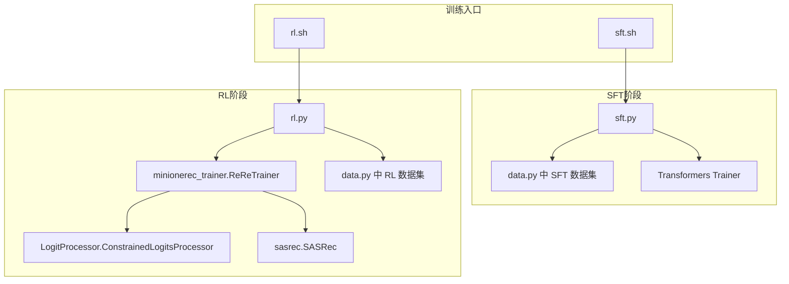
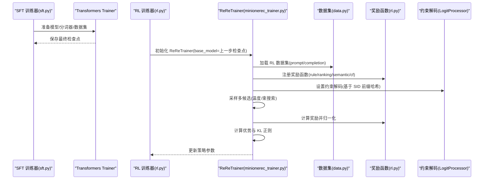
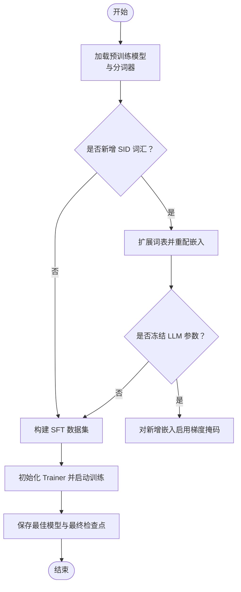
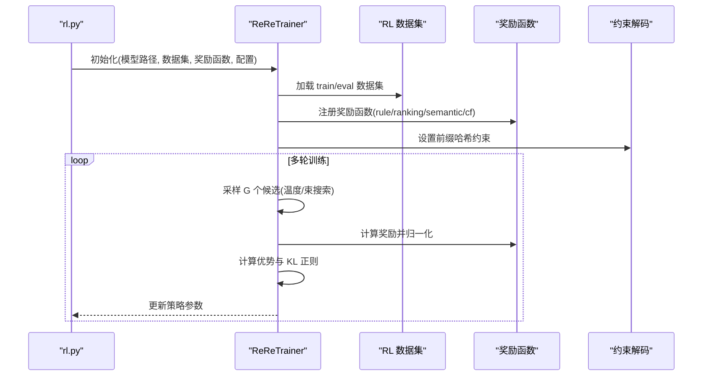
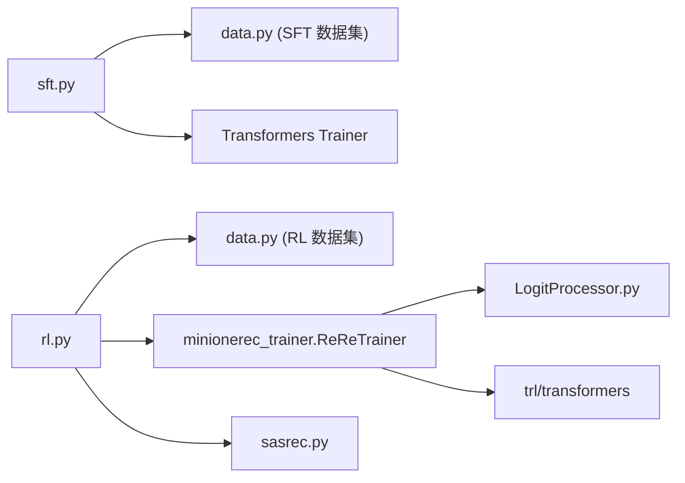

# 模型训练

<cite>
**本文引用的文件**
- [sft.py](file://sft.py)
- [rl.py](file://rl.py)
- [minionerec_trainer.py](file://minionerec_trainer.py)
- [data.py](file://data.py)
- [LogitProcessor.py](file://LogitProcessor.py)
- [sasrec.py](file://sasrec.py)
- [sft.sh](file://sft.sh)
- [rl.sh](file://rl.sh)
- [README.md](file://README.md)
</cite>

## 目录
1. [简介](#简介)
2. [项目结构](#项目结构)
3. [核心组件](#核心组件)
4. [架构总览](#架构总览)
5. [详细组件分析](#详细组件分析)
6. [依赖关系分析](#依赖关系分析)
7. [性能考量](#性能考量)
8. [故障排查指南](#故障排查指南)
9. [结论](#结论)
10. [附录](#附录)

## 简介
本文件面向“监督微调（SFT）与强化学习（RL）”两阶段的训练流程，系统化梳理 MiniOneRec 的端到端训练管线：SFT 阶段通过序列建模实现 next-token 预测与语言对齐目标；RL 阶段采用基于 GRPO 的策略优化，结合多源奖励信号（规则、排序、语义相似度、协同过滤）进行推荐导向的策略微调。文档同时说明两阶段衔接方式（SFT 模型作为 RL 初始策略）、训练日志解读、超参数调优建议以及常见问题（如梯度爆炸、收敛缓慢）的解决方案。

## 项目结构
- 训练入口脚本
  - SFT：sft.sh 调用 sft.py
  - RL：rl.sh 调用 rl.py
- 核心训练脚本
  - sft.py：加载预训练模型、构建 SFT 数据集、可选冻结 LLM 参数、使用 Transformers Trainer 执行监督微调
  - rl.py：加载 SFT/RL 微调后的模型，构造 RL 数据集，定义奖励函数，使用 ReReTrainer（基于 GRPO）进行策略优化
- 训练器与数据
  - minionerec_trainer.py：ReReTrainer 实现 GRPO 的采样、奖励归一化、优势估计、KL 正则与策略更新
  - data.py：SFT/RL 数据集类，统一输出 input_ids/attention_mask/labels 或 prompt/completion
  - LogitProcessor.py：约束解码的 LogitsProcessor，保证候选唯一且合法
  - sasrec.py：协同过滤基线模型（用于 RL 奖励或评估）
- 文档与配置
  - README.md：框架概述、SFT/RL 流程说明
  - rl.sh/ sft.sh：示例训练命令行参数

图表来源
- [sft.sh](file://sft.sh#L1-L27)
- [rl.sh](file://rl.sh#L1-L42)
- [sft.py](file://sft.py#L93-L276)
- [rl.py](file://rl.py#L30-L317)
- [minionerec_trainer.py](file://minionerec_trainer.py#L113-L200)
- [data.py](file://data.py#L37-L173)
- [LogitProcessor.py](file://LogitProcessor.py#L1-L63)
- [sasrec.py](file://sasrec.py#L214-L276)

章节来源
- [README.md](file://README.md#L16-L48)
- [sft.sh](file://sft.sh#L1-L27)
- [rl.sh](file://rl.sh#L1-L42)

## 核心组件
- SFT 训练器（sft.py）
  - 加载预训练因果语言模型与分词器，支持从零初始化或从检查点恢复
  - 构建多种 SFT 数据集（标题/历史到 SID、融合序列等），拼接为单个训练集
  - 可选冻结 LLM 参数，仅训练新增 SID 词汇表对应的嵌入层
  - 使用 Transformers Trainer 执行监督微调，支持早停、bf16、梯度累积等
- RL 训练器（rl.py + ReReTrainer）
  - 以 SFT/RL 微调后的模型为基础策略，加载奖励函数（规则、排序、语义、协同过滤）
  - 使用 GRPO 配置与 ReReTrainer 进行组相对策略优化，包含温度采样、束搜索、约束解码
  - 支持参考模型同步、动态采样、测试期评估等特性
- 数据管道（data.py）
  - SFT 数据集：将用户历史与目标项映射为指令式提示与响应，构造 next-token 预测样本
  - RL 数据集：提供标题/描述到 SID、SID 到标题、序列推荐等多任务格式，产出 prompt/completion
- 约束解码（LogitProcessor.py）
  - 基于前缀哈希限制下一 token，确保候选在合法 SID 空间内且不重复
- 协同过滤奖励（sasrec.py）
  - 提供基于序列注意力的推荐模型，用于 RL 奖励或离线评估

章节来源
- [sft.py](file://sft.py#L93-L276)
- [rl.py](file://rl.py#L30-L317)
- [minionerec_trainer.py](file://minionerec_trainer.py#L113-L200)
- [data.py](file://data.py#L37-L173)
- [LogitProcessor.py](file://LogitProcessor.py#L1-L63)
- [sasrec.py](file://sasrec.py#L214-L276)

## 架构总览
SFT 与 RL 的衔接方式：
- SFT 阶段输出的模型权重作为 RL 阶段的初始策略（base_model），ReReTrainer 在训练中维护参考模型（ref_model），并通过 KL 正则保持策略稳定
- RL 阶段的奖励函数由规则匹配、排序指标（NDCG）与可选的语义/协同过滤分数共同构成，形成推荐导向的强化信号

图表来源
- [sft.py](file://sft.py#L233-L271)
- [rl.py](file://rl.py#L136-L314)
- [minionerec_trainer.py](file://minionerec_trainer.py#L247-L378)
- [data.py](file://data.py#L826-L862)
- [LogitProcessor.py](file://LogitProcessor.py#L23-L63)

## 详细组件分析

### SFT 组件分析（sft.py）
- 模型与分词器加载
  - 从预训练路径加载因果语言模型，支持 bf16；可选择从零初始化
  - 分词器设置 pad_token 为 eos，并左填充
- 新增 SID 词汇扩展
  - 从索引文件读取新增 token，动态扩展词表并重配嵌入矩阵
  - 可选冻结 LLM 参数，仅训练新增 token 对应嵌入层（通过梯度掩码）
- 数据集构建
  - 组合多种 SFT 数据集（标题/历史到 SID、融合序列、标题历史到 SID 等），并转换为 HuggingFace Dataset
- 训练配置
  - 使用 Transformers Trainer，支持梯度累积、warmup、bf16、早停、分组长度等
  - 保存最佳模型与最终检查点

图表来源
- [sft.py](file://sft.py#L137-L193)
- [sft.py](file://sft.py#L194-L209)
- [sft.py](file://sft.py#L229-L271)

章节来源
- [sft.py](file://sft.py#L93-L276)

### RL 组件分析（rl.py + ReReTrainer）
- 模型与分词器
  - 从上一步 SFT/RL 微调检查点加载模型与分词器，设备自动分配
- 数据与映射
  - 组合多种 RL 数据集，构建 prompt2history 与 history2target 映射，便于奖励计算
- 奖励函数
  - 规则匹配（完全一致得 1，否则 0）
  - 排序奖励（基于 NDCG 的负权重序列）
  - 语义相似度（Ada 嵌入余弦相似度）
  - 协同过滤（SASRec 预测分数）
- 训练器（ReReTrainer）
  - 基于 GRPO 的策略优化，支持温度采样与束搜索
  - 约束解码：根据当前输入前缀哈希，限定下一 token 为合法 SID
  - 参考模型同步、优势估计、KL 正则、动态采样、测试期评估等

图表来源
- [rl.py](file://rl.py#L136-L314)
- [minionerec_trainer.py](file://minionerec_trainer.py#L344-L371)
- [minionerec_trainer.py](file://minionerec_trainer.py#L575-L598)
- [LogitProcessor.py](file://LogitProcessor.py#L23-L63)

章节来源
- [rl.py](file://rl.py#L30-L317)
- [minionerec_trainer.py](file://minionerec_trainer.py#L113-L200)
- [LogitProcessor.py](file://LogitProcessor.py#L1-L63)

### 数据集与奖励函数设计
- SFT 数据集（data.py）
  - 将用户历史与目标项映射为指令式提示与响应，构造 next-token 预测样本（input_ids/attention_mask/labels）
- RL 数据集（data.py）
  - 标题/描述到 SID、SID 到标题、序列推荐等多任务格式，统一输出 prompt/completion
- 奖励函数（rl.py）
  - 规则匹配、排序（NDCG 权重）、语义相似度、协同过滤（SASRec）

章节来源
- [data.py](file://data.py#L37-L173)
- [data.py](file://data.py#L826-L862)
- [data.py](file://data.py#L927-L972)
- [data.py](file://data.py#L1078-L1114)
- [rl.py](file://rl.py#L160-L259)

## 依赖关系分析
- 模块耦合
  - sft.py 依赖 data.py 的 SFT 数据集类与 Transformers Trainer
  - rl.py 依赖 data.py 的 RL 数据集类、minionerec_trainer.ReReTrainer、LogitProcessor、sasrec.SASRec
  - ReReTrainer 内部依赖 transformers、accelerate、trl 的 GRPO 配置与工具
- 关键依赖链
  - SFT：sft.py -> data.py -> Transformers Trainer -> 模型权重
  - RL：rl.py -> data.py -> ReReTrainer -> 约束解码 -> 奖励函数 -> 模型权重

图表来源
- [sft.py](file://sft.py#L93-L276)
- [rl.py](file://rl.py#L30-L317)
- [minionerec_trainer.py](file://minionerec_trainer.py#L113-L200)
- [data.py](file://data.py#L37-L173)

章节来源
- [sft.py](file://sft.py#L93-L276)
- [rl.py](file://rl.py#L30-L317)
- [minionerec_trainer.py](file://minionerec_trainer.py#L113-L200)
- [data.py](file://data.py#L37-L173)

## 性能考量
- 训练稳定性
  - SFT：bf16、梯度累积、早停、分组长度有助于稳定训练
  - RL：max_grad_norm、beta（KL 正则系数）、sync_ref_model、beam_search 提升稳定性
- 解码效率
  - 束搜索与约束解码减少无效候选，提升采样效率
  - vLLM（可选）加速生成，但需注意设备分配与内存占用
- 奖励质量
  - 多奖励函数加权融合（规则+排序+语义/CF）可提升策略泛化能力
  - 动态采样与测试期评估有助于监控过拟合与退化

[本节为通用指导，无需列出具体文件来源]

## 故障排查指南
- 梯度爆炸
  - RL：降低学习率、减小 num_generations、增大 max_grad_norm、启用 sync_ref_model
  - SFT：检查 bf16/梯度累积步数、早停阈值
- 收敛缓慢
  - RL：增加 num_generations、提高 temperature、使用 beam_search、调整 beta
  - SFT：增大 batch_size/micro_batch_size、warmup_steps、优化分词器 pad/eos 设置
- 采样重复或无效
  - 检查约束解码前缀哈希是否正确、SID 索引文件是否完整
- 奖励异常
  - 确认 prompt2history/history2target 映射是否覆盖训练/验证集
  - 检查语义嵌入与 CF 模型加载路径与设备一致性

章节来源
- [rl.py](file://rl.py#L263-L306)
- [minionerec_trainer.py](file://minionerec_trainer.py#L344-L371)
- [LogitProcessor.py](file://LogitProcessor.py#L23-L63)

## 结论
MiniOneRec 通过 SFT 引入语言对齐与序列建模，再以 GRPO 驱动的 RL 在推荐空间内进行策略优化。SFT 模型作为 RL 的初始策略，配合多源奖励与约束解码，实现了高效稳定的生成式推荐训练流程。实践中建议优先调优 RL 的采样与奖励配置，以获得更稳健的收敛与更高的推荐指标。

[本节为总结性内容，无需列出具体文件来源]

## 附录

### 训练日志解读
- SFT 日志
  - 训练步数、损失、评估指标、早停触发信息
- RL 日志
  - 生成候选、奖励分布、优势统计、KL 正则强度、参考模型同步状态

章节来源
- [sft.py](file://sft.py#L240-L266)
- [minionerec_trainer.py](file://minionerec_trainer.py#L1000-L1034)

### 超参数调优建议
- SFT
  - batch_size/micro_batch_size：按显存与吞吐平衡
  - learning_rate：通常较小（如 3e-4），bf16 启用
  - freeze_LLM：若仅训练新增 SID 嵌入，可显著降低参数量
- RL
  - num_generations：需能被全局批大小整除
  - temperature：控制多样性，过高易发散
  - beta：KL 正则强度，过大抑制探索，过小不稳定
  - reward_type：优先使用规则+排序组合，辅以语义/CF
  - beam_search：在高召回场景下提升质量
  - sync_ref_model：大模型训练时建议开启

章节来源
- [sft.py](file://sft.py#L93-L120)
- [rl.py](file://rl.py#L30-L69)
- [rl.py](file://rl.py#L263-L306)
- [minionerec_trainer.py](file://minionerec_trainer.py#L393-L412)