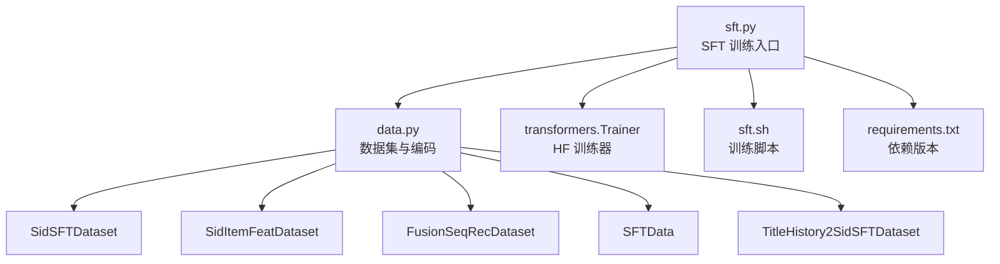
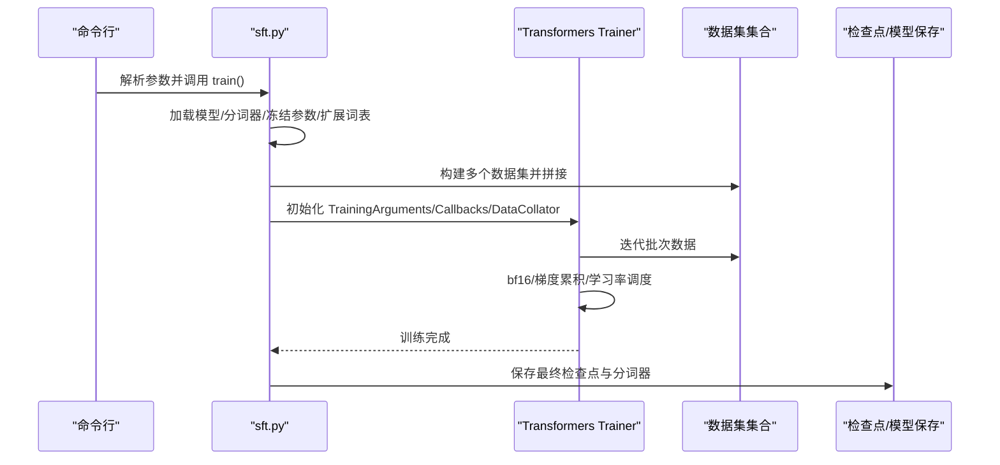
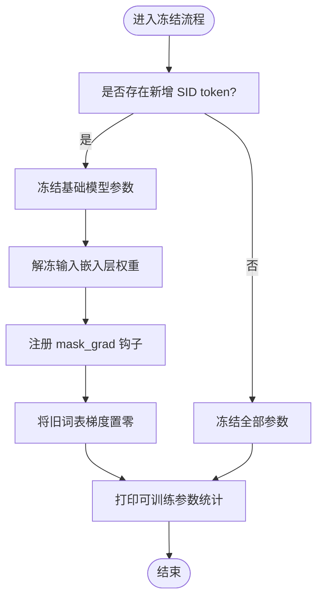
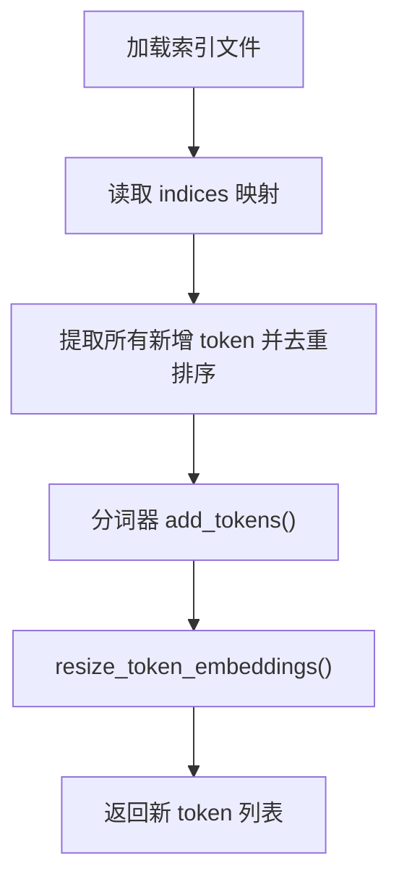
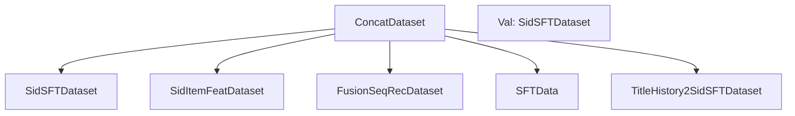
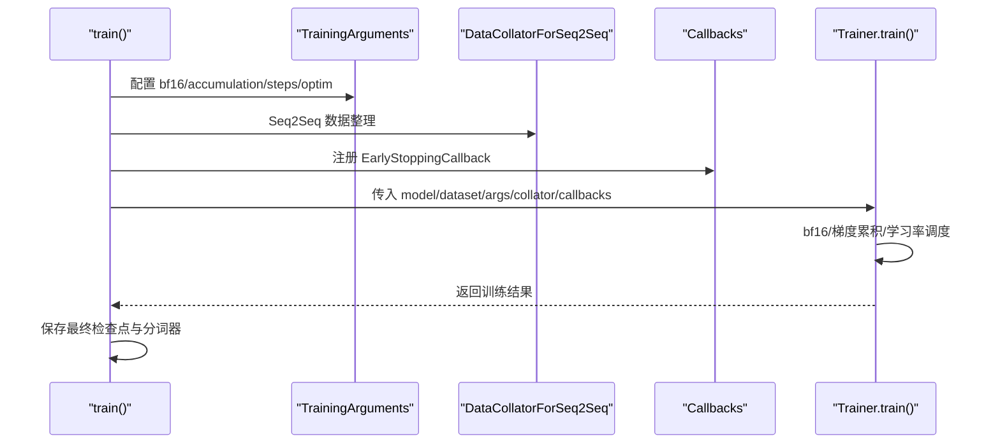
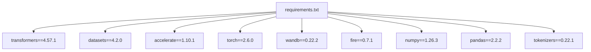

# 监督微调（SFT）

<cite>
**本文引用的文件**
- [sft.py](file://sft.py)
- [sft.sh](file://sft.sh)
- [data.py](file://data.py)
- [requirements.txt](file://requirements.txt)
</cite>

## 目录
1. [简介](#简介)
2. [项目结构](#项目结构)
3. [核心组件](#核心组件)
4. [架构总览](#架构总览)
5. [详细组件分析](#详细组件分析)
6. [依赖关系分析](#依赖关系分析)
7. [性能考量](#性能考量)
8. [故障排查指南](#故障排查指南)
9. [结论](#结论)
10. [附录](#附录)

## 简介
本文件围绕监督微调（Supervised Fine-Tuning, SFT）阶段展开，重点解析 sft.py 的实现机制与训练流程。内容覆盖：
- 预训练语言模型（如 LLaMA）的加载与可选“从零开始”训练模式
- 冻结基础模型参数（freeze_LLM）以仅微调新增语义ID（SID）嵌入层
- 基于 TokenExtender 的动态分词器词汇表扩展，以容纳新生成的 SID 标记
- 多数据集融合训练策略：SidSFTDataset、SidItemFeatDataset、FusionSeqRecDataset、SFTData、TitleHistory2SidSFTDataset 的拼接逻辑
- 基于 Hugging Face Transformers Trainer 的训练流程：bf16 混合精度、余弦退火学习率调度、梯度累积与早停回调
- 断点续训与最终检查点保存路径
- mask_grad 钩子确保仅新添加词嵌入参与梯度更新
- 常见问题排查：训练损失不下降、显存溢出、参数冻结失效等

## 项目结构
SFT 训练入口位于 sft.py，数据集构造与编码在 data.py，训练脚本在 sft.sh，依赖版本在 requirements.txt。

图表来源
- [sft.py](file://sft.py#L93-L276)
- [data.py](file://data.py#L484-L2090)
- [sft.sh](file://sft.sh#L1-L27)
- [requirements.txt](file://requirements.txt#L1-L139)

章节来源
- [sft.py](file://sft.py#L93-L276)
- [data.py](file://data.py#L484-L2090)
- [sft.sh](file://sft.sh#L1-L27)
- [requirements.txt](file://requirements.txt#L1-L139)

## 核心组件
- TokenExtender：从索引文件读取新增 token 列表，动态扩展分词器并调整嵌入维度
- 训练主流程 train：加载模型与分词器、处理 SID 新词、冻结/解冻参数、构建多数据集、初始化 Trainer 并执行训练
- 数据集族：多种 SFT 数据集按任务类型拼接，统一输出 input_ids、attention_mask、labels
- 学习率调度：余弦退火带预热的 LambdaLR
- 早停回调：EarlyStoppingCallback

章节来源
- [sft.py](file://sft.py#L33-L276)
- [data.py](file://data.py#L484-L2090)

## 架构总览
下图展示 SFT 训练从命令行到模型保存的关键交互。

图表来源
- [sft.py](file://sft.py#L93-L276)

## 详细组件分析

### 参数冻结与 SID 嵌入微调（freeze_LLM 与 mask_grad）
- 当 freeze_LLM=True 时，所有参数 requires_grad 被设为 False
- 若存在新增 SID token，则仅对输入嵌入层权重启用梯度，并通过注册 hook 将旧词表对应梯度置零，从而实现“仅新词嵌入参与更新”
- 输出可训练参数统计，便于监控冻结效果

图表来源
- [sft.py](file://sft.py#L164-L193)

章节来源
- [sft.py](file://sft.py#L164-L193)

### 动态分词器扩展（TokenExtender）
- 从 .index.json 中读取新增 token 集合，去重排序后加入分词器
- 调整模型嵌入维度以匹配新的词表大小
- 与 freeze_LLM 协同工作，确保仅新增 token 嵌入参与训练

图表来源
- [sft.py](file://sft.py#L33-L60)

章节来源
- [sft.py](file://sft.py#L33-L60)

### 多数据集融合训练策略
- 构建五类数据集并拼接：
  1) SidSFTDataset：基于历史 SID 序列预测下一个 SID
  2) SidItemFeatDataset：基于 SID 预测标题或反向映射
  3) FusionSeqRecDataset：融合序列推荐与物品特征（标题/描述）
  4) SFTData：通用 SFT 数据集
  5) TitleHistory2SidSFTDataset：基于历史标题序列预测目标 SID
- 使用 torch.utils.data.ConcatDataset 将多个 Dataset 合并为一个训练集
- 验证集采用 SidSFTDataset

图表来源
- [sft.py](file://sft.py#L194-L209)
- [data.py](file://data.py#L484-L2090)

章节来源
- [sft.py](file://sft.py#L194-L209)
- [data.py](file://data.py#L484-L2090)

### 训练流程与 Trainer 配置
- 模型加载：支持从预训练权重加载或从配置直接初始化（train_from_scratch）
- 分词器：pad_token 设置为 eos_token，padding_side 左侧
- 训练参数：per_device_train_batch_size/micro_batch_size 控制梯度累积；bf16；adamw_torch；warmup_steps；eval_strategy/save_strategy；save_total_limit；load_best_model_at_end
- 数据整理：DataCollatorForSeq2Seq，pad_to_multiple_of=8
- 回调：EarlyStoppingCallback(early_stopping_patience=3)
- 断点续训：resume_from_checkpoint 支持传入目录，内部定位 pytorch_model.bin
- 最终保存：trainer.save_model() 与 model.save_pretrained()/tokenizer.save_pretrained() 双路径保存

图表来源
- [sft.py](file://sft.py#L229-L271)

章节来源
- [sft.py](file://sft.py#L229-L271)

### 学习率调度（余弦退火 + 预热）
- 自定义 get_cosine_schedule_with_warmup 返回 LambdaLR
- 预热阶段线性上升，随后余弦退火至最低比例（默认 0.1）

章节来源
- [sft.py](file://sft.py#L71-L90)

### 训练脚本与多 GPU/多进程
- sft.sh 使用 torchrun --nproc_per_node 指定 GPU 数量
- 通过 batch_size 与 micro_batch_size 计算 gradient_accumulation_steps
- DDP 环境变量 WORLD_SIZE/LOCAL_RANK 自动适配设备映射

章节来源
- [sft.sh](file://sft.sh#L1-L27)
- [sft.py](file://sft.py#L120-L140)

### 数据集实现要点
- Tokenizer 包装：统一 encode/decode 行为，处理 bos/eos
- SidSFTDataset：构造指令 + 历史 SID + 目标 SID 的 prompt，标签对 prompt 部分置 -100
- SidItemFeatDataset：sid2title/title2sid 任务，随机选择任务类型
- FusionSeqRecDataset：历史 SID → 标题/描述，支持描述清洗与最长字符串选择
- TitleHistory2SidSFTDataset：历史标题序列 → 目标 SID
- UserPreference2sidSFTDataset：结合用户偏好与交互历史预测目标 SID

章节来源
- [data.py](file://data.py#L1-L46)
- [data.py](file://data.py#L484-L649)
- [data.py](file://data.py#L670-L869)
- [data.py](file://data.py#L1300-L1699)
- [data.py](file://data.py#L1890-L2089)

## 依赖关系分析
- Python 与 PyTorch 版本：torch==2.6.0、torchaudio==2.6.0、torchvision==0.21.0
- Transformers 版本：transformers==4.57.1、datasets==4.2.0、accelerate==1.10.1
- 其他：fire==0.7.1、wandb==0.22.2、numpy==1.26.3、pandas==2.2.2、tokenizers==0.22.1

图表来源
- [requirements.txt](file://requirements.txt#L1-L139)

章节来源
- [requirements.txt](file://requirements.txt#L1-L139)

## 性能考量
- bf16 混合精度：在支持的硬件上显著降低显存占用并提升吞吐
- 梯度累积：通过 batch_size/micro_batch_size 计算，减少单卡内存压力
- DDP 与多 GPU：自动设备映射，世界规模大于 1 时调整累积步数
- 数据整理：pad_to_multiple_of=8，提高张量对齐效率
- early stopping：避免无效训练轮次，节省时间与资源

章节来源
- [sft.py](file://sft.py#L229-L271)
- [requirements.txt](file://requirements.txt#L1-L139)

## 故障排查指南
- 训练损失不下降
  - 检查 freeze_LLM 是否正确设置且 mask_grad 生效（仅新增词嵌入可训练）
  - 确认 sid_index_path 正确且新增 token 成功加入分词器
  - 核对学习率调度与 warmup 设置是否合理
  - 参考：[sft.py](file://sft.py#L164-L193)、[sft.py](file://sft.py#L229-L271)
- 显存溢出
  - 降低 per_device_train_batch_size 或增大 micro_batch_size 以增加梯度累积步数
  - 减小 cutoff_len 或 sample 规模
  - 在多 GPU 环境下确保 WORLD_SIZE/LOCAL_RANK 设置正确
  - 参考：[sft.py](file://sft.py#L120-L140)、[sft.py](file://sft.py#L229-L271)
- 参数冻结失效
  - 确保 freeze_LLM=True 且存在新增 token；否则会冻结全部参数
  - 检查是否正确注册 mask_grad 钩子，确保旧词表梯度被置零
  - 参考：[sft.py](file://sft.py#L164-L193)
- 断点续训失败
  - 确认 resume_from_checkpoint 指向包含 pytorch_model.bin 的目录
  - 参考：[sft.py](file://sft.py#L211-L216)
- 词汇表未扩展
  - 确认 sid_index_path 存在且索引文件格式正确
  - 参考：[sft.py](file://sft.py#L152-L163)

章节来源
- [sft.py](file://sft.py#L120-L193)
- [sft.py](file://sft.py#L211-L216)

## 结论
sft.py 提供了完整的 SFT 流程：从模型与分词器加载、SID 嵌入层的参数冻结与梯度掩码、动态词表扩展，到多数据集融合与基于 Transformers Trainer 的高效训练。通过 bf16、梯度累积、余弦退火学习率与早停回调，系统在多 GPU 环境下具备良好的可扩展性与稳定性。配合断点续训与最终检查点保存，便于在大规模训练中灵活管理进度与产出。

## 附录

### 关键参数与配置建议
- batch_size 与 micro_batch_size
  - 通过 batch_size/micro_batch_size 计算 gradient_accumulation_steps
  - 在多 GPU 环境下，DDP 会进一步按 WORLD_SIZE 调整累积步数
  - 参考：[sft.py](file://sft.py#L120-L140)
- 断点续训
  - 传入 resume_from_checkpoint 目录，内部定位 pytorch_model.bin
  - 参考：[sft.py](file://sft.py#L211-L216)
- 最终检查点保存
  - trainer.save_model() 与 model.save_pretrained()/tokenizer.save_pretrained() 双路径保存
  - 参考：[sft.py](file://sft.py#L265-L271)

章节来源
- [sft.py](file://sft.py#L120-L140)
- [sft.py](file://sft.py#L211-L216)
- [sft.py](file://sft.py#L265-L271)