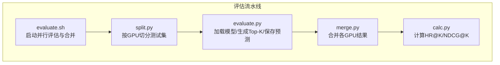
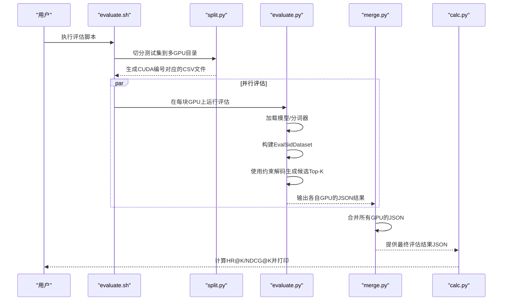
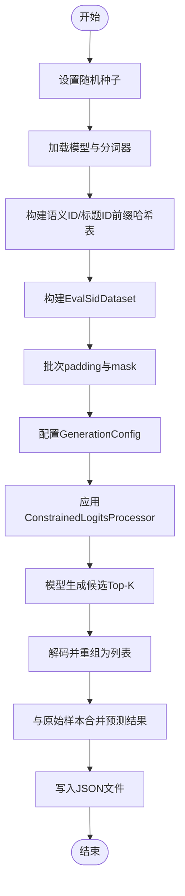
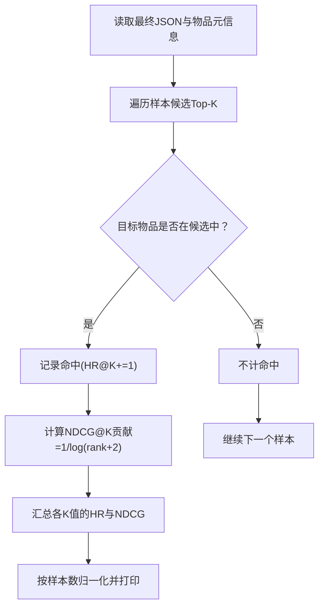
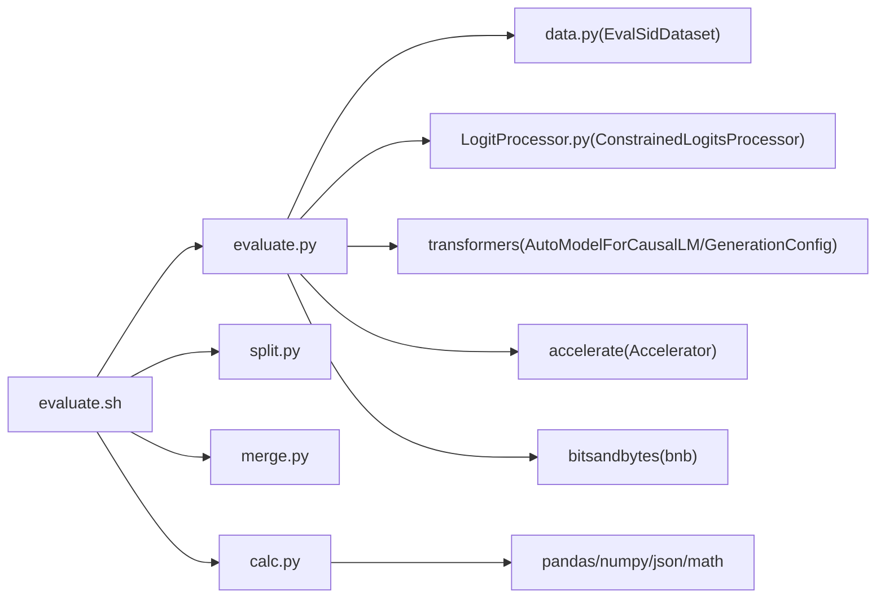

# 模型评估

<cite>
**本文引用的文件**
- [evaluate.py](file://evaluate.py)
- [evaluate.sh](file://evaluate.sh)
- [calc.py](file://calc.py)
- [split.py](file://split.py)
- [merge.py](file://merge.py)
- [data.py](file://data.py)
- [LogitProcessor.py](file://LogitProcessor.py)
- [README.md](file://README.md)
</cite>

## 目录
1. [简介](#简介)
2. [项目结构](#项目结构)
3. [核心组件](#核心组件)
4. [架构总览](#架构总览)
5. [详细组件分析](#详细组件分析)
6. [依赖关系分析](#依赖关系分析)
7. [性能考量](#性能考量)
8. [故障排查指南](#故障排查指南)
9. [结论](#结论)
10. [附录](#附录)

## 简介
本文件围绕推荐系统离线评估体系进行系统化说明，重点覆盖以下内容：
- 评估脚本 evaluate.py 的执行流程：加载训练好的模型、构造测试样本、使用约束解码生成候选Top-K推荐、保存预测结果。
- 评估指标计算：通过 calc.py 对生成的Top-K候选进行HR@K与NDCG@K的批量计算，并给出输出格式解析。
- 各评估指标的数学定义与在推荐场景中的意义。
- 离线评估的局限性与适用范围。
- 评估结果的输出格式解析与可视化建议，帮助用户分析模型表现并指导后续优化方向。

## 项目结构
评估子系统由多段脚本协同完成，形成“数据切分—并行推理—合并—指标计算”的流水线。下图展示评估相关文件之间的关系与职责分工。

图表来源
- [evaluate.sh](file://evaluate.sh#L1-L95)
- [split.py](file://split.py#L1-L22)
- [evaluate.py](file://evaluate.py#L1-L242)
- [merge.py](file://merge.py#L1-L19)
- [calc.py](file://calc.py#L1-L85)

章节来源
- [evaluate.sh](file://evaluate.sh#L1-L95)
- [README.md](file://README.md#L250-L259)

## 核心组件
- evaluate.sh：负责选择类别、切分测试集、并行调度GPU上的评估进程、等待完成、合并结果并触发指标计算。
- split.py：将单个CSV测试集按GPU数量均匀切分为多个子文件，便于分布式推理。
- evaluate.py：加载预训练模型与分词器，构建测试数据集，使用约束解码生成候选Top-K，将预测结果写入JSON。
- merge.py：将各GPU生成的JSON结果合并为最终评估结果文件。
- calc.py：读取最终JSON与物品元信息，计算HR@K与NDCG@K等指标，并打印统计结果。
- data.py：提供EvalSidDataset等数据集类，用于构造测试样本与历史序列。
- LogitProcessor.py：实现ConstrainedLogitsProcessor，基于前缀哈希表限制生成词汇，确保候选在SID空间内有效。

章节来源
- [evaluate.sh](file://evaluate.sh#L1-L95)
- [split.py](file://split.py#L1-L22)
- [evaluate.py](file://evaluate.py#L1-L242)
- [merge.py](file://merge.py#L1-L19)
- [calc.py](file://calc.py#L1-L85)
- [data.py](file://data.py#L592-L711)
- [LogitProcessor.py](file://LogitProcessor.py#L1-L63)

## 架构总览
评估流水线以Shell脚本为入口，串联数据切分、模型推理、结果合并与指标计算四个阶段，如下所示。

图表来源
- [evaluate.sh](file://evaluate.sh#L1-L95)
- [split.py](file://split.py#L1-L22)
- [evaluate.py](file://evaluate.py#L1-L242)
- [merge.py](file://merge.py#L1-L19)
- [calc.py](file://calc.py#L1-L85)

## 详细组件分析

### evaluate.py：加载模型与生成Top-K
- 设备与随机种子：根据CUDA可用性设置设备；统一设置随机种子以保证可复现性。
- 模型与分词器：从指定路径加载预训练模型与分词器，设置模型为评估模式。
- 语料与前缀约束：读取物品信息文件，构造语义ID与标题ID的前缀序列，建立哈希表映射，从而在生成时仅允许合法的后续token，确保候选在SID空间内。
- 数据集：使用EvalSidDataset构造测试样本，包含用户交互历史与目标物品SID，返回input_ids与attention_mask。
- 推理与解码：对每个批次进行padding，配置GenerationConfig（含beam数、长度惩罚、最大新token数等），使用ConstrainedLogitsProcessor实施前缀约束，生成候选Top-K序列。
- 结果保存：将生成的候选Top-K与原始样本合并，写入JSON文件。

图表来源
- [evaluate.py](file://evaluate.py#L1-L242)
- [LogitProcessor.py](file://LogitProcessor.py#L1-L63)
- [data.py](file://data.py#L592-L711)

章节来源
- [evaluate.py](file://evaluate.py#L1-L242)
- [LogitProcessor.py](file://LogitProcessor.py#L1-L63)
- [data.py](file://data.py#L592-L711)

### evaluate.sh：离线评估脚本
- 选择类别与文件：根据类别自动定位训练/测试/信息文件，若缺失则跳过该类别。
- 数据切分：调用split.py将测试集按GPU数量切分，生成CUDA编号对应的CSV文件。
- 并行评估：为每个可用GPU启动一个evaluate.py进程，传入base_model、info_file、category、test_data_path、result_json_data等参数。
- 结果合并：等待所有进程完成后，调用merge.py合并各GPU的JSON结果。
- 指标计算：调用calc.py对最终JSON与物品元信息进行HR@K与NDCG@K计算。

章节来源
- [evaluate.sh](file://evaluate.sh#L1-L95)

### split.py：测试集切分
- 将输入CSV按行数均分给多个CUDA设备，生成对应编号的子文件，便于并行评估。

章节来源
- [split.py](file://split.py#L1-L22)

### merge.py：结果合并
- 读取各GPU的JSON文件，将其中的样本列表合并为一个大列表，输出到最终结果文件。

章节来源
- [merge.py](file://merge.py#L1-L19)

### calc.py：HR@K与NDCG@K计算
- 读取最终评估结果JSON与物品元信息，构建物品名称到ID的映射。
- 遍历每个样本的候选Top-K列表，计算命中与排序奖励：
  - HR@K：若目标物品出现在Top-K内，则计为1，否则为0。
  - NDCG@K：若目标物品位于位置rank，则贡献1/log(rank+2)，并按标准归一化。
- 统计不同K值下的平均HR与NDCG，打印结果。

图表来源
- [calc.py](file://calc.py#L1-L85)

章节来源
- [calc.py](file://calc.py#L1-L85)

### 数据集类：EvalSidDataset
- 输入构造：将用户交互历史拼接为提示文本，目标为下一个物品的SID，返回input_ids与attention_mask。
- 测试模式：在测试模式下仅返回编码后的input_ids与attention_mask，供evaluate.py直接推理使用。

章节来源
- [data.py](file://data.py#L592-L711)

### 约束解码：ConstrainedLogitsProcessor
- 前缀哈希：根据当前生成序列的固定后缀长度构建哈希键，查询允许的下一token集合。
- 逻辑处理：对每个beam构造掩码，仅保留允许的token，其余置为极小值，再加到log_softmax分数上，实现约束解码。

章节来源
- [LogitProcessor.py](file://LogitProcessor.py#L1-L63)

## 依赖关系分析
评估模块内部依赖关系如下：

图表来源
- [evaluate.py](file://evaluate.py#L1-L242)
- [data.py](file://data.py#L592-L711)
- [LogitProcessor.py](file://LogitProcessor.py#L1-L63)
- [evaluate.sh](file://evaluate.sh#L1-L95)
- [split.py](file://split.py#L1-L22)
- [merge.py](file://merge.py#L1-L19)
- [calc.py](file://calc.py#L1-L85)

章节来源
- [evaluate.py](file://evaluate.py#L1-L242)
- [evaluate.sh](file://evaluate.sh#L1-L95)
- [calc.py](file://calc.py#L1-L85)

## 性能考量
- 并行策略：通过evaluate.sh对测试集进行GPU级切分，结合多GPU并行推理，显著缩短评估耗时。
- 解码效率：采用beam search与前缀约束，既保证多样性又避免无效token生成，提高生成质量与速度。
- 内存占用：模型加载为bf16精度并自动分配至GPU，注意显存上限；必要时降低num_beams或max_new_tokens。
- I/O瓶颈：split/merge阶段涉及大量磁盘读写，建议使用SSD与合理分片大小平衡吞吐与延迟。

[本节为通用性能建议，不直接分析具体文件]

## 故障排查指南
- 缺少测试/信息文件：evaluate.sh会检查测试文件与信息文件是否存在，不存在则跳过该类别并打印错误信息。请确认路径与文件命名一致。
- CUDA可见设备：evaluate.py固定使用CUDA 0，若需切换，请修改环境变量或脚本参数。
- 结果合并失败：若无任何JSON文件生成，merge.py将无法合并。请检查evaluate.py是否成功写入结果文件。
- 指标计算异常：calc.py在候选中找不到目标物品时会打印日志并增加计数，建议检查候选去重与SID映射是否正确。
- 约束解码失效：若前缀哈希未命中，ConstrainedLogitsProcessor会返回空集合，导致生成被阻断。请确认分词器与哈希键长度配置一致。

章节来源
- [evaluate.sh](file://evaluate.sh#L1-L95)
- [evaluate.py](file://evaluate.py#L1-L242)
- [calc.py](file://calc.py#L1-L85)

## 结论
本评估体系通过“切分—并行推理—合并—指标计算”四步法，实现了高效、可扩展的离线评估。evaluate.py负责加载模型与生成Top-K候选，calc.py负责HR@K与NDCG@K的批量计算。结合README中的快速开始与评估说明，用户可以快速复现实验并获得可靠的离线指标，为后续模型优化提供依据。

[本节为总结性内容，不直接分析具体文件]

## 附录

### 评估指标定义与意义
- HR@K（Hit Rate@K）
  - 定义：在Top-K推荐中是否包含真实目标物品。若包含则为1，否则为0。
  - 意义：衡量推荐系统在Top-K内的召回能力，越接近1越好。
- NDCG@K（Normalized Discounted Cumulative Gain@K）
  - 定义：对目标物品在Top-K中的排序位置进行折扣累积，再按标准进行归一化。
  - 意义：同时考虑排序质量与位置权重，位置越靠前贡献越大，越接近1越好。

章节来源
- [calc.py](file://calc.py#L1-L85)

### 离线评估的局限性与适用范围
- 局限性
  - 仅基于历史交互与模型生成，无法反映真实点击/购买行为与长期留存。
  - 无法捕捉用户偏好随时间变化与冷启动问题。
  - 评测结果受数据划分方式影响，存在偏差风险。
- 适用范围
  - 快速筛选与比较不同模型/超参组合的相对优劣。
  - 作为A/B实验前的快速过滤工具，减少线上试验成本。
  - 用于模型训练过程中的监控与早停判断。

[本节为概念性说明，不直接分析具体文件]

### 评估结果输出格式解析与可视化建议
- 输出文件
  - evaluate.py：每条样本包含原始字段与新增的predict字段（候选Top-K列表）。
  - merge.py：将各GPU结果合并为单一JSON文件。
  - calc.py：打印HR@K与NDCG@K在不同K值下的平均值。
- 可视化建议
  - 折线图：横轴为K值，纵轴为HR@K与NDCG@K，对比不同模型或超参组。
  - 热力图：展示不同类别/时间窗口下的HR@K与NDCG@K分布，识别性能热点与洼地。
  - 质量散点：HR@K与NDCG@K的散点分布，辅助识别“高HR低NDCG”或“低HR高NDCG”的样本类型。
- 分析要点
  - 关注HR@K与NDCG@K的单调性与一致性，异常波动可能指示数据不平衡或生成质量下降。
  - 结合候选数量（beam数）与长度惩罚等解码参数，观察其对指标的影响，指导解码策略优化。

章节来源
- [evaluate.py](file://evaluate.py#L211-L238)
- [merge.py](file://merge.py#L1-L19)
- [calc.py](file://calc.py#L1-L85)