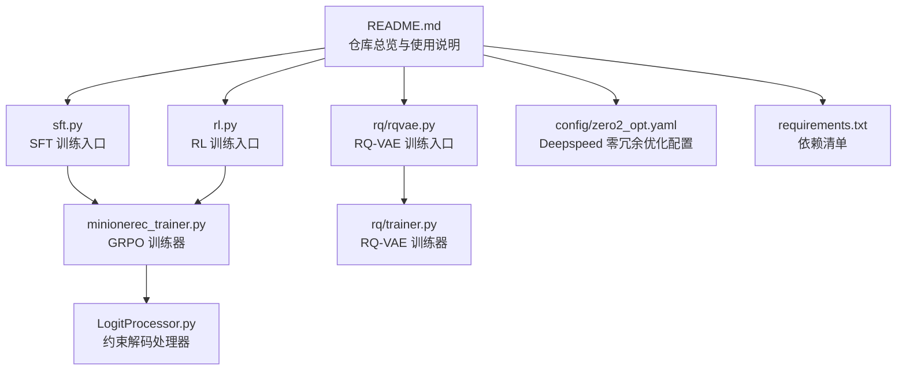
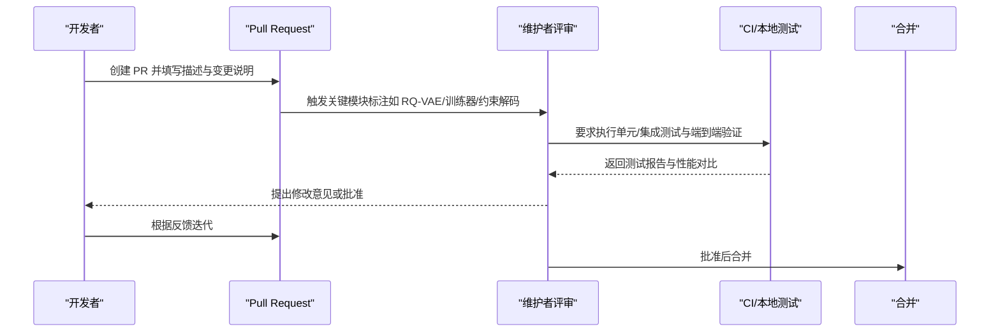

# 贡献指南

<cite>
**本文引用的文件**
- [README.md](file://README.md)
- [requirements.txt](file://requirements.txt)
- [minionerec_trainer.py](file://minionerec_trainer.py)
- [LogitProcessor.py](file://LogitProcessor.py)
- [rq/rqvae.py](file://rq/rqvae.py)
- [rq/trainer.py](file://rq/trainer.py)
- [config/zero2_opt.yaml](file://config/zero2_opt.yaml)
- [sft.py](file://sft.py)
- [rl.py](file://rl.py)
</cite>

## 目录
1. [简介](#简介)
2. [项目结构](#项目结构)
3. [核心贡献流程](#核心贡献流程)
4. [代码风格规范](#代码风格规范)
5. [分支与合并策略](#分支与合并策略)
6. [Pull Request 要求](#pull-request-要求)
7. [测试与验证](#测试与验证)
8. [文档更新规则](#文档更新规则)
9. [关键模块变更的审批流程](#关键模块变更的审批流程)
10. [性能优化与新功能建议](#性能优化与新功能建议)
11. [故障排查与常见问题](#故障排查与常见问题)
12. [结语](#结语)

## 简介
本贡献指南旨在帮助开发者高效参与 MiniOneRec 项目的开发与维护，明确代码风格、提交流程、测试与文档更新要求，并对涉及关键模块（如 RQ-VAE 训练、MiniOneRec 训练器、约束解码等）的变更建立清晰的评审机制。同时鼓励社区提交新功能（如新的 SID 构建算法）、性能优化与文档改进，并提供联系维护者的方式。

## 项目结构
MiniOneRec 是一个面向生成式推荐的端到端框架，包含数据处理、SID 构建、监督微调（SFT）、推荐导向强化学习（RL）等阶段。核心文件与职责概览：
- 训练入口与流水线：sft.py、rl.py
- 训练器与约束解码：minionerec_trainer.py、LogitProcessor.py
- SID 构建与训练：rq/rqvae.py、rq/trainer.py 及相关 RQ-Kmeans 实现
- 配置与依赖：config/zero2_opt.yaml、requirements.txt
- 仓库总览与使用说明：README.md

图表来源
- [README.md](file://README.md#L59-L120)
- [sft.py](file://sft.py#L93-L200)
- [rl.py](file://rl.py#L1-L120)
- [minionerec_trainer.py](file://minionerec_trainer.py#L1-L120)
- [LogitProcessor.py](file://LogitProcessor.py#L1-L63)
- [rq/rqvae.py](file://rq/rqvae.py#L1-L95)
- [rq/trainer.py](file://rq/trainer.py#L1-L120)
- [config/zero2_opt.yaml](file://config/zero2_opt.yaml#L1-L20)
- [requirements.txt](file://requirements.txt#L1-L139)

章节来源
- [README.md](file://README.md#L59-L120)

## 核心贡献流程
- 提交前准备
  - 在本地创建隔离环境并安装依赖，确保运行环境与 requirements.txt 一致。
  - 阅读 README.md 的“快速开始”和“全管道 walkthrough”，确认本地环境满足运行条件。
- 分支策略
  - 基于主分支创建特性分支进行开发；避免直接在主分支提交。
- 提交流程
  - 提交前完成本地测试与格式检查；编写清晰的提交信息与 PR 描述。
  - 关联相关 issue 或需求背景，便于评审与追踪。

章节来源
- [README.md](file://README.md#L92-L128)
- [requirements.txt](file://requirements.txt#L1-L139)

## 代码风格规范
- 语言与工具
  - 使用 Python 编写；遵循通用 Python 风格与可读性原则。
  - 推荐使用统一的格式化工具（例如 black、isort）以保持一致性；如无统一配置，请参考现有代码的缩进、命名与注释风格。
- 文件组织
  - 按功能分层或按模块划分文件夹（如 rq/、data/），保持高内聚低耦合。
- 注释与文档
  - 函数与类需提供必要的 docstring；变量命名清晰、参数与返回值说明完整。
- 日志与错误处理
  - 使用标准日志记录关键信息；对异常进行显式捕获与提示，避免静默失败。

说明：本节为通用规范建议，具体风格以仓库现有实现为准。

## 分支与合并策略
- 分支命名
  - 特性分支：feature/xxx
  - 修复分支：fix/xxx
  - 文档分支：docs/xxx
- 合并策略
  - 使用快进合并或小型变更的 squash 合并；复杂改动建议拆分为多个 PR。
  - 合并前必须通过 CI 检查与至少一位维护者审核。

说明：本节为通用流程建议，具体以仓库实际配置为准。

## Pull Request 要求
- 内容完整性
  - PR 描述中包含变更动机、影响范围、测试方法与验证结果。
  - 如涉及关键模块（见下一节），请在描述中明确标注。
- 审核与批准
  - 至少一名维护者批准后方可合并。
- CI 与质量门禁
  - 通过自动化的格式检查与基础测试；必要时补充单元测试或集成测试。

说明：本节为通用要求建议，具体以仓库实际配置为准。

## 测试与验证
- 单元测试
  - 对新增或修改的函数/类补充单元测试，覆盖正常与边界场景。
- 集成测试
  - 在最小数据集上验证端到端流程（如 SFT/RL），确保关键路径可用。
- 性能回归
  - 对性能敏感的模块（如 RQ-VAE、约束解码）进行基准对比，避免显著退化。
- 运行验证
  - 使用 README.md 中的“Quickstart”与“Full Pipeline Walk-through”步骤验证整体可用性。

章节来源
- [README.md](file://README.md#L129-L257)

## 文档更新规则
- 新增/修改功能
  - 更新 README.md 中的“Upcoming Features”或相应章节，补充使用说明与示例。
- 参数与接口变更
  - 更新对应脚本或模块的命令行参数说明与注释，保持内外一致。
- 示例与脚本
  - 若新增 shell 脚本或 Python 入口，补充在 README.md 的“Repository Overview”或“Walk-through”中的说明。

章节来源
- [README.md](file://README.md#L59-L120)
- [README.md](file://README.md#L259-L266)

## 关键模块变更的审批流程
以下模块属于核心路径，任何修改均需额外审慎评估与批准：

- RQ-VAE 训练链路
  - 包括入口脚本与训练器：rq/rqvae.py、rq/trainer.py
  - 影响范围：SID 构建质量、索引生成、下游 SFT/RL 数据准备
  - 审批要点：训练稳定性、收敛性、碰撞率指标、checkpoint 策略
- MiniOneRec 训练器与约束解码
  - 包括训练器与 logits 处理器：minionerec_trainer.py、LogitProcessor.py
  - 影响范围：RL 训练稳定性、生成约束、召回与排序指标
  - 审批要点：采样策略、beam/search 一致性、奖励归一化与 KL 正则
- SFT/RL 入口脚本
  - 包括 sft.py、rl.py
  - 影响范围：数据加载、参数传递、分布式与混合精度设置
  - 审批要点：分布式兼容性、参数校验、资源占用与日志输出

图表来源
- [rq/rqvae.py](file://rq/rqvae.py#L1-L95)
- [rq/trainer.py](file://rq/trainer.py#L1-L120)
- [minionerec_trainer.py](file://minionerec_trainer.py#L1-L120)
- [LogitProcessor.py](file://LogitProcessor.py#L1-L63)
- [sft.py](file://sft.py#L93-L200)
- [rl.py](file://rl.py#L1-L120)

章节来源
- [rq/rqvae.py](file://rq/rqvae.py#L1-L95)
- [rq/trainer.py](file://rq/trainer.py#L1-L120)
- [minionerec_trainer.py](file://minionerec_trainer.py#L1-L120)
- [LogitProcessor.py](file://LogitProcessor.py#L1-L63)
- [sft.py](file://sft.py#L93-L200)
- [rl.py](file://rl.py#L1-L120)

## 性能优化与新功能建议
- 性能优化方向
  - 训练稳定性：合理设置 warmup、梯度裁剪、学习率调度；关注 NaN 检测与早停策略。
  - 采样与解码：优化 beam search/温度采样与约束解码的组合，减少重复计算。
  - 分布式与混合精度：结合 Deepspeed 零冗余优化配置，平衡显存与吞吐。
- 新功能建议
  - 新的 SID 构建算法：在 README.md 的“Upcoming Features”中提出路线图，附带预期收益与实现难度评估。
  - 数据与奖励：新增数据源或奖励函数时，提供最小复现实验与指标对比。
- 社区协作
  - 提交前先搜索现有 issue/PR，避免重复；在讨论区或 issue 中先行沟通方案。

章节来源
- [config/zero2_opt.yaml](file://config/zero2_opt.yaml#L1-L20)
- [README.md](file://README.md#L259-L266)

## 故障排查与常见问题
- 环境与依赖
  - 确认 Python 版本与依赖版本与 requirements.txt 一致；若出现 CUDA/驱动不匹配，调整 torch 版本或编译选项。
- 训练异常
  - RQ-VAE：关注训练损失是否为 NaN，检查梯度裁剪与学习率；必要时降低 batch size 或增大 warmup。
  - MiniOneRec 训练器：检查 num_generations 与全局 batch size 的整除关系；确保 tokenizer pad/eos 设置正确。
- 解码约束
  - 若出现无法生成或生成为空，检查约束哈希表构建与 prefix_allowed_tokens_fn 的映射是否正确。
- 分布式与设备
  - 多卡训练时注意 device_map、local_rank 与 WORLD_SIZE 的设置；Deepspeed 零冗余优化需与分布式策略配合。

章节来源
- [rq/trainer.py](file://rq/trainer.py#L93-L125)
- [minionerec_trainer.py](file://minionerec_trainer.py#L393-L412)
- [LogitProcessor.py](file://LogitProcessor.py#L23-L63)
- [config/zero2_opt.yaml](file://config/zero2_opt.yaml#L1-L20)

## 结语
感谢您对 MiniOneRec 的关注与贡献。请在提交 PR 前确保变更经过充分测试与文档更新，并在关键模块变更时主动标注与沟通。我们期待与社区共同推动生成式推荐技术的发展与落地。