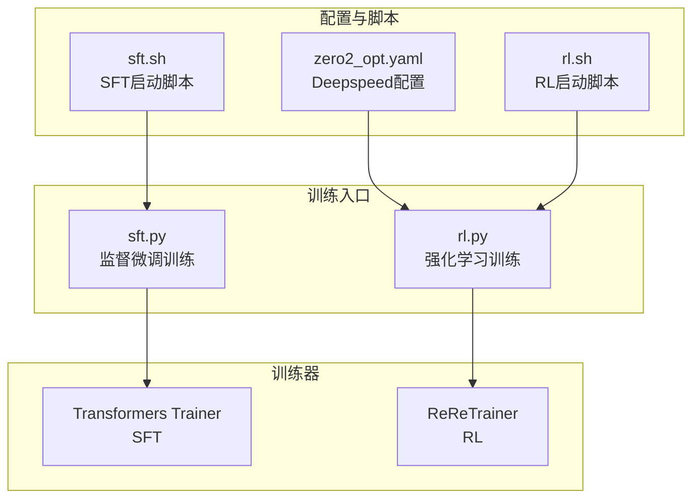
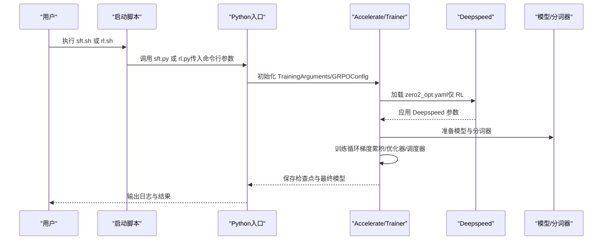
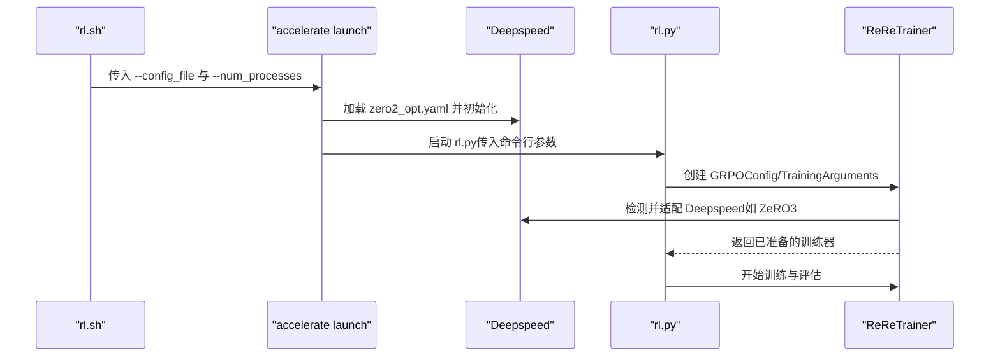
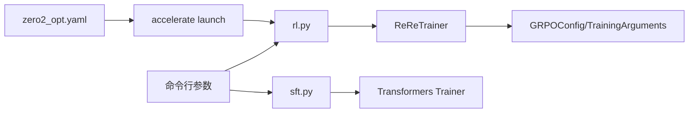

# 配置说明

<cite>
**本文引用的文件**
- [config/zero2_opt.yaml](file://config/zero2_opt.yaml)
- [sft.py](file://sft.py)
- [rl.py](file://rl.py)
- [minionerec_trainer.py](file://minionerec_trainer.py)
- [sft.sh](file://sft.sh)
- [rl.sh](file://rl.sh)
</cite>

## 目录
1. [简介](#简介)
2. [项目结构](#项目结构)
3. [核心组件](#核心组件)
4. [架构总览](#架构总览)
5. [详细组件分析](#详细组件分析)
6. [依赖分析](#依赖分析)
7. [性能考虑](#性能考虑)
8. [故障排查指南](#故障排查指南)
9. [结论](#结论)
10. [附录：典型配置场景与调优建议](#附录典型配置场景与调优建议)

## 简介
本文件围绕配置系统进行系统化说明，重点以零冗余优化配置文件 zero2_opt.yaml 为核心，逐项解释其关键参数的含义、取值范围及对训练过程的影响，并阐述该配置在 sft.py 和 rl.py 主程序中的加载与解析方式。同时给出命令行参数与配置文件的优先级关系，帮助用户灵活调整实验设置；并提供典型场景（单卡/多卡、不同规模模型）的配置建议与最佳实践。

## 项目结构
本仓库包含两类主要入口脚本：
- 常规监督微调（SFT）：通过 sft.py 启动，使用 Transformers Trainer 进行训练。
- 强化学习（RL）：通过 rl.py 启动，使用自定义 ReReTrainer（基于 TRL 的 GRPOTrainer 扩展）进行训练。

配置文件 zero2_opt.yaml 用于 Deepspeed 分布式训练的加速与内存优化，由 accelerate launch 在 rl.py 训练时加载。

图表来源
- [config/zero2_opt.yaml](file://config/zero2_opt.yaml#L1-L20)
- [sft.sh](file://sft.sh#L1-L27)
- [rl.sh](file://rl.sh#L1-L42)
- [sft.py](file://sft.py#L212-L275)
- [minionerec_trainer.py](file://minionerec_trainer.py#L211-L378)

章节来源
- [config/zero2_opt.yaml](file://config/zero2_opt.yaml#L1-L20)
- [sft.sh](file://sft.sh#L1-L27)
- [rl.sh](file://rl.sh#L1-L42)

## 核心组件
- 零冗余优化配置（Deepspeed）
  - 作用：在多卡分布式训练中降低显存占用、提升吞吐，支持 BF16 混合精度。
  - 关键参数：zero_stage、contiguous_gradients、overlap_comm、reduce_scatter、reduce_bucket_size、allgather_bucket_size、offload_optimizer_device、offload_param_device、mixed_precision、debug 等。
- SFT 训练入口（sft.py）
  - 使用 Transformers Trainer，通过命令行参数控制 batch、学习率、梯度累积步数、bf16 等。
- RL 训练入口（rl.py）
  - 使用 ReReTrainer（基于 GRPO），通过命令行参数控制生成数量、温度、beta、bf16、优化器等。
- 启动脚本
  - sft.sh：torchrun 启动，直接调用 sft.py。
  - rl.sh：accelerate launch 启动，加载 zero2_opt.yaml 并调用 rl.py。

章节来源
- [config/zero2_opt.yaml](file://config/zero2_opt.yaml#L1-L20)
- [sft.py](file://sft.py#L212-L275)
- [rl.py](file://rl.py#L263-L306)
- [minionerec_trainer.py](file://minionerec_trainer.py#L211-L378)
- [sft.sh](file://sft.sh#L1-L27)
- [rl.sh](file://rl.sh#L1-L42)

## 架构总览
下图展示从启动脚本到训练器再到 Deepspeed 的整体流程，以及命令行参数与配置文件的交互关系。

图表来源
- [sft.sh](file://sft.sh#L1-L27)
- [rl.sh](file://rl.sh#L1-L42)
- [config/zero2_opt.yaml](file://config/zero2_opt.yaml#L1-L20)
- [sft.py](file://sft.py#L212-L275)
- [rl.py](file://rl.py#L263-L306)
- [minionerec_trainer.py](file://minionerec_trainer.py#L211-L378)

## 详细组件分析

### 配置文件 zero2_opt.yaml 参数详解
- compute_environment
  - 含义：计算环境类型。LOCAL_MACHINE 表示本地机器训练。
  - 影响：决定分布式/加速器初始化策略。
- distributed_type
  - 含义：分布式训练类型。DEEPSPEED 表示启用 Deepspeed。
  - 影响：触发 Deepspeed 初始化与参数应用。
- num_machines
  - 含义：机器数量。1 表示单机多卡。
  - 影响：与 num_processes 共同决定进程拓扑。
- mixed_precision
  - 含义：混合精度类型。bf16 提升吞吐并降低显存。
  - 影响：影响 bf16/bfloat16 的使用与兼容性。
- deepspeed_config.zero_stage
  - 含义：ZeRO 优化级别。2 表示参数分片，显著降低显存占用。
  - 影响：显存占用大幅下降，通信开销增加。
- deepspeed_config.contiguous_gradients
  - 含义：梯度聚合是否连续存储。
  - 影响：影响梯度传输效率与内存布局。
- deepspeed_config.overlap_comm
  - 含义：是否重叠通信与计算。
  - 影响：减少等待时间，提高吞吐。
- deepspeed_config.reduce_scatter
  - 含义：是否使用 reduce-scatter 通信原语。
  - 影响：降低通信带宽需求。
- deepspeed_config.reduce_bucket_size / allgather_bucket_size
  - 含义：通信桶大小（字节）。较大桶可提升带宽利用率但增加延迟。
  - 影响：平衡吞吐与延迟。
- deepspeed_config.offload_optimizer_device / offload_param_device
  - 含义：优化器/参数离线设备。none 表示不离线。
  - 影响：进一步降低显存占用，可能增加 CPU/GPU 间带宽压力。
- debug
  - 含义：调试开关。
  - 影响：输出更多诊断信息，便于定位问题。

章节来源
- [config/zero2_opt.yaml](file://config/zero2_opt.yaml#L1-L20)

### SFT 训练入口（sft.py）中的配置与参数
- 命令行参数（train 函数签名）
  - base_model、train_file、eval_file、output_dir、sample、seed
  - batch_size、micro_batch_size、num_epochs、learning_rate、cutoff_len
  - group_by_length、freeze_LLM
  - wandb_project、wandb_run_name、resume_from_checkpoint、train_from_scratch
  - sid_index_path、item_meta_path
- 关键逻辑
  - 自动推导 gradient_accumulation_steps = batch_size // micro_batch_size，并在 DDP 下按世界规模进一步折半。
  - bf16=True 显式启用 BF16 训练。
  - 使用 Transformers Trainer 的 TrainingArguments 控制训练超参（如 warmup_steps、logging_steps、optim、eval_strategy、save_strategy 等）。
  - 支持冻结 LLM 参数（仅训练新增 token 嵌入）。
- 与 Deepspeed 的关系
  - 代码中存在注释占位符（deepspeed=deepspeed），当前未直接传入 deepspeed 参数；若需启用 Deepspeed，可在 args 中显式传入或通过 accelerate/transformers 的集成机制生效。

章节来源
- [sft.py](file://sft.py#L93-L136)
- [sft.py](file://sft.py#L212-L275)

### RL 训练入口（rl.py）中的配置与参数
- 命令行参数（train 函数签名）
  - model_path、seed、train_file、eval_file、info_file、category
  - output_dir、train_batch_size、eval_batch_size、gradient_accumulation_steps、temperature、add_gt、eval_step、num_generations、num_train_epochs、learning_rate、beta、beam_search、test_during_training、dynamic_sampling、mask_all_zero、sync_ref_model、test_beam、reward_type、sample_train、ada_path、cf_path、sid_index_path、item_meta_path、dapo、gspo
- 关键逻辑
  - 使用 GRPOConfig 初始化训练配置，包含 bf16、optim、warmup_ratio、max_grad_norm、lr_scheduler_type 等。
  - 通过 ReReTrainer（minionerec_trainer.py）封装生成、奖励函数、参考模型同步等。
  - 通过 accelerate launch 加载 zero2_opt.yaml，实现 Deepspeed 分布式训练。
- 与 Deepspeed 的关系
  - accelerate launch 会读取 --config_file 指定的 zero2_opt.yaml，并将其传递给底层 Deepspeed 初始化。

章节来源
- [rl.py](file://rl.py#L30-L112)
- [rl.py](file://rl.py#L263-L306)
- [minionerec_trainer.py](file://minionerec_trainer.py#L211-L378)
- [rl.sh](file://rl.sh#L1-L42)

### 配置文件加载与解析流程（重点：rl.py）
- accelerate launch
  - 通过 --config_file ./config/zero2_opt.yaml 将 Deepspeed 配置注入训练进程。
  - 通过 --num_processes 指定 GPU 数量，--main_process_port 指定主进程端口。
- ReReTrainer
  - 在初始化阶段检测是否启用 Deepspeed ZeRO3（用于参考模型准备），并在需要时调用 prepare_deepspeed。
  - 通过 Accelerate 的加速器能力与 Deepspeed 集成，实现分布式训练。

图表来源
- [rl.sh](file://rl.sh#L1-L42)
- [config/zero2_opt.yaml](file://config/zero2_opt.yaml#L1-L20)
- [rl.py](file://rl.py#L263-L306)
- [minionerec_trainer.py](file://minionerec_trainer.py#L283-L302)

## 依赖分析
- 配置文件与入口脚本
  - zero2_opt.yaml 仅在 rl.sh 中通过 accelerate launch 被显式加载；sft.sh 直接调用 sft.py，不涉及 Deepspeed 配置文件。
- 训练器与 Deepspeed
  - ReReTrainer 内部通过 is_deepspeed_zero3_enabled 与 prepare_deepspeed 判断与适配 Deepspeed。
  - SFT 的 Trainer 当前未直接传入 deepspeed 参数，可通过其他方式（如环境变量或集成）启用。
- 命令行参数与配置文件的优先级
  - accelerate launch 的命令行参数（如 --num_processes、--main_process_port）优先于脚本内部硬编码的进程数。
  - 对于训练超参（如学习率、batch size、bf16 等），命令行参数通常优先于 Trainer/GRPO 的默认值；具体优先级取决于各框架实现细节。建议在脚本中明确覆盖默认值，避免歧义。

图表来源
- [rl.sh](file://rl.sh#L1-L42)
- [config/zero2_opt.yaml](file://config/zero2_opt.yaml#L1-L20)
- [rl.py](file://rl.py#L263-L306)
- [sft.py](file://sft.py#L212-L275)

章节来源
- [rl.sh](file://rl.sh#L1-L42)
- [sft.sh](file://sft.sh#L1-L27)
- [minionerec_trainer.py](file://minionerec_trainer.py#L283-L302)

## 性能考虑
- 显存与吞吐权衡
  - ZeRO2（zero_stage=2）显著降低显存占用，适合大模型/大批量训练；但通信开销增大，需合理设置 reduce_bucket_size 与 allgather_bucket_size。
  - BF16（mixed_precision=bf16）可提升吞吐并节省显存，需确保硬件与驱动支持。
- 通信优化
  - overlap_comm=true 可重叠通信与计算，减少等待时间。
  - reduce_scatter=true 降低通信带宽需求。
- 梯度累积与批大小
  - gradient_accumulation_steps 由 batch_size/micro_batch_size 推导；在 DDP 下还会按世界规模进一步折半，需结合 num_processes 统筹规划。
- 生成与奖励
  - num_generations 必须能被全局批大小整除，否则会抛出异常；应根据 per_device_train_batch_size 与 num_processes 调整。
  - beam_search 与 temperature 控制生成多样性与稳定性，需结合任务目标调优。

章节来源
- [config/zero2_opt.yaml](file://config/zero2_opt.yaml#L1-L20)
- [sft.py](file://sft.py#L120-L140)
- [rl.py](file://rl.py#L263-L306)
- [minionerec_trainer.py](file://minionerec_trainer.py#L393-L412)

## 故障排查指南
- Deepspeed 初始化失败
  - 检查 zero2_opt.yaml 是否正确加载（rl.sh 中 --config_file）。
  - 确认 --num_processes 与实际 GPU 数一致，且 --main_process_port 未被占用。
- 生成数量与批大小不匹配
  - 报错提示 num_generations 必须能被全局批大小整除；请调整 per_device_train_batch_size 或 num_processes。
- 温度与采样异常
  - beam_search 与 temperature 的组合会影响生成稳定性；若出现重复或无意义输出，适当降低 temperature 或开启长度惩罚。
- 冻结 LLM 参数无效
  - 若 freeze_LLM=True 但未添加新 token，将导致全部参数被冻结；确认 sid_index_path 与 item_meta_path 正确，且确实新增了 token。

章节来源
- [rl.sh](file://rl.sh#L1-L42)
- [minionerec_trainer.py](file://minionerec_trainer.py#L393-L412)
- [sft.py](file://sft.py#L164-L193)

## 结论
- zero2_opt.yaml 是 RL 训练（通过 accelerate launch）的关键配置，核心在于 ZeRO2 与 BF16 的组合，以换取更佳的显存与吞吐表现。
- sft.py 与 rl.py 分别通过命令行参数与 GRPO/Trainer 配置管理训练超参；二者均支持 BF16 与梯度累积，但 Deepspeed 的启用路径不同。
- 建议在实际实验中明确命令行参数覆盖关系，统一管理 batch、学习率、bf16 等关键超参，确保可复现实验结果。

[无需章节来源]

## 附录：典型配置场景与调优建议

### 单 GPU 训练（SFT）
- 推荐做法
  - 使用 sft.sh 直接启动（torchrun），不加载 Deepspeed 配置文件。
  - 将 micro_batch_size 设为较小值，batch_size 与 num_epochs 根据显存调整。
  - bf16=True，optim 保持默认或选择 adamw_torch。
- 注意事项
  - 若显存不足，优先减小 micro_batch_size 或 cutoff_len。
  - 如需冻结 LLM 参数，确保新增 token 已正确扩展。

章节来源
- [sft.sh](file://sft.sh#L1-L27)
- [sft.py](file://sft.py#L212-L275)

### 多 GPU 分布式训练（RL）
- 推荐做法
  - 使用 rl.sh 启动，通过 --config_file ./config/zero2_opt.yaml 加载 Deepspeed 配置。
  - --num_processes 设置为 GPU 数量；--main_process_port 选择空闲端口。
  - gradient_accumulation_steps 与 per_device_train_batch_size 联合调优，确保 num_generations 能被全局批大小整除。
- 参数建议
  - mixed_precision=bf16，optim=paged_adamw_32bit，lr_scheduler_type=cosine。
  - beta 与 learning_rate 根据奖励尺度调优；beam_search 与 temperature 视任务稳定性而定。

章节来源
- [rl.sh](file://rl.sh#L1-L42)
- [config/zero2_opt.yaml](file://config/zero2_opt.yaml#L1-L20)
- [rl.py](file://rl.py#L263-L306)
- [minionerec_trainer.py](file://minionerec_trainer.py#L393-L412)

### 不同规模模型的调优建议
- 小模型（如 7B 级别）
  - 可尝试较大的 per_device_train_batch_size，适当提高 num_generations。
  - 保持 ZeRO2，BF16，适度增大 learning_rate。
- 中型模型（如 13B 级别）
  - 严格控制 per_device_train_batch_size，必要时增大 gradient_accumulation_steps。
  - 调整 reduce_bucket_size 与 allgather_bucket_size 以平衡带宽与延迟。
- 大模型（如 70B 级别）
  - 强烈建议启用 ZeRO2/ZeRO3（取决于资源），并开启 overlap_comm、reduce_scatter。
  - 优先使用 BF16，谨慎设置梯度裁剪阈值与学习率，避免不稳定。

章节来源
- [config/zero2_opt.yaml](file://config/zero2_opt.yaml#L1-L20)
- [rl.py](file://rl.py#L263-L306)
- [minionerec_trainer.py](file://minionerec_trainer.py#L393-L412)

### 命令行参数与配置文件的优先级关系
- accelerate launch 的命令行参数（如 --num_processes、--main_process_port）优先于脚本内硬编码的进程数。
- 对于训练超参（如学习率、batch size、bf16、optim 等），命令行参数通常优先于 Trainer/GRPO 的默认值；建议在脚本中显式覆盖默认值，避免歧义。
- Deepspeed 配置（zero2_opt.yaml）仅在 rl.sh 通过 accelerate launch 生效；sft.sh 不加载该配置文件。

章节来源
- [rl.sh](file://rl.sh#L1-L42)
- [sft.py](file://sft.py#L212-L275)
- [rl.py](file://rl.py#L263-L306)