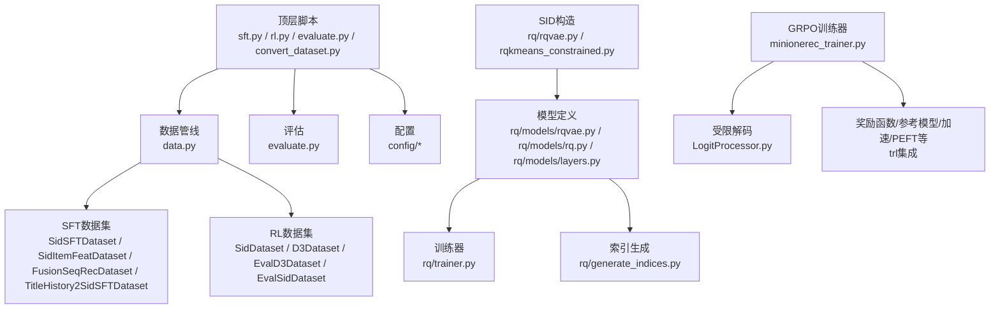
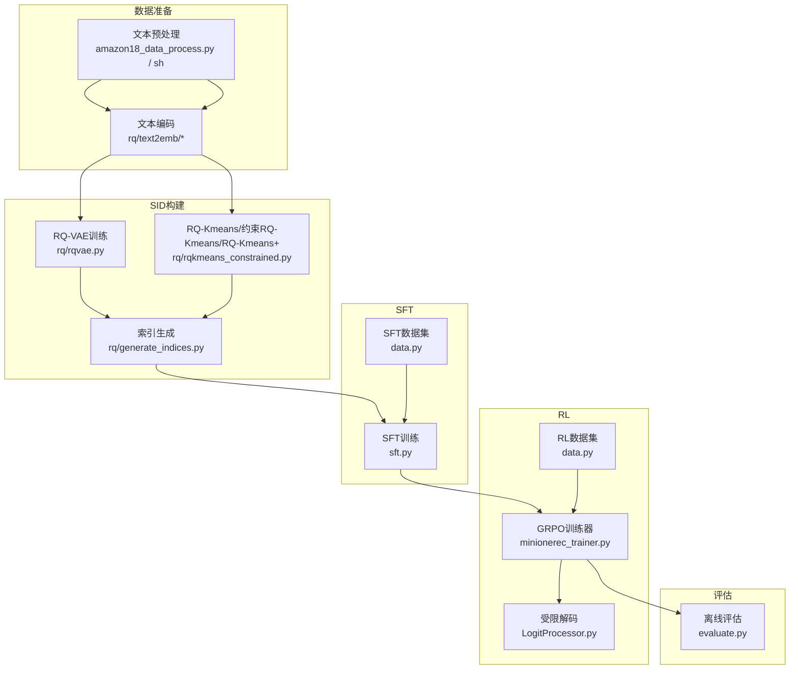
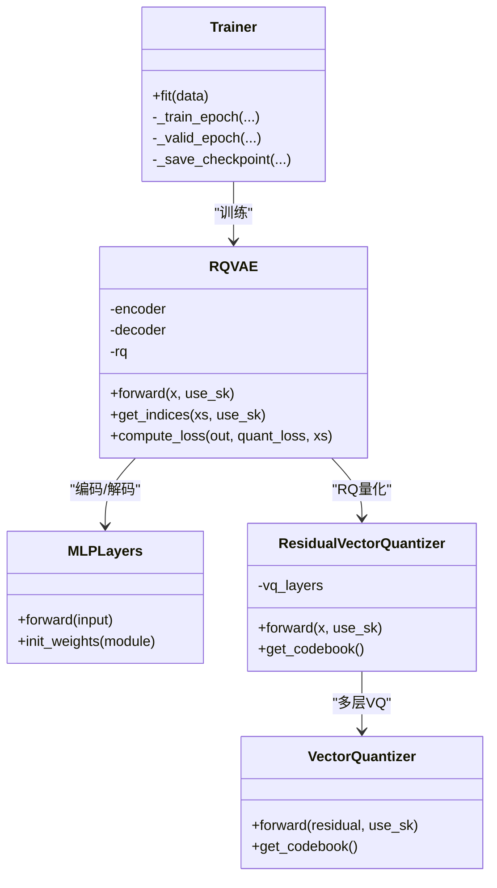
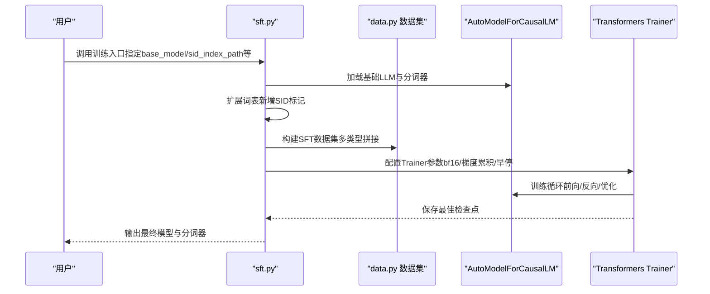
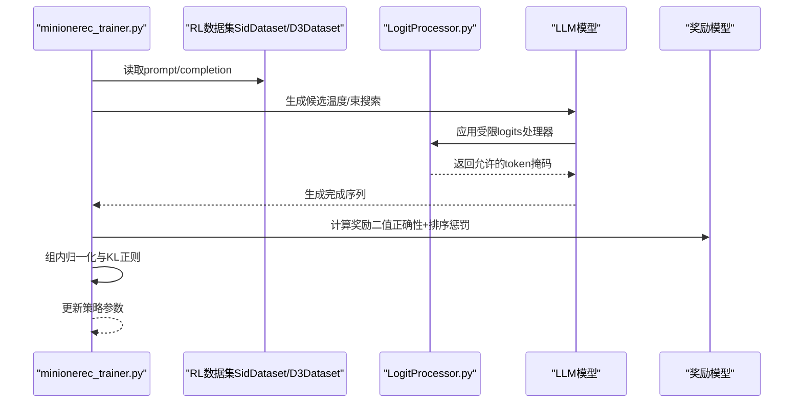
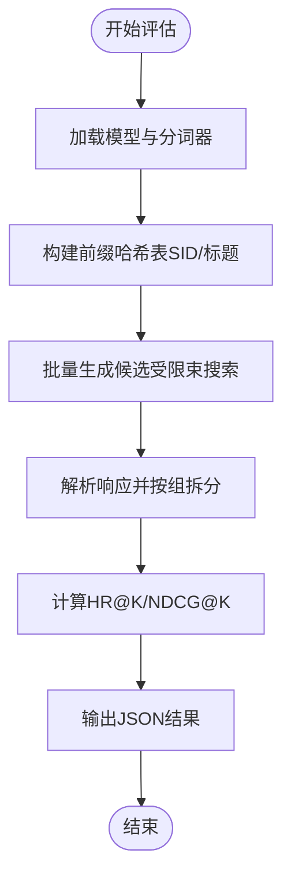
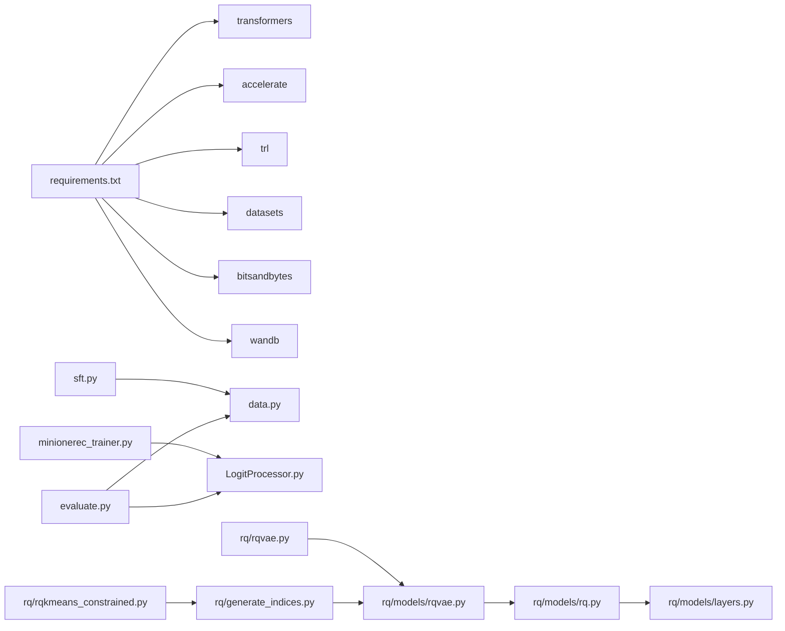

# 项目概述

<cite>
**本文引用的文件**
- [README.md](file://README.md)
- [requirements.txt](file://requirements.txt)
- [minionerec_trainer.py](file://minionerec_trainer.py)
- [LogitProcessor.py](file://LogitProcessor.py)
- [sft.py](file://sft.py)
- [data.py](file://data.py)
- [evaluate.py](file://evaluate.py)
- [rq/rqvae.py](file://rq/rqvae.py)
- [rq/models/rqvae.py](file://rq/models/rqvae.py)
- [rq/models/rq.py](file://rq/models/rq.py)
- [rq/models/layers.py](file://rq/models/layers.py)
- [rq/trainer.py](file://rq/trainer.py)
- [rq/generate_indices.py](file://rq/generate_indices.py)
- [rq/rqkmeans_constrained.py](file://rq/rqkmeans_constrained.py)
</cite>

## 目录
1. [简介](#简介)
2. [项目结构](#项目结构)
3. [核心组件](#核心组件)
4. [架构总览](#架构总览)
5. [详细组件分析](#详细组件分析)
6. [依赖关系分析](#依赖关系分析)
7. [性能考量](#性能考量)
8. [故障排查指南](#故障排查指南)
9. [结论](#结论)
10. [附录](#附录)

## 简介
MiniOneRec 是一个开源的“生成式推荐”端到端框架，覆盖从“语义ID（SID）构建”、“监督微调（SFT）”到“面向推荐的强化学习（RL）”的完整流水线。其核心目标是将自然语言与离散语义ID耦合，借助大语言模型（LLM）的通用知识，实现轻量、可扩展且高性能的生成式推荐系统。项目提供了多套SID构造方法（RQ-VAE、RQ-Kmeans、约束RQ-Kmeans、RQ-Kmeans+），并在RL阶段采用基于组内归一化与KL正则的GRPO训练器，结合受限束搜索以保证候选多样性与合法性。

本文件旨在：
- 为初学者提供概念性概述与端到端流程图解；
- 为高级开发者深入解析系统边界、组件交互与设计动机；
- 结合仓库中实际模块，展示从数据预处理到模型评估的完整工作流；
- 阐述该框架相较传统推荐系统的创新点与优势。

## 项目结构
仓库采用按功能域划分的组织方式：顶层脚本负责训练入口与评估；rq 子目录聚焦于SID构造与量化；data.py 提供SFT与RL阶段的数据集接口；evaluate.py 提供离线评估工具；minionerec_trainer.py 实现GRPO训练器与受限解码逻辑。

图表来源
- [sft.py](file://sft.py#L1-L276)
- [data.py](file://data.py#L1-L800)
- [evaluate.py](file://evaluate.py#L1-L242)
- [rq/rqvae.py](file://rq/rqvae.py#L1-L95)
- [rq/models/rqvae.py](file://rq/models/rqvae.py#L1-L85)
- [rq/models/rq.py](file://rq/models/rq.py#L1-L56)
- [rq/models/layers.py](file://rq/models/layers.py#L1-L108)
- [rq/trainer.py](file://rq/trainer.py#L1-L256)
- [rq/generate_indices.py](file://rq/generate_indices.py#L1-L151)
- [minionerec_trainer.py](file://minionerec_trainer.py#L1-L800)
- [LogitProcessor.py](file://LogitProcessor.py#L1-L63)

章节来源
- [README.md](file://README.md#L1-L322)
- [requirements.txt](file://requirements.txt#L1-L139)

## 核心组件
- SID 构建与量化
  - RQ-VAE：三层残差向量量化（RQ）+ 自编码器重构，支持Sinkhorn初始化与多层量化码书。
  - RQ-Kmeans 系列：残差K-means（含约束平衡与RQ-Kmeans+），通过聚类生成离散路径码。
- SFT 训练
  - 基于LLM的监督微调，使用多种SFT数据集（历史SID序列预测、标题-语义ID映射、融合序列推荐等）。
  - 支持冻结LLM参数仅训练新增词表嵌入，降低训练成本。
- 推荐导向RL（GRPO）
  - 使用Group Relative Policy Optimization（GRPO）进行策略优化，结合组内归一化与KL正则稳定训练。
  - 采用受限束搜索（Constrained Beam Search）保证候选唯一性与合法性，提升采样效率与多样性。
- 数据与评估
  - 统一的数据集接口，涵盖SFT与RL阶段；评估脚本支持Top-K指标计算与结果落盘。

章节来源
- [README.md](file://README.md#L38-L120)
- [rq/rqvae.py](file://rq/rqvae.py#L1-L95)
- [rq/models/rqvae.py](file://rq/models/rqvae.py#L1-L85)
- [rq/models/rq.py](file://rq/models/rq.py#L1-L56)
- [rq/models/layers.py](file://rq/models/layers.py#L1-L108)
- [rq/trainer.py](file://rq/trainer.py#L1-L256)
- [rq/generate_indices.py](file://rq/generate_indices.py#L1-L151)
- [rq/rqkmeans_constrained.py](file://rq/rqkmeans_constrained.py#L1-L292)
- [sft.py](file://sft.py#L1-L276)
- [data.py](file://data.py#L1-L800)
- [minionerec_trainer.py](file://minionerec_trainer.py#L1-L800)
- [LogitProcessor.py](file://LogitProcessor.py#L1-L63)
- [evaluate.py](file://evaluate.py#L1-L242)

## 架构总览
MiniOneRec 的整体架构围绕“SID构建—SFT—RL”的三段式流水线展开，各阶段职责清晰、耦合度低，便于替换与扩展。

图表来源
- [README.md](file://README.md#L129-L256)
- [rq/rqvae.py](file://rq/rqvae.py#L1-L95)
- [rq/rqkmeans_constrained.py](file://rq/rqkmeans_constrained.py#L1-L292)
- [rq/generate_indices.py](file://rq/generate_indices.py#L1-L151)
- [sft.py](file://sft.py#L1-L276)
- [data.py](file://data.py#L1-L800)
- [minionerec_trainer.py](file://minionerec_trainer.py#L1-L800)
- [LogitProcessor.py](file://LogitProcessor.py#L1-L63)
- [evaluate.py](file://evaluate.py#L1-L242)

## 详细组件分析

### SID 构建与量化（RQ-VAE、RQ-Kmeans系列）
- RQ-VAE
  - 模型结构：编码器MLP + 多层残差向量量化（RQ）+ 解码器MLP；支持KMeans初始化与Sinkhorn迭代。
  - 训练器：梯度裁剪、周期性碰撞率评估、保存最佳checkpoint。
  - 索引生成：加载最佳权重，推理得到每条样本的多级离散码，必要时通过Sinkhorn迭代去碰撞。
- RQ-Kmeans系列
  - 残差K-means：逐层聚类，平衡约束确保每层簇大小接近，减少冲突。
  - 约束RQ-Kmeans：引入k-means-constrained，强制最小/最大簇大小，进一步降低碰撞。
  - RQ-Kmeans+：额外去重与路径拼接策略，生成更稳定的SID索引。

图表来源
- [rq/models/layers.py](file://rq/models/layers.py#L1-L108)
- [rq/models/rq.py](file://rq/models/rq.py#L1-L56)
- [rq/models/rqvae.py](file://rq/models/rqvae.py#L1-L85)
- [rq/trainer.py](file://rq/trainer.py#L1-L256)

章节来源
- [rq/rqvae.py](file://rq/rqvae.py#L1-L95)
- [rq/models/rqvae.py](file://rq/models/rqvae.py#L1-L85)
- [rq/models/rq.py](file://rq/models/rq.py#L1-L56)
- [rq/models/layers.py](file://rq/models/layers.py#L1-L108)
- [rq/trainer.py](file://rq/trainer.py#L1-L256)
- [rq/generate_indices.py](file://rq/generate_indices.py#L1-L151)
- [rq/rqkmeans_constrained.py](file://rq/rqkmeans_constrained.py#L1-L292)

### SFT 训练（监督微调）
- 数据集族
  - SidSFTDataset：以历史SID序列为输入，预测下一个SID。
  - SidItemFeatDataset：标题-语义ID双向映射任务。
  - FusionSeqRecDataset：融合序列推荐的SFT样本。
  - TitleHistory2SidSFTDataset：从标题与历史SID组合生成SFT样本。
- 训练策略
  - 支持冻结LLM参数，仅训练新增词表嵌入，显著降低显存与训练成本。
  - 多数据集拼接与早停回调，使用bf16与梯度累积。
- 关键流程
  - 加载基础LLM与分词器，动态扩展词表，适配SID标记。
  - 构造SFT数据集，配置Trainer参数，执行训练并保存最终检查点。

图表来源
- [sft.py](file://sft.py#L1-L276)
- [data.py](file://data.py#L1-L800)

章节来源
- [sft.py](file://sft.py#L1-L276)
- [data.py](file://data.py#L1-L800)

### 推荐导向RL（GRPO）与受限解码
- GRPO训练器
  - 基于TRL的GRPO实现，支持多奖励函数加权、参考模型同步、vLLM加速与批内重复采样。
  - 通过组内归一化与KL正则稳定策略更新；支持温度采样与束搜索。
- 受限解码
  - ConstrainedLogitsProcessor：根据当前已生成前缀，限制下一步可选token集合，确保输出在SID空间内合法且唯一。
  - 训练期与推理期均使用哈希字典快速查询允许的后缀token，避免无效采样。
- 评估
  - evaluate.py 在推理阶段同样使用受限解码，批量生成候选并计算HR@K/NDCG@K等指标。

图表来源
- [minionerec_trainer.py](file://minionerec_trainer.py#L1-L800)
- [LogitProcessor.py](file://LogitProcessor.py#L1-L63)
- [data.py](file://data.py#L1-L800)

章节来源
- [minionerec_trainer.py](file://minionerec_trainer.py#L1-L800)
- [LogitProcessor.py](file://LogitProcessor.py#L1-L63)
- [data.py](file://data.py#L1-L800)
- [evaluate.py](file://evaluate.py#L1-L242)

### 离线评估与指标
- 评估流程
  - 加载基础模型与分词器，构建受限解码所需的哈希表（基于SID或标题前缀）。
  - 对测试样本批量生成Top-K候选，解析响应并按组拆分。
  - 计算HR@K与NDCG@K，输出JSON结果。
- 指标含义
  - HR@K：Top-K中命中真实物品的比例。
  - NDCG@K：考虑排名位置的归一化折损增益。

图表来源
- [evaluate.py](file://evaluate.py#L1-L242)

章节来源
- [evaluate.py](file://evaluate.py#L1-L242)

## 依赖关系分析
- 外部依赖
  - transformers、accelerate、trl、datasets、bitsandbytes、wandb等，用于模型加载、分布式训练、奖励建模与日志。
- 内部模块依赖
  - sft.py 依赖 data.py 中的SFT数据集类；
  - minionerec_trainer.py 依赖 LogitProcessor.py 实现受限解码；
  - rq/* 子模块共同构成SID构造与量化栈；
  - evaluate.py 依赖 data.py 的Eval数据集与LogitProcessor。

图表来源
- [requirements.txt](file://requirements.txt#L1-L139)
- [sft.py](file://sft.py#L1-L276)
- [data.py](file://data.py#L1-L800)
- [minionerec_trainer.py](file://minionerec_trainer.py#L1-L800)
- [LogitProcessor.py](file://LogitProcessor.py#L1-L63)
- [rq/rqvae.py](file://rq/rqvae.py#L1-L95)
- [rq/models/rqvae.py](file://rq/models/rqvae.py#L1-L85)
- [rq/models/rq.py](file://rq/models/rq.py#L1-L56)
- [rq/models/layers.py](file://rq/models/layers.py#L1-L108)
- [rq/generate_indices.py](file://rq/generate_indices.py#L1-L151)
- [rq/rqkmeans_constrained.py](file://rq/rqkmeans_constrained.py#L1-L292)
- [evaluate.py](file://evaluate.py#L1-L242)

章节来源
- [requirements.txt](file://requirements.txt#L1-L139)

## 性能考量
- 训练效率
  - RQ-VAE：通过Sinkhorn初始化与多层量化，提高收敛稳定性与表示质量；训练器支持梯度裁剪与周期性评估，避免过拟合并节省存储。
  - RQ-Kmeans系列：约束平衡与去重策略有效降低碰撞率，提升SID表达能力与检索效率。
- 推理效率
  - 受限束搜索与哈希前缀过滤显著减少无效token，提升候选多样性与生成速度。
  - vLLM集成（可选）在大规模生成场景下进一步提速。
- 显存与成本
  - 冻结LLM参数仅训练新增嵌入，大幅降低显存占用与训练成本；适合中小规模部署与快速迭代。

[本节为通用指导，不直接分析具体文件]

## 故障排查指南
- 训练崩溃或NaN
  - 检查梯度裁剪与损失NaN保护；确认数据加载与设备映射正确。
  - 参考：rq/trainer.py 的损失检查与梯度裁剪。
- 碰撞率过高
  - 优先尝试RQ-VAE或RQ-Kmeans+；必要时启用Sinkhorn迭代与去重逻辑。
  - 参考：rq/generate_indices.py 的碰撞检测与迭代修正。
- 生成结果非法或重复
  - 确认受限解码哈希表构建正确；检查前缀索引与eos处理。
  - 参考：minionerec_trainer.py 与evaluate.py中的哈希构建与前缀函数。
- 评估指标异常
  - 检查Top-K设置与分组拆分逻辑；确认标签与预测格式一致。
  - 参考：evaluate.py 的解析与指标计算。

章节来源
- [rq/trainer.py](file://rq/trainer.py#L1-L256)
- [rq/generate_indices.py](file://rq/generate_indices.py#L1-L151)
- [minionerec_trainer.py](file://minionerec_trainer.py#L1-L800)
- [evaluate.py](file://evaluate.py#L1-L242)

## 结论
MiniOneRec 将“语义ID（SID）”作为连接自然语言与离散推荐空间的桥梁，形成“SID构建—SFT—RL”的闭环。其关键创新在于：
- SID构造多样化：RQ-VAE、RQ-Kmeans系列在表达力与碰撞控制上各有侧重；
- SFT与RL协同：SFT继承LLM世界知识，RL在推荐目标上精细优化；
- GRPO训练器与受限解码：组内归一化、KL正则与受控束搜索，兼顾稳定性与多样性；
- 工程化落地：冻结LLM参数、vLLM加速、多数据集拼接与评估脚本，便于快速复现与部署。

相较传统推荐系统，MiniOneRec在以下方面具备优势：
- 更强的跨域泛化能力（来自LLM）；
- 更高的可解释性（SID可映射至标题/属性）；
- 更灵活的训练范式（SFT+RL）；
- 更好的工程可扩展性（模块化、可替换）。

[本节为总结性内容，不直接分析具体文件]

## 附录
- 快速开始与全链路步骤参见README的“Quickstart”与“Full Pipeline Walk-through”。
- 依赖项与版本要求请参考requirements.txt。

章节来源
- [README.md](file://README.md#L92-L256)
- [requirements.txt](file://requirements.txt#L1-L139)