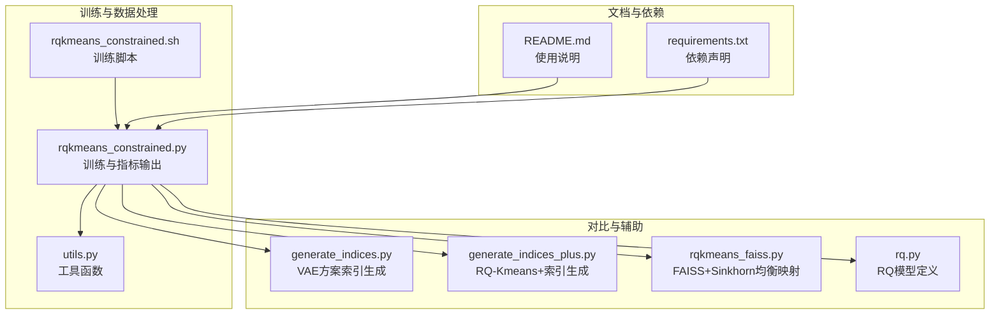
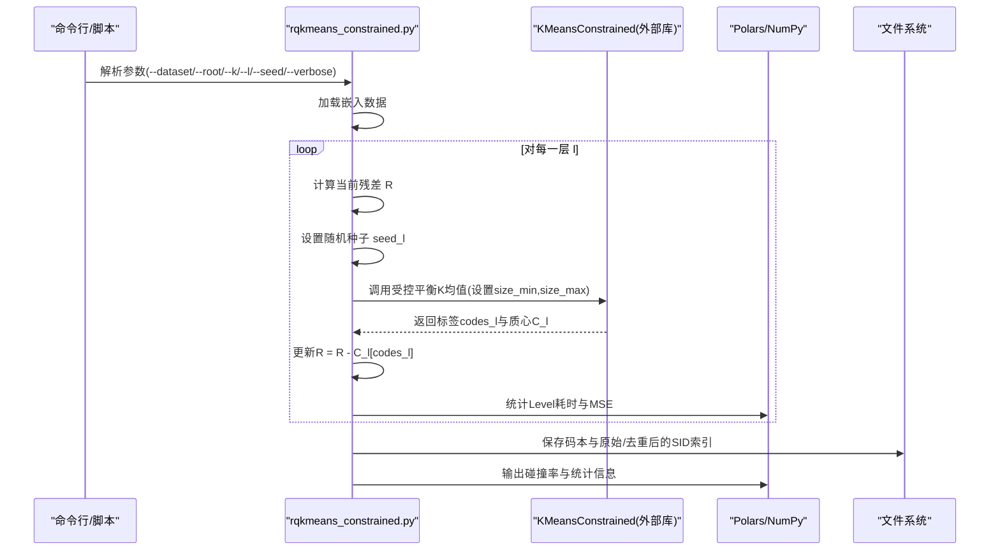
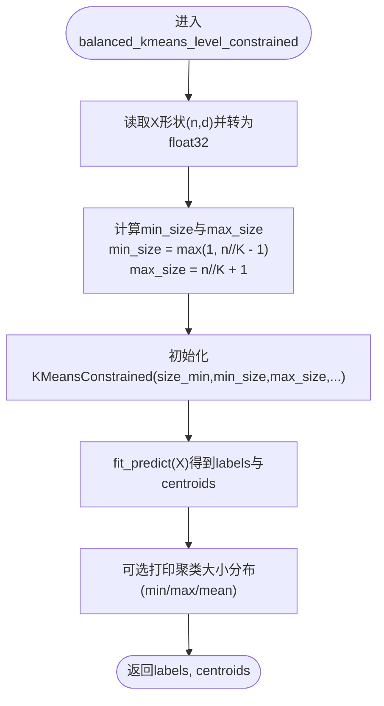
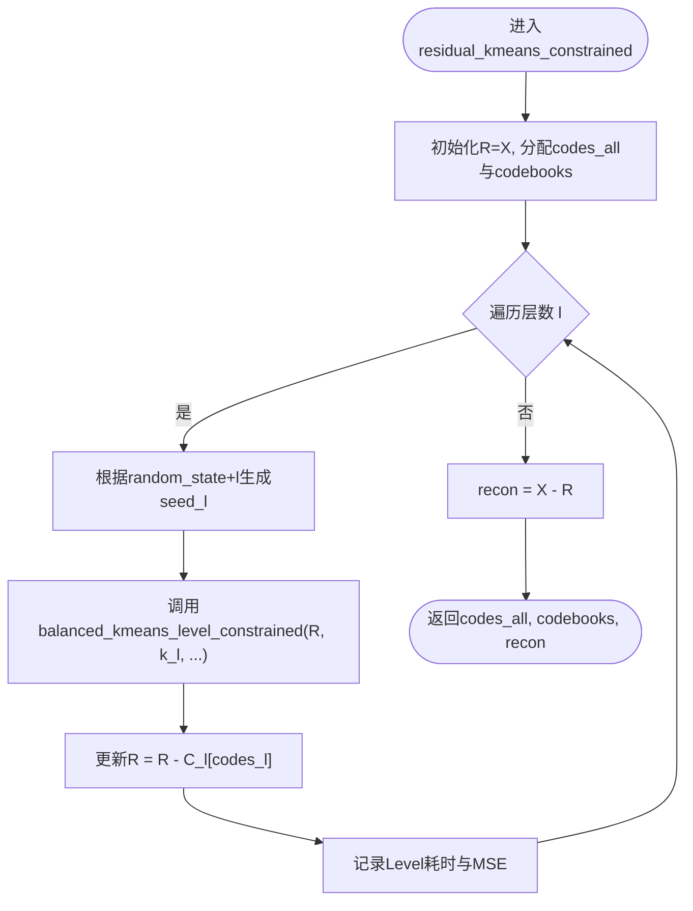
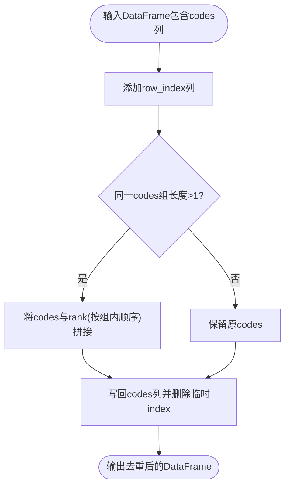
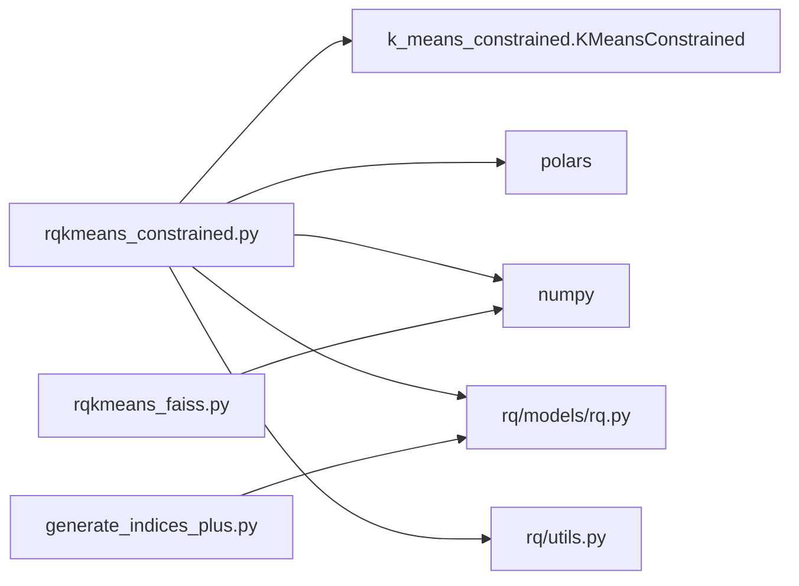

# Constrained RQ-Kmeans

<cite>
**本文引用的文件列表**
- [rqkmeans_constrained.py](file://rq/rqkmeans_constrained.py)
- [rqkmeans_constrained.sh](file://rq/rqkmeans_constrained.sh)
- [utils.py](file://rq/utils.py)
- [generate_indices.py](file://rq/generate_indices.py)
- [generate_indices_plus.py](file://rq/generate_indices_plus.py)
- [rq.py](file://rq/models/rq.py)
- [rqkmeans_faiss.py](file://rq/rqkmeans_faiss.py)
- [README.md](file://README.md)
- [requirements.txt](file://requirements.txt)
</cite>

## 目录
1. [简介](#简介)
2. [项目结构](#项目结构)
3. [核心组件](#核心组件)
4. [架构总览](#架构总览)
5. [关键组件详解](#关键组件详解)
6. [依赖关系分析](#依赖关系分析)
7. [性能与复杂度](#性能与复杂度)
8. [故障排查指南](#故障排查指南)
9. [结论](#结论)
10. [附录](#附录)

## 简介
本文件围绕“带约束的RQ-Kmeans”（Constrained RQ-Kmeans）展开，系统性说明如何通过k-means-constrained库实现聚类大小均衡化，防止聚类空心化或过度集中；解释在rqkmeans_constrained.py中，balanced_kmeans_level_constrained如何设置min_size和max_size约束（n//K±1），并在residual_kmeans_constrained中逐层应用该约束，确保各层级码本负载均衡；同时介绍配套的数据处理流程，包括重复SID的去重策略deal_with_deduplicate、JSON索引生成与性能统计分析，展示其在生成唯一且均衡的Semantic ID方面的优势。

## 项目结构
与Constrained RQ-Kmeans直接相关的模块与脚本如下：
- 训练入口与主逻辑：rq/rqkmeans_constrained.py
- 训练脚本：rq/rqkmeans_constrained.sh
- 工具函数：rq/utils.py
- 其他SID构建对比方案（用于对照）：rq/generate_indices.py、rq/generate_indices_plus.py、rq/rqkmeans_faiss.py
- 残差向量量化器（RQ）定义：rq/models/rq.py
- 仓库说明与使用指引：README.md
- 依赖声明：requirements.txt

图表来源
- [rqkmeans_constrained.py](file://rq/rqkmeans_constrained.py#L1-L292)
- [rqkmeans_constrained.sh](file://rq/rqkmeans_constrained.sh#L1-L38)
- [generate_indices.py](file://rq/generate_indices.py#L1-L151)
- [generate_indices_plus.py](file://rq/generate_indices_plus.py#L1-L188)
- [rqkmeans_faiss.py](file://rq/rqkmeans_faiss.py#L1-L300)
- [rq.py](file://rq/models/rq.py#L1-L56)
- [README.md](file://README.md#L1-L322)
- [requirements.txt](file://requirements.txt#L1-L139)

章节来源
- [rqkmeans_constrained.py](file://rq/rqkmeans_constrained.py#L1-L292)
- [rqkmeans_constrained.sh](file://rq/rqkmeans_constrained.sh#L1-L38)
- [README.md](file://README.md#L1-L322)

## 核心组件
- balanced_kmeans_level_constrained：基于k-means-constrained的受控平衡K均值，为每层提供均衡的聚类大小约束。
- residual_kmeans_constrained：残差式多层K均值，逐层应用上述受控平衡约束，得到分层码本与重建误差。
- deal_with_deduplicate：对重复路径进行去重，保证每个样本最终对应唯一SID序列。
- analyze_codes：统计唯一路径数与碰撞率，评估SID唯一性与均衡性。
- 训练脚本与参数解析：rqkmeans_constrained.sh与rqkmeans_constrained.py中的命令行参数。

章节来源
- [rqkmeans_constrained.py](file://rq/rqkmeans_constrained.py#L26-L128)
- [rqkmeans_constrained.py](file://rq/rqkmeans_constrained.py#L131-L166)
- [rqkmeans_constrained.py](file://rq/rqkmeans_constrained.py#L168-L292)
- [rqkmeans_constrained.sh](file://rq/rqkmeans_constrained.sh#L1-L38)

## 架构总览
Constrained RQ-Kmeans采用“逐层受控平衡”的残差量化策略：输入嵌入逐层减去上一层的重构，再用受控平衡K均值对当前残差进行聚类，从而在各层级保持近似均匀的码本占用，避免空心化或过度集中。训练完成后，生成分层码本与唯一SID索引，并进行碰撞率统计与保存。

图表来源
- [rqkmeans_constrained.py](file://rq/rqkmeans_constrained.py#L67-L128)
- [rqkmeans_constrained.py](file://rq/rqkmeans_constrained.py#L180-L292)

## 关键组件详解

### 受控平衡K均值：balanced_kmeans_level_constrained
- 功能要点
  - 将聚类规模限制在[n//K−1, n//K+1]之间，允许轻微偏差，避免极端不平衡。
  - 使用k-means-constrained提供的KMeansConstrained接口，传入size_min与size_max。
  - 为每层独立设置随机种子，提升稳定性。
- 复杂度与性能
  - 时间复杂度近似O(L·N·d·迭代次数)，其中L为层数，N为样本数，d为维度。
  - 通过n_init与n_jobs等参数可调并行度与初始化次数，以权衡收敛质量与速度。
- 错误处理
  - 若未安装k-means-constrained，会提示安装信息并退出。

图表来源
- [rqkmeans_constrained.py](file://rq/rqkmeans_constrained.py#L26-L64)

章节来源
- [rqkmeans_constrained.py](file://rq/rqkmeans_constrained.py#L26-L64)

### 残差式多层聚类：residual_kmeans_constrained
- 功能要点
  - 输入X，逐层对残差R进行受控平衡K均值聚类，得到codes_all与codebooks。
  - 每层独立设置随机种子，避免层间耦合。
  - 记录每层耗时与残差MSE，便于评估收敛与重建质量。
- 数据流
  - 初始化R=X，逐层更新R=R−C_l[codes_l]，最终重建X−R。
- 性能与稳定性
  - 通过逐层残差分解，降低每层的聚类难度，提高整体稳定性与均衡性。

图表来源
- [rqkmeans_constrained.py](file://rq/rqkmeans_constrained.py#L67-L128)

章节来源
- [rqkmeans_constrained.py](file://rq/rqkmeans_constrained.py#L67-L128)

### 去重策略：deal_with_deduplicate
- 功能要点
  - 针对同一codes组内的重复项，追加行序号作为后缀，形成唯一序列，保证每个样本对应唯一SID序列。
  - 使用Polars表达式进行高效批处理。
- 适用场景
  - 在生成原始codes后，若存在多条路径相同的情况，通过此步骤消除冲突，确保SID唯一性。
- 统计分析
  - 训练结束后，统计重复组数量、重复总数与最大重复组规模，评估去重效果。

图表来源
- [rqkmeans_constrained.py](file://rq/rqkmeans_constrained.py#L131-L146)

章节来源
- [rqkmeans_constrained.py](file://rq/rqkmeans_constrained.py#L131-L146)
- [rqkmeans_constrained.py](file://rq/rqkmeans_constrained.py#L232-L291)

### JSON索引生成与统计
- 索引格式
  - 将每条样本的多层codes转换为形如"<a_code>","<b_code>"...的字符串序列，作为SID。
- 保存流程
  - 保存原始codes与去重后的codes，分别生成.index.json与.npz码本。
- 统计输出
  - 输出最终重建MSE、唯一路径数、碰撞率、重复组统计等，便于评估均衡性与唯一性。

章节来源
- [rqkmeans_constrained.py](file://rq/rqkmeans_constrained.py#L232-L291)

### 与其他方案的对比与补充
- RQ-VAE方案（generate_indices.py）
  - 通过加载预训练RQ-VAE模型，推理得到indices并生成JSON索引；支持碰撞检测与迭代修正。
- RQ-Kmeans+方案（generate_indices_plus.py）
  - 在推理阶段引入残差连接与偏置零初始化，结合已训练码本，生成唯一SID并进行碰撞分析。
- FAISS+Sinkhorn均衡映射（rqkmeans_faiss.py）
  - 先用FAISS训练RQ，再对每层进行Sinkhorn均衡映射，使各层容量均衡，最后生成JSON索引。

章节来源
- [generate_indices.py](file://rq/generate_indices.py#L1-L151)
- [generate_indices_plus.py](file://rq/generate_indices_plus.py#L1-L188)
- [rqkmeans_faiss.py](file://rq/rqkmeans_faiss.py#L1-L300)

## 依赖关系分析
- 外部库
  - k-means-constrained：提供受控平衡K均值的核心能力。
  - polars：用于高效的数据处理与去重。
  - numpy：数值计算基础。
- 内部模块
  - rq/models/rq.py：提供ResidualVectorQuantizer结构，用于RQ相关推理与对比。
  - rq/utils.py：通用工具函数（目录创建、时间格式化等）。

图表来源
- [rqkmeans_constrained.py](file://rq/rqkmeans_constrained.py#L1-L24)
- [rq/models/rq.py](file://rq/models/rq.py#L1-L56)
- [generate_indices_plus.py](file://rq/generate_indices_plus.py#L1-L82)
- [rqkmeans_faiss.py](file://rq/rqkmeans_faiss.py#L1-L300)

章节来源
- [rqkmeans_constrained.py](file://rq/rqkmeans_constrained.py#L1-L24)
- [rq/models/rq.py](file://rq/models/rq.py#L1-L56)
- [generate_indices_plus.py](file://rq/generate_indices_plus.py#L1-L82)
- [rqkmeans_faiss.py](file://rq/rqkmeans_faiss.py#L1-L300)

## 性能与复杂度
- 受控平衡约束
  - 通过min_size与max_size限制每层聚类规模，缓解空心化与过度集中，提升码本利用率与均衡性。
- 运行时开销
  - 主要由逐层K均值与残差更新构成，复杂度随层数与样本数线性增长。
  - 通过合理设置n_init、n_jobs与每层随机种子，可在稳定性和速度间取得平衡。
- 重建误差
  - 通过记录每层残差MSE与最终重建MSE，评估重建质量与收敛情况。

章节来源
- [rqkmeans_constrained.py](file://rq/rqkmeans_constrained.py#L26-L64)
- [rqkmeans_constrained.py](file://rq/rqkmeans_constrained.py#L83-L128)
- [rqkmeans_constrained.py](file://rq/rqkmeans_constrained.py#L120-L128)

## 故障排查指南
- 缺少k-means-constrained
  - 现象：启动时报错并提示安装。
  - 处理：按照提示安装k-means-constrained与polars。
- 数据文件缺失
  - 现象：找不到.embeddings文件。
  - 处理：确认--root与--dataset参数正确，检查数据路径。
- 去重后仍存在碰撞
  - 现象：重复组数量不为0。
  - 处理：检查去重策略是否生效，必要时调整K或层数L，或在更高层增加随机性。
- 训练耗时过长
  - 现象：每层耗时较长。
  - 处理：适当减少max_iter、增大n_jobs、降低K或L，或使用更高效的索引生成方案（如FAISS+Sinkhorn）。

章节来源
- [rqkmeans_constrained.py](file://rq/rqkmeans_constrained.py#L180-L206)
- [rqkmeans_constrained.py](file://rq/rqkmeans_constrained.py#L232-L291)
- [rqkmeans_constrained.sh](file://rq/rqkmeans_constrained.sh#L1-L38)

## 结论
Constrained RQ-Kmeans通过在每层施加受控平衡约束，有效避免了聚类空心化与过度集中问题，提升了码本的均衡性与利用率。配合去重策略与JSON索引生成，能够输出唯一且均衡的Semantic ID，满足下游SFT与RL阶段对高质量SID的需求。相较其他方案，该方法在训练稳定性与SID唯一性方面具有明显优势。

## 附录
- 快速开始
  - 安装依赖：pip install -r requirements.txt
  - 安装k-means-constrained与polars后运行训练脚本。
- 参数说明
  - --dataset：数据集名称
  - --root：数据根目录
  - --k：每层聚类数
  - --l：层数
  - --max_iter：最大迭代次数
  - --seed：随机种子
  - --verbose：详细输出

章节来源
- [README.md](file://README.md#L180-L215)
- [rqkmeans_constrained.sh](file://rq/rqkmeans_constrained.sh#L1-L38)
- [rqkmeans_constrained.py](file://rq/rqkmeans_constrained.py#L168-L177)