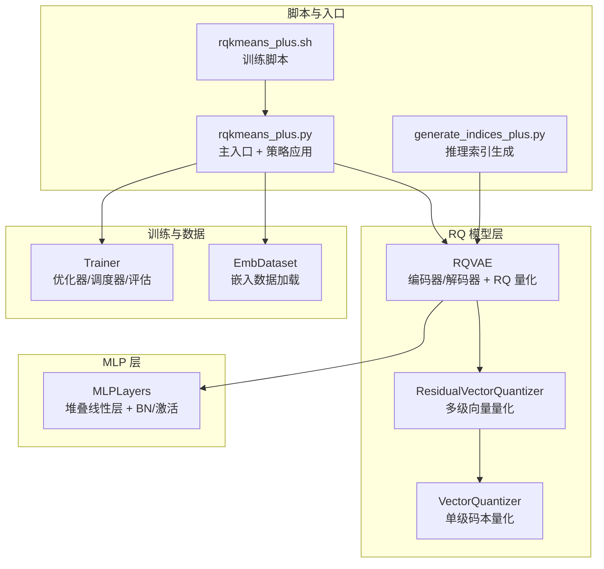
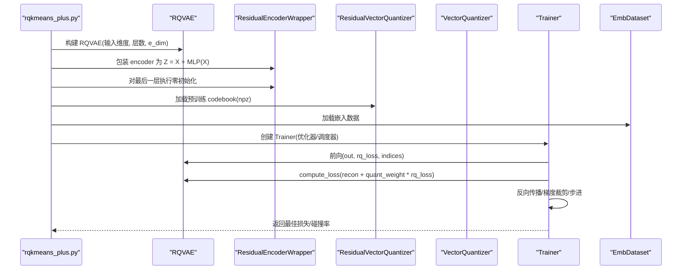
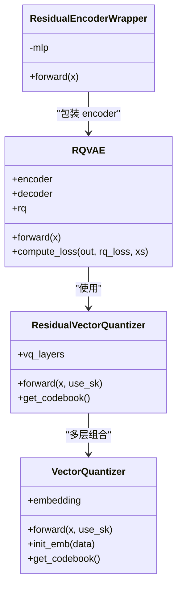
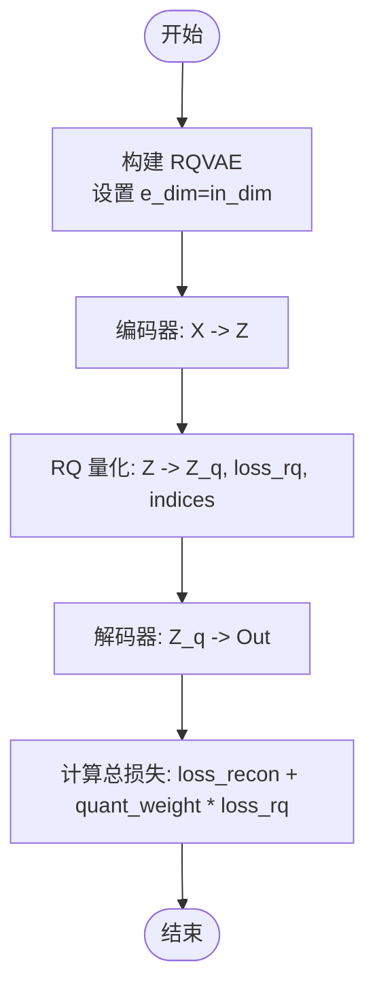
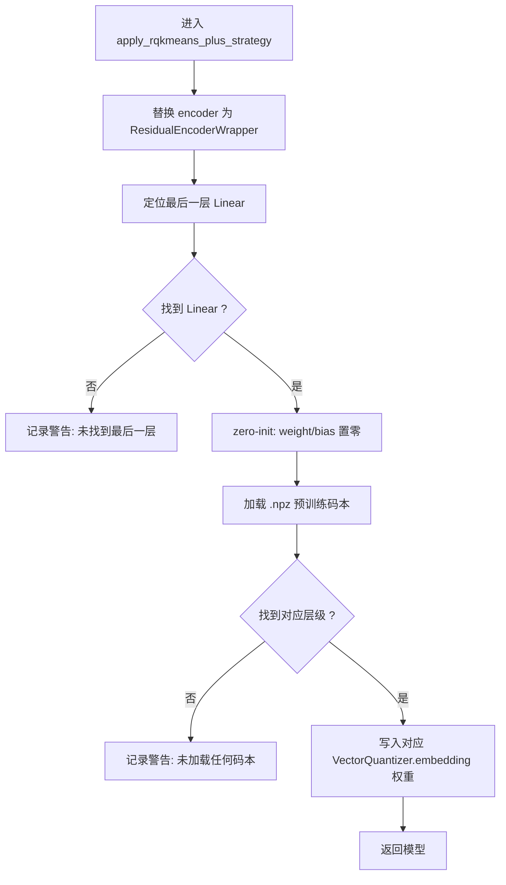
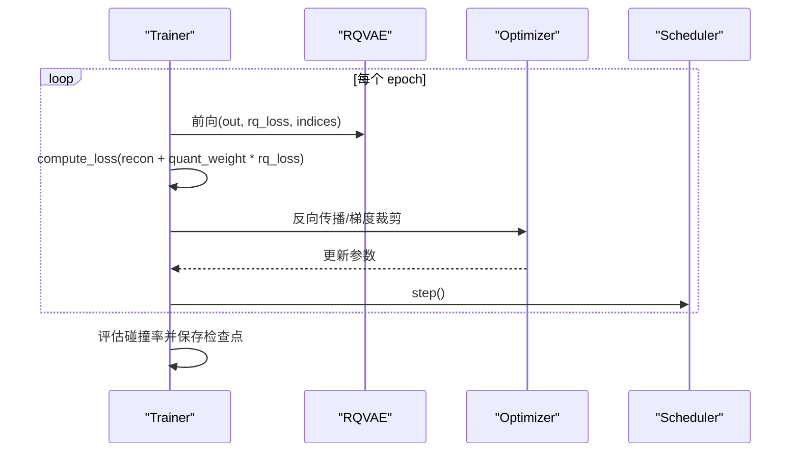
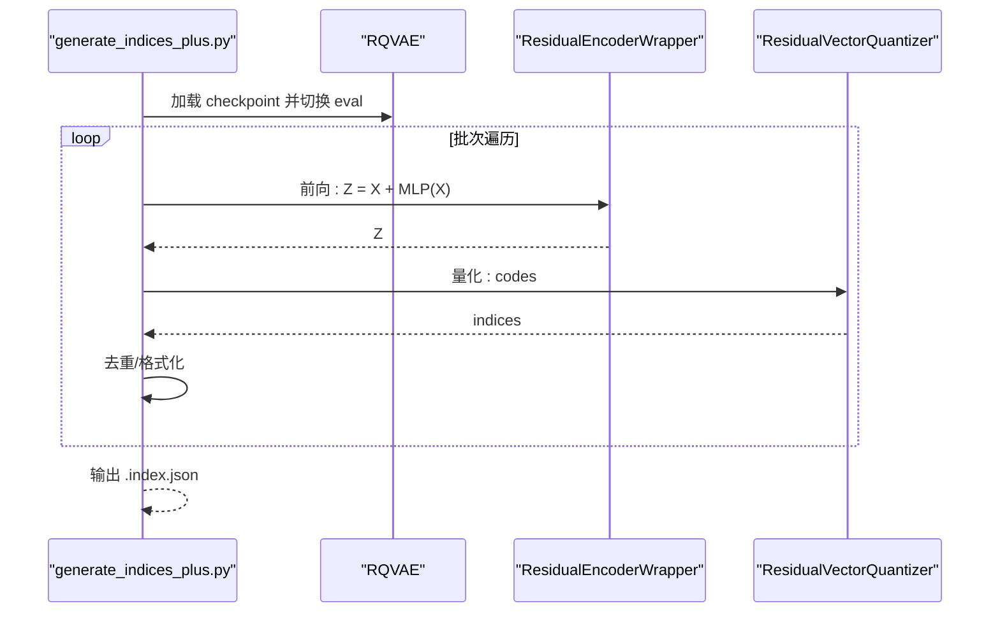
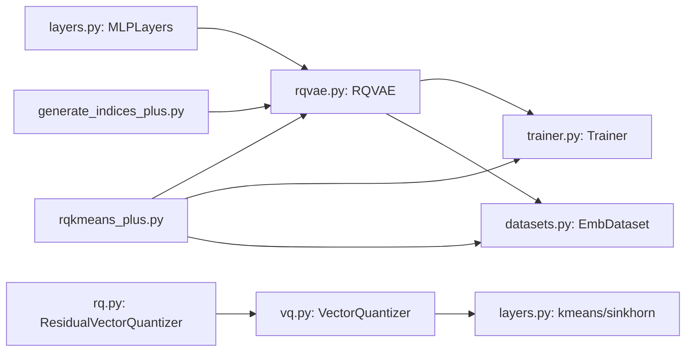

# RQ-Kmeans+

<cite>
**本文引用的文件**
- [rq/rqkmeans_plus.py](file://rq/rqkmeans_plus.py)
- [rq/models/rqvae.py](file://rq/models/rqvae.py)
- [rq/models/rq.py](file://rq/models/rq.py)
- [rq/models/vq.py](file://rq/models/vq.py)
- [rq/models/layers.py](file://rq/models/layers.py)
- [rq/trainer.py](file://rq/trainer.py)
- [rq/datasets.py](file://rq/datasets.py)
- [rq/generate_indices_plus.py](file://rq/generate_indices_plus.py)
- [rq/rqkmeans_plus.sh](file://rq/rqkmeans_plus.sh)
- [README.md](file://README.md)
</cite>

## 目录
1. [引言](#引言)
2. [项目结构](#项目结构)
3. [核心组件](#核心组件)
4. [架构总览](#架构总览)
5. [详细组件分析](#详细组件分析)
6. [依赖关系分析](#依赖关系分析)
7. [性能考量](#性能考量)
8. [故障排查指南](#故障排查指南)
9. [结论](#结论)
10. [附录](#附录)

## 引言
本文件系统性解析 RQ-Kmeans+ 算法的实现原理与工程优化策略，重点说明以下三点：
- 如何通过残差连接（Residual Connection）将原始编码器包装为 Z = X + MLP(X)，使训练初期输出接近恒等映射，从而实现“Warm-start”。
- 如何对 MLP 最后一层进行零初始化（Zero-Initialization），确保残差路径主导训练早期行为，稳定收敛并提升重建质量。
- 如何与预训练的 codebook 协同工作，加载多层级码本权重，保证量化阶段的初始化一致性与稳定性。

同时给出参数配置建议、训练流程图与关键调用序列图，帮助读者快速上手并正确复现实验。

## 项目结构
RQ-Kmeans+ 的核心代码位于 rq 子目录，围绕 RQ-VAE 编码器、残差包装器、量化模块与训练器展开；数据集加载与推理索引生成脚本分别位于 datasets.py 与 generate_indices_plus.py 中。

图表来源
- [rq/rqkmeans_plus.py](file://rq/rqkmeans_plus.py#L1-L179)
- [rq/models/rqvae.py](file://rq/models/rqvae.py#L1-L85)
- [rq/models/rq.py](file://rq/models/rq.py#L1-L56)
- [rq/models/vq.py](file://rq/models/vq.py#L1-L102)
- [rq/models/layers.py](file://rq/models/layers.py#L1-L108)
- [rq/trainer.py](file://rq/trainer.py#L1-L256)
- [rq/datasets.py](file://rq/datasets.py#L1-L40)
- [rq/generate_indices_plus.py](file://rq/generate_indices_plus.py#L1-L188)
- [rq/rqkmeans_plus.sh](file://rq/rqkmeans_plus.sh#L1-L9)

章节来源
- [rq/rqkmeans_plus.py](file://rq/rqkmeans_plus.py#L1-L179)
- [rq/models/rqvae.py](file://rq/models/rqvae.py#L1-L85)
- [rq/models/rq.py](file://rq/models/rq.py#L1-L56)
- [rq/models/vq.py](file://rq/models/vq.py#L1-L102)
- [rq/models/layers.py](file://rq/models/layers.py#L1-L108)
- [rq/trainer.py](file://rq/trainer.py#L1-L256)
- [rq/datasets.py](file://rq/datasets.py#L1-L40)
- [rq/generate_indices_plus.py](file://rq/generate_indices_plus.py#L1-L188)
- [rq/rqkmeans_plus.sh](file://rq/rqkmeans_plus.sh#L1-L9)
- [README.md](file://README.md#L180-L225)

## 核心组件
- ResidualEncoderWrapper：将原始编码器包装为残差形式，实现 Z = X + MLP(X)，并在训练初期通过零初始化最后一层，使输出接近恒等映射，加速收敛。
- RQVAE：包含编码器（MLP）、多级 ResidualVectorQuantizer（RQ）与解码器（MLP），负责端到端重建与量化损失计算。
- ResidualVectorQuantizer：按层级顺序对残差进行量化，累积重构误差，输出总量化结果与各层指标。
- VectorQuantizer：单级码本量化，支持 KMeans 初始化与 Sinkhorn 约束分配。
- MLPLayers：通用 MLP 构建器，默认权重初始化与可选 BN/激活。
- Trainer：训练循环、优化器与学习率调度器、评估与保存逻辑。
- EmbDataset：从 .npy 加载嵌入，自动处理 NaN/Inf 并统计维度。
- generate_indices_plus.py：在已训练模型上执行 Z = X + MLP(X) 推理，再进行 RQ 量化得到 SID 索引。

章节来源
- [rq/rqkmeans_plus.py](file://rq/rqkmeans_plus.py#L15-L88)
- [rq/models/rqvae.py](file://rq/models/rqvae.py#L10-L85)
- [rq/models/rq.py](file://rq/models/rq.py#L7-L56)
- [rq/models/vq.py](file://rq/models/vq.py#L7-L102)
- [rq/models/layers.py](file://rq/models/layers.py#L7-L68)
- [rq/trainer.py](file://rq/trainer.py#L1-L256)
- [rq/datasets.py](file://rq/datasets.py#L1-L40)
- [rq/generate_indices_plus.py](file://rq/generate_indices_plus.py#L1-L188)

## 架构总览
RQ-Kmeans+ 在 RQ-VAE 基础上引入残差编码器与零初始化策略，并加载预训练码本，形成稳定的 Warm-start 训练闭环。

图表来源
- [rq/rqkmeans_plus.py](file://rq/rqkmeans_plus.py#L24-L88)
- [rq/models/rqvae.py](file://rq/models/rqvae.py#L61-L85)
- [rq/models/rq.py](file://rq/models/rq.py#L39-L56)
- [rq/models/vq.py](file://rq/models/vq.py#L63-L100)
- [rq/trainer.py](file://rq/trainer.py#L98-L125)

## 详细组件分析

### 残差编码器与零初始化策略
- ResidualEncoderWrapper 将原始编码器替换为 Z = X + MLP(X) 形式，使网络在训练初期输出接近恒等映射，缓解梯度爆炸与发散风险，实现 Warm-start。
- apply_rqkmeans_plus_strategy 负责：
  - 将 model.encoder 替换为 ResidualEncoderWrapper。
  - 遍历编码器子模块，定位最后一层 Linear，并将其权重与偏置置零，确保零初始化。
  - 从 .npz 文件加载预训练码本，写入 RQ 多级 VectorQuantizer 的 embedding 权重，完成预训练权重注入。

图表来源
- [rq/rqkmeans_plus.py](file://rq/rqkmeans_plus.py#L15-L88)
- [rq/models/rqvae.py](file://rq/models/rqvae.py#L10-L85)
- [rq/models/rq.py](file://rq/models/rq.py#L7-L56)
- [rq/models/vq.py](file://rq/models/vq.py#L7-L102)

章节来源
- [rq/rqkmeans_plus.py](file://rq/rqkmeans_plus.py#L15-L88)

### RQ-VAE 结构与前向流程
- RQVAE 构造时：
  - 编码器/解码器均为 MLPLayers，层数由 encode_layer_dims 与 decode_layer_dims 决定。
  - e_dim 必须等于输入维度，以满足残差连接的维度一致要求。
- 前向流程：
  - 先经 encoder 得到中间表征。
  - 交由 ResidualVectorQuantizer 进行逐层量化，累积残差并输出总量化结果与平均量化损失。
  - 解码器将量化后的特征还原为重建输出。
- 损失函数：
  - 根据 loss_type 计算重建损失，再叠加量化损失乘以权重系数，作为总损失。

图表来源
- [rq/models/rqvae.py](file://rq/models/rqvae.py#L46-L85)
- [rq/models/rq.py](file://rq/models/rq.py#L39-L56)
- [rq/models/vq.py](file://rq/models/vq.py#L63-L100)

章节来源
- [rq/models/rqvae.py](file://rq/models/rqvae.py#L10-L85)

### 零初始化与 Warm-start 实现细节
- 零初始化目标层定位：
  - 遍历编码器模块（优先检查 mlp_layers 或直接遍历 modules），逆序查找第一个 Linear 层，将其 weight/bias 置零。
- Warm-start 效果：
  - 由于最后一层被零初始化，残差路径在训练初期占主导，输出接近恒等映射，降低初始重建误差，加速收敛并减少震荡。
- 预训练码本注入：
  - 从 .npz 中读取多个层级的 codebook，按层级名写入对应 VectorQuantizer 的 embedding 权重，确保量化初始化与预训练一致。

图表来源
- [rq/rqkmeans_plus.py](file://rq/rqkmeans_plus.py#L24-L88)
- [rq/models/vq.py](file://rq/models/vq.py#L21-L31)

章节来源
- [rq/rqkmeans_plus.py](file://rq/rqkmeans_plus.py#L24-L88)

### 训练器与评估流程
- 优化器与调度器：
  - 支持 Adam/SGD/Adagrad/RMSprop/AdamW；学习率调度器支持线性或常数带 warmup。
- 训练循环：
  - 每轮迭代前向、计算总损失、反向传播、梯度裁剪、步进与调度器更新。
- 评估：
  - 定期计算碰撞率（不同样本映射到相同码本组合的比例），用于保存最优模型。
- 保存策略：
  - 维护最近若干检查点与最佳碰撞率检查点，自动清理最差检查点。

图表来源
- [rq/trainer.py](file://rq/trainer.py#L98-L125)
- [rq/trainer.py](file://rq/trainer.py#L187-L251)

章节来源
- [rq/trainer.py](file://rq/trainer.py#L1-L256)

### 推理索引生成（SID 构建）
- generate_indices_plus.py 在已训练模型上执行：
  - 使用 ResidualEncoderWrapper 进行 Z = X + MLP(X) 推理。
  - 将 Z 输入 RQ 量化得到 indices。
  - 对 indices 做去重与格式化，输出 .index.json 供下游使用。

图表来源
- [rq/generate_indices_plus.py](file://rq/generate_indices_plus.py#L40-L149)
- [rq/models/rqvae.py](file://rq/models/rqvae.py#L61-L73)
- [rq/models/rq.py](file://rq/models/rq.py#L39-L56)

章节来源
- [rq/generate_indices_plus.py](file://rq/generate_indices_plus.py#L1-L188)

## 依赖关系分析
- RQVAE 依赖 MLPLayers 构建编码器/解码器，依赖 ResidualVectorQuantizer 实现多级量化。
- ResidualVectorQuantizer 依赖 VectorQuantizer 实现单级量化，并提供 get_codebook 以导出码本。
- VectorQuantizer 内部使用 kmeans 与 sinkhorn_algorithm 初始化与分配。
- RQ-Kmeans+ 主入口依赖 Trainer 进行训练，依赖 EmbDataset 提供数据，依赖 generate_indices_plus.py 进行推理索引生成。

图表来源
- [rq/models/layers.py](file://rq/models/layers.py#L69-L108)
- [rq/models/rqvae.py](file://rq/models/rqvae.py#L10-L85)
- [rq/models/rq.py](file://rq/models/rq.py#L7-L56)
- [rq/models/vq.py](file://rq/models/vq.py#L1-L102)
- [rq/trainer.py](file://rq/trainer.py#L1-L256)
- [rq/datasets.py](file://rq/datasets.py#L1-L40)
- [rq/rqkmeans_plus.py](file://rq/rqkmeans_plus.py#L1-L179)
- [rq/generate_indices_plus.py](file://rq/generate_indices_plus.py#L1-L188)

章节来源
- [rq/models/layers.py](file://rq/models/layers.py#L1-L108)
- [rq/models/rqvae.py](file://rq/models/rqvae.py#L1-L85)
- [rq/models/rq.py](file://rq/models/rq.py#L1-L56)
- [rq/models/vq.py](file://rq/models/vq.py#L1-L102)
- [rq/trainer.py](file://rq/trainer.py#L1-L256)
- [rq/datasets.py](file://rq/datasets.py#L1-L40)
- [rq/rqkmeans_plus.py](file://rq/rqkmeans_plus.py#L1-L179)
- [rq/generate_indices_plus.py](file://rq/generate_indices_plus.py#L1-L188)

## 性能考量
- 残差连接与零初始化：
  - 降低训练初期的重建误差，提升收敛速度与稳定性。
  - e_dim 必须等于输入维度，避免维度不匹配导致的额外开销与错误。
- 数据加载与内存：
  - EmbDataset 自动处理 NaN/Inf，建议在上游预处理阶段就清洗数据。
  - DataLoader 使用 pin_memory 与合理 num_workers，有助于 GPU 利用率。
- 量化与分配：
  - VectorQuantizer 的 KMeans 初始化与 Sinkhorn 分配在小批量上开销可控；若数据规模大，建议提前初始化码本（如 RQ-Kmeans 预训练）。
- 训练稳定性：
  - Trainer 中对梯度进行裁剪，防止爆炸；学习率调度器采用 warmup，有利于早期稳定。
- 推理效率：
  - generate_indices_plus.py 采用批处理与 eval 模式，避免不必要的梯度计算。

[本节为通用性能建议，无需特定文件来源]

## 故障排查指南
- e_dim 与输入维度不一致：
  - 当 e_dim 不等于数据维度时，主入口会报错并提示修正。请确保 e_dim 与数据维度一致。
- 未找到 'encoder'：
  - 若模型结构不含 encoder 字段，策略应用会失败并记录错误。请确认传入的是 RQVAE 类模型。
- 未找到最后一层 Linear：
  - 零初始化会记录警告。请检查编码器结构是否包含 Linear 层，或调整网络结构。
- 未加载任何码本：
  - .npz 中缺少对应层级键值时会记录警告。请核对 .npz 文件与层级名称。
- 预训练码本路径不存在：
  - 会抛出 FileNotFoundError，请确认路径正确。
- 检查点加载失败：
  - generate_indices_plus.py 在加载 checkpoint 时会打印状态信息，若缺失关键键值，需确认保存格式与加载逻辑一致。
- 评估指标异常：
  - Trainer 会在评估阶段计算碰撞率，若出现异常值，检查数据分布与量化参数设置。

章节来源
- [rq/rqkmeans_plus.py](file://rq/rqkmeans_plus.py#L141-L148)
- [rq/rqkmeans_plus.py](file://rq/rqkmeans_plus.py#L27-L33)
- [rq/rqkmeans_plus.py](file://rq/rqkmeans_plus.py#L59-L61)
- [rq/rqkmeans_plus.py](file://rq/rqkmeans_plus.py#L62-L87)
- [rq/generate_indices_plus.py](file://rq/generate_indices_plus.py#L65-L81)
- [rq/trainer.py](file://rq/trainer.py#L127-L153)

## 结论
RQ-Kmeans+ 通过残差编码器与零初始化策略，在训练初期实现接近恒等映射的 Warm-start，显著提升收敛速度与重建质量；配合预训练码本注入，进一步稳定量化初始化。结合 RQ-VAE 的多级量化与 Trainer 的稳健训练流程，可在大规模推荐场景中高效构建高质量的 SID 索引，并为后续 SFT/RL 阶段奠定良好基础。

[本节为总结性内容，无需特定文件来源]

## 附录

### 参数配置建议
- 关键参数
  - e_dim：必须与输入嵌入维度一致，确保残差连接维度兼容。
  - layers：编码器/解码器隐藏层配置，最后一层输出需等于 e_dim。
  - num_emb_list：每层码本容量列表，长度决定 RQ 层数。
  - loss_type：mse 或 l1，影响重建损失类型。
  - quant_loss_weight：量化损失权重，平衡重建与离散化程度。
  - beta：量化承诺损失权重，控制量化稳定性。
  - sk_epsilons/sk_iters：Sinkhorn 约束分配的正则项与迭代次数。
  - kmeans_init/kmeans_iters：是否使用 KMeans 初始化码本及迭代次数。
  - dropout_prob/bn：可选正则与归一化，按需开启。
- 训练建议
  - 使用 warmup_epochs 与合适的学习率 scheduler，确保早期稳定。
  - batch_size 与 num_workers 根据显存与数据规模调整。
  - 评估间隔 eval_step 控制保存频率与资源占用。
- 推理建议
  - generate_indices_plus.py 使用 eval 模式与批处理，避免不必要的梯度计算。
  - 输出 .index.json 前进行去重与格式化，确保下游可用。

章节来源
- [rq/rqkmeans_plus.py](file://rq/rqkmeans_plus.py#L90-L124)
- [rq/models/rqvae.py](file://rq/models/rqvae.py#L10-L45)
- [rq/models/vq.py](file://rq/models/vq.py#L7-L20)
- [rq/trainer.py](file://rq/trainer.py#L16-L36)
- [rq/generate_indices_plus.py](file://rq/generate_indices_plus.py#L170-L184)

### 训练与推理脚本
- 训练入口：rq/rqkmeans_plus.py
- 推理索引：rq/generate_indices_plus.py
- 训练脚本：rq/rqkmeans_plus.sh

章节来源
- [rq/rqkmeans_plus.py](file://rq/rqkmeans_plus.py#L125-L179)
- [rq/generate_indices_plus.py](file://rq/generate_indices_plus.py#L185-L188)
- [rq/rqkmeans_plus.sh](file://rq/rqkmeans_plus.sh#L1-L9)
- [README.md](file://README.md#L180-L225)