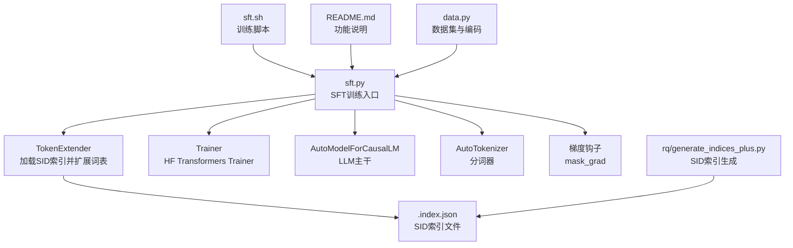
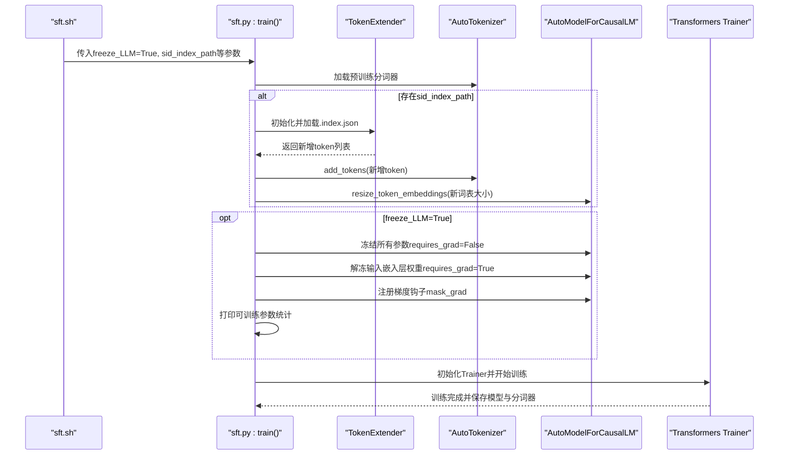
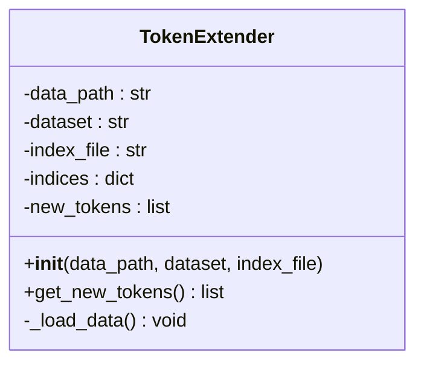
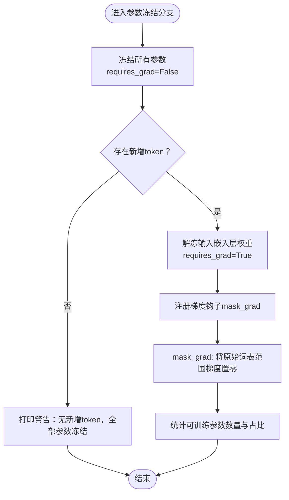
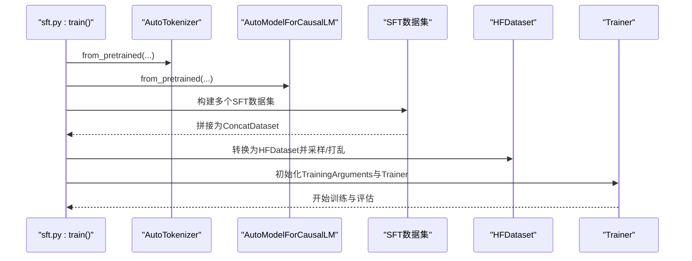
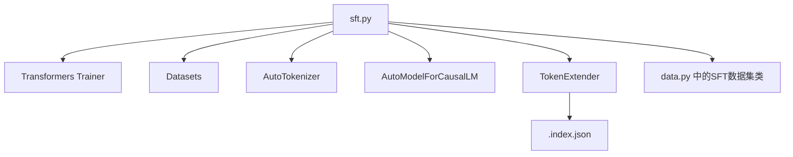

# 参数冻结

<cite>
**本文引用的文件**
- [sft.py](file://sft.py)
- [sft.sh](file://sft.sh)
- [README.md](file://README.md)
- [data.py](file://data.py)
- [rq/generate_indices_plus.py](file://rq/generate_indices_plus.py)
</cite>

## 目录
1. [简介](#简介)
2. [项目结构](#项目结构)
3. [核心组件](#核心组件)
4. [架构总览](#架构总览)
5. [详细组件分析](#详细组件分析)
6. [依赖关系分析](#依赖关系分析)
7. [性能考量](#性能考量)
8. [故障排查指南](#故障排查指南)
9. [结论](#结论)
10. [附录](#附录)

## 简介
本节聚焦于MiniOneRec在监督微调阶段（SFT）中通过“参数冻结（freeze_LLM）”机制实现高效训练的技术细节。当freeze_LLM=True时，模型主干参数被冻结，仅训练新增的语义ID（SID）嵌入层；同时，TokenExtender负责从SID索引文件加载SID并动态扩展词表，配合梯度钩子（hook）确保只有新增token的嵌入参与更新。本文将结合sft.py中的实现，系统阐述该机制的工作流程、关键数据结构与算法、性能优化效果，并提供配置示例与训练日志解读，帮助读者快速掌握该技术对训练效率与资源消耗的优化作用。

## 项目结构
围绕参数冻结与词表扩展的关键文件与职责如下：
- sft.py：SFT训练入口，包含参数冻结逻辑、TokenExtender使用、梯度钩子注册与训练器初始化。
- sft.sh：SFT训练脚本示例，展示freeze_LLM等关键参数的传入方式。
- README.md：项目说明，包含“可选择在SFT阶段冻结LLM参数”的功能说明。
- data.py：数据集构建与编码相关工具，支撑SFT训练的数据输入。
- rq/generate_indices_plus.py：SID索引生成脚本，输出“.index.json”，供TokenExtender加载。

图表来源
- [sft.py](file://sft.py#L138-L271)
- [sft.sh](file://sft.sh#L1-L27)
- [README.md](file://README.md#L28-L36)
- [data.py](file://data.py#L1-L200)
- [rq/generate_indices_plus.py](file://rq/generate_indices_plus.py#L123-L162)

章节来源
- [sft.py](file://sft.py#L138-L271)
- [sft.sh](file://sft.sh#L1-L27)
- [README.md](file://README.md#L28-L36)
- [data.py](file://data.py#L1-L200)
- [rq/generate_indices_plus.py](file://rq/generate_indices_plus.py#L123-L162)

## 核心组件
- 参数冻结开关：freeze_LLM布尔值控制是否冻结LLM主干参数。
- TokenExtender：从“.index.json”读取SID映射，提取新增token集合，动态扩展分词器并调整嵌入矩阵大小。
- 梯度钩子mask_grad：对输入嵌入权重的梯度进行掩码，仅允许新增token行参与反向传播。
- 训练器Trainer：基于Transformers Trainer进行训练，支持多卡分布式与早停回调。

章节来源
- [sft.py](file://sft.py#L110-L119)
- [sft.py](file://sft.py#L152-L187)
- [sft.py](file://sft.py#L175-L183)
- [sft.py](file://sft.py#L229-L266)

## 架构总览
下图展示了freeze_LLM=True时的训练流程与关键交互：

图表来源
- [sft.py](file://sft.py#L138-L271)
- [sft.sh](file://sft.sh#L1-L27)

## 详细组件分析

### 组件A：TokenExtender（SID索引加载与词表扩展）
- 职责
  - 从指定数据集目录加载“.index.json”。
  - 提取所有SID token集合，去重并排序，作为新增token列表。
  - 将新增token加入分词器，并调用resize_token_embeddings以扩展嵌入矩阵。
- 关键点
  - 索引文件路径由sid_index_path传入，TokenExtender根据数据集名与目录解析。
  - 新增token数量通常远小于原始词表规模，显著降低训练参数量。
- 复杂度
  - 加载与去重操作近似O(N)，N为索引中token总数；扩展词表为O(1)。

图表来源
- [sft.py](file://sft.py#L33-L59)

章节来源
- [sft.py](file://sft.py#L33-L59)
- [rq/generate_indices_plus.py](file://rq/generate_indices_plus.py#L123-L162)

### 组件B：参数冻结与梯度钩子（mask_grad）
- 冻结策略
  - 当freeze_LLM=True时，遍历模型所有参数，将其requires_grad设为False。
  - 获取输入嵌入层（get_input_embeddings），若嵌入矩阵大小超过原始词表，则仅解冻嵌入权重。
- 梯度钩子
  - 注册mask_grad钩子，对输入嵌入权重的梯度进行掩码：将原始词表范围内的梯度置零，仅保留新增token对应的梯度。
- 可训练参数统计
  - 打印当前可训练参数数量与占比，体现冻结带来的参数规模下降。

图表来源
- [sft.py](file://sft.py#L165-L193)
- [sft.py](file://sft.py#L175-L183)

章节来源
- [sft.py](file://sft.py#L165-L193)
- [sft.py](file://sft.py#L175-L183)

### 组件C：训练流程与数据准备
- 分词器与模型
  - 使用AutoTokenizer加载预训练分词器，设置pad_token与padding_side。
  - 使用AutoModelForCausalLM加载预训练模型，bf16精度训练。
- 数据集
  - 构建多个SFT数据集（含SID、历史标题等），拼接为一个大集合。
  - 使用HuggingFace Dataset进行采样与打乱，构造训练/验证集。
- 训练器
  - 使用Transformers Trainer，配置bf16、warmup_steps、eval_strategy、save_strategy等。
  - 支持多GPU并行与早停回调。

图表来源
- [sft.py](file://sft.py#L138-L271)
- [data.py](file://data.py#L1-L200)

章节来源
- [sft.py](file://sft.py#L138-L271)
- [data.py](file://data.py#L1-L200)

## 依赖关系分析
- 外部依赖
  - Transformers：模型与分词器加载、Trainer训练框架。
  - Datasets：数据集转换与批处理。
  - Fire：命令行参数解析。
- 内部依赖
  - TokenExtender依赖“.index.json”索引文件。
  - 训练流程依赖多种SFT数据集类（由data.py提供）。

图表来源
- [sft.py](file://sft.py#L138-L271)
- [data.py](file://data.py#L1-L200)
- [rq/generate_indices_plus.py](file://rq/generate_indices_plus.py#L123-L162)

章节来源
- [sft.py](file://sft.py#L138-L271)
- [data.py](file://data.py#L1-L200)
- [rq/generate_indices_plus.py](file://rq/generate_indices_plus.py#L123-L162)

## 性能考量
- 参数规模下降
  - 冻结LLM主干后，仅训练输入嵌入层新增token行，大幅减少可训练参数数量，从而降低显存占用与计算开销。
- 训练速度提升
  - 可训练参数减少，前向/反向传播更快，适合中小规模数据集或资源受限场景。
- 内存与显存优化
  - 输入嵌入矩阵扩展但仅新增token参与更新，避免对原始词表的频繁写入，降低内存压力。
- 适用场景
  - 当SID覆盖范围有限且与预训练词表差异较大时，参数冻结收益更明显；若SID几乎覆盖原词表，则收益有限。

[本节为通用性能讨论，不直接分析具体代码文件]

## 故障排查指南
- 问题：freeze_LLM=True但未见新增token
  - 检查sid_index_path是否存在且格式正确；确认“.index.json”中包含目标数据集名称对应的键。
  - 确认TokenExtender初始化时传入的dataset与目录匹配。
- 问题：训练参数统计异常
  - 确认在冻结后已正确解冻输入嵌入层权重并注册梯度钩子。
  - 检查mask_grad是否生效（原始词表范围梯度应为零）。
- 问题：显存不足或训练过慢
  - 适当减小batch_size或micro_batch_size，增大gradient_accumulation_steps。
  - 确保group_by_length与bf16配置合理。
- 问题：训练日志中可训练参数比例异常
  - 检查resize_token_embeddings是否成功扩展词表，以及是否在冻结后正确解冻嵌入层。

章节来源
- [sft.py](file://sft.py#L152-L187)
- [sft.py](file://sft.py#L175-L183)
- [sft.py](file://sft.py#L188-L193)

## 结论
MiniOneRec通过freeze_LLM机制，在SFT阶段将LLM主干参数冻结，仅训练新增SID嵌入层，结合TokenExtender动态扩展词表与梯度钩子mask_grad，实现了对训练参数规模与计算开销的有效控制。该方法在保持模型语言能力的同时，显著降低了资源消耗，适用于中小规模数据集与资源受限场景。配合合理的训练配置与日志监控，可稳定获得良好的训练效果。

[本节为总结性内容，不直接分析具体代码文件]

## 附录

### 配置示例（freeze_LLM=True）
- 命令行参数要点
  - --base_model：预训练模型路径或标识符。
  - --sid_index_path：指向“.index.json”的完整路径。
  - --item_meta_path：物品元信息JSON路径（用于数据集构建）。
  - --freeze_LLM：设为True启用参数冻结。
  - --batch_size、--micro_batch_size、--learning_rate、--num_epochs：按需调整。
- 示例脚本片段
  - 参考sft.sh中对freeze_LLM与sid_index_path的传入方式。

章节来源
- [sft.sh](file://sft.sh#L1-L27)
- [sft.py](file://sft.py#L110-L119)

### 训练日志输出说明
- “Freezing LLM parameters, only training new token embeddings”
  - 表明已启用参数冻结。
- “Adding {N} new tokens to tokenizer”
  - 显示新增token数量与词表扩展结果。
- “Unfrozen {M} new token embeddings ...”
  - 显示仅新增token嵌入被解冻并参与训练。
- “Trainable parameters (with grad-mask): ...”
  - 展示当前可训练参数规模与占比，反映冻结带来的参数压缩效果。

章节来源
- [sft.py](file://sft.py#L165-L193)