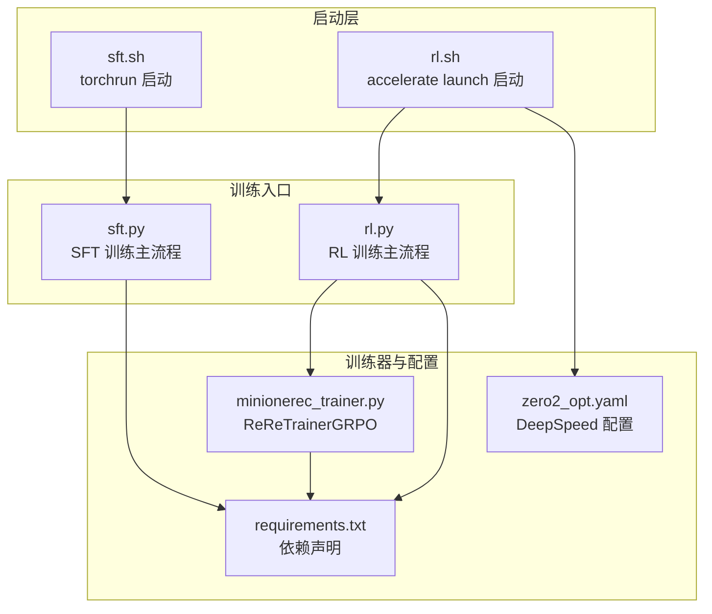
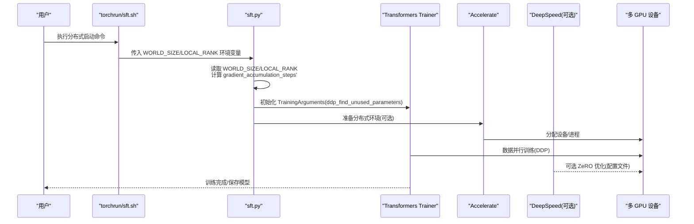
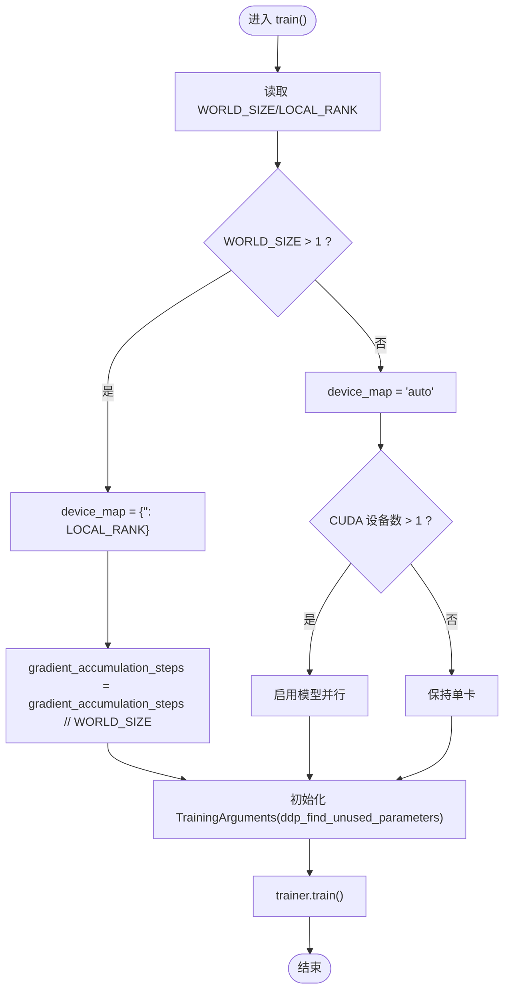
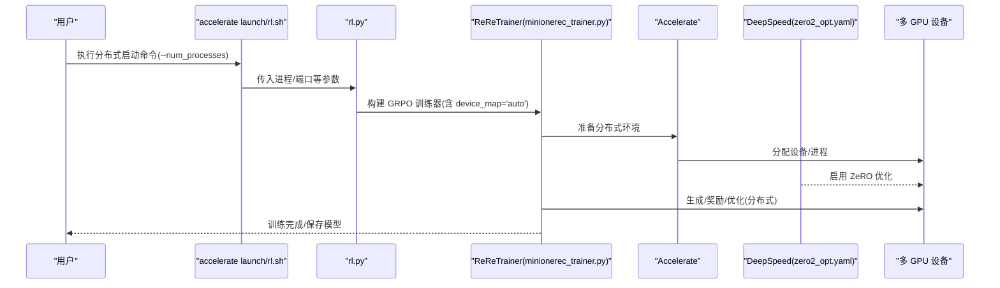
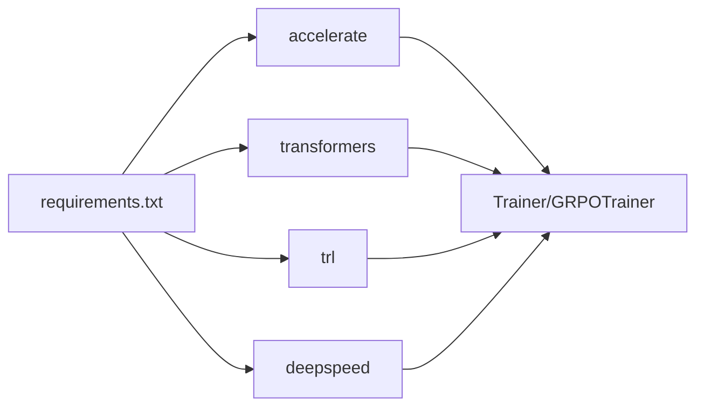

# 多GPU支持

<cite>
**本文引用的文件**
- [sft.py](file://sft.py)
- [rl.py](file://rl.py)
- [minionerec_trainer.py](file://minionerec_trainer.py)
- [sft.sh](file://sft.sh)
- [rl.sh](file://rl.sh)
- [requirements.txt](file://requirements.txt)
- [zero2_opt.yaml](file://config/zero2_opt.yaml)
- [README.md](file://README.md)
</cite>

## 目录
1. [简介](#简介)
2. [项目结构](#项目结构)
3. [核心组件](#核心组件)
4. [架构总览](#架构总览)
5. [详细组件分析](#详细组件分析)
6. [依赖分析](#依赖分析)
7. [性能考量](#性能考量)
8. [故障排查指南](#故障排查指南)
9. [结论](#结论)
10. [附录](#附录)

## 简介
本文件系统性阐述 MiniOneRec 在多 GPU 训练上的原生支持机制，重点分析 SFT（监督微调）与 RL（强化学习）阶段如何通过 Hugging Face Transformers 与 Accelerate 库实现 DDP（分布式数据并行）训练。内容覆盖：
- 自动检测 world_size 与 LOCAL_RANK 的方式
- device_map='auto' 的模型分配策略
- 梯度累积步数在多卡间的调整规则
- ddp_find_unused_parameters 的配置逻辑
- 通过 WORLD_SIZE 与 LOCAL_RANK 环境变量启动多卡训练的方法
- 典型分布式启动命令示例

## 项目结构
围绕多 GPU 支持的关键文件与脚本如下：
- 启动脚本：sft.sh、rl.sh
- 训练入口：sft.py、rl.py
- 推荐训练器：minionerec_trainer.py（RL 阶段）
- 分布式配置：config/zero2_opt.yaml
- 依赖声明：requirements.txt

图表来源
- [sft.sh](file://sft.sh#L1-L27)
- [rl.sh](file://rl.sh#L1-L42)
- [sft.py](file://sft.py#L93-L276)
- [rl.py](file://rl.py#L1-L317)
- [minionerec_trainer.py](file://minionerec_trainer.py#L1-L120)
- [zero2_opt.yaml](file://config/zero2_opt.yaml#L1-L20)
- [requirements.txt](file://requirements.txt#L1-L139)

章节来源
- [sft.sh](file://sft.sh#L1-L27)
- [rl.sh](file://rl.sh#L1-L42)
- [sft.py](file://sft.py#L93-L276)
- [rl.py](file://rl.py#L1-L317)
- [minionerec_trainer.py](file://minionerec_trainer.py#L1-L120)
- [zero2_opt.yaml](file://config/zero2_opt.yaml#L1-L20)
- [requirements.txt](file://requirements.txt#L1-L139)

## 核心组件
- SFT 训练入口（sft.py）：负责加载模型、分词器、数据集，构建 Trainer 并进行训练；在多卡场景下自动检测 WORLD_SIZE 与 LOCAL_RANK，动态调整 device_map 与 gradient_accumulation_steps，并设置 ddp_find_unused_parameters。
- RL 训练入口（rl.py）：使用 ReReTrainer（基于 GRPO）进行推荐导向的强化学习训练；通过 accelerate launch 启动，结合 DeepSpeed 配置文件实现分布式训练。
- ReReTrainer（minionerec_trainer.py）：在 GRPO 流程中利用 Accelerate 的设备与进程管理能力，处理生成、奖励计算与优化过程的分布式一致性。
- 启动脚本（sft.sh、rl.sh）：分别使用 torchrun 与 accelerate launch 进行多 GPU 启动，设置必要的环境变量与进程参数。
- 分布式配置（zero2_opt.yaml）：定义分布式类型为 DEEPSPEED，启用混合精度 bf16，并配置 ZeRO 优化策略。
- 依赖声明（requirements.txt）：包含 accelerate、transformers、trl 等关键库版本，确保分布式与训练器兼容。

章节来源
- [sft.py](file://sft.py#L93-L276)
- [rl.py](file://rl.py#L1-L317)
- [minionerec_trainer.py](file://minionerec_trainer.py#L1-L120)
- [sft.sh](file://sft.sh#L1-L27)
- [rl.sh](file://rl.sh#L1-L42)
- [zero2_opt.yaml](file://config/zero2_opt.yaml#L1-L20)
- [requirements.txt](file://requirements.txt#L1-L139)

## 架构总览
下图展示了 SFT 与 RL 两阶段在多 GPU 场景下的整体交互与分布式控制流。

图表来源
- [sft.sh](file://sft.sh#L1-L27)
- [sft.py](file://sft.py#L93-L276)
- [zero2_opt.yaml](file://config/zero2_opt.yaml#L1-L20)

## 详细组件分析

### SFT 阶段的多 GPU 支持（sft.py）
- 自动检测 world_size 与 LOCAL_RANK
  - 通过读取环境变量 WORLD_SIZE 获取全局进程数；当 WORLD_SIZE > 1 时判定为 DDP 场景。
  - 当处于 DDP 场景时，device_map 被设置为 {"": LOCAL_RANK}，将模型显式绑定到当前进程所对应的 GPU。
  - 若未设置 LOCAL_RANK，则默认使用 0。
- device_map='auto' 的模型分配策略
  - 在非 DDP 场景且 torch.cuda.device_count() > 1 时，启用模型并行（is_parallelizable/model_parallel）以利用多卡。
  - 在 DDP 场景下，device_map 显式绑定到 LOCAL_RANK，避免跨进程共享权重导致的不一致。
- 梯度累积步数在多卡间的调整
  - 原始 batch_size 由 batch_size 与 micro_batch_size 计算得到；在 DDP 场景下，gradient_accumulation_steps 会按 world_size 进行整除调整，从而保证全局有效批大小不变。
- ddp_find_unused_parameters 的配置
  - 当 ddp=True 时，TrainingArguments 中设置 ddp_find_unused_parameters=False；否则为 None。该配置用于控制是否在 DDP 中查找未使用参数，有助于稳定训练与减少不必要的通信开销。

图表来源
- [sft.py](file://sft.py#L93-L276)

章节来源
- [sft.py](file://sft.py#L93-L276)

### RL 阶段的多 GPU 支持（rl.py 与 ReReTrainer）
- 分布式启动方式
  - 使用 accelerate launch 启动，通过 --num_processes 指定进程数量，并结合配置文件 zero2_opt.yaml 启用 DeepSpeed（分布式类型 DEEPSPEED）。
- device_map='auto' 的模型分配策略
  - 在 RL 阶段，模型加载时使用 device_map="auto"，由 Accelerate/Transformers 自动在可用 GPU 上进行分片或并行放置。
- 生成与奖励计算的分布式一致性
  - ReReTrainer 内部使用 Accelerate 的设备与进程管理能力，确保不同进程对相同提示的重复采样与奖励归一化在组内正确完成。
- ddp_find_unused_parameters 的配置
  - ReReTrainer 继承自 Trainer，其 ddp_find_unused_parameters 的设置遵循 Accelerate/Trainer 的默认行为；在本仓库中，RL 阶段主要通过 accelerate launch 与 DeepSpeed 配置实现分布式，未显式在训练参数中覆盖该选项。

图表来源
- [rl.sh](file://rl.sh#L1-L42)
- [rl.py](file://rl.py#L1-L317)
- [minionerec_trainer.py](file://minionerec_trainer.py#L1-L120)
- [zero2_opt.yaml](file://config/zero2_opt.yaml#L1-L20)

章节来源
- [rl.py](file://rl.py#L1-L317)
- [minionerec_trainer.py](file://minionerec_trainer.py#L1-L120)
- [rl.sh](file://rl.sh#L1-L42)
- [zero2_opt.yaml](file://config/zero2_opt.yaml#L1-L20)

### 启动脚本与环境变量
- sft.sh 使用 torchrun 启动，通过 --nproc_per_node 指定每节点 GPU 数量，同时设置 NCCL_IB_DISABLE=1 禁用 IB/RoCE，以适配部分网络环境。
- rl.sh 使用 accelerate launch 启动，通过 --num_processes 指定总进程数，并指定主进程端口；同时通过环境变量 HF_ENDPOINT 指向镜像源，提升依赖下载效率。
- 两个脚本均通过环境变量 WORLD_SIZE 与 LOCAL_RANK 将分布式信息传递给训练入口。

章节来源
- [sft.sh](file://sft.sh#L1-L27)
- [rl.sh](file://rl.sh#L1-L42)

## 依赖分析
- 关键依赖
  - accelerate：提供分布式训练与设备管理能力，SFT 与 RL 阶段均依赖其进行进程/设备协调。
  - transformers：提供 AutoModelForCausalLM、Trainer、TrainingArguments 等核心组件，SFT 与 RL 阶段均直接使用。
  - trl：提供 GRPO 训练器与相关配置，RL 阶段使用 ReReTrainer（基于 GRPO）。
  - deepspeed：通过配置文件启用 ZeRO 优化，降低显存占用，提升大规模训练效率。
- 版本兼容性
  - requirements.txt 中明确列出 accelerate、transformers、trl、deepspeed 等版本，确保分布式与训练器功能稳定。

图表来源
- [requirements.txt](file://requirements.txt#L1-L139)
- [minionerec_trainer.py](file://minionerec_trainer.py#L1-L120)

章节来源
- [requirements.txt](file://requirements.txt#L1-L139)
- [minionerec_trainer.py](file://minionerec_trainer.py#L1-L120)

## 性能考量
- 梯度累积步数调整
  - 在 DDP 场景下，gradient_accumulation_steps 会按 world_size 整除，确保全局有效批大小不变，避免因进程数增加导致的学习不稳定。
- 设备映射策略
  - DDP 场景下将模型显式绑定到 LOCAL_RANK 对应 GPU，减少跨进程权重同步带来的额外开销；非 DDP 且多 GPU 时启用模型并行，提升吞吐。
- DeepSpeed ZeRO 优化
  - 通过 zero2_opt.yaml 启用 ZeRO 2，降低显存占用，提高大规模模型训练的可行性。
- 生成与奖励计算的分布式一致性
  - ReReTrainer 通过 Accelerate 的广播与收集机制，确保不同进程对同一提示的生成与奖励计算在组内一致，避免梯度漂移。

[本节为通用性能讨论，无需特定文件来源]

## 故障排查指南
- WORLD_SIZE 与 LOCAL_RANK 未设置
  - 现象：无法正确识别 DDP 场景，device_map 未按预期绑定到具体 GPU。
  - 处理：通过启动脚本或手动导出环境变量，确保 WORLD_SIZE 与 LOCAL_RANK 正确传递。
- 梯度累积步数与全局批大小不匹配
  - 现象：训练不稳定或显存不足。
  - 处理：确认 batch_size 与 micro_batch_size 的关系，并检查 DDP 场景下 gradient_accumulation_steps 是否已按 world_size 调整。
- ddp_find_unused_parameters 设置不当
  - 现象：在存在未使用参数或动态结构时出现通信异常或训练停滞。
  - 处理：在 DDP 场景下保持 ddp_find_unused_parameters=False，避免不必要的参数追踪。
- DeepSpeed 配置冲突
  - 现象：ZeRO 优化未生效或报错。
  - 处理：核对 zero2_opt.yaml 的 distributed_type 与 mixed_precision 设置，确保与训练入口一致。

章节来源
- [sft.py](file://sft.py#L93-L276)
- [rl.py](file://rl.py#L1-L317)
- [zero2_opt.yaml](file://config/zero2_opt.yaml#L1-L20)

## 结论
MiniOneRec 在 SFT 与 RL 两阶段均实现了对多 GPU 训练的原生支持：
- SFT 阶段通过读取 WORLD_SIZE/LOCAL_RANK，动态设置 device_map 与 gradient_accumulation_steps，并在 DDP 场景下合理配置 ddp_find_unused_parameters。
- RL 阶段通过 accelerate launch 与 DeepSpeed 配置文件实现分布式训练，结合 ReReTrainer 的 Accelerate 集成，保障生成与奖励计算的分布式一致性。
- 启动脚本提供了标准化的分布式启动方式，便于快速扩展到多节点/多卡集群。

[本节为总结性内容，无需特定文件来源]

## 附录

### 启动命令示例
- SFT 多卡启动（torchrun）
  - 示例：在每节点使用 8 张 GPU 启动 SFT 训练，同时设置 NCCL 网络参数与输出目录。
  - 参考路径：[sft.sh](file://sft.sh#L1-L27)
- RL 多卡启动（accelerate launch + DeepSpeed）
  - 示例：使用 accelerate launch 启动 8 个进程，结合 DeepSpeed 配置文件启用 ZeRO 优化。
  - 参考路径：[rl.sh](file://rl.sh#L1-L42)，[zero2_opt.yaml](file://config/zero2_opt.yaml#L1-L20)

章节来源
- [sft.sh](file://sft.sh#L1-L27)
- [rl.sh](file://rl.sh#L1-L42)
- [zero2_opt.yaml](file://config/zero2_opt.yaml#L1-L20)