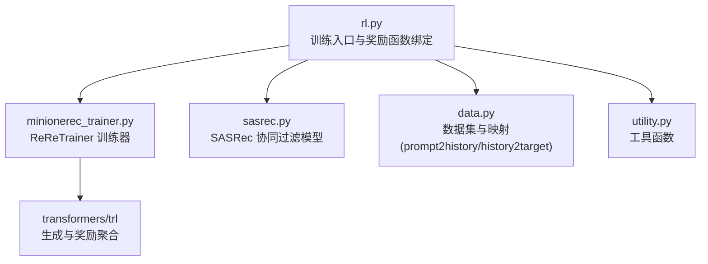
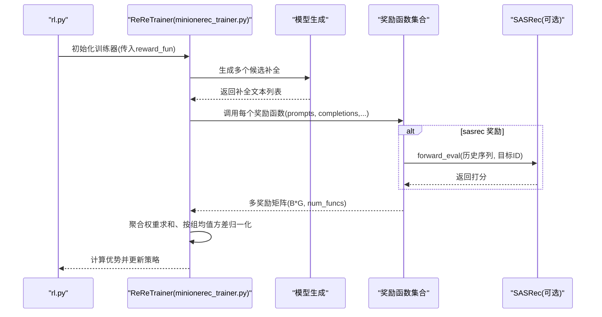
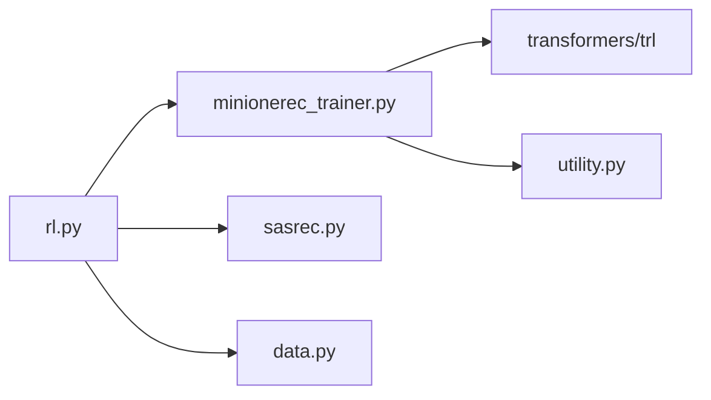
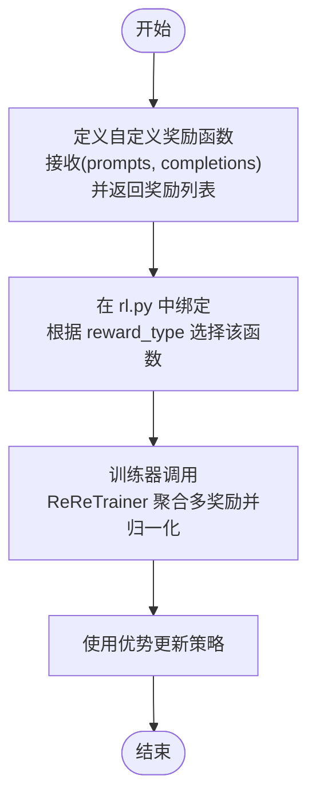

# 自定义奖励信号

<cite>
**本文引用的文件**
- [rl.py](file://rl.py)
- [minionerec_trainer.py](file://minionerec_trainer.py)
- [sasrec.py](file://sasrec.py)
- [data.py](file://data.py)
- [utility.py](file://utility.py)
</cite>

## 目录
1. [简介](#简介)
2. [项目结构](#项目结构)
3. [核心组件](#核心组件)
4. [架构总览](#架构总览)
5. [详细组件分析](#详细组件分析)
6. [依赖关系分析](#依赖关系分析)
7. [性能考量](#性能考量)
8. [故障排查指南](#故障排查指南)
9. [结论](#结论)
10. [附录：扩展新奖励函数的代码模板](#附录扩展新奖励函数的代码模板)

## 简介
本文件围绕 MiniOneRec 强化学习阶段的“灵活奖励信号集成机制”进行深入讲解。基于 rl.py 中的 reward_type 参数，系统性说明如何动态绑定并组合多种奖励函数：
- rule（精确匹配奖励）
- ranking（NDCG 位置加权奖励，与 rule 组合）
- ranking_only（仅 NDCG 位置加权奖励）
- semantic（基于语义嵌入的余弦相似度奖励）
- sasrec（协同过滤模型打分奖励）

文档将解释 reward_fun 如何根据配置动态绑定不同奖励函数，描述每种奖励的计算逻辑、适用场景及对推荐策略的影响，并提供在自定义任务中扩展新奖励函数的代码模板。

## 项目结构
MiniOneRec 的强化学习训练入口位于 rl.py，训练器 ReReTrainer 在 minionerec_trainer.py 中实现，协同过滤模型 SASRec 在 sasrec.py 中定义，数据准备与映射在 data.py 中完成，辅助工具在 utility.py 中提供。

图表来源
- [rl.py](file://rl.py#L1-L120)
- [minionerec_trainer.py](file://minionerec_trainer.py#L298-L347)
- [sasrec.py](file://sasrec.py#L214-L276)
- [data.py](file://data.py#L230-L272)

章节来源
- [rl.py](file://rl.py#L1-L120)
- [minionerec_trainer.py](file://minionerec_trainer.py#L298-L347)
- [sasrec.py](file://sasrec.py#L214-L276)
- [data.py](file://data.py#L230-L272)

## 核心组件
- 奖励函数绑定与选择：rl.py 中通过 reward_type 参数动态选择或组合奖励函数，赋值给 reward_fun。
- 训练器 ReReTrainer：负责生成候选补全、调用奖励函数、聚合多奖励、标准化优势、计算损失并更新策略。
- 协同过滤模型 SASRec：用于 sasrec 奖励，提供物品到物品的打分。
- 数据映射：data.py 构建 prompt2history 与 history2target 映射，供奖励函数按历史序列与目标项进行比对。

章节来源
- [rl.py](file://rl.py#L120-L260)
- [minionerec_trainer.py](file://minionerec_trainer.py#L928-L1025)
- [sasrec.py](file://sasrec.py#L214-L276)
- [data.py](file://data.py#L230-L272)

## 架构总览
下图展示从生成候选到奖励计算与优势归一化的端到端流程，映射到实际源码模块。

图表来源
- [rl.py](file://rl.py#L248-L260)
- [minionerec_trainer.py](file://minionerec_trainer.py#L928-L1025)
- [sasrec.py](file://sasrec.py#L259-L276)

## 详细组件分析

### 奖励函数绑定与选择（rl.py）
- 支持的 reward_type：
  - rule：精确匹配奖励，命中目标项得 1，否则 0。
  - ranking：rule + NDCG 位置加权奖励，组合两个奖励函数。
  - ranking_only：仅 NDCG 位置加权奖励。
  - semantic：基于语义嵌入的余弦相似度奖励。
  - sasrec：基于 SASRec 的协同过滤打分奖励。
- 动态绑定逻辑：
  - 当 reward_type 为 rule/ranking/ranking_only/semantic/sasrec 时，分别将对应函数赋给 reward_fun；当为 ranking 时，reward_fun 是一个包含两个函数的列表。
- 关键实现位置：
  - 奖励函数定义与绑定：[rl.py](file://rl.py#L156-L260)
  - 模型加载与预处理：[rl.py](file://rl.py#L120-L159)

章节来源
- [rl.py](file://rl.py#L120-L260)

### ReReTrainer 奖励聚合与优势归一化（minionerec_trainer.py）
- 生成候选补全后，ReReTrainer 将 prompts 与 completions 传入 reward_funcs 列表中的每个函数。
- 对于模块型奖励函数（如预训练奖励模型），会使用对应的 tokenizer 进行编码并前向得到打分；对于自定义函数（如 rule/semantic/cf），直接以函数形式调用。
- 奖励聚合与归一化：
  - 将各奖励函数输出拼接为矩阵，乘以权重后求和。
  - 按 num_generations 分组，计算组内均值与标准差，再进行优势归一化。
  - 优势向量用于策略梯度更新。
- 关键实现位置：
  - 奖励函数调用与聚合：[minionerec_trainer.py](file://minionerec_trainer.py#L928-L972)
  - 优势归一化与切片：[minionerec_trainer.py](file://minionerec_trainer.py#L972-L1001)
  - 训练损失计算（使用优势）：[minionerec_trainer.py](file://minionerec_trainer.py#L1028-L1066)

章节来源
- [minionerec_trainer.py](file://minionerec_trainer.py#L928-L1066)

### rule 奖励（精确匹配）
- 计算逻辑：根据 prompt2history/history2target 映射获取目标项，比较每个补全是否与目标完全一致，一致则 1，否则 0。
- 适用场景：强调“严格匹配”的任务，适合对齐指令与输出格式的任务。
- 对策略影响：提供明确的二元信号，有利于收敛但可能缺乏细粒度排序信息。

章节来源
- [rl.py](file://rl.py#L186-L198)
- [data.py](file://data.py#L230-L272)

### ranking 奖励（NDCG 位置加权 + rule 组合）
- 计算逻辑：
  - 先构造 NDCG 位置加权奖励数组，按生成顺序分配到各候选上。
  - 若某组内存在与目标完全一致的补全，则该组所有候选奖励置零（由规则奖励主导）；否则使用 NDCG 加权奖励。
- 适用场景：需要在“精确匹配”之外，同时鼓励更合理的排序位置。
- 对策略影响：在保证正确性的前提下，引导模型在错误补全时也尽量给出更靠前的候选。

章节来源
- [rl.py](file://rl.py#L156-L199)
- [data.py](file://data.py#L230-L272)

### ranking_only 奖励（仅 NDCG 位置加权）
- 计算逻辑：与 ranking 类似，但不包含 rule 部分，仅使用 NDCG 位置加权。
- 适用场景：更注重排序质量而非严格匹配的任务。
- 对策略影响：促使模型学习排序偏好，但可能牺牲部分准确性。

章节来源
- [rl.py](file://rl.py#L156-L199)

### semantic 奖励（语义嵌入余弦相似度）
- 计算逻辑：
  - 从映射中提取目标项与当前补全项的 ID，查表得到其语义嵌入向量。
  - 计算目标与补全之间的余弦相似度作为奖励。
- 适用场景：当希望利用语义相近性提升推荐多样性与相关性。
- 对策略影响：鼓励语义接近的补全，有助于跨领域或长尾物品的发现。

章节来源
- [rl.py](file://rl.py#L199-L214)
- [data.py](file://data.py#L230-L272)

### sasrec 奖励（协同过滤打分）
- 计算逻辑：
  - 使用 SASRec 模型对“历史序列 + 目标物品”进行打分，取目标物品的预测分数作为奖励。
  - 历史序列会被截断/填充到固定长度，目标物品 ID 通过映射转换。
- 适用场景：需要利用协同信号提升推荐质量与覆盖率。
- 对策略影响：结合用户历史行为，提高召回与排序的准确性。

章节来源
- [rl.py](file://rl.py#L144-L159)
- [rl.py](file://rl.py#L215-L246)
- [sasrec.py](file://sasrec.py#L259-L276)

### 数据映射与生成（data.py）
- prompt2history 与 history2target：
  - 通过数据集构建，将 prompt 文本映射到历史字符串，再将历史字符串映射到目标项。
  - 该映射在奖励函数中被用于规则匹配与 NDCG 计算。
- 关键实现位置：
  - 映射构建与生成：[data.py](file://data.py#L230-L272)

章节来源
- [data.py](file://data.py#L230-L272)

## 依赖关系分析
- rl.py 依赖：
  - ReReTrainer（训练器）：[rl.py](file://rl.py#L288-L305)
  - SASRec（协同过滤模型，仅在 sasrec 奖励时加载）：[rl.py](file://rl.py#L144-L159)
  - 语义嵌入（仅在 semantic 奖励时加载）：[rl.py](file://rl.py#L149-L154)
  - 数据映射（prompt2history/history2target）：[data.py](file://data.py#L230-L272)
- ReReTrainer 依赖：
  - transformers/trl 的生成与奖励处理能力：[minionerec_trainer.py](file://minionerec_trainer.py#L928-L1025)
  - SASRec（可选）：[sasrec.py](file://sasrec.py#L259-L276)

图表来源
- [rl.py](file://rl.py#L120-L260)
- [minionerec_trainer.py](file://minionerec_trainer.py#L928-L1025)
- [sasrec.py](file://sasrec.py#L214-L276)
- [data.py](file://data.py#L230-L272)
- [utility.py](file://utility.py#L1-L180)

章节来源
- [rl.py](file://rl.py#L120-L260)
- [minionerec_trainer.py](file://minionerec_trainer.py#L928-L1025)
- [sasrec.py](file://sasrec.py#L214-L276)
- [data.py](file://data.py#L230-L272)
- [utility.py](file://utility.py#L1-L180)

## 性能考量
- 批量生成与奖励并行：ReReTrainer 会一次性生成多个候选补全，随后统一调用奖励函数，减少重复开销。
- 奖励聚合与归一化：按组均值/方差归一化，避免极端奖励主导，提升稳定性。
- 模型加载与设备：SASRec 在 sasrec 奖励模式下加载到设备并设置为 eval，避免训练开销。
- 语义嵌入缓存：semantic 奖励一次性加载语义向量，后续直接查表计算余弦相似度。

章节来源
- [minionerec_trainer.py](file://minionerec_trainer.py#L928-L1001)
- [rl.py](file://rl.py#L144-L159)

## 故障排查指南
- 奖励函数返回类型不匹配：
  - ReReTrainer 期望每个奖励函数返回数值列表，且长度等于生成数量。若返回形状不一致，会导致聚合报错。
  - 参考路径：[minionerec_trainer.py](file://minionerec_trainer.py#L928-L972)
- 无效物品 ID 或越界：
  - semantic 与 sasrec 奖励依赖 item2id 映射，若补全项不在映射中，需确保映射完整或进行兜底处理。
  - 参考路径：[rl.py](file://rl.py#L199-L246)
- 奖励权重与函数数量不一致：
  - 若设置了 reward_weights，必须与 reward_funcs 数量一致，否则会抛出异常。
  - 参考路径：[minionerec_trainer.py](file://minionerec_trainer.py#L301-L318)
- NDCG 奖励归一化导致组内奖励为零：
  - ranking 模式下，若某组存在完全匹配补全，该组奖励会被置零；这是预期行为，若不符合需求可切换为 ranking_only。
  - 参考路径：[rl.py](file://rl.py#L156-L199)

章节来源
- [minionerec_trainer.py](file://minionerec_trainer.py#L301-L318)
- [rl.py](file://rl.py#L156-L246)

## 结论
MiniOneRec 的奖励信号集成机制通过 reward_type 参数实现了灵活的奖励函数绑定与组合，配合 ReReTrainer 的奖励聚合与优势归一化，能够在不同任务目标之间快速切换。rule/ranking/ranking_only 主要面向“准确匹配与排序质量”，semantic 奖励引入语义相关性，sasrec 奖励引入协同信号。通过上述机制，用户可以在同一框架下评估不同奖励策略对推荐效果的影响，并据此优化策略。

## 附录：扩展新奖励函数的代码模板
以下模板展示了如何在自定义任务中添加新的奖励函数，并将其接入 ReReTrainer 的奖励管线。

- 步骤一：在 rl.py 中定义你的奖励函数
  - 函数签名建议：接收 prompts 与 completions 列表，返回与生成数量一致的奖励列表。
  - 示例路径参考：[rl.py](file://rl.py#L186-L214)
- 步骤二：在 rl.py 中绑定新奖励函数
  - 在 reward_type 分支中新增分支，将你的函数赋给 reward_fun。
  - 示例路径参考：[rl.py](file://rl.py#L248-L260)
- 步骤三：在 ReReTrainer 中确保奖励函数兼容
  - 自定义函数会被直接调用，无需额外封装；若使用预训练奖励模型，请遵循模块型奖励的规范。
  - 示例路径参考：[minionerec_trainer.py](file://minionerec_trainer.py#L928-L972)

图表来源
- [rl.py](file://rl.py#L248-L260)
- [minionerec_trainer.py](file://minionerec_trainer.py#L928-L1001)