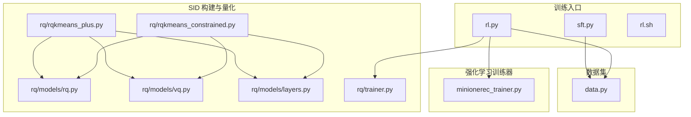
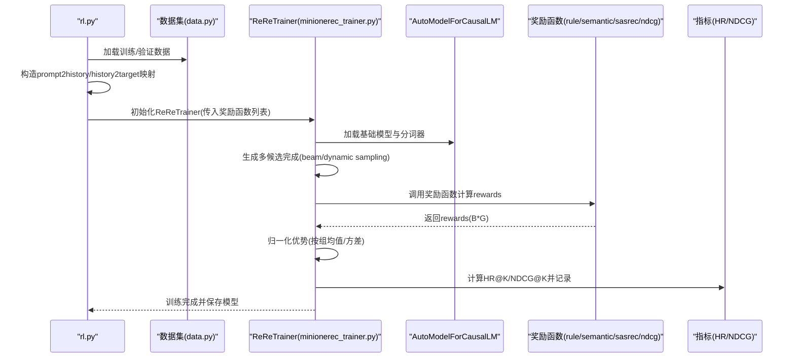
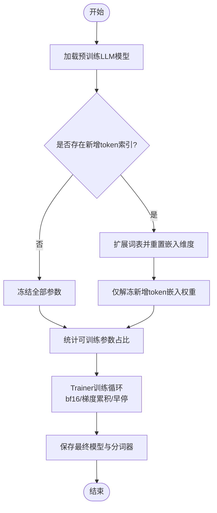
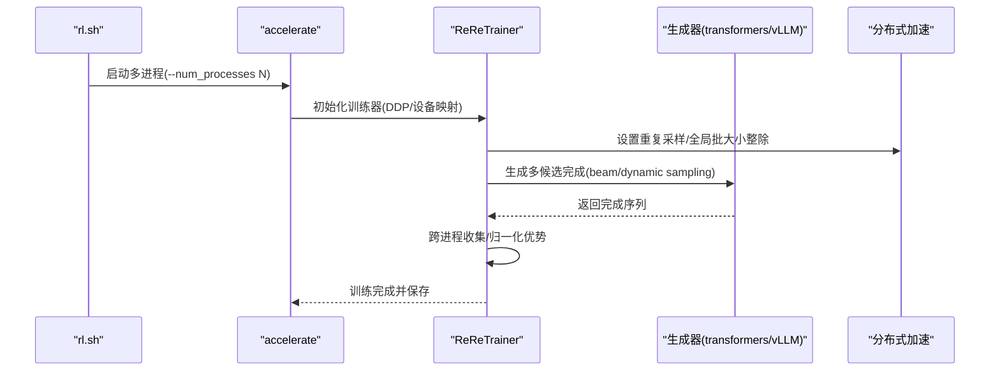
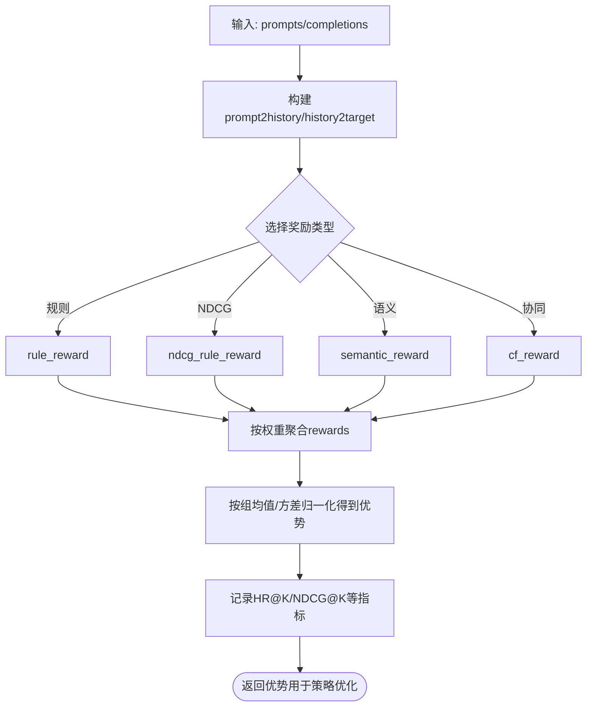
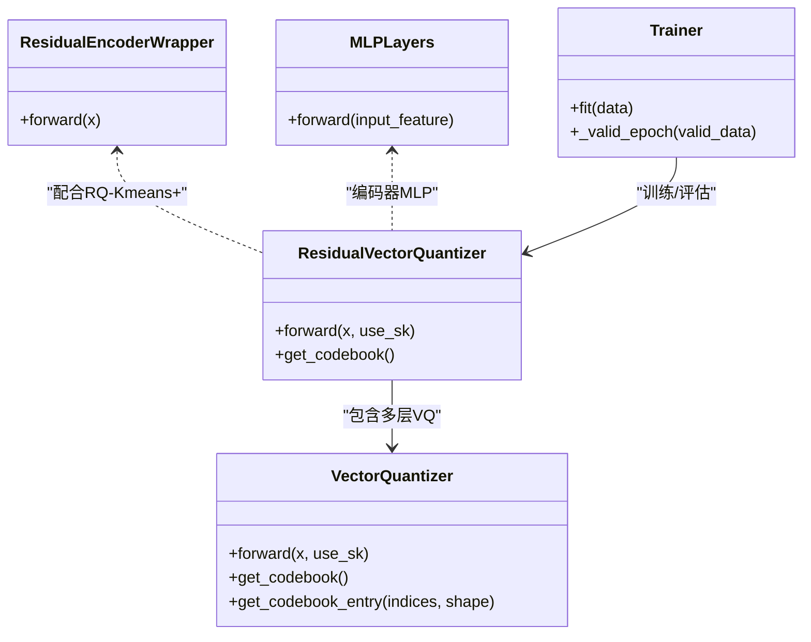
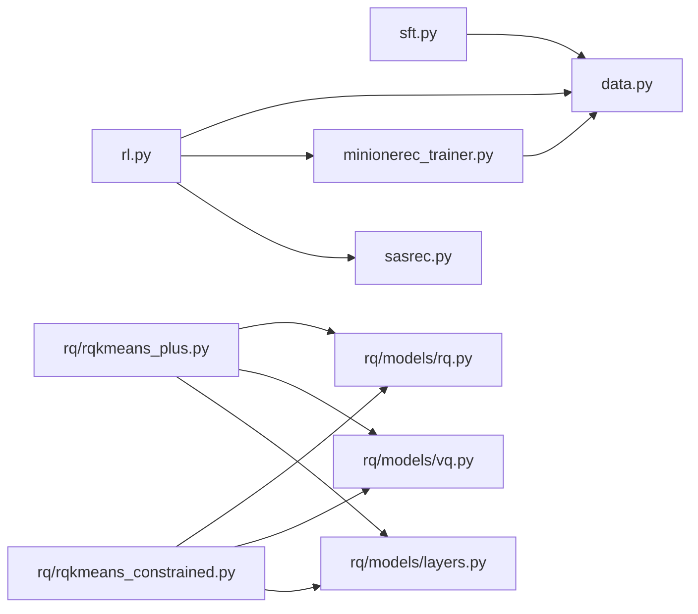

# 高级特性

<cite>
**本文引用的文件**
- [sft.py](file://sft.py)
- [rl.py](file://rl.py)
- [minionerec_trainer.py](file://minionerec_trainer.py)
- [rq/rqkmeans_plus.py](file://rq/rqkmeans_plus.py)
- [rq/rqkmeans_constrained.py](file://rq/rqkmeans_constrained.py)
- [rq/models/rq.py](file://rq/models/rq.py)
- [rq/models/vq.py](file://rq/models/vq.py)
- [rq/models/layers.py](file://rq/models/layers.py)
- [rq/trainer.py](file://rq/trainer.py)
- [data.py](file://data.py)
- [rl.sh](file://rl.sh)
</cite>

## 目录
1. [简介](#简介)
2. [项目结构](#项目结构)
3. [核心组件](#核心组件)
4. [架构总览](#架构总览)
5. [详细组件分析](#详细组件分析)
6. [依赖关系分析](#依赖关系分析)
7. [性能考量](#性能考量)
8. [故障排查指南](#故障排查指南)
9. [结论](#结论)
10. [附录](#附录)

## 简介
本指南聚焦 MiniOneRec 的高级能力：参数冻结、多 GPU 支持、自定义奖励信号以及多种 SID 构建算法（RQ-Kmeans+、Constrained RQ-Kmeans）。我们将从系统架构、数据流、处理逻辑与集成点出发，结合具体文件路径与行号，解释这些特性如何提升模型灵活性与性能，并给出可操作的配置建议与实践参考。

## 项目结构
MiniOneRec 由训练脚本、推荐数据集构造器、量化与 SID 构建模块、强化学习训练器等组成。关键目录与文件如下：
- 训练入口：sft.py（监督微调）、rl.py（强化学习）
- 推荐数据集：data.py（SFT/RL 数据集构造）
- 强化学习训练器：minionerec_trainer.py（ReReTrainer 实现 GRPO）
- SID 构建与量化：rq/rqkmeans_plus.py、rq/rqkmeans_constrained.py、rq/models/*、rq/trainer.py
- 多 GPU 启动脚本：rl.sh

图表来源
- [sft.py](file://sft.py#L1-L276)
- [rl.py](file://rl.py#L1-L317)
- [minionerec_trainer.py](file://minionerec_trainer.py#L1-L1149)
- [rq/rqkmeans_plus.py](file://rq/rqkmeans_plus.py#L1-L179)
- [rq/rqkmeans_constrained.py](file://rq/rqkmeans_constrained.py#L1-L292)
- [rq/models/rq.py](file://rq/models/rq.py#L1-L56)
- [rq/models/vq.py](file://rq/models/vq.py#L1-L102)
- [rq/models/layers.py](file://rq/models/layers.py#L1-L108)
- [rq/trainer.py](file://rq/trainer.py#L1-L256)
- [data.py](file://data.py#L1-L1200)
- [rl.sh](file://rl.sh#L1-L30)

章节来源
- [sft.py](file://sft.py#L1-L276)
- [rl.py](file://rl.py#L1-L317)
- [minionerec_trainer.py](file://minionerec_trainer.py#L1-L1149)
- [rq/rqkmeans_plus.py](file://rq/rqkmeans_plus.py#L1-L179)
- [rq/rqkmeans_constrained.py](file://rq/rqkmeans_constrained.py#L1-L292)
- [rq/models/rq.py](file://rq/models/rq.py#L1-L56)
- [rq/models/vq.py](file://rq/models/vq.py#L1-L102)
- [rq/models/layers.py](file://rq/models/layers.py#L1-L108)
- [rq/trainer.py](file://rq/trainer.py#L1-L256)
- [data.py](file://data.py#L1-L1200)
- [rl.sh](file://rl.sh#L1-L30)

## 核心组件
- 参数冻结（SFT 微调）：通过冻结 LLM 参数、仅训练新增 token 嵌入，实现高效微调与低资源占用。
- 多 GPU 支持（RL 训练）：使用 accelerate 启动多进程分布式训练，ReReTrainer 内部处理采样、生成与奖励归一化。
- 自定义奖励信号（RL）：支持规则奖励、语义相似度奖励、协同过滤评分奖励、NDCG 加权奖励等，可组合加权。
- SID 构建算法：RQ-Kmeans+ 引入残差连接与零初始化热启动；Constrained RQ-Kmeans 在每层施加平衡聚类约束，降低碰撞率。

章节来源
- [sft.py](file://sft.py#L110-L193)
- [minionerec_trainer.py](file://minionerec_trainer.py#L397-L415)
- [rl.py](file://rl.py#L144-L259)
- [rq/rqkmeans_plus.py](file://rq/rqkmeans_plus.py#L24-L88)
- [rq/rqkmeans_constrained.py](file://rq/rqkmeans_constrained.py#L26-L128)

## 架构总览
下图展示了 RL 训练主流程：数据准备、提示词历史映射、奖励函数计算、生成与优势估计、指标记录与保存。

图表来源
- [rl.py](file://rl.py#L84-L112)
- [rl.py](file://rl.py#L144-L259)
- [minionerec_trainer.py](file://minionerec_trainer.py#L904-L1001)
- [data.py](file://data.py#L407-L482)
- [data.py](file://data.py#L851-L977)
- [data.py](file://data.py#L979-L1089)

章节来源
- [rl.py](file://rl.py#L1-L317)
- [minionerec_trainer.py](file://minionerec_trainer.py#L1-L1149)
- [data.py](file://data.py#L1-L1200)

## 详细组件分析

### 组件A：参数冻结（SFT 微调）
- 功能要点
  - 可选冻结 LLM 全部参数，仅训练新增 token 嵌入，显著减少可训练参数量与显存占用。
  - 新增 token 通过索引文件加载，动态扩展词表并重置嵌入矩阵大小。
  - 支持从检查点恢复训练，自动选择 bf16 与梯度累积步数。
- 关键实现位置
  - 冻结策略与梯度掩码注册：[sft.py](file://sft.py#L165-L184)
  - 新 token 扩展与嵌入维度调整：[sft.py](file://sft.py#L152-L163)
  - 训练循环与 Trainer 配置：[sft.py](file://sft.py#L211-L266)

图表来源
- [sft.py](file://sft.py#L152-L193)
- [sft.py](file://sft.py#L211-L266)

章节来源
- [sft.py](file://sft.py#L110-L193)
- [sft.py](file://sft.py#L211-L266)

### 组件B：多 GPU 支持（RL 训练）
- 功能要点
  - 使用 accelerate 启动多进程分布式训练，rl.sh 提供示例配置。
  - ReReTrainer 内部处理重复采样、生成与跨进程奖励归一化。
  - vLLM 与 Transformers 两种生成路径，支持 beam 搜索与温度采样。
- 关键实现位置
  - 分布式与设备映射：[sft.py](file://sft.py#L130-L136)
  - 多进程生成与广播：[minionerec_trainer.py](file://minionerec_trainer.py#L702-L721)
  - vLLM 设备分配与权重迁移：[minionerec_trainer.py](file://minionerec_trainer.py#L415-L474)
  - 生成批大小与 num_generations 整除约束：[minionerec_trainer.py](file://minionerec_trainer.py#L397-L415)
  - 启动脚本示例：[rl.sh](file://rl.sh#L1-L30)

图表来源
- [rl.sh](file://rl.sh#L1-L30)
- [minionerec_trainer.py](file://minionerec_trainer.py#L397-L415)
- [minionerec_trainer.py](file://minionerec_trainer.py#L702-L721)
- [minionerec_trainer.py](file://minionerec_trainer.py#L415-L474)
- [sft.py](file://sft.py#L130-L136)

章节来源
- [rl.sh](file://rl.sh#L1-L30)
- [minionerec_trainer.py](file://minionerec_trainer.py#L397-L415)
- [minionerec_trainer.py](file://minionerec_trainer.py#L702-L721)
- [minionerec_trainer.py](file://minionerec_trainer.py#L415-L474)
- [sft.py](file://sft.py#L130-L136)

### 组件C：自定义奖励信号（RL）
- 功能要点
  - 支持多种奖励类型：规则匹配、NDCG 加权、语义相似度、协同过滤评分。
  - 可同时使用多个奖励函数并进行加权求和，按组内归一化得到优势。
  - 内置 prompt2history 与 history2target 映射，便于规则与排序奖励。
- 关键实现位置
  - 奖励函数定义与选择：[rl.py](file://rl.py#L144-L259)
  - ReReTrainer 中奖励函数调用与归一化：[minionerec_trainer.py](file://minionerec_trainer.py#L904-L972)
  - 指标记录（HR/NDCG）：[minionerec_trainer.py](file://minionerec_trainer.py#L970-L1001)
  - 数据集映射构建：[data.py](file://data.py#L407-L482)

图表来源
- [rl.py](file://rl.py#L144-L259)
- [minionerec_trainer.py](file://minionerec_trainer.py#L904-L1001)
- [data.py](file://data.py#L407-L482)

章节来源
- [rl.py](file://rl.py#L144-L259)
- [minionerec_trainer.py](file://minionerec_trainer.py#L904-L1001)
- [data.py](file://data.py#L407-L482)

### 组件D：SID 构建算法（RQ-Kmeans+ 与 Constrained RQ-Kmeans）
- RQ-Kmeans+
  - 特性：在编码器上包裹残差连接，最后一层线性层零初始化，加载预训练 codebook 作为热启动，加速收敛与稳定训练。
  - 关键实现：[rq/rqkmeans_plus.py](file://rq/rqkmeans_plus.py#L15-L88)
- Constrained RQ-Kmeans
  - 特性：每层使用 k-means-constrained 平衡聚类，限制簇大小范围，降低碰撞率，提升 SID 覆盖均衡性。
  - 关键实现：[rq/rqkmeans_constrained.py](file://rq/rqkmeans_constrained.py#L26-L128)
- 量化与残差向量量化
  - RQ 模块与 VQ 层：[rq/models/rq.py](file://rq/models/rq.py#L1-L56)
  - 单层 VQ 与 Sinkhorn 算法：[rq/models/vq.py](file://rq/models/vq.py#L1-L102)
  - MLP 层与 KMeans/Sinkhorn 工具：[rq/models/layers.py](file://rq/models/layers.py#L1-L108)
  - 训练循环与碰撞率评估：[rq/trainer.py](file://rq/trainer.py#L127-L153)

图表来源
- [rq/rqkmeans_plus.py](file://rq/rqkmeans_plus.py#L15-L88)
- [rq/models/rq.py](file://rq/models/rq.py#L1-L56)
- [rq/models/vq.py](file://rq/models/vq.py#L1-L102)
- [rq/models/layers.py](file://rq/models/layers.py#L1-L108)
- [rq/trainer.py](file://rq/trainer.py#L127-L153)

章节来源
- [rq/rqkmeans_plus.py](file://rq/rqkmeans_plus.py#L1-L179)
- [rq/rqkmeans_constrained.py](file://rq/rqkmeans_constrained.py#L1-L292)
- [rq/models/rq.py](file://rq/models/rq.py#L1-L56)
- [rq/models/vq.py](file://rq/models/vq.py#L1-L102)
- [rq/models/layers.py](file://rq/models/layers.py#L1-L108)
- [rq/trainer.py](file://rq/trainer.py#L1-L256)

## 依赖关系分析
- 训练脚本依赖
  - sft.py 依赖 data.py 的 SFT/RL 数据集类与 TokenExtender，Trainer 与 HuggingFace 集成。
  - rl.py 依赖 data.py 的 RL 数据集类、minionerec_trainer.ReReTrainer、SASRec（协同过滤评分）。
- SID 构建依赖
  - rq/rqkmeans_plus.py 依赖 rq/models/* 与 rq/trainer.py；rq/rqkmeans_constrained.py 依赖 k_means_constrained 库与 polars。
- 多 GPU 依赖
  - ReReTrainer 内部使用 accelerate 进行分布式训练与生成，要求 num_generations 与全局批大小整除。

图表来源
- [sft.py](file://sft.py#L1-L276)
- [rl.py](file://rl.py#L1-L317)
- [minionerec_trainer.py](file://minionerec_trainer.py#L1-L1149)
- [rq/rqkmeans_plus.py](file://rq/rqkmeans_plus.py#L1-L179)
- [rq/rqkmeans_constrained.py](file://rq/rqkmeans_constrained.py#L1-L292)
- [rq/models/rq.py](file://rq/models/rq.py#L1-L56)
- [rq/models/vq.py](file://rq/models/vq.py#L1-L102)
- [rq/models/layers.py](file://rq/models/layers.py#L1-L108)
- [data.py](file://data.py#L1-L1200)

章节来源
- [sft.py](file://sft.py#L1-L276)
- [rl.py](file://rl.py#L1-L317)
- [minionerec_trainer.py](file://minionerec_trainer.py#L1-L1149)
- [rq/rqkmeans_plus.py](file://rq/rqkmeans_plus.py#L1-L179)
- [rq/rqkmeans_constrained.py](file://rq/rqkmeans_constrained.py#L1-L292)
- [rq/models/rq.py](file://rq/models/rq.py#L1-L56)
- [rq/models/vq.py](file://rq/models/vq.py#L1-L102)
- [rq/models/layers.py](file://rq/models/layers.py#L1-L108)
- [data.py](file://data.py#L1-L1200)

## 性能考量
- 参数冻结
  - 仅训练新增 token 嵌入可显著降低可训练参数数量，适合资源受限场景；需确保新增 token 数量合理，避免过度稀疏。
  - 参考：[sft.py](file://sft.py#L165-L184)
- 多 GPU
  - 使用 accelerate 多进程时，num_generations 必须能被全局批大小整除，否则会抛出异常；建议根据 GPU 数量与 batch size 调整。
  - 参考：[minionerec_trainer.py](file://minionerec_trainer.py#L397-L415)
- 奖励函数
  - 规则奖励简单稳定；语义/CF 奖励更贴近业务目标，但计算开销更大；可组合加权以平衡性能与效果。
  - 参考：[rl.py](file://rl.py#L144-L259)
- SID 构建
  - RQ-Kmeans+ 通过残差连接与零初始化热启动，收敛更快、稳定性更好；Constrained RQ-Kmeans 降低碰撞率，提升 SID 覆盖均衡性。
  - 参考：[rq/rqkmeans_plus.py](file://rq/rqkmeans_plus.py#L24-L88)，[rq/rqkmeans_constrained.py](file://rq/rqkmeans_constrained.py#L26-L128)

## 故障排查指南
- 分布式训练报错“num_generations 与全局批大小不整除”
  - 现象：ReReTrainer 校验失败，抛出异常。
  - 解决：调整 per_device_train_batch_size 或 num_generations，使其满足整除条件。
  - 参考：[minionerec_trainer.py](file://minionerec_trainer.py#L397-L415)
- vLLM 设备冲突或显存不足
  - 现象：请求设备不可用或与训练 GPU 冲突。
  - 解决：修改 --num_processes 或 vLLM 设备分配，确保独占或共享显存合理。
  - 参考：[minionerec_trainer.py](file://minionerec_trainer.py#L415-L474)
- 奖励函数返回 NaN/Inf
  - 现象：语义/CF 奖励计算中出现数值不稳定。
  - 解决：检查输入合法性（如 item 是否存在），添加裁剪与保护项；必要时降采样或缓存中间结果。
  - 参考：[rl.py](file://rl.py#L215-L246)
- 参数冻结无效
  - 现象：freeze_LLM=True 但所有参数仍被冻结。
  - 解决：确认已加载新增 token 索引并正确扩展词表；检查梯度掩码是否注册。
  - 参考：[sft.py](file://sft.py#L152-L184)

章节来源
- [minionerec_trainer.py](file://minionerec_trainer.py#L397-L415)
- [minionerec_trainer.py](file://minionerec_trainer.py#L415-L474)
- [rl.py](file://rl.py#L215-L246)
- [sft.py](file://sft.py#L152-L184)

## 结论
MiniOneRec 的高级特性通过参数冻结、多 GPU 分布式训练、灵活的自定义奖励信号与多样化的 SID 构建算法，实现了在资源受限与业务导向场景下的高效与高表现。建议在生产环境中：
- 使用参数冻结快速适配新领域，结合 TokenExtender 动态扩展词表；
- 采用 ReReTrainer 的多进程与生成策略，合理设置 num_generations 与 batch size；
- 依据业务目标选择/组合奖励函数，并持续监控 HR/NDCG 等指标；
- 在 SID 构建阶段优先考虑 RQ-Kmeans+ 以获得稳定收敛，或使用 Constrained RQ-Kmeans 以降低碰撞率。

## 附录
- 实际配置示例（路径引用）
  - SFT 参数冻结与新增 token 扩展：[sft.py](file://sft.py#L152-L184)
  - RL 多 GPU 启动脚本示例：[rl.sh](file://rl.sh#L1-L30)
  - 自定义奖励函数选择与组合：[rl.py](file://rl.py#L144-L259)
  - RQ-Kmeans+ 策略应用：[rq/rqkmeans_plus.py](file://rq/rqkmeans_plus.py#L24-L88)
  - Constrained RQ-Kmeans 训练与保存：[rq/rqkmeans_constrained.py](file://rq/rqkmeans_constrained.py#L180-L292)