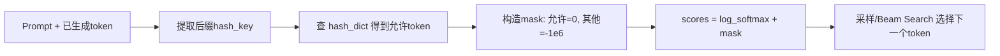

# MiniOneRec 讨论笔记（NOTES）

概览：针对数据转换、SFT数据集实现、RL奖励（NDCG/分组归一化）、Beam Search顺序语义、受限解码（前缀约束）、LogitsProcessor行为与边界处理进行了系统梳理。


## 1. 数据集转换与“brackets”含义

代码位置与片段：
- 文件：convert_dataset.py
  ```python
  def semantic_tokens_to_id(tokens: List[str]) -> str:
      """Convert semantic tokens list to concatenated string with brackets preserved"""
      # Keep brackets and concatenate directly (no spaces)
      return ''.join(tokens)
  ```
- 示例打印（确认拼接效果）：
  ```python
  print(f"  Item {item_id}: {tokens} -> {semantic_id}")
  ```

- 字段：`history_item_sid`、`item_sid` 在生成 CSV 时保留方括号，语义ID最终形如 `[123][456][789]`。
- 转换函数：`semantic_tokens_to_id` 直接拼接 `tokens`，保留每个 token 自带的方括号。
- 参考：`convert_dataset.py` 中 `semantic_tokens_to_id` 的注释与实现确保“with brackets”。


## 2. HFDataset.from_dict 的“行转列”行为

代码位置与片段：
- 文件：sft.py
  ```python
  hf_train_dataset = HFDataset.from_dict({k: [v[k] for v in train_data] for k in train_data[0].keys()})
  ```
- 说明：将样本列表按键聚合为列式字典，符合 HF Dataset 输入规范。

- 代码：`HFDataset.from_dict({k: [v[k] for v in train_data] for k in train_data[0].keys()})`
- 作用：样本是“行”（列表中的每个字典），该写法按字段名聚合成“列”（每列是该字段的所有值列表），符合 HF `Dataset.from_dict` 的输入期望。
- 注意：假设所有样本键集合一致，否则会触发 KeyError。


## 3. 自定义数据集与 `SidSFTDataset` 必要方法

代码位置与片段：
- 文件：data.py（`SidSFTDataset` 初始化与预生成输入）
  ```python
  class SidSFTDataset(Dataset):
      def __init__(self, train_file, tokenizer, max_len=2048, sample=-1, test=False, seed=0, category="", K=4, dedup=False):
          self.data = pd.read_csv(train_file)
          random.seed(seed)
          if sample > 0:
              self.data = self.data.sample(sample, random_state=seed)
          self.tokenizer = Tokenizer(tokenizer)
          self.test = test
          self.max_len = max_len
          self.category = category
          self.dedup = dedup
          self.get_inputs()
  ```
- 文件：data.py（生成训练样本）
  ```python
  def pre(self, idx):
      instruction = """Below is an instruction that describes a task ..."""
      tokens = self.tokenizer.encode(instruction, bos=True, eos=False)
      history = self.get_history(self.data.iloc[idx])
      target_item = history['output']
      history['output'] = ''
      prompt = self.generate_prompt(history)
      tokens = tokens + self.tokenizer.encode(prompt, bos=False, eos=False)
      attention_mask = [1] * len(tokens)
      if self.test:
          return {"input_ids": tokens, "attention_mask": attention_mask}
      golden_tokens = self.tokenizer.encode(target_item, bos=False, eos=True)
      input_prompt_len = len(tokens)
      tokens = tokens + golden_tokens
      attention_mask = [1] * len(tokens)
      labels = [-100] * input_prompt_len + tokens[input_prompt_len:]
      return {"input_ids": tokens[-self.max_len:], "attention_mask": attention_mask[-self.max_len:], "labels": labels[-self.max_len:]}
  ```

- 继承 `torch.utils.data.Dataset` 时必须实现：
  - `__len__`：返回样本总数
  - `__getitem__`：返回单样本字典（典型键：`input_ids`、`attention_mask`、`labels`）
- 项目中的 `SidSFTDataset`：
  - `__init__`：读取 CSV、可采样、构建 `Tokenizer`、预生成 `inputs`
  - `pre`：拼接指令与历史、构造监督标签（提示部分 `labels` 置为 -100，目标部分为真实标签）
  - `generate_prompt` / `get_history`：将 `history_item_sid` 与 `item_sid` 转为提示词与目标文本
- 评估侧 `EvalSidDataset`：同样提供 `__len__`、`__getitem__`，并构造测试所需输入。


## 4. RL 奖励：NDCG权重与分组归一化（GRPO）

代码位置与片段：
- 文件：rl.py（NDCG位置权重）
  ```python
  ndcg_rewards = [-1.0/math.log2(i+2) for i in range(num_generations)]
  ndcg_rewards = [-elm/sum(ndcg_rewards) for elm in ndcg_rewards]
  ```
- 文件：rl.py（按组处理的排名敏感奖励）
  ```python
  def ndcg_rule_reward(prompts, completions):
      history = [prompt2history[prompt] for prompt in prompts]
      targets = [history2target[elm] for elm in history]
      rewards, flag, lis = [], False, []
      for i, completion in enumerate(completions):
          if completion.strip("\n\"") == targets[i].strip("\n\""):
              flag = True; lis.append(0.0)
          else:
              lis.append(ndcg_rewards[i%num_generations])
          if (i+1)%num_generations == 0:
              rewards.extend(lis if flag else [0.0]*num_generations)
              flag, lis = False, []
      return rewards
  ```
- 训练器中的组内归一化（计算优势）：
  ```python
  mean_grouped_rewards = rewards.view(-1, self.num_generations).mean(dim=1)
  std_grouped_rewards = rewards.view(-1, self.num_generations).std(dim=1)
  advantages = (rewards - mean_grouped_rewards) / (std_grouped_rewards + 1e-4)
  ```

- 位置折扣权重：
  - `ndcg_rewards = [-1.0/math.log2(i+2) for i in range(num_generations)]`
  - 归一化到和为 -1：`ndcg_rewards = [-elm/sum(ndcg_rewards) for elm in ndcg_rewards]`
- `ndcg_rule_reward` 流程（简化）：
  - `prompts` 与 `completions` 组织为“一个样本重复 num_generations 次”的扁平数组。
  - 遍历 `completions`：若与目标 `targets[i]` 匹配 → 记 `0.0`；否则按组内位置给负权重 `ndcg_rewards[i % num_generations]`。
  - 每组结束（`(i+1) % num_generations == 0`）：若该组出现过正确答案 → 用组内列表；否则 → 整组记 `0.0`。
- 为什么“答对给 0 分”：
  - GRPO 在训练器中做组内归一化：`advantages = (rewards - mean) / (std + 1e-4)`。
  - 正确项为 0.0，但组内均值为负，归一化后得到正优势值；全错时均为 0.0，归一化后无梯度（避免虚假信号）。


## 5. Beam Search 的顺序含义

代码位置与片段：
- 文件：minionerec_trainer.py（启用 Beam Search 的生成配置）
  ```python
  if self.beam_search:
      self.generation_config = GenerationConfig(
          max_new_tokens=self.max_completion_length,
          length_penalty=self.length_penalty,
          num_beams=self.num_generations,
          num_return_sequences=self.num_generations,
          pad_token_id=processing_class.pad_token_id,
          eos_token_id=processing_class.eos_token_id,
      )
  ```
- 说明：返回的多个 completion 按分数从高到低排序，索引即排名位置。

- 当 `beam_search=True` 且 `num_return_sequences=num_generations`：
  - 生成结果按模型分数从高到低排序（受 `length_penalty` 等影响）。
  - 此时 `i % num_generations` 可作为“排名位置”，给 NDCG 权重是合理的（排名越靠前，错误惩罚越重）。
- 当为随机采样（`do_sample=True`）：
  - 采样顺序无排名语义，不宜用索引分配 NDCG 权重；建议改用简单 `rule_reward`（对=1，错=0）。


## 6. 受限解码：`hash_dict` 与 `ConstrainedLogitsProcessor`

代码位置与片段：
- 文件：minionerec_trainer.py（受限字典构建）
  ```python
  tokenizer = AutoTokenizer.from_pretrained(self.base_model)
  prefixID = [tokenizer(_).input_ids[1:] if self.base_model.lower().find("llama")>-1 else tokenizer(_).input_ids for _ in info]
  prefix_index = 4 if self.base_model.lower().find("gpt2")>-1 else 3
  self.hash_dict = dict()
  for ID in prefixID:
      ID.append(tokenizer.eos_token_id)
      for i in range(prefix_index, len(ID)):
          hash_number = self.get_hash(ID[:i] if i==prefix_index else ID[prefix_index:i])
          if hash_number not in self.hash_dict:
              self.hash_dict[hash_number] = set()
          self.hash_dict[hash_number].add(ID[i])
  for key in self.hash_dict.keys():
      self.hash_dict[key] = list(self.hash_dict[key])
  ```
- 文件：minionerec_trainer.py（允许token查询）
  ```python
  def prefix_allowed_tokens_fn(self, batch_id, input_ids):
      hash_number = self.get_hash(input_ids)
      if hash_number in self.hash_dict:
          return self.hash_dict[hash_number]
      return []
  ```
- 文件：minionerec_trainer.py（挂载Logits处理器）
  ```python
  ccc = ConstrainedLogitsProcessor(
      prefix_allowed_tokens_fn=self.prefix_allowed_tokens_fn,
      num_beams=self.num_generations if self.beam_search else 1,
      base_model=self.base_model
  )
  self.logits_processor = LogitsProcessorList([TemperatureLogitsWarper(temperature=self.temperature), ccc])
  ```

- 目标：确保生成的商品 SID 是合法组合，避免“幻觉”输出。
- 构建 `hash_dict`：
  - 读取 `info_file`，将每个合法 SID 文本（形如 `### Response:\n[123][456]\n`）进行 `tokenize`。
  - 跳过响应前缀（`prefix_index`：LLAMA 为 3，GPT2 为 4），对后续 token 前缀构造哈希键（`get_hash`），映射到允许的“下一个 token 列表”。
  - 示例：`"123-30" -> [456, 789]`，`"123-30-456" -> [40]`，`"123-30-456-40" -> [EOS]`。
- 运行时约束：
  - `prefix_allowed_tokens_fn(batch_id, input_ids_suffix)`：依据当前后缀哈希，返回该位置允许的 token 集合。
  - `ConstrainedLogitsProcessor.__call__(input_ids, scores)`：对 `scores` 做 `log_softmax` 后，构建 `mask`，将允许 token 置零（保留），其他位置加上极大负数（屏蔽）。
  - `self.count` 用于跟踪“已生成步数”，第 1 步取 `prefix_index` 个后缀，后续步按已生成 token 数取后缀。


## 7. LogitsProcessor 的输入形状与循环逻辑

代码位置与片段：
- 文件：LogitProcessor.py（核心约束逻辑）
  ```python
  class ConstrainedLogitsProcessor(LogitsProcessor):
      def __call__(self, input_ids: torch.LongTensor, scores: torch.FloatTensor) -> torch.FloatTensor:
          scores = torch.nn.functional.log_softmax(scores, dim=-1)
          mask = torch.full_like(scores, -1000000)
          for batch_id, beam_sent in enumerate(input_ids.view(-1, self._num_beams, input_ids.shape[-1])):
              for beam_id, sent in enumerate(beam_sent):
                  hash_key = (sent[-self.prefix_index:] if self.count==0 else sent[-self.count:]).tolist()
                  prefix_allowed_tokens = self._prefix_allowed_tokens_fn(batch_id, hash_key)
                  if len(prefix_allowed_tokens) == 0:
                      continue
                  mask[batch_id * self._num_beams + beam_id, prefix_allowed_tokens] = 0
          self.count += 1
          scores = scores + mask
          return scores
  ```
- 说明：
  - `input_ids` 形状 `(batch_size * num_beams, current_length)`；`scores` 形状 `(batch_size * num_beams, vocab_size)`。
  - 仅允许集合保留原分数，其它被屏蔽为近似负无穷。

- `input_ids`：形状 `(batch_size * num_beams, current_sequence_length)`，包含 prompt + 已生成 token；Beam Search 会重复 prompt 以构造多条 beam。
- `scores`：形状 `(batch_size * num_beams, vocab_size)`，当前步的下一个 token 的 logits（或 log-softmax 分数）。
- 处理流程：
  1. `scores = log_softmax(scores, dim=-1)`
  2. 初始化 `mask = full_like(scores, -1e6)`（全部屏蔽）
  3. 按 `(batch_id, beam_id)` 遍历：从 `input_ids` 末尾截取后缀，查询允许的 token 集合；将这些位置的 `mask` 置为 0
  4. 累加：`scores = scores + mask`，仅允许集合保留原分数，其余近似负无穷（概率≈0）
  5. 返回更新后的 `scores`


## 8. 边界情况与稳妥改进建议

代码位置与片段（建议落点）：
- 在 `prefix_allowed_tokens_fn` 返回空集时，回退到允许 `eos_token_id`：
  ```python
  def prefix_allowed_tokens_fn(self, batch_id, input_ids):
      hash_number = self.get_hash(input_ids)
      allowed = self.hash_dict.get(hash_number, [])
      if not allowed:
          return [self.processing_class.eos_token_id]
      return allowed
  ```
- 或在 `ConstrainedLogitsProcessor.__call__` 中为空集不加遮罩（临时解除约束）：
  ```python
  if len(prefix_allowed_tokens) == 0:
      # 不修改mask，保持该beam当前步不被判死
      continue
  ```
- 或实现前缀回退（匹配窗口 3→2→1）：在 `prefix_allowed_tokens_fn` 中按不同长度尝试 `get_hash`。

- 无合法 next token（`prefix_allowed_tokens_fn` 返回空集）：
  - 现状：该 beam 的整行概率被屏蔽为近似负无穷，softmax 后几乎相等，生成器可能“随便选”若干索引，导致不受约束；在 RL 奖励侧会被判错（得 0 或负）。
  - 建议回退策略：
    1) 允许 `eos_token_id` 作为回退（提前结束），避免继续生成不合法 SID；
    2) 临时解除约束（空集时不加遮罩），让该步不被“判死刑”；
    3) 前缀回退匹配：失败时缩短匹配窗口（3→2→1），尽量找最近的合法路径。
- EOS 与长度不匹配：
  - 训练器以 `completion_mask` 屏蔽 EOS 之后的 token，确保损失只计入有效段；长度过短/过长仅影响与目标字符串是否匹配，从而影响奖励分值，不会抛错。
- Beam 在遇到 EOS 后：
  - 框架通常保留 beam 并通过填充保证 `input_ids` 等长；后续步 `LogitsProcessor.__call__` 仍接收等长矩阵，但该 beam 不再扩展（或只允许 EOS）。


## 9. 训练中评估与日志

代码位置与片段：
- 文件：minionerec_trainer.py（训练中评估 Top-K 指标）
  ```python
  if self.test_during_training:
      dedup_prompt, dedup_mask, dedup_target = [], [], []
      for i in range(len(prompt_ids)):
          if i % self.num_generations == 0:
              dedup_prompt.append(prompt_ids[i])
              dedup_mask.append(prompt_mask[i])
              dedup_target.append(targets[i])
      dedup_prompt_ids = torch.stack(dedup_prompt).to(device)
      dedup_prompt_mask = torch.stack(dedup_mask).to(device)
      with torch.no_grad():
          test_completion_ids = unwrapped_model.generate(
              dedup_prompt_ids, attention_mask=dedup_prompt_mask, generation_config=self.test_generation_config,
              logits_processor=self.test_lp_list,
          )
      test_completions = self.processing_class.batch_decode(test_completion_ids, skip_special_tokens=True)
      test_comp_lis = [test_completions[i:i+self.test_beam] for i in range(0, len(test_completions), self.test_beam)]
      for i, comp_lis in enumerate(test_comp_lis):
          target = dedup_target[i]
          for j in range(len(comp_lis)):
              if comp_lis[j].strip("\n\"") == target.strip("\n\""):
                  for index, k in enumerate(topk):
                      if j < k:
                          hr[index] += 1
                          ndcg[index] += 1 / math.log2(j+2)
                  break
      hr = [elm/len(dedup_target) for elm in hr]
      ndcg = [elm/len(dedup_target) for elm in ndcg]
  ```
- 说明：使用确定性 Beam Search 进行评估，按排名位置累计 HR/NDCG。

- `test_during_training`：周期性用 Beam Search 进行测试集 Top-K 指标（`HR@K`、`NDCG@K`）统计：
  - 对每个去重后的 prompt 进行 `num_beams=test_beam` 的确定性生成；
  - 若正确答案出现在位置 `j`，则对所有 `k` 满足 `j < k` 记一次命中，并累积 `1/log2(j+2)` 到 `NDCG@k`。
- 日志：按配置写入 `wandb`（可离线模式）。


## 10. 受限解码流程（Mermaid 简图）



## 11. 关键点总结
- `brackets` 指语义ID中的方括号，转换阶段保留，最终形如 `[a][b][c]`。
- `from_dict` 是典型“行转列”构造 HF Dataset 的方式。
- `SidSFTDataset` 已具备 `__len__` / `__getitem__` 等核心方法，训练输入通过 `pre` 预生成。
- 奖励设计遵循 GRPO：正确给 0、错误给负，组内归一化产生优势；全错组无梯度。
- Beam Search 下索引代表排名，可用于 NDCG 权重；采样模式下索引不具备排名语义。
- 受限解码依赖 `hash_dict` + `LogitsProcessor`，在每步生成前将非法 token 概率屏蔽。
- 边界处理需要“允许 EOS / 临时解约束 / 前缀回退”，避免退化生成。


## 12. 相关代码位置与片段

- 数据转换：`convert_dataset.py`
  - 语义ID拼接保留方括号（semantic_tokens_to_id）
    ```python
    def semantic_tokens_to_id(tokens: List[str]) -> str:
        """Convert semantic tokens list to concatenated string with brackets preserved"""
        # Keep brackets and concatenate directly (no spaces)
        return ''.join(tokens)
    ```
  - 行转列样例输出（打印示例在 main 中）
    ```python
    print(f"  Item {item_id}: {tokens} -> {semantic_id}")
    ```

- SFT数据集构造：`sft.py`
  - Hugging Face Dataset 行转列
    ```python
    hf_train_dataset = HFDataset.from_dict({k: [v[k] for v in train_data] for k in train_data[0].keys()})
    ```

- 本地PyTorch数据集：`data.py`（SidSFTDataset）
  - 初始化与预生成输入
    ```python
    class SidSFTDataset(Dataset):
        def __init__(self, train_file, tokenizer, max_len=2048, sample=-1, test=False, seed=0, category="", K=4, dedup=False):
            self.data = pd.read_csv(train_file)
            random.seed(seed)
            if sample > 0:
                self.data = self.data.sample(sample, random_state=seed)
            self.tokenizer = Tokenizer(tokenizer)
            self.test = test
            self.max_len = max_len
            self.category = category
            self.dedup = dedup
            self.get_inputs()
    ```
  - 生成训练样本（提示与标签）
    ```python
    def pre(self, idx):
        instruction = """Below is an instruction ..."""
        tokens = self.tokenizer.encode(instruction, bos=True, eos=False)
        history = self.get_history(self.data.iloc[idx])
        target_item = history['output']
        history['output'] = ''
        prompt = self.generate_prompt(history)
        tokens = tokens + self.tokenizer.encode(prompt, bos=False, eos=False)
        attention_mask = [1] * len(tokens)
        if self.test:
            return {"input_ids": tokens, "attention_mask": attention_mask}
        golden_tokens = self.tokenizer.encode(target_item, bos=False, eos=True)
        input_prompt_len = len(tokens)
        tokens = tokens + golden_tokens
        labels = [-100] * input_prompt_len + tokens[input_prompt_len:]
        return {"input_ids": tokens[-self.max_len:], "attention_mask": attention_mask[-self.max_len:], "labels": labels[-self.max_len:]}
    ```

- RL奖励：`rl.py`
  - NDCG位置权重与归一化
    ```python
    ndcg_rewards = [-1.0/math.log2(i+2) for i in range(num_generations)]
    ndcg_rewards = [-elm/sum(ndcg_rewards) for elm in ndcg_rewards]
    ```
  - 排名敏感奖励（按组处理）
    ```python
    def ndcg_rule_reward(prompts, completions):
        history = [prompt2history[prompt] for prompt in prompts]
        targets = [history2target[elm] for elm in history]
        rewards, flag, lis = [], False, []
        for i, completion in enumerate(completions):
            if completion.strip("\n\"") == targets[i].strip("\n\""):
                flag = True; lis.append(0.0)
            else:
                lis.append(ndcg_rewards[i%num_generations])
            if (i+1)%num_generations == 0:
                rewards.extend(lis if flag else [0.0]*num_generations)
                flag, lis = False, []
        return rewards
    ```

- 训练器与Beam Search：`minionerec_trainer.py`
  - Beam Search 配置（确定性、返回Top-N）
    ```python
    if self.beam_search:
        self.generation_config = GenerationConfig(
            max_new_tokens=self.max_completion_length,
            length_penalty=self.length_penalty,
            num_beams=self.num_generations,
            num_return_sequences=self.num_generations,
            pad_token_id=processing_class.pad_token_id,
            eos_token_id=processing_class.eos_token_id,
        )
    ```
  - 受限解码处理器挂载
    ```python
    ccc = ConstrainedLogitsProcessor(
        prefix_allowed_tokens_fn=self.prefix_allowed_tokens_fn,
        num_beams=self.num_generations if self.beam_search else 1,
        base_model=self.base_model
    )
    self.logits_processor = LogitsProcessorList([TemperatureLogitsWarper(temperature=self.temperature), ccc])
    ```
  - 受限字典构建（hash_dict）
    ```python
    tokenizer = AutoTokenizer.from_pretrained(self.base_model)
    prefixID = [tokenizer(_).input_ids[1:] if self.base_model.lower().find("llama")>-1 else tokenizer(_).input_ids for _ in info]
    prefix_index = 4 if self.base_model.lower().find("gpt2")>-1 else 3
    self.hash_dict = dict()
    for ID in prefixID:
        ID.append(tokenizer.eos_token_id)
        for i in range(prefix_index, len(ID)):
            hash_number = self.get_hash(ID[:i] if i==prefix_index else ID[prefix_index:i])
            if hash_number not in self.hash_dict:
                self.hash_dict[hash_number] = set()
            self.hash_dict[hash_number].add(ID[i])
    for key in self.hash_dict.keys():
        self.hash_dict[key] = list(self.hash_dict[key])
    ```
  - 允许token查询（前缀约束）
    ```python
    def prefix_allowed_tokens_fn(self, batch_id, input_ids):
        hash_number = self.get_hash(input_ids)
        if hash_number in self.hash_dict:
            return self.hash_dict[hash_number]
        return []
    ```

- 受限Logits处理器：`LogitProcessor.py`
  - 约束逻辑（仅保留允许token，其它屏蔽）
    ```python
    class ConstrainedLogitsProcessor(LogitsProcessor):
        def __call__(self, input_ids: torch.LongTensor, scores: torch.FloatTensor) -> torch.FloatTensor:
            scores = torch.nn.functional.log_softmax(scores, dim=-1)
            mask = torch.full_like(scores, -1000000)
            for batch_id, beam_sent in enumerate(input_ids.view(-1, self._num_beams, input_ids.shape[-1])):
                for beam_id, sent in enumerate(beam_sent):
                    hash_key = (sent[-self.prefix_index:] if self.count==0 else sent[-self.count:]).tolist()
                    prefix_allowed_tokens = self._prefix_allowed_tokens_fn(batch_id, hash_key)
                    if len(prefix_allowed_tokens) == 0:
                        continue
                    mask[batch_id * self._num_beams + beam_id, prefix_allowed_tokens] = 0
            self.count += 1
            scores = scores + mask
            return scores
    ```

